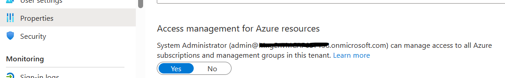

# 環境変数設定

## 管理者ログイン

- Entra ID (旧称 Azure AD) テナントの管理者アカウント（グローバル管理者のアカウント）を利用してログインを行ってください。
  - 同一の az cli 環境で複数の Azure 環境を操作している場合、ログインキャッシュなどが残っていることがあります。az account clear をしてから az login することをオススメします。
- 「00.環境準備」では基本的な Entra ID (Azure AD), Azure の設定を行います。グローバル管理者アカウントが各 Azure サブスクリプションの管理者権限をもっていない場合には以下を行ってください。
  - Azure Portal にログインする
  - Entra ID (Azure Active Directory) の管理画面を開く
  - プロパティ画面を開き、当該 Entra ID (Azure AD) 配下のすべての Azure サブスクリプションに対して暗黙的に管理者権限を持つように設定する（「Azure リソースのアクセス管理」を「はい」に設定、これによりユーザアクセス管理者になる）
  - テナント管理グループに対して、IAM で自身に所有者の権限を付与する

  

``` bash
# 拡張機能の自動インストールを指定
az config set extension.use_dynamic_install=yes_without_prompt
az config set auto-upgrade.enable=yes

# ログイン状態のクリア
az logout
rm -rf ~/.azure
az account clear

# ログイン処理 (Global Admin + 昇格特権設定でログイン)
az login # --tenant ${PRIMARY_DOMAIN_NAME} # --use-device
```

## 環境変数の設定

- 以下のスクリプト内のプライマリドメイン名と監視通知先メールアドレスを適宜変更し、環境変数の設定を行います。
- このスクリプトは、作業の再開時に利用します。このため、上記を書き換えたファイルを手元（デスクトップなど）に保存しておいてください。（コマンドラインを途中で閉じてしまった場合、このスクリプトを再実行すれば、どのページからでも作業を再開できるようにしてあります。）
- （※ MS 社員向け）複数の環境セットを利用してテストしているような場合、az login のキャッシュ情報が残っていると、下記スクリプトの "az account show --query id -o tsv" 処理で取得されるサブスクリプション ID が正しくない（アクセス不可能な他のテナントのものになってしまう）場合があります。このような場合は az account clear によっていったんキャッシュをクリアし、その後に az login でログインしなおして、下記の環境変数設定スクリプトを実行してください。

``` bash
######################## ここを修正してください
# プライマリドメイン名
PRIMARY_DOMAIN_NAME=XXXXX.onmicrosoft.com
# 監視通知先メールアドレス
ALERT_EMAIL_ADDRESS=xxxx@xxxxxxx.com
######################## ここまで
 
# BCDR 用リージョン
# 0 がメインロケーション（共用リソースは 0 に配置する）
VDC_NUMBERS="0 1"
LOCATION_NAMES[0]=eastus
LOCATION_NAMES[1]=westus
LOCATION_PREFIXS[0]=eus
LOCATION_PREFIXS[1]=wus
 
# IP 帯設計
IP_HUB_PREFIXS[0]="10.0"
IP_HUB_PREFIXS[1]="10.50"
IP_MGMT_PREFIXS[0]="10.48"
IP_MGMT_PREFIXS[1]="10.98"
IP_OPS_PREFIXS[0]="10.49"
IP_OPS_PREFIXS[1]="10.99"
IP_SPOKE_A_PREFIXS[0]="10.1"
IP_SPOKE_A_PREFIXS[1]="10.51"
IP_SPOKE_B_PREFIXS[0]="10.2"
IP_SPOKE_B_PREFIXS[1]="10.52"
 
# サブスクリプションはリージョン別に分離しなくてよい（Firewall Policy などは東西共通）
SUBSCRIPTION_NAME_MGMT=subscription-mgmt
SUBSCRIPTION_NAME_HUB=subscription-hub
SUBSCRIPTION_NAME_SPOKE_A=subscription-spoke-a
SUBSCRIPTION_NAME_SPOKE_B=subscription-spoke-b
 
# グローバル一意識別のための文字列の生成
TEMP=$(echo -n $PRIMARY_DOMAIN_NAME | shasum -a 256)
UNIQUE_SUFFIX=${TEMP:0:5}

# 既定で利用する VM サイズ (v5 以降を推奨) 
DEFAULT_VM_SIZE="Standard_D2ads_v5"

# VM 用管理者名・パスワード
ADMIN_USERNAME=azrefadmin
ADMIN_PASSWORD="p&ssw0rdp&ssw0rd"
 
# 権限分掌（ユーザアカウントの使い分け, Segregation of Duties）をするか否か
# 行う場合は適宜 az login でユーザアカウントを切り替える
FLAG_USE_SOD=true

# 権限分掌の処理を行う際に、ユーザアカウントとサービスプリンシパルのどちらを使うか
FLAG_USE_SOD_SP=true

# マルチサブスクリプションで管理グループを使うか否か
FLAG_USE_MG=true

# 業務系ワークロード（Compute, Storage）及び基盤系サービスに対してゾーン冗長化を行うか
FLAG_USE_WORKLOAD_AZ=false
FLAG_USE_PLATFORM_AZ=false

# テスト作業の場合は
VDC_NUMBERS=0
 
# SubscriptionID を拾っておく
SUBSCRIPTION_ID_MGMT=$(az account list --query "[? name == '${SUBSCRIPTION_NAME_MGMT}'].id" -o tsv)
SUBSCRIPTION_ID_HUB=$(az account list --query "[? name == '${SUBSCRIPTION_NAME_HUB}'].id" -o tsv)
SUBSCRIPTION_ID_SPOKE_A=$(az account list --query "[? name == '${SUBSCRIPTION_NAME_SPOKE_A}'].id" -o tsv)
SUBSCRIPTION_ID_SPOKE_B=$(az account list --query "[? name == '${SUBSCRIPTION_NAME_SPOKE_B}'].id" -o tsv)

# 全サブスクリプション ID
# SUBSCRIPTION_IDS=$(az account subscription list --query [].subscriptionId -o tsv)
SUBSCRIPTION_IDS="$SUBSCRIPTION_ID_MGMT $SUBSCRIPTION_ID_HUB $SUBSCRIPTION_ID_SPOKE_A $SUBSCRIPTION_ID_SPOKE_B"
 
# 管理サブスクリプションに切り替え
az account set -s "${SUBSCRIPTION_NAME_MGMT}"

```

10 個のサブスクリプションが利用できる場合には、さらに以下を実行してください。

``` bash

# 追加設定
IP_SPOKE_C_PREFIXS[0]="10.3"
IP_SPOKE_C_PREFIXS[1]="10.53"
IP_SPOKE_D_PREFIXS[0]="10.4"
IP_SPOKE_D_PREFIXS[1]="10.54"
SUBSCRIPTION_NAME_SPOKE_C=subscription-spoke-c
SUBSCRIPTION_NAME_SPOKE_D=subscription-spoke-d

SUBSCRIPTION_ID_SPOKE_C=$(az account list --query "[? name == '${SUBSCRIPTION_NAME_SPOKE_C}'].id" -o tsv)
SUBSCRIPTION_ID_SPOKE_D=$(az account list --query "[? name == '${SUBSCRIPTION_NAME_SPOKE_D}'].id" -o tsv)

SUBSCRIPTION_IDS="$SUBSCRIPTION_ID_MGMT $SUBSCRIPTION_ID_HUB $SUBSCRIPTION_ID_SPOKE_A $SUBSCRIPTION_ID_SPOKE_B $SUBSCRIPTION_ID_SPOKE_C $SUBSCRIPTION_ID_SPOKE_D"

# 追加設定
IP_SPOKE_E_PREFIXS[0]="10.5"
IP_SPOKE_E_PREFIXS[1]="10.55"
SUBSCRIPTION_NAME_SPOKE_E=subscription-spoke-e

SUBSCRIPTION_ID_SPOKE_E=$(az account list --query "[? name == '${SUBSCRIPTION_NAME_SPOKE_E}'].id" -o tsv)

SUBSCRIPTION_IDS="$SUBSCRIPTION_ID_MGMT $SUBSCRIPTION_ID_HUB $SUBSCRIPTION_ID_SPOKE_A $SUBSCRIPTION_ID_SPOKE_B $SUBSCRIPTION_ID_SPOKE_C $SUBSCRIPTION_ID_SPOKE_D $SUBSCRIPTION_ID_SPOKE_E"


# 追加設定
IP_SPOKE_F_PREFIXS[0]="10.6"
IP_SPOKE_F_PREFIXS[1]="10.56"
SUBSCRIPTION_NAME_SPOKE_F=subscription-spoke-f

SUBSCRIPTION_ID_SPOKE_F=$(az account list --query "[? name == '${SUBSCRIPTION_NAME_SPOKE_F}'].id" -o tsv)

SUBSCRIPTION_IDS="$SUBSCRIPTION_ID_MGMT $SUBSCRIPTION_ID_HUB $SUBSCRIPTION_ID_SPOKE_A $SUBSCRIPTION_ID_SPOKE_B $SUBSCRIPTION_ID_SPOKE_C $SUBSCRIPTION_ID_SPOKE_D $SUBSCRIPTION_ID_SPOKE_E $SUBSCRIPTION_ID_SPOKE_F"

SUBSCRIPTION_NAME_DEV1=subscription-dev1
SUBSCRIPTION_NAME_DEV2=subscription-dev2
SUBSCRIPTION_ID_DEV1=$(az account list --query "[? name == '${SUBSCRIPTION_NAME_DEV1}'].id" -o tsv)
SUBSCRIPTION_ID_DEV2=$(az account list --query "[? name == '${SUBSCRIPTION_NAME_DEV2}'].id" -o tsv)

SUBSCRIPTION_IDS="$SUBSCRIPTION_ID_MGMT $SUBSCRIPTION_ID_HUB $SUBSCRIPTION_ID_SPOKE_A $SUBSCRIPTION_ID_SPOKE_B $SUBSCRIPTION_ID_SPOKE_C $SUBSCRIPTION_ID_SPOKE_D $SUBSCRIPTION_ID_SPOKE_E $SUBSCRIPTION_ID_SPOKE_F $SUBSCRIPTION_ID_DEV1 $SUBSCRIPTION_ID_DEV2"

# すべてのサブスクリプション ID が解決されていることを確認します。

echo $SUBSCRIPTION_ID_MGMT
echo $SUBSCRIPTION_ID_HUB
echo $SUBSCRIPTION_ID_SPOKE_A
echo $SUBSCRIPTION_ID_SPOKE_B
echo $SUBSCRIPTION_ID_SPOKE_C
echo $SUBSCRIPTION_ID_SPOKE_D
echo $SUBSCRIPTION_ID_SPOKE_E
echo $SUBSCRIPTION_ID_SPOKE_F
echo $SUBSCRIPTION_ID_DEV1
echo $SUBSCRIPTION_ID_DEV2

TEMP_TARGET_SUBSCRIPTION_IDS=$SUBSCRIPTION_IDS

```

また、権限分掌をユーザアカウントではなくサービスプリンシパルで実施する場合には、FLAG_USE_SOD_SP=true を設定したうえで、下記のスクリプトも実行します。（詳細は Step 00.05 作業用ユーザアカウントの作成にて解説します。）

```bash
# ユーザアカウントではなくサービスプリンシパルで以降のスクリプトを実行する場合は、各サービスプリンシパルのパスワードを入手しておく
if ${FLAG_USE_SOD_SP} ; then

  TEMP_SP_NAMES=("shared_breakglass_admin" "sp_pvr_admin" "sp_spokea_dev" "sp_spokea_ops" "sp_spokea_change" "sp_spokeb_dev" "sp_spokeb_ops" "sp_spokeb_change" "sp_plat_dev" "sp_plat_change" "sp_nw_change" "sp_mgmt_ops" "sp_gov_change" "sp_spokec_dev" "sp_spokec_ops" "sp_spokec_change" "sp_spoked_dev" "sp_spoked_ops" "sp_spoked_change" "sp_spokee_dev" "sp_spokee_ops" "sp_spokee_change" "sp_spokef_dev" "sp_spokef_ops" "sp_spokef_change" "sp_dev1_dev" "sp_dev1_ops" "sp_dev1_change")

  # パスワードを格納するディクショナリを初期化
  declare -A SP_APP_IDS
  declare -A SP_PWDS
  declare -A SP_OBJ_IDS

  for TEMP_SP_NAME in "${TEMP_SP_NAMES[@]}"; do
    # Service Principal の作成  (App Registrations, Enterprise Application の 2 つが作成される)
    # az ad sp create-for-rbac --display-name ${TEMP_SP_NAME} --years 10
    # パスワードをリセットしながら取得
    TEMP_SP_APP_ID=$(az ad sp list --display-name ${TEMP_SP_NAME} --query [0].appId -o tsv)
    if [ -n "$TEMP_SP_APP_ID" ]; then
      TEMP_SP_OBJ_ID=$(az ad sp list --display-name ${TEMP_SP_NAME} --query [0].id -o tsv)
      TEMP_SP_PASSWORD_TEXT=$(az ad sp credential reset --id ${TEMP_SP_OBJ_ID} --query password -o tsv)

      # ディクショナリに AppID, Object ID, パスワードを格納
      # (az login では AppID とパスワードを利用、RBAC 権限付与では Object ID を利用)
      SP_APP_IDS["${TEMP_SP_NAME}"]="${TEMP_SP_APP_ID}"
      SP_PWDS["${TEMP_SP_NAME}"]="${TEMP_SP_PASSWORD_TEXT}"
      SP_OBJ_IDS["${TEMP_SP_NAME}"]="${TEMP_SP_OBJ_ID}"
    else
      SP_APP_IDS["${TEMP_SP_NAME}"]=""
      SP_PWDS["${TEMP_SP_NAME}"]=""
      SP_OBJ_IDS["${TEMP_SP_NAME}"]=""
    fi
  done  # TEMP_SP_NAME

fi

```
