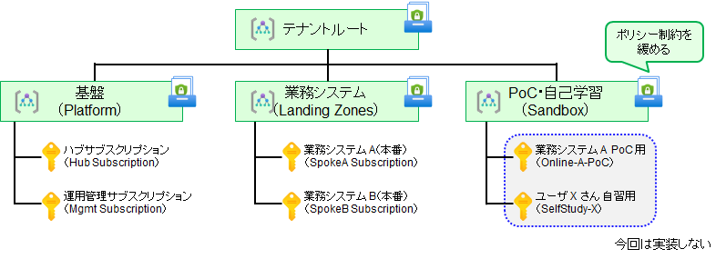

# 管理グループ作成

- 管理グループを作成し、4 つのサブスクリプションをグループ化します。
- 下記のスクリプトでは "name" プロパティと "displayName" プロパティが使い分けられていることに注意してください。displayName には日本語（ダブルバイト）を利用しても構いませんが、name プロパティ（リソース ID の一部にもなります）には半角英数字のみを利用し、スペースも入れないようにします。（以降も同様です。）

  

```bash
# 管理グループの作成とサブスクリプションの移設
# 構造は https://github.com/Azure/Enterprise-Scale/blob/main/eslzArm/managementGroupTemplates/mgmtGroupStructure/mgmtGroupsLite.json を踏襲
 
# ※ Global Administrator アカウントで実施
 
if ${FLAG_USE_MG} ; then
 
az account management-group create --name platform --display-name "Azure Landing Zone Platform"
az account management-group create --name landingzones --display-name "Landing Zones for LOB Applications"
az account management-group create --name sandbox --display-name "Sandboxes for Testing, PoC, Self-Learning"
 
# サブスクリプションの移設
az account management-group subscription add --name platform --subscription ${SUBSCRIPTION_ID_MGMT}
az account management-group subscription add --name platform --subscription ${SUBSCRIPTION_ID_HUB}
 
# サブスクリプションの移設
az account management-group subscription add --name landingzones --subscription ${SUBSCRIPTION_ID_SPOKE_A}
az account management-group subscription add --name landingzones --subscription ${SUBSCRIPTION_ID_SPOKE_B}
 
fi

```

10 個のサブスクリプションを利用する場合には、さらに以下を実行しておいてください。

```bash
 
if ${FLAG_USE_MG} ; then
 
# サブスクリプションの移設
az account management-group subscription add --name landingzones --subscription ${SUBSCRIPTION_ID_SPOKE_C}
az account management-group subscription add --name landingzones --subscription ${SUBSCRIPTION_ID_SPOKE_D}
az account management-group subscription add --name landingzones --subscription ${SUBSCRIPTION_ID_SPOKE_E}
az account management-group subscription add --name landingzones --subscription ${SUBSCRIPTION_ID_SPOKE_F}

az account management-group subscription add --name sandbox --subscription ${SUBSCRIPTION_ID_DEV1}
az account management-group subscription add --name sandbox --subscription ${SUBSCRIPTION_ID_DEV2}

fi

```
