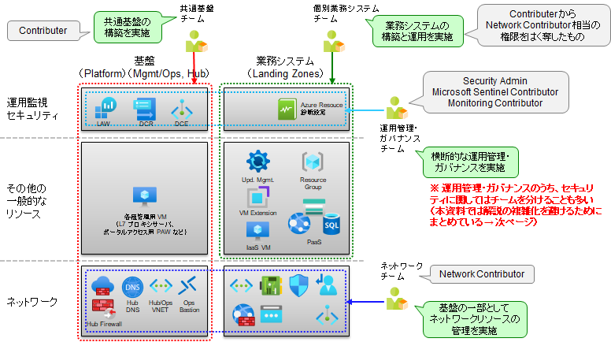

# 作業用ユーザアカウントの作成

※ 作業スクリプトは後半にあります。

## 作業上の注意点

新規に作成したユーザアカウントに対して MFA（多要素認証）が必要な状態になっていると、以降のスクリプトでアカウント切り替えのつど MFA 認証を求められ、作業が非常に煩雑になります。条件付きアクセスによって、「Azure管理アプリへのアクセスにMFAを強制する」というオプションが設定されているとこの状態になる場合があります。この場合には、以下のいずれかの方法で対応します。

- MFA を強制するオプションを外した状態で検証作業を進める。（非推奨）
- サービスプリンシパルを使ってスクリプトを動かすようにする。

後者の方法を使いたい場合には、Step 00_01 の環境変数の中の FLAG_USE_SOD_SP=false という設定を true にしてください。これにより、user_XXX というユーザアカウントではなく、sp_XXX というサービスプリンシパルが利用され、IaC スクリプトが MFA なしでスムーズに動作するようになります。

## 本デモでの設計について

環境の安全な運用のためには、やみくもに Owner などの高権限を付与して作業するのを避けることが望ましいです。適切な人たちに適切に権限を分け持ちさせることで安全性を確保する手法を、権限分掌（SoD, Segregation of Duties）と呼びます。大まかには各チーム間で以下のような役割分担を行います。

- 共通基盤管理チーム （mgmt., hub サブスクリプションを管理）
- ネットワーク構成管理チーム （hub サブスクリプションとネットワーク系作業を管理）
- 運用管理チーム、業務システム統制チーム （横断的にシステムを確認）
- 各業務システムチーム （各業務システムの所管部）

  

現時点で非常に粗い運用を行っている場合（運用環境を Owner 権限で操作しているなど）、いきなり厳格な権限分掌を行おうとすると、作業が煩雑になることもあり、適用のハードルが非常に高くなります。このため、実際の現場における権限分掌の適用に関しては、段階を追ってレベルアップしていくことが望ましいです。一般的に以下のようにレベルアップさせていきます。

- 初期段階 → Owner/Contributor/Reader を使い分ける、PIM を使って JIT を行うようにする
- 第二段階 → カスタムロールを使って JEA を行う
- 第三段階 → Entra Permission Management を使って JEA をさらに洗練させる

※ JIT, JEA は以下の通りです。

- JIT = Just in Time、必要なときのみ権限を割り当てる（通常は PIM により実現）
- JEA = Just Enough Access、必要最小限の権限のみを割り当てる（通常は XXContributor ロールやカスタムロールで実現）

本デモでは、第二段階のカスタムロールを使って JEA を行うところまでを想定しています。本来であれば、作成したカスタムロールをパッケージ化したうえでユーザに割り当てる作業が必要になりますが、そこまで実施すると作業が煩雑になるため、本デモでは、各チームの代表者 1 名に、静的に権限を割り当てる形で進めます。具体的には以下を行います。

- SoD（権限分掌）用のカスタムロールの作成
- 作業用ユーザアカウントの作成
- 権限の割り当て

本デモでは以下のような形で作業者とロールを設計しています。

| チーム | 役割 | ユーザ名 | 主な作業内容 | 作業タイミング | 主な保有権限 | 権限ランク |
| :-- | :-- | :-- | :-- | :-- | :-- | :-- |
| 権限管理 | ⓪ 権限付与 | admin | 権限払い出し | 随時 | User Access Administrator / TRG | 最高：常時付与 |
| 緊急作業 | ⓪ 緊急作業 | shared_breakglass_admin | 緊急対応 | 緊急時 | Owner / TRG | 最高：常時付与 |
| 共通基盤管理チーム | ① 初期構築時 | user_plat_dev | 共通管理基盤の構築 | 初回のみ | Contributor / Platform | 高：JIT |
|  | ③ 構成変更 | user_plat_change | 共通管理基盤のメンテ | 必要なときのみ | XXContributor / Platform | 中：JIT |
| ネットワーク構成管理チーム | ③ 構成変更 | user_nw_change | ネットワーク関連の変更作業 | 必要なときのみ | Network Contributor / TRG | 中：JIT |
業務システム統制チーム | ③ 構成変更 | user_gov_change | 各業務システムへの強制介入 | 必要なときのみ | Monitoring & Security Contributor / TRG | 中：JIT |
| 運用管理チーム | ② 平常作業 | user_mgmt_ops | 集約運用管理（運用作業移管） | 随時（常時） | Monitoring & Security Reader / TRG | 低：常時付与可 |
| 利用部門（業務所管） | ① 初期構築 | user_spokeX_dev | 業務システムのインフラ構築（除 NW） | 初回のみ | Contributor - NW 権限 / Spoke | 高：JIT |
|   | ② 平常作業 | user_spokeX_ops | 業務システムの定常運用 | 随時（常時） | Reader + α / Spoke | 低：常時付与可 |
|   | ③ 構成変更 | user_spokeX_change | 業務システムの構成変更 | 必要なときのみ | XXContributor / Spoke | 中：JIT |

※（注意）本デモのうち、**Spoke E, F に関しては、user_spokeX_dev アカウントに対して、Role Based Access Control Administrator ロールを追加で付与しています**。

- Spoke E, F では、よりセキュアな環境を実現するために、Managed ID を使ってリソースアクセスを行うようにアプリケーションを構成します。この構成を行うためには、Managed ID に対して Azure RBAC による権限付与を行う必要があり、そのために Role Based Access Control Administrator ロールを割り当てています。
- **Role Based Access Control Administrator ロール（他のユーザに権限を与えることができる権限）は極めて強い権限です**。このため、この権限を user_spokeX_dev アカウントに対して与えるのではなく、Managed ID によるリソースアクセス権限付与を別のアカウントで実施する方法も考えられますが、作業が煩雑になりすぎる、という問題もあります。
- 本デモでは、本番環境に対する変更は、検証環境で事前に確認されたレビュー済みの IaC を使って行う（＝不正操作が差し込まれるリスクは少ない）というコンセプトで設計しています。このような理由により、本デモでは、Spoke E, F に関しては、user_spokeX_dev アカウントに対して、Role Based Access Control Administrator ロールを追加で付与するという方針で設計しています。

なお、権限分掌をオフにして IaC スクリプトを利用したい場合には、FLAG_USE_SOD フラグを false に設定してください。（アカウント切り替え処理が飛ばされるようにスクリプトを作ってあります。）

## （参考）権限分掌設計のポイント

権限分掌設計の主なポイントは以下の通りです。詳細は別資料をご確認ください。

- 初期構築(dev)／平常作業(ops)／構成変更(change)に分ける
  - 初期構築時は強めの権限を一時付与
  - 平常時は安全な権限のみを長期付与
  - 構成変更時は必要な権限のみを一時付与
- 権限の過不足を調整するためのカスタムロールはすべて TRG (Tenant Root Group、テナント管理グループと呼ばれる最上位の管理グループ) に作る
  - 特定のサブ管理グループやサブスクリプションでしか使わないカスタムロールも一律で AssignableScopes = TRG にする
  - カスタムロールが迷子にならないようにするため
- 事後的なロール変更（アクション追加）を想定してカスタムロールを組む。ベース±αの形で作るのがよい。
  - 明示的許可で作るのが基本、剥奪する場合は * で剥奪するが漏れが出ることは受け入れる
- CustomRole は ID を明示的に指定して作る
  - ロールを更新する際に迷子にならないようにするため

## （参考）アカウント切り替えスクリプト

本サンプルにおけるアカウント切り替え用のスクリプトは以下の通りです。特に利用する必要はありませんが、参考までに掲載します。

- FLAG_USE_SOD フラグを false にしておくと、アカウント切り替え処理が飛ばされるようになります。
- FLAG_USE_SP フラグを false にしておくと user_XXX ユーザアカウントを、true にしておくと sp_XXX サービスプリンシパルを使って処理を行います。

```bash
# 権限管理／⓪ 権限付与の作業アカウントに切り替え
if ${FLAG_USE_SOD} ; then az account clear ; az login -u "admin@${PRIMARY_DOMAIN_NAME}" -p "${ADMIN_PASSWORD}" ; fi

# 緊急作業／⓪ 緊急作業の作業アカウントに切り替え
if ${FLAG_USE_SOD} ; then az account clear ; az login -u "shared_breakglass_admin@${PRIMARY_DOMAIN_NAME}" -p "${ADMIN_PASSWORD}" ; fi

# 共通基盤管理チーム／① 初期構築時の作業アカウントに切り替え
if ${FLAG_USE_SOD}; then if ${FLAG_USE_SOD_SP}; then TEMP_SP_NAME="sp_plat_dev"; az login --service-principal --username ${SP_APP_IDS[${TEMP_SP_NAME}]} --password "${SP_PWDS[${TEMP_SP_NAME}]}" --tenant ${PRIMARY_DOMAIN_NAME} --allow-no-subscriptions; else az account clear; az login -u "user_plat_dev@${PRIMARY_DOMAIN_NAME}" -p "${ADMIN_PASSWORD}"; fi; fi

# NW 構成管理チーム／③ 構成変更の作業アカウントに切り替え
if ${FLAG_USE_SOD}; then if ${FLAG_USE_SOD_SP}; then TEMP_SP_NAME="sp_nw_change"; az login --service-principal --username ${SP_APP_IDS[${TEMP_SP_NAME}]} --password "${SP_PWDS[${TEMP_SP_NAME}]}" --tenant ${PRIMARY_DOMAIN_NAME} --allow-no-subscriptions; else az account clear; az login -u "user_nw_change@${PRIMARY_DOMAIN_NAME}" -p "${ADMIN_PASSWORD}"; fi; fi

# 業務システム統制チーム／③ 構成変更の作業アカウントに切り替え
if ${FLAG_USE_SOD}; then if ${FLAG_USE_SOD_SP}; then TEMP_SP_NAME="sp_gov_change"; az login --service-principal --username ${SP_APP_IDS[${TEMP_SP_NAME}]} --password "${SP_PWDS[${TEMP_SP_NAME}]}" --tenant ${PRIMARY_DOMAIN_NAME} --allow-no-subscriptions; else az account clear; az login -u "user_gov_change@${PRIMARY_DOMAIN_NAME}" -p "${ADMIN_PASSWORD}"; fi; fi

# 運用管理チーム／② 平常作業の作業アカウントに切り替え
if ${FLAG_USE_SOD}; then if ${FLAG_USE_SOD_SP}; then TEMP_SP_NAME="sp_mgmt_ops"; az login --service-principal --username ${SP_APP_IDS[${TEMP_SP_NAME}]} --password "${SP_PWDS[${TEMP_SP_NAME}]}" --tenant ${PRIMARY_DOMAIN_NAME} --allow-no-subscriptions; else az account clear; az login -u "user_mgmt_ops@${PRIMARY_DOMAIN_NAME}" -p "${ADMIN_PASSWORD}"; fi; fi

# 業務システム A チーム／① 初期構築の作業アカウントに切り替え
if ${FLAG_USE_SOD}; then if ${FLAG_USE_SOD_SP}; then TEMP_SP_NAME="sp_spokea_dev"; az login --service-principal --username ${SP_APP_IDS[${TEMP_SP_NAME}]} --password "${SP_PWDS[${TEMP_SP_NAME}]}" --tenant ${PRIMARY_DOMAIN_NAME} --allow-no-subscriptions; else az account clear; az login -u "user_spokea_dev@${PRIMARY_DOMAIN_NAME}" -p "${ADMIN_PASSWORD}"; fi; fi

# 業務システム A チーム／② 平常作業の作業アカウントに切り替え
if ${FLAG_USE_SOD}; then if ${FLAG_USE_SOD_SP}; then TEMP_SP_NAME="sp_spokea_ops"; az login --service-principal --username ${SP_APP_IDS[${TEMP_SP_NAME}]} --password "${SP_PWDS[${TEMP_SP_NAME}]}" --tenant ${PRIMARY_DOMAIN_NAME} --allow-no-subscriptions; else az account clear; az login -u "user_spokea_ops@${PRIMARY_DOMAIN_NAME}" -p "${ADMIN_PASSWORD}"; fi; fi

# 業務システム B チーム／① 初期構築の作業アカウントに切り替え
if ${FLAG_USE_SOD}; then if ${FLAG_USE_SOD_SP}; then TEMP_SP_NAME="sp_spokeb_dev"; az login --service-principal --username ${SP_APP_IDS[${TEMP_SP_NAME}]} --password "${SP_PWDS[${TEMP_SP_NAME}]}" --tenant ${PRIMARY_DOMAIN_NAME} --allow-no-subscriptions; else az account clear; az login -u "user_spokeb_dev@${PRIMARY_DOMAIN_NAME}" -p "${ADMIN_PASSWORD}"; fi; fi

# 業務システム B チーム／② 平常作業の作業アカウントに切り替え
if ${FLAG_USE_SOD}; then if ${FLAG_USE_SOD_SP}; then TEMP_SP_NAME="sp_spokeb_ops"; az login --service-principal --username ${SP_APP_IDS[${TEMP_SP_NAME}]} --password "${SP_PWDS[${TEMP_SP_NAME}]}" --tenant ${PRIMARY_DOMAIN_NAME} --allow-no-subscriptions; else az account clear; az login -u "user_spokeb_ops@${PRIMARY_DOMAIN_NAME}" -p "${ADMIN_PASSWORD}"; fi; fi
```

## 作業スクリプト

カスタムロールなどの作成を以下のスクリプトにより実施してください。本作業は Entra ID グローバル管理者のアカウントで実施する必要があります。

- ユーザの作成
- カスタムロールの作成
- ユーザへのロールの割り当て

なお、作業が失敗した場合やカスタムロールの作り直しをしたい場合、あるいは既存のロール割り当てをいったん全削除したいような場合には、「98.後片付け」の中にカスタムロールやユーザを削除するスクリプトがあります。これらを利用してクリーンアップした上で作業を行ってください。（**※ 既存のカスタムロールなどを全削除しますので十分注意して作業してください。**）

```bash
# 以降の作業は管理者権限で行う

# 管理サブスクリプションの配下で作業する
az account set -s "${SUBSCRIPTION_NAME_MGMT}"

# ユーザの作成
for TEMP_NAME in "shared_breakglass_admin" "user_pvr_admin" "user_spokea_dev" "user_spokea_ops" "user_spokea_change" "user_spokeb_dev" "user_spokeb_ops" "user_spokeb_change" "user_plat_dev" "user_plat_change" "user_nw_change" "user_mgmt_ops" "user_gov_change"; do
  az ad user create --display-name ${TEMP_NAME} --user-principal-name "${TEMP_NAME}@${PRIMARY_DOMAIN_NAME}" --password ${ADMIN_PASSWORD} --force-change-password-next-sign-in false
done

# ユーザアカウントのかわりにサービスプリンシパルを使う場合は...
if ${FLAG_USE_SOD_SP} ; then
  TEMP_SP_NAMES=("shared_breakglass_admin" "sp_pvr_admin" "sp_spokea_dev" "sp_spokea_ops" "sp_spokea_change" "sp_spokeb_dev" "sp_spokeb_ops" "sp_spokeb_change" "sp_plat_dev" "sp_plat_change" "sp_nw_change" "sp_mgmt_ops" "sp_gov_change")

  # パスワードを格納するディクショナリを初期化
  declare -A SP_APP_IDS
  declare -A SP_PWDS
  declare -A SP_OBJ_IDS

  for TEMP_SP_NAME in "${TEMP_SP_NAMES[@]}"; do
    # Service Principal の作成  (App Registrations, Enterprise Application の 2 つが作成される)
    az ad sp create-for-rbac --display-name ${TEMP_SP_NAME} --years 10
    # パスワードをリセットしながら取得
    TEMP_SP_APP_ID=$(az ad sp list --display-name ${TEMP_SP_NAME} --query [0].appId -o tsv)
    TEMP_SP_OBJ_ID=$(az ad sp list --display-name ${TEMP_SP_NAME} --query [0].id -o tsv)
    TEMP_SP_PASSWORD_TEXT=$(az ad sp credential reset --id ${TEMP_SP_OBJ_ID} --query password -o tsv)
    # ディクショナリに AppID, Object ID, パスワードを格納
    # (az login では AppID とパスワードを利用、RBAC 権限付与では Object ID を利用)
    SP_APP_IDS["${TEMP_SP_NAME}"]="${TEMP_SP_APP_ID}"
    SP_PWDS["${TEMP_SP_NAME}"]="${TEMP_SP_PASSWORD_TEXT}"
    SP_OBJ_IDS["${TEMP_SP_NAME}"]="${TEMP_SP_OBJ_ID}"
  done  # TEMP_SP_NAME
  # ディクショナリの内容を表示
  for KEY in "${!SP_PWDS[@]}"; do
    echo "Service Principal: ${KEY}, AppID: ${SP_APP_IDS[${KEY}]}, Password: ${SP_PWDS[${KEY}]}"
  done
fi

# =============================

# カスタムロール名の定義と UUID 作成
# カスタムロールの UUID は乱数生成ではなく一定の値になるようにしておいた方がよい。このため、ロジックで UUID を作成し、ARM テンプレートで展開している。（az cli コマンドでは UUID が乱数生成されてしまうため、定義変更・再作成のつど UUID が動いてしまう）

# Contributor と重複適用する（Contributor で notAction を使っているため）
CR_ROLENAME_SPOKE_DEV_ON_SPOKE_DIFF="Custom Role for Spoke Developer on Spoke diff Contributor"
CR_NAMEUUID_SPOKE_DEV_ON_SPOKE_DIFF=$(uuidgen --sha1 --namespace @oid --name "${CR_ROLENAME_SPOKE_DEV_ON_SPOKE_DIFF}${PRIMARY_DOMAIN_NAME}")

CR_ROLENAME_SPOKE_OPS_ON_SPOKE="Custom Role for Spoke Operator on Spoke"
CR_NAMEUUID_SPOKE_OPS_ON_SPOKE=$(uuidgen --sha1 --namespace @oid --name "${CR_ROLENAME_SPOKE_OPS_ON_SPOKE}${PRIMARY_DOMAIN_NAME}")

CR_ROLENAME_SPOKE_OPS_ON_MGMT="Custom Role for Spoke Operator on Mgmt"
CR_NAMEUUID_SPOKE_OPS_ON_MGMT=$(uuidgen --sha1 --namespace @oid --name "${CR_ROLENAME_SPOKE_OPS_ON_MGMT}${PRIMARY_DOMAIN_NAME}")

# Reader, Network Contributor と併用
CR_ROLENAME_NW_CNG_ON_TRG_DIFF="Custom Role for Network Operator on TRG diff Reader, Network Contributor"
CR_NAMEUUID_NW_CNG_ON_TRG_DIFF=$(uuidgen --sha1 --namespace @oid --name "${CR_ROLENAME_NW_CNG_ON_TRG_DIFF}${PRIMARY_DOMAIN_NAME}")

CR_ROLENAME_MGMT_OPS_ON_TRG="Custom Role for Management Operator on TRG"
CR_NAMEUUID_MGMT_OPS_ON_TRG=$(uuidgen --sha1 --namespace @oid --name "${CR_ROLENAME_MGMT_OPS_ON_TRG}${PRIMARY_DOMAIN_NAME}")

# Reader, Resource Policy Contributor, Microsoft Sentinel Contributor, Security Admin, Monitoring Contributor と併用
CR_ROLENAME_GOV_CNG_ON_TRG_DIFF="Custom Role for Governance Operator on TRG diff Reader, Resource Policy Contributor, Microsoft Sentinel Contributor, Security Admin, Monitoring Contributor"
CR_NAMEUUID_GOV_CNG_ON_TRG_DIFF=$(uuidgen --sha1 --namespace @oid --name "${CR_ROLENAME_GOV_CNG_ON_TRG_DIFF}${PRIMARY_DOMAIN_NAME}")

# "/" スコープで権限割り当てすると取り外しが面倒なため、テナントルートグループを利用する
TEMP_MG_TRG_ID=$(az account management-group list --query "[?displayName=='Tenant Root Group'].id" -o tsv)

# カスタムロール定義の ARM テンプレート
# Assignable Scope はすべてルート管理グループにそろえる
# （管理容易性を高めるため。割当先をサブスクリプションやサブ管理グループにすると、カスタムロールの管理が面倒になる。）
cat > temp.json << EOF
{
  "\$schema": " https://schema.management.azure.com/schemas/2018-05-01/subscriptionDeploymentTemplate.json#",
  "contentVersion": "1.0.0.0",
  "resources": [
    {
      "type": "Microsoft.Authorization/roleDefinitions",
      "apiVersion": "2018-07-01",
      "name": "${CR_NAMEUUID_SPOKE_DEV_ON_SPOKE_DIFF}",
      "properties": {
        "roleName": "${CR_ROLENAME_SPOKE_DEV_ON_SPOKE_DIFF}",
        "description": "${CR_ROLENAME_SPOKE_DEV_ON_SPOKE_DIFF}",
        "type": "customRole",
        "permissions": [
          {
            "actions": [],
            "notActions": [
              "Microsoft.Authorization/*/write",
              "Microsoft.Authorization/*/delete",
              "Microsoft.Authorization/elevateAccess/Action",
              "Microsoft.Blueprint/blueprintAssignments/write",
              "Microsoft.Blueprint/blueprintAssignments/delete",
              "Microsoft.Compute/galleries/share/action",
              "Microsoft.Network/*/write",
              "Microsoft.Network/*/delete",
              "Microsoft.ClassicNetwork/*"
            ],
            "dataActions": [],
            "notDataActions": [],
          }
        ],
        "assignableScopes": [
          "${TEMP_MG_TRG_ID}"
        ]
      }
    },
    {
      "type": "Microsoft.Authorization/roleDefinitions",
      "apiVersion": "2018-07-01",
      "name": "${CR_NAMEUUID_SPOKE_OPS_ON_SPOKE}",
      "properties": {
        "roleName": "${CR_ROLENAME_SPOKE_OPS_ON_SPOKE}",
        "description": "${CR_ROLENAME_SPOKE_OPS_ON_SPOKE}",
        "type": "customRole",
        "permissions": [
          {
            "actions": [ 
              "*/read",
              "Microsoft.Compute/virtualMachines/start/action",
              "Microsoft.Compute/virtualMachines/powerOff/action",
              "Microsoft.Compute/virtualMachines/deallocate/action",
              "Microsoft.Compute/virtualMachines/performMaintenance/action",
              "Microsoft.Compute/virtualMachines/restart/action",
              "Microsoft.Compute/virtualMachines/installPatches/action",
              "Microsoft.Compute/virtualMachines/assessPatches/action",
              "Microsoft.Compute/virtualMachines/cancelPatchInstallation/action",
              "Microsoft.SqlVirtualMachine/sqlVirtualMachines/startAssessment/action",
              "Microsoft.SqlVirtualMachine/sqlVirtualMachines/troubleshoot/action",
              "Microsoft.Web/sites/restart/action"
            ],
            "notActions": [],
            "dataActions": [],
            "notDataActions": [],
          }
        ],
        "assignableScopes": [
          "${TEMP_MG_TRG_ID}"
        ]
      }
    },
    {
      "type": "Microsoft.Authorization/roleDefinitions",
      "apiVersion": "2018-07-01",
      "name": "${CR_NAMEUUID_SPOKE_OPS_ON_MGMT}",
      "properties": {
        "roleName": "${CR_ROLENAME_SPOKE_OPS_ON_MGMT}",
        "description": "${CR_ROLENAME_SPOKE_OPS_ON_MGMT}",
        "type": "customRole",
        "permissions": [
          {
            "actions": [ 
              "microsoft.operationalinsights/workspaces/features/generateMap/read"
            ],
            "notActions": [],
            "dataActions": [],
            "notDataActions": [],
          }
        ],
        "assignableScopes": [
          "${TEMP_MG_TRG_ID}"
        ]
      }
    },
    {
      "type": "Microsoft.Authorization/roleDefinitions",
      "apiVersion": "2018-07-01",
      "name": "${CR_NAMEUUID_NW_CNG_ON_TRG_DIFF}",
      "properties": {
        "roleName": "${CR_ROLENAME_NW_CNG_ON_TRG_DIFF}",
        "description": "${CR_ROLENAME_NW_CNG_ON_TRG_DIFF}",
        "type": "customRole",
        "permissions": [
          {
            "actions": [ 
              "*/PrivateEndpointConnectionsApproval/action",
              "Microsoft.Web/sites/write",
              "Microsoft.Web/sites/config/list/action",
              "Microsoft.Web/sites/config/write",
              "Microsoft.Web/sites/restart/action"
            ],
            "notActions": [],
            "dataActions": [],
            "notDataActions": [],
          }
        ],
        "assignableScopes": [
          "${TEMP_MG_TRG_ID}"
        ]
      }
    },
    {
      "type": "Microsoft.Authorization/roleDefinitions",
      "apiVersion": "2018-07-01",
      "name": "${CR_NAMEUUID_MGMT_OPS_ON_TRG}",
      "properties": {
        "roleName": "${CR_ROLENAME_MGMT_OPS_ON_TRG}",
        "description": "${CR_ROLENAME_MGMT_OPS_ON_TRG}",
        "type": "customRole",
        "permissions": [
          {
            "actions": [ 
              "Microsoft.Compute/virtualMachines/assessPatches/action",
              "Microsoft.Compute/virtualMachines/installPatches/action"
            ],
            "notActions": [],
            "dataActions": [],
            "notDataActions": [],
          }
        ],
        "assignableScopes": [
          "${TEMP_MG_TRG_ID}"
        ]
      }
    },
    {
      "type": "Microsoft.Authorization/roleDefinitions",
      "apiVersion": "2018-07-01",
      "name": "${CR_NAMEUUID_GOV_CNG_ON_TRG_DIFF}",
      "properties": {
        "roleName": "${CR_ROLENAME_GOV_CNG_ON_TRG_DIFF}",
        "description": "${CR_ROLENAME_GOV_CNG_ON_TRG_DIFF}",
        "type": "customRole",
        "permissions": [
          {
            "actions": [ 
              "Microsoft.Compute/virtualMachines/write",
              "Microsoft.Compute/virtualMachines/extensions/write",
              "Microsoft.Compute/virtualMachines/extensions/delete",
              "Microsoft.Compute/virtualMachines/runCommand/action",
              "Microsoft.Compute/virtualMachines/installPatches/action",
              "Microsoft.Compute/virtualMachines/assessPatches/action",
              "Microsoft.Compute/virtualMachines/cancelPatchInstallation/action",
              "Microsoft.Compute/virtualMachines/assessPatches/action",
              "Microsoft.Compute/virtualMachines/redeploy/action",
              "Microsoft.GuestConfiguration/guestConfigurationAssignments/*",
              "Microsoft.Maintenance/maintenanceConfigurations/write",
              "Microsoft.Maintenance/configurationAssignments/write",
              "Microsoft.SqlVirtualMachine/sqlVirtualMachines/write",
              "Microsoft.Sql/servers/auditingSettings/*",
              "Microsoft.Sql/servers/databases/auditingSettings/*",
              "Microsoft.ContainerService/managedClusters/*",
              "Microsoft.Network/virtualNetworks/*",
              "*/register/action",
              "Microsoft.Resources/subscriptions/resourcegroups/write",
              "Microsoft.OperationsManagement/solutions/write",
              "Microsoft.Dashboard/grafana/write",
              "Microsoft.Authorization/roleAssignments/write",
              "Microsoft.Monitor/accounts/write",
            ],
            "notActions": [],
            "dataActions": [],
            "notDataActions": [],
          }
        ],
        "assignableScopes": [
          "${TEMP_MG_TRG_ID}"
        ]
      }
    }
  ]
}
EOF

# 管理グループのところにカスタムロールを作る（AssignableScopes のところでリソース作成する必要があることに注意）
TEMP=(${TEMP_MG_TRG_ID//\// })
az deployment mg create --location ${LOCATION_NAMES[0]} --template-file temp.json --management-group-id "${TEMP[3]}" --name "dep_customrole_${LOCATION_NAMES[0]}"

# ロールの割り当て
# ※ グループに割り当ててもよいが、今回のデモではユーザに割り当てる

TEMP_ROLE_ASSIGNMENT_DEFS="\
shared_breakglass_admin,Owner,${TEMP_MG_TRG_ID} \
user_pvr_admin,User_Access_Administrator,${TEMP_MG_TRG_ID} \
user_plat_dev,Contributor,/providers/Microsoft.Management/managementGroups/Platform \
user_plat_change,Contributor,/providers/Microsoft.Management/managementGroups/Platform \
user_gov_change,Resource_Policy_Contributor,${TEMP_MG_TRG_ID} \
user_gov_change,Microsoft_Sentinel_Contributor,${TEMP_MG_TRG_ID} \
user_gov_change,Security_Admin,${TEMP_MG_TRG_ID} \
user_gov_change,Monitoring_Contributor,${TEMP_MG_TRG_ID} \
user_gov_change,Reader,${TEMP_MG_TRG_ID} \
user_gov_change,${CR_NAMEUUID_GOV_CNG_ON_TRG_DIFF},${TEMP_MG_TRG_ID} \
user_gov_change,Owner,/subscriptions/${SUBSCRIPTION_ID_MGMT} \
user_nw_change,Network_Contributor,${TEMP_MG_TRG_ID} \
user_nw_change,Reader,${TEMP_MG_TRG_ID} \
user_nw_change,Storage_Account_Key_Operator_Service_Role,/subscriptions/${SUBSCRIPTION_ID_MGMT} \
user_nw_change,Monitoring_Contributor,/subscriptions/${SUBSCRIPTION_ID_MGMT} \
user_nw_change,${CR_NAMEUUID_NW_CNG_ON_TRG_DIFF},${TEMP_MG_TRG_ID} \
user_mgmt_ops,Reader,${TEMP_MG_TRG_ID} \
user_mgmt_ops,Microsoft_Sentinel_Reader,${TEMP_MG_TRG_ID} \
user_mgmt_ops,Security_Reader,${TEMP_MG_TRG_ID} \
user_mgmt_ops,Monitoring_Reader,${TEMP_MG_TRG_ID} \
user_mgmt_ops,${CR_NAMEUUID_MGMT_OPS_ON_TRG},${TEMP_MG_TRG_ID} \
user_spokea_dev,Contributor,/subscriptions/${SUBSCRIPTION_ID_SPOKE_A} \
user_spokea_dev,${CR_NAMEUUID_SPOKE_DEV_ON_SPOKE_DIFF},/subscriptions/${SUBSCRIPTION_ID_SPOKE_A} \
user_spokea_ops,${CR_NAMEUUID_SPOKE_OPS_ON_SPOKE},/subscriptions/${SUBSCRIPTION_ID_SPOKE_A} \
user_spokea_ops,${CR_NAMEUUID_SPOKE_OPS_ON_MGMT},/subscriptions/${SUBSCRIPTION_ID_MGMT} \
user_spokea_change,Virtual_Machine_Contributor,/subscriptions/${SUBSCRIPTION_ID_SPOKE_A} \
user_spokeb_dev,Contributor,/subscriptions/${SUBSCRIPTION_ID_SPOKE_B} \
user_spokeb_dev,${CR_NAMEUUID_SPOKE_DEV_ON_SPOKE_DIFF},/subscriptions/${SUBSCRIPTION_ID_SPOKE_B} \
user_spokeb_ops,${CR_NAMEUUID_SPOKE_OPS_ON_SPOKE},/subscriptions/${SUBSCRIPTION_ID_SPOKE_B} \
user_spokeb_ops,${CR_NAMEUUID_SPOKE_OPS_ON_MGMT},/subscriptions/${SUBSCRIPTION_ID_MGMT}
user_spokeb_change,Website_Contributor,/subscriptions/${SUBSCRIPTION_ID_SPOKE_B} \
user_spokeb_change,Web_Plan_Contributor,/subscriptions/${SUBSCRIPTION_ID_SPOKE_B} \
user_spokeb_change,SQL_DB_Contributor,/subscriptions/${SUBSCRIPTION_ID_SPOKE_B} \
"

# ユーザに対する割り当て
for TEMP_ROLE_ASSIGNMENT_DEF in $TEMP_ROLE_ASSIGNMENT_DEFS; do
  # 分解して利用
  TEMP=(${TEMP_ROLE_ASSIGNMENT_DEF//,/ })
  TEMP_USER_NAME=${TEMP[0]}
  TEMP_ROLE_NAME=${TEMP[1]//_/ }
  TEMP_SCOPE_NAME=${TEMP[2]}
  echo $TEMP_USER_NAME $TEMP_ROLE_NAME $TEMP_SCOPE_NAME

# すでに割り当て済みかを確認してから割り当てる
# 標準ロールの場合：割り当てが行われているかを確認
TEMP_RA_EXISTS=$(az role assignment list --assignee "${TEMP_USER_NAME}@${PRIMARY_DOMAIN_NAME}" --scope "${TEMP_SCOPE_NAME}" --query "[? roleDefinitionName == '${TEMP_ROLE_NAME}']" -o tsv)
if [ -z "${TEMP_RA_EXISTS}" ]; then
 
  # カスタムロールの場合：割り当てが行われているかを確認
  TEMP_RA_EXISTS=$(az role assignment list --assignee "${TEMP_USER_NAME}@${PRIMARY_DOMAIN_NAME}" --scope "${TEMP_SCOPE_NAME}" --query "[? ends_with(roleDefinitionId , '${TEMP_ROLE_NAME}')]" -o tsv)
  if [ -z "${TEMP_RA_EXISTS}" ]; then
    TEMP_ROLE_ASSIGNMENT_ID=$(uuidgen --sha1 --namespace @oid --name "${TEMP_ROLE_ASSIGNMENT_DEF}")
    echo "Role assignmet does not exist. Creating assignments... ${TEMP_ROLE_ASSIGNMENT_DEF} ${TEMP_ROLE_ASSIGNMENT_ID}"
    az role assignment create --name ${TEMP_ROLE_ASSIGNMENT_ID} --assignee "${TEMP_USER_NAME}@${PRIMARY_DOMAIN_NAME}" --role "${TEMP_ROLE_NAME}" --scope "${TEMP_SCOPE_NAME}"
  else
    echo "role assignmet already exists.(custom roles ${TEMP_ROLE_NAME})"
  fi
else
  echo "role assignmet already exists. (built-in roles ${TEMP_ROLE_NAME})"
fi
 
done

# ユーザアカウントのかわりにサービスプリンシパルを使う場合は...
if ${FLAG_USE_SOD_SP} ; then
  # サービスプリンシパルに対する割り当て
  for TEMP_ROLE_ASSIGNMENT_DEF in $TEMP_ROLE_ASSIGNMENT_DEFS; do
    # 分解して利用
    TEMP=(${TEMP_ROLE_ASSIGNMENT_DEF//,/ })
    TEMP_USER_NAME=${TEMP[0]}
    TEMP_ROLE_NAME=${TEMP[1]//_/ }
    TEMP_SCOPE_NAME=${TEMP[2]}

    # "user_" で始まる場合に "sp_" に置換し、ロール割り当てを実施
    if [[ $TEMP_USER_NAME == user_* ]]; then
      TEMP_USER_NAME="sp_${TEMP_USER_NAME#user_}"
      echo $TEMP_USER_NAME $TEMP_ROLE_NAME $TEMP_SCOPE_NAME

      TEMP_ASSIGNEE=${SP_OBJ_IDS[${TEMP_USER_NAME}]};

      # すでに割り当て済みかを確認してから割り当てる
      # 標準ロールの場合：割り当てが行われているかを確認
      TEMP_RA_EXISTS=$(az role assignment list --assignee "${TEMP_ASSIGNEE}" --scope "${TEMP_SCOPE_NAME}" --query "[? roleDefinitionName == '${TEMP_ROLE_NAME}']" -o tsv)
      if [ -z "${TEMP_RA_EXISTS}" ]; then
      
        # カスタムロールの場合：割り当てが行われているかを確認
        TEMP_RA_EXISTS=$(az role assignment list --assignee "${TEMP_ASSIGNEE}" --scope "${TEMP_SCOPE_NAME}" --query "[? ends_with(roleDefinitionId , '${TEMP_ROLE_NAME}')]" -o tsv)
        if [ -z "${TEMP_RA_EXISTS}" ]; then
          TEMP_ROLE_ASSIGNMENT_ID=$(uuidgen --sha1 --namespace @oid --name "sp_${TEMP_ROLE_ASSIGNMENT_DEF}")
          echo "Role assignmet does not exist. Creating assignments... ${TEMP_ROLE_ASSIGNMENT_DEF} ${TEMP_ROLE_ASSIGNMENT_ID}"
          az role assignment create --name ${TEMP_ROLE_ASSIGNMENT_ID} --assignee "${TEMP_ASSIGNEE}" --role "${TEMP_ROLE_NAME}" --scope "${TEMP_SCOPE_NAME}"
        else
          echo "role assignmet already exists.(custom roles ${TEMP_ROLE_NAME})"
        fi
      else
        echo "role assignmet already exists. (built-in roles ${TEMP_ROLE_NAME})"
      fi
    fi
  done
fi

```

### (参考) ロール定義を更新した場合

実際の基盤運用時は、必要に応じてカスタムロールの権限セットを変更することになります。よくあるのは、運用作業用のロールやガバナンス作業チーム用のロールで、actions に不足している権限を追加することになります。

権限を追加した新しいカスタムロールを有効化したい場合には、改めてカスタムロールを定義するコードを流しなおすとともに、ローカルにキャッシュされたアクセストークンをクリアしてください。ローカルのキャッシュトークンの削除は以下により行います。

```bash

az logout
rm -rf ~/.azure
az account clear

```
