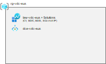

# 共用LAW作成

まずは環境内のあらゆるログを一か所に収集できるように、共用の Log Analytics Workspace (LAW) を管理サブスクリプションに作成します。

  

この LAW は極めて重要なリソースになるため、通常はリソースロック（削除ロック）をかけた状態にしておきます。（今回は権限分掌の切り替えが煩雑になる関係で割愛しています）

また、LAW に併せて DCE (Data Collection Endpoint)も作成しておきます。これはカスタムログなどを LAW に収集するために必要になるもので、LAW と併せて作成しておくと便利です。

```bash
# 基盤構築管理者のアカウントに切り替え
if ${FLAG_USE_SOD} ; then az account clear ; az login -u "user_plat_dev@${PRIMARY_DOMAIN_NAME}" -p "${ADMIN_PASSWORD}" ; fi
 
# LAW 作成とアクティビティログ出力の設定
az account set -s "${SUBSCRIPTION_ID_MGMT}"
 
# LAW, DCE 作成
for i in ${VDC_NUMBERS}; do
  TEMP_LOCATION_NAME=${LOCATION_NAMES[$i]}
  TEMP_LOCATION_PREFIX=${LOCATION_PREFIXS[$i]}
 
  # LAW, DCE 作成
  TEMP_RG_NAME="rg-vdc-${TEMP_LOCATION_PREFIX}"
  TEMP_LAW_NAME="law-vdc-${TEMP_LOCATION_PREFIX}"
  TEMP_DCE_NAME="dce-vdc-${TEMP_LOCATION_PREFIX}"
 
  az group create --name ${TEMP_RG_NAME} --location ${TEMP_LOCATION_NAME}
  az monitor log-analytics workspace create --workspace-name ${TEMP_LAW_NAME} --resource-group ${TEMP_RG_NAME} --location ${TEMP_LOCATION_NAME} --retention-time 90
  az monitor data-collection endpoint create --name ${TEMP_DCE_NAME} --resource-group ${TEMP_RG_NAME} --public-network-access Enabled
 
# リソースロック作成には owner のみが作業可能
# 権限分掌を行う場合にはリソースロック編集権限を持ったユーザによる作業が必要だが、今回は簡単のためスキップする
if ! ${FLAG_USE_SOD} ; then 
# LAW に対して削除ロック
TEMP_LAW_RESOURCE_ID="/subscriptions/${SUBSCRIPTION_ID_MGMT}/resourcegroups/rg-vdc-${TEMP_LOCATION_PREFIX}/providers/microsoft.operationalinsights/workspaces/${TEMP_LAW_NAME}"
az resource lock create --name CanNotDelete --resource $TEMP_LAW_RESOURCE_ID --lock-type CanNotDelete
fi
 
done
 
# 今回は割愛しているが、Azure AD テナントのログの出力設定も行うとよい
```
