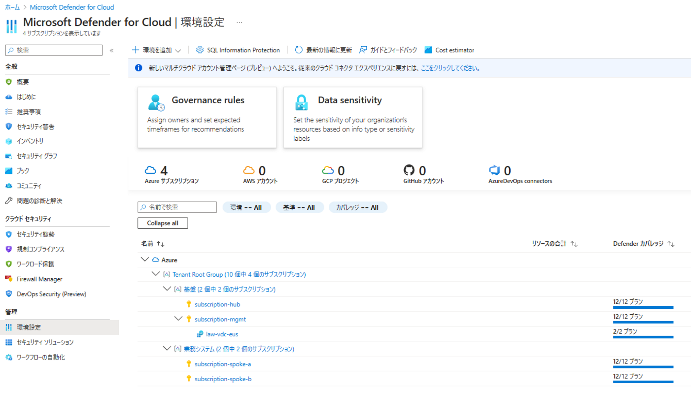
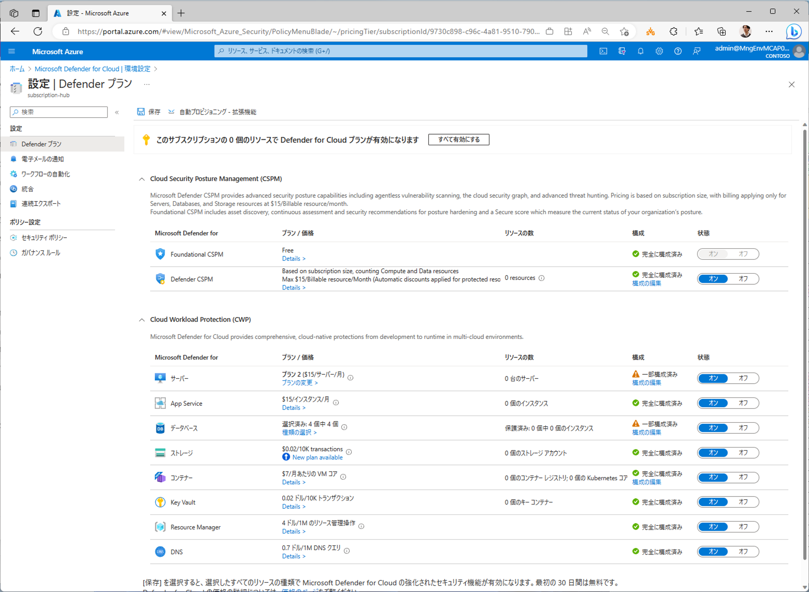
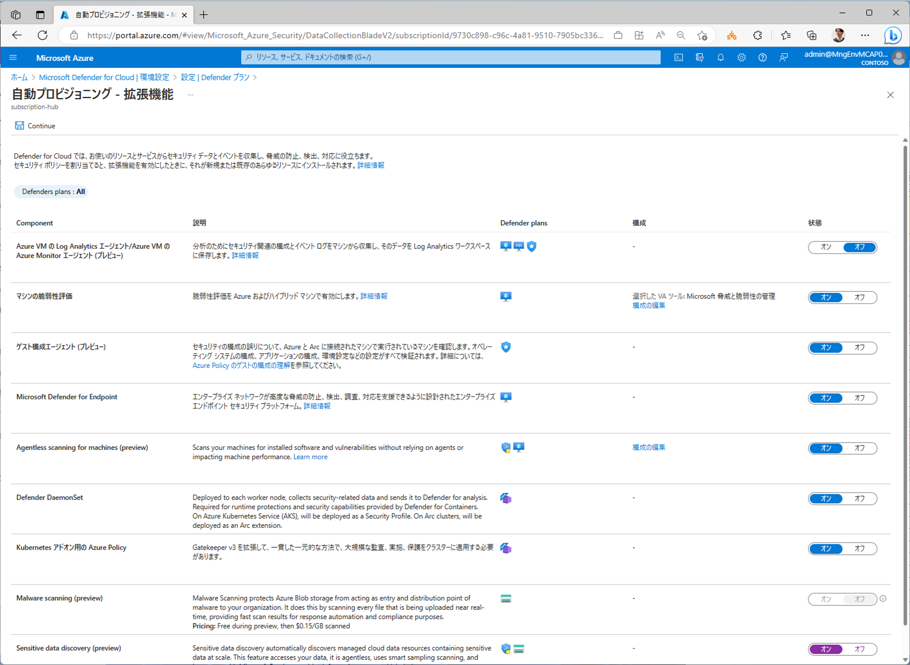
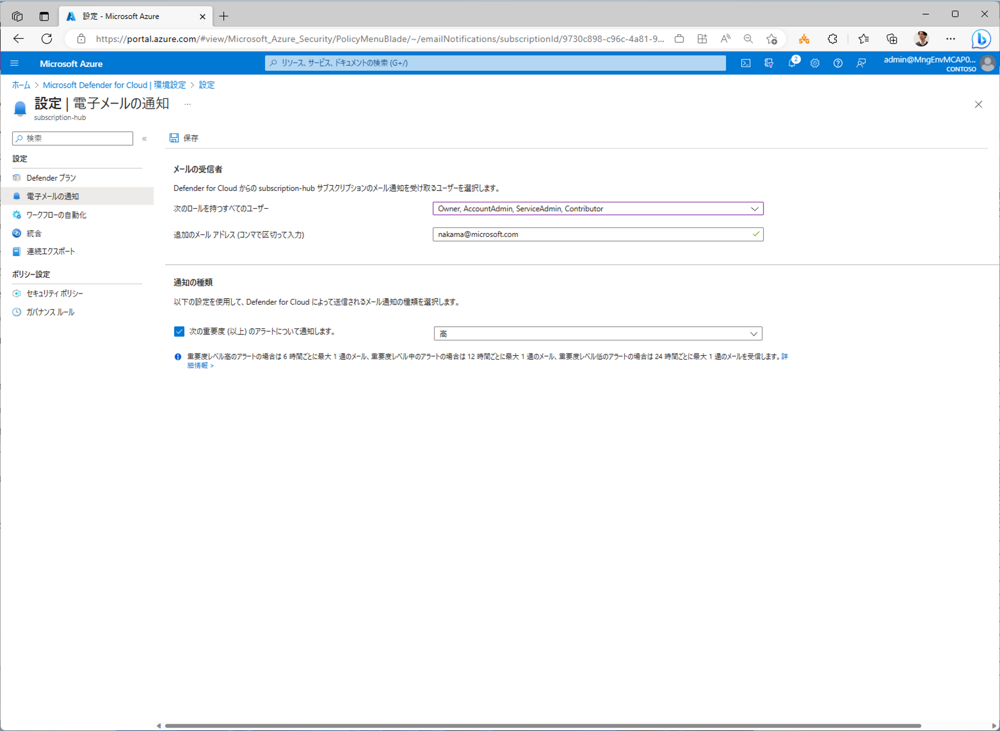
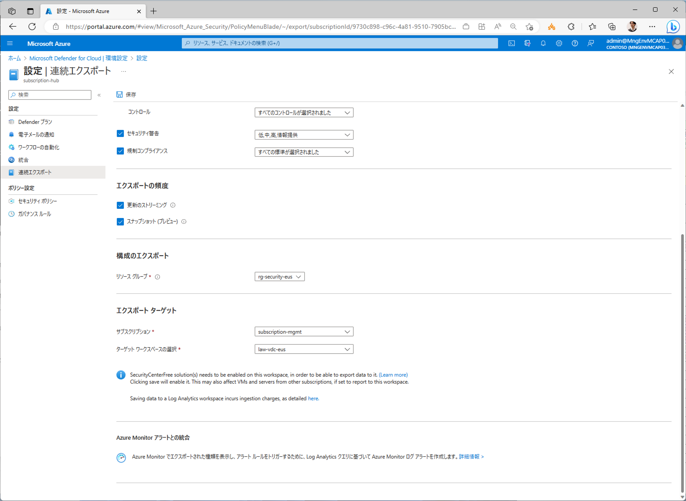
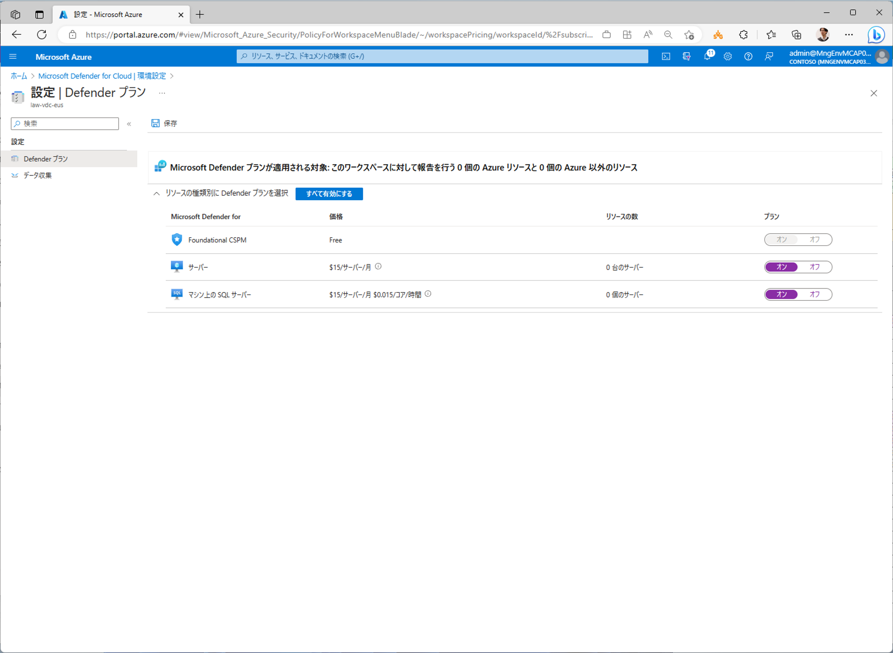
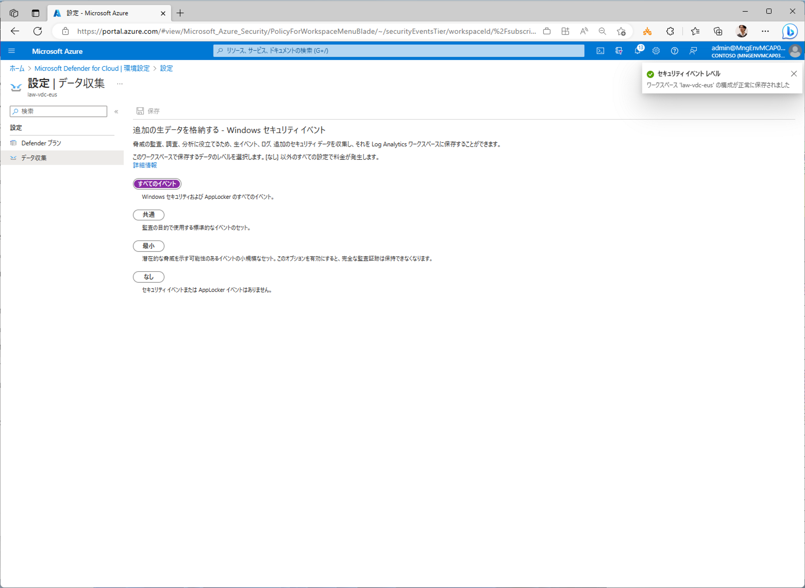

# MDfC セットアップ

各サブスクリプションで、MDfC (Microsoft Defender for Cloud)の機能を有効化します。スクリプトからの有効化・自動化が困難なところがあるため、本作業はポータルから手作業で実施してください。ポイントは以下の通りです。具体的な操作手順が必要な場合はデモビテオを参照してください。（※ 2023/07/12 注記：スクリプトから行う方法を本ページ末尾につけていますので、そちらで実行していただいても OK です。）

- 各サブスクリプションで、MDfC の有効化を行う
  - LAW を集約型にするため、AMA 関連の自動プロビジョニング機能は無効化し、手動でセットアップする
- 連続エクスポートの設定を書き出しておくためのリソースグループを各サブスクリプションに作成
  - 設定には各サブスクリプションの owner 権限が必要、サブスクリプションの新規作成時に下記をまとめて行うようなフローを設計しておくことが望ましい。
  - 本サンプルでは簡単のため、admin アカウントを使ってまとめて設定してしまうことにする。
- 各サブスクリプションの環境設定を開き、以下を行う
  - ① CSPM、CWP 機能をすべて有効化したのち、自動プロビジョニング設定で LAA/AMA の自動インストールのみ無効化する
  - ② 電子メールの通知を有効化
  - ③ 連続エクスポート機能の有効化（事前に作成しておいた rg-security-{MAIN_LOCATION} リソースグループに設定を保存しておくようにする）
- さらに管理サブスクリプション内の LAW に対して、以下を設定する
  - ④ サーバ、SQL サーバの CSPM 機能を有効化
  - ⑤ すべてのセキュリティイベントの収集を有効化
- すべてのプランが有効化されていれば OK

なお大規模な Azure 共通基盤の本番運用では、管理グループへの Azure Policy の手動割り当てなどを行いますが、これについては一通りの環境構築が終わった後、セクション 11 にて詳細に解説します。ここでは MDfC をデフォルトの機能範囲で有効化して利用する、という形で設定してください。

  

  

  

  

  

  

  

## コマンドラインからの MDfC の有効化方法

- MDfC の各機能は以下で有効化することができます。
- 注意点として、一部の MDfC 機能は有効化すると自動プロビジョニング機能（DINE ポリシー）も有効化されます。本デモスクリプトでは、原則として DINE ポリシーは使わない方針にしていますので、自動設定された DINE ポリシーを削除するようにスクリプトを作成してあります。
- 連続エクスポートは出力先を一つしか設定できないため、メインリージョン側へ出力しています。
- 連続エクスポートの設定保存先は、手順 00_03 で作成したリソースグループを指定しています。

```bash

# 適用対象サブスクリプションを全サブスクリプションに設定
TEMP_TARGET_SUBSCRIPTION_IDS="${SUBSCRIPTION_IDS}"

```

```bash

# ガバナンス管理者に切り替え
if ${FLAG_USE_SOD} ; then az account clear ; az login -u "user_gov_change@${PRIMARY_DOMAIN_NAME}" -p "${ADMIN_PASSWORD}" ; fi

for TEMP_SUBSCRIPTION_ID in $TEMP_TARGET_SUBSCRIPTION_IDS; do

az rest --method PUT --uri "https://management.azure.com/subscriptions/${TEMP_SUBSCRIPTION_ID}/providers/Microsoft.Security/pricings/CloudPosture?api-version=2023-01-01" --body @- <<EOF
{
    "properties": {
        "bundleName": "CloudPosture",
        "pricingTier": "Standard",
        "subPlan": null,
        "extensions": [
            {
                "name": "AgentlessVmScanning",
                "isEnabled": "True",
                "additionalExtensionProperties": {
                    "ExclusionTags": "[]"
                }
            },
            {
                "name": "AgentlessDiscoveryForKubernetes",
                "isEnabled": "True",
                "additionalExtensionProperties": null
            },
            {
                "name": "ContainerRegistriesVulnerabilityAssessments",
                "isEnabled": "True",
                "additionalExtensionProperties": null
            },
            {
                "name": "SensitiveDataDiscovery",
                "isEnabled": "True",
                "additionalExtensionProperties": null
            }
        ]
    }
}
EOF

az rest --method PUT --uri "https://management.azure.com/subscriptions/${TEMP_SUBSCRIPTION_ID}/providers/Microsoft.Security/pricings/AppServices?api-version=2023-01-01" --body @- <<EOF
{
    "properties": {
        "bundleName": "AppServices",
        "pricingTier": "Standard",
        "subPlan": null,
        "extensions": []
    }
}
EOF

az rest --method PUT --uri "https://management.azure.com/subscriptions/${TEMP_SUBSCRIPTION_ID}/providers/Microsoft.Security/pricings/StorageAccounts?api-version=2023-01-01" --body @- <<EOF
{
    "properties": {
        "bundleName": "StorageAccounts",
        "pricingTier": "Standard",
        "subPlan": "DefenderForStorageV2",
        "extensions": [
            {
                "name": "OnUploadMalwareScanning",
                "isEnabled": "True",
                "additionalExtensionProperties": null
            },
            {
                "name": "SensitiveDataDiscovery",
                "isEnabled": "True"
            }
        ]
    }
}
EOF

az rest --method PUT --uri "https://management.azure.com/subscriptions/${TEMP_SUBSCRIPTION_ID}/providers/Microsoft.Security/pricings/Containers?api-version=2023-01-01" --body @- <<EOF
{
    "properties": {
        "bundleName": "Containers",
        "pricingTier": "Standard",
        "subPlan": null,
        "extensions": []
    }
}
EOF

az rest --method PUT --uri "https://management.azure.com/subscriptions/${TEMP_SUBSCRIPTION_ID}/providers/Microsoft.Security/pricings/KeyVaults?api-version=2023-01-01" --body @- <<EOF
{
    "properties": {
        "bundleName": "KeyVaults",
        "pricingTier": "Standard",
        "subPlan": "PerKeyVault",
        "extensions": []
    }
}
EOF

az rest --method PUT --uri "https://management.azure.com/subscriptions/${TEMP_SUBSCRIPTION_ID}/providers/Microsoft.Security/pricings/Arm?api-version=2023-01-01" --body @- <<EOF
{
    "properties": {
        "bundleName": "Arm",
        "pricingTier": "Standard",
        "subPlan": "PerSubscription",
        "extensions": []
    }
}
EOF

az rest --method PUT --uri "https://management.azure.com/subscriptions/${TEMP_SUBSCRIPTION_ID}/providers/Microsoft.Security/pricings/Dns?api-version=2023-01-01" --body @- <<EOF
{
    "properties": {
        "bundleName": "Dns",
        "pricingTier": "Standard",
        "subPlan": null,
        "extensions": []
    }
}
EOF

az rest --method PUT --uri "https://management.azure.com/subscriptions/${TEMP_SUBSCRIPTION_ID}/providers/Microsoft.Security/pricings/Api?api-version=2023-01-01" --body @- <<EOF
{
    "properties": {
        "bundleName": "Api",
        "pricingTier": "Standard",
        "subPlan": null,
        "extensions": []
    }
}
EOF

az rest --method PUT --uri "https://management.azure.com/subscriptions/${TEMP_SUBSCRIPTION_ID}/providers/Microsoft.Security/pricings/SqlServers?api-version=2023-01-01" --body @- <<EOF
{
    "properties": {
        "bundleName": "SqlServers",
        "pricingTier": "Standard",
        "subPlan": null,
        "extensions": []
    }
}
EOF

az rest --method PUT --uri "https://management.azure.com/subscriptions/${TEMP_SUBSCRIPTION_ID}/providers/Microsoft.Security/pricings/SqlServerVirtualMachines?api-version=2023-01-01" --body @- <<EOF
{
    "properties": {
        "bundleName": "SqlServerVirtualMachines",
        "pricingTier": "Standard",
        "subPlan": null,
        "extensions": []
    }
}
EOF

az rest --method PUT --uri "https://management.azure.com/subscriptions/${TEMP_SUBSCRIPTION_ID}/providers/Microsoft.Security/pricings/OpenSourceRelationalDatabases?api-version=2023-01-01" --body @- <<EOF
{
    "properties": {
        "bundleName": "OpenSourceRelationalDatabases",
        "pricingTier": "Standard",
        "subPlan": null,
        "extensions": []
    }
}
EOF

az rest --method PUT --uri "https://management.azure.com/subscriptions/${TEMP_SUBSCRIPTION_ID}/providers/Microsoft.Security/pricings/CosmosDbs?api-version=2023-01-01" --body @- <<EOF
{
    "properties": {
        "bundleName": "CosmosDbs",
        "pricingTier": "Standard",
        "subPlan": null,
        "extensions": []
    }
}
EOF

az rest --method PUT --uri "https://management.azure.com/subscriptions/${TEMP_SUBSCRIPTION_ID}/providers/Microsoft.Security/pricings/CloudPosture?api-version=2023-01-01" --body @- <<EOF
{
    "properties": {
        "bundleName": "CloudPosture",
        "pricingTier": "Standard",
        "subPlan": null,
        "extensions": [
            {
              "name": "SensitiveDataDiscovery",
              "isEnabled": "True",
              "additionalExtensionProperties": null
            }
        ]
    }
}
EOF

az rest --method PUT --uri "https://management.azure.com/subscriptions/${TEMP_SUBSCRIPTION_ID}/providers/Microsoft.Security/pricings/StorageAccounts?api-version=2023-01-01" --body @- <<EOF
{
    "properties": {
        "bundleName": "StorageAccounts",
        "pricingTier": "Standard",
        "subPlan": "DefenderForStorageV2",
        "extensions": [
            {
              "name": "OnUploadMalwareScanning",
              "isEnabled": "True",
              "additionalExtensionProperties": {
                "CapGBPerMonthPerStorageAccount": "5000"
              }
            }
        ]
    }
}
EOF

az rest --method PUT --uri "https://management.azure.com/subscriptions/${TEMP_SUBSCRIPTION_ID}/providers/Microsoft.Security/pricings/VirtualMachines?api-version=2023-01-01" --body @- <<EOF
{
    "properties": {
        "bundleName": "VirtualMachines",
        "pricingTier": "Standard",
        "subPlan": "P2",
        "extensions": []
    }
}
EOF

done #TEMP_SUBSCRIPTION_ID

# 上記を行うと、OpenSourceRelationalDatabases, SqlServerVirtualMachines, SqlServers が DINE ポリシーを割り当ててしまうため、これらは削除する
# ASC DataProtection
# Configure Azure Defender to be enabled on SQL Servers and SQL Managed Instances
# /providers/Microsoft.Authorization/policySetDefinitions/9cb3cc7a-b39b-4b82-bc89-e5a5d9ff7b97
# ASC OpenSourceRelationalDatabasesProtection
# Configure Advanced Threat Protection to be enabled on open-source relational databases
# /providers/Microsoft.Authorization/policySetDefinitions/e77fc0b3-f7e9-4c58-bc13-cb753ed8e46e

TEMP_POLICY_IDS="
/providers/Microsoft.Authorization/policySetDefinitions/9cb3cc7a-b39b-4b82-bc89-e5a5d9ff7b97 \
/providers/Microsoft.Authorization/policySetDefinitions/e77fc0b3-f7e9-4c58-bc13-cb753ed8e46e \
"

for TEMP_SUBSCRIPTION_ID in $TEMP_TARGET_SUBSCRIPTION_IDS; do
for TEMP_POLICY_ID in ${TEMP_POLICY_IDS}; do
# for TEMP_POLICY_ASSIGNMENT_ID in $(az policy assignment list --query "[? policyDefinitionId=='${TEMP_POLICY_ID}'].id" --disable-scope-strict-match -o tsv --subscription ${TEMP_SUBSCRIPTION_ID}); do
TEMP_IDS2=$(az policy assignment list --query "[? policyDefinitionId=='${TEMP_POLICY_ID}'].id" --disable-scope-strict-match --subscription ${TEMP_SUBSCRIPTION_ID})
TEMP_IDS2=${TEMP_IDS2//  \"/\"}
TEMP_IDS2=${TEMP_IDS2//[\[\],]/}
TEMP_IDS2=${TEMP_IDS2// /SPACEFIX}
for TEMP2 in $TEMP_IDS2; do
TEMP_ID2="${TEMP2//SPACEFIX/ }"
TEMP_POLICY_ASSIGNMENT_ID="${TEMP_ID2//\"/}"
 
echo "Deleting Policy Assignment ID : $TEMP_POLICY_ASSIGNMENT_ID"
az rest --method DELETE --uri "${TEMP_POLICY_ASSIGNMENT_ID}?api-version=2021-06-01"
done # TEMP_POLICY_ASSIGNMENT_ID
done # TEMP_POLICY_ID

done #TEMP_SUBSCRIPTION_ID

# 連絡先設定
for TEMP_SUBSCRIPTION_ID in $TEMP_TARGET_SUBSCRIPTION_IDS; do

az rest --method PUT --uri "https://management.azure.com/subscriptions/${TEMP_SUBSCRIPTION_ID}/providers/Microsoft.Security/securityContacts/default?api-version=2020-01-01-preview" --body @- <<EOF
{
    "properties": {
        "emails": "${ALERT_EMAIL_ADDRESS}",
        "notificationsByRole": {
            "state": "On",
            "roles": [
                "Owner",
                "Contributor",
                "ServiceAdmin"
            ]
        },
        "alertNotifications": {
            "state": "On",
            "minimalSeverity": "Medium"
        },
        "phone": ""
    }
}
EOF

done #TEMP_SUBSCRIPTION_ID

# 連続エクスポートの設定
# セキュリティ情報の出力先となる LAW。1系統にしか出力できないため、メインリージョン側に出力する。
TEMP_LAW_RES_ID="/subscriptions/${SUBSCRIPTION_ID_MGMT}/resourcegroups/rg-vdc-${LOCATION_PREFIXS[0]}/providers/microsoft.operationalinsights/workspaces/law-vdc-${LOCATION_PREFIXS[0]}"

for TEMP_SUBSCRIPTION_ID in $TEMP_TARGET_SUBSCRIPTION_IDS; do

# MDfC の連続エクスポート設定を保存しておくためのリソースグループを作成する
echo "Creating resource group for security export settings... ${TEMP_SUBSCRIPTION_ID}"
TEMP_MAIN_LOCATION=${LOCATION_NAMES[0]}
TEMP_MAIN_RG_NAME="rg-security-${LOCATION_PREFIXS[0]}"
az group create --name ${TEMP_MAIN_RG_NAME} --location ${TEMP_MAIN_LOCATION} --subscription ${TEMP_SUBSCRIPTION_ID}

TEMP_URI="/subscriptions/${TEMP_SUBSCRIPTION_ID}/resourcegroups/rg-security-${LOCATION_PREFIXS[0]}/providers/Microsoft.Security/automations/ExportToWorkspace"
az rest --method PUT --headers "Content-Type=application/json" --uri "${TEMP_URI}?api-version=2019-01-01-preview" --body @- <<EOF
{
    "etag": "",
    "id": "${TEMP_URI}",
    "location": "${LOCATION_NAMES[0]}",
    "name": "ExportToWorkspace",
    "type": "Microsoft.Security/automations",
    "tags": {},
    "kind": "",
    "properties": {
        "description": "",
        "isEnabled": true,
        "actions": [
            {
                "workspaceResourceId": "${TEMP_LAW_RES_ID}",
                "actionType": "Workspace"
            }
        ],
        "scopes": [
            {
                "description": "scope for subscription ${TEMP_SUBSCRIPTION_ID}",
                "scopePath": "/subscriptions/${TEMP_SUBSCRIPTION_ID}"
            }
        ],
        "sources": [
            {
                "eventSource": "Assessments",
                "eventVersionType": "Api",
                "ruleSets": [
                    {
                        "rules": [
                            {
                                "propertyJPath": "type",
                                "propertyType": "string",
                                "expectedValue": "Microsoft.Security/assessments",
                                "operator": "Contains"
                            }
                        ]
                    }
                ]
            },
            {
                "eventSource": "AssessmentsSnapshot",
                "eventVersionType": "Api",
                "ruleSets": [
                    {
                        "rules": [
                            {
                                "propertyJPath": "type",
                                "propertyType": "string",
                                "expectedValue": "Microsoft.Security/assessments",
                                "operator": "Contains"
                            }
                        ]
                    }
                ]
            },
            {
                "eventSource": "SubAssessments",
                "eventVersionType": "Api",
                "ruleSets": []
            },
            {
                "eventSource": "SubAssessmentsSnapshot",
                "eventVersionType": "Api",
                "ruleSets": []
            },
            {
                "eventSource": "Alerts",
                "eventVersionType": "Standard",
                "ruleSets": [
                    {
                        "rules": [
                            {
                                "propertyJPath": "Severity",
                                "propertyType": "string",
                                "expectedValue": "low",
                                "operator": "Equals"
                            }
                        ]
                    },
                    {
                        "rules": [
                            {
                                "propertyJPath": "Severity",
                                "propertyType": "string",
                                "expectedValue": "medium",
                                "operator": "Equals"
                            }
                        ]
                    },
                    {
                        "rules": [
                            {
                                "propertyJPath": "Severity",
                                "propertyType": "string",
                                "expectedValue": "high",
                                "operator": "Equals"
                            }
                        ]
                    },
                    {
                        "rules": [
                            {
                                "propertyJPath": "Severity",
                                "propertyType": "string",
                                "expectedValue": "informational",
                                "operator": "Equals"
                            }
                        ]
                    }
                ]
            },
            {
                "eventSource": "SecureScores",
                "eventVersionType": "Api",
                "ruleSets": []
            },
            {
                "eventSource": "SecureScoresSnapshot",
                "eventVersionType": "Api",
                "ruleSets": []
            },
            {
                "eventSource": "SecureScoreControls",
                "eventVersionType": "Api",
                "ruleSets": []
            },
            {
                "eventSource": "SecureScoreControlsSnapshot",
                "eventVersionType": "Api",
                "ruleSets": []
            },
            {
                "eventSource": "RegulatoryComplianceAssessment",
                "eventVersionType": "Api",
                "ruleSets": []
            },
            {
                "eventSource": "RegulatoryComplianceAssessmentSnapshot",
                "eventVersionType": "Api",
                "ruleSets": []
            }
        ]
    }
}
EOF

done # TEMP_SUBSCRIPTION_ID


```
