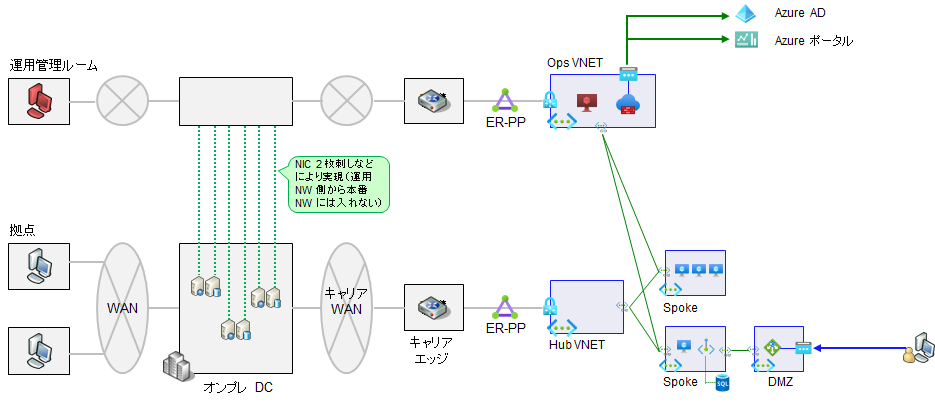
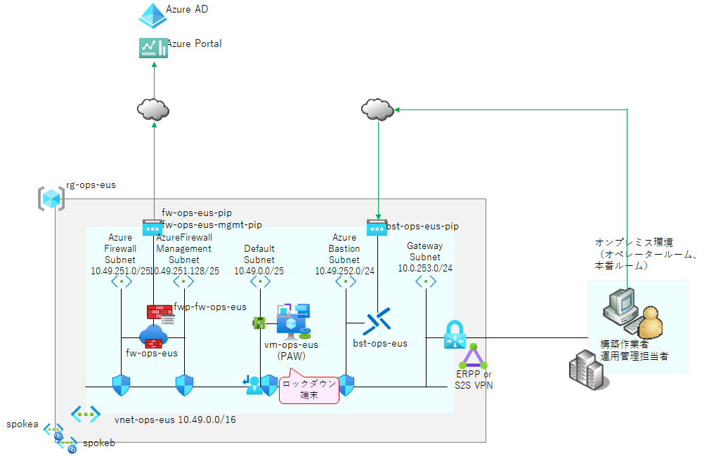

# Ops VNET 作成

金融や公共などの規制業界をはじめとして、高セキュリティを求める企業では、運用管理作業を行うネットワークと、エンドユーザが本番環境を利用するネットワークを分離していることがよくあります。クラウド環境でこれを行う場合には、下図に示すように以下のような設計を行います。

- 運用管理を行うための仮想ネットワーク（図中の Ops VNET）を別途作成
- 各業務システムを持つ Spoke VNET へピアリングを行う（VNET ピアリングは 2 ホップができないため、Ops VNET から Hub VNET への直接侵入はできなくなります）

  

また、Ops VNET には以下のようなリソースを配置することがよくあります。

- ハードニングされた管理用端末
  - オンプレミス環境でもハードニングされた物理端末を利用することはよくありますが、サプライチェーンまで管理された物理端末を用意するのは非常に大変です。
  - このため、ハードニングされた作業端末を用意する場合には、仮想マシンとして用意する方が容易であることが多いです。本デモでも、Azure 環境を操作したり業務システムの VM を操作したりするための作業端末を Ops VNET 内に作成します。
- Azure Firewall
  - Azure 環境の操作には、Azure AD や Azure ポータルへのアクセス経路が必要です。オンプレの Firewall に穴開けをすることもできますが、先の管理用端末からのアクセスだけであれば、Ops VNET 内に Azure Firewall を立てて必要な通信経路を確保した方が管理も容易です。
- Azure Bastion
  - 図中では Ops VNET に対して専用回線（Express Route Private Peering）を張り、運用管理ルームから接続する形で示していますが...
  - 社外からこの管理端末にアクセスしたいようなケースでは、Ops VNET に Azure Bastion と呼ばれる踏み台環境を作成しておくと便利です。

本サンプルでは上述を加味して、以下のような運用管理用環境を管理サブスクリプション内に構築します。（※ 専用線接続は割愛します）

  

まずは以下のスクリプトで Ops VNET と Azure Bastion を作成します。

## （参考）Bastion の SKU 選択

ここでは Standard SKU を利用しています。主な違いは[以下](https://learn.microsoft.com/en-us/azure/bastion/configuration-settings)の通りです。規制業界における本番環境ではセッションレコーディング及び Private-only 機能が利用できる Premium SKU の利用もご検討ください。

- Basic SKU 以上のみ
  - VNET Peering を介した接続
  - Kerberos 認証のサポート
- Standard SKU のみ
  - ホストスケーリング
  - ファイルのアップロード・ダウンロード
  - Web クライアントでのコピペ無効化
  - 共有リンク
- Premium SKU のみ
  - セッションレコーディング ([参考](https://www.kentsu.website/ja/posts/2024/bastion_recording/))
  - Private-Only Bastion（パブリックアクセスできない Bastion の作成）

```bash

# 共通基盤管理チーム／① 初期構築時の作業アカウントに切り替え
if ${FLAG_USE_SOD}; then if ${FLAG_USE_SOD_SP}; then TEMP_SP_NAME="sp_plat_dev"; az login --service-principal --username ${SP_APP_IDS[${TEMP_SP_NAME}]} --password '${SP_PWDS[${TEMP_SP_NAME}]}' --tenant ${PRIMARY_DOMAIN_NAME} --allow-no-subscriptions; else az account clear; az login -u "user_plat_dev@${PRIMARY_DOMAIN_NAME}" -p "${ADMIN_PASSWORD}"; fi; fi
 
# 運用管理基盤の作成
az account set -s "${SUBSCRIPTION_ID_MGMT}"
 
for i in ${VDC_NUMBERS}; do
  TEMP_LOCATION_NAME=${LOCATION_NAMES[$i]}
  TEMP_LOCATION_PREFIX=${LOCATION_PREFIXS[$i]}
 
  # Ops VNET 作成
  TEMP_RG_NAME="rg-ops-${TEMP_LOCATION_PREFIX}"
  TEMP_VNET_NAME="vnet-ops-${TEMP_LOCATION_PREFIX}"
  TEMP_IP_PREFIX=${IP_OPS_PREFIXS[$i]}
  TEMP_VNET_ADDRESS="${TEMP_IP_PREFIX}.0.0/16"
  TEMP_SUBNET_DEFAULT="${TEMP_IP_PREFIX}.0.0/24"
  TEMP_SUBNET_PE="${TEMP_IP_PREFIX}.250.0/24"
  TEMP_SUBNET_FW="${TEMP_IP_PREFIX}.251.0/25"
  TEMP_SUBNET_FWMGMT="${TEMP_IP_PREFIX}.251.128/25"
  TEMP_SUBNET_BASTION="${TEMP_IP_PREFIX}.252.0/24"
  TEMP_SUBNET_PROXY="${TEMP_IP_PREFIX}.254.0/24"
  TEMP_NSG_NAME="${TEMP_VNET_NAME}-nsg"
 
  az group create --name ${TEMP_RG_NAME} --location ${TEMP_LOCATION_NAME}
  az network nsg create --name ${TEMP_NSG_NAME} --resource-group ${TEMP_RG_NAME}
  az network vnet create --resource-group ${TEMP_RG_NAME} --name ${TEMP_VNET_NAME} --address-prefixes ${TEMP_VNET_ADDRESS}
  az network vnet subnet create --name "DefaultSubnet" --address-prefix ${TEMP_SUBNET_DEFAULT} --resource-group ${TEMP_RG_NAME} --vnet-name ${TEMP_VNET_NAME} --nsg ${TEMP_NSG_NAME}
  az network vnet subnet create --name "AzureFirewallSubnet" --address-prefix ${TEMP_SUBNET_FW} --resource-group ${TEMP_RG_NAME} --vnet-name ${TEMP_VNET_NAME}
  az network vnet subnet create --name "AzureFirewallManagementSubnet" --address-prefix ${TEMP_SUBNET_FWMGMT} --resource-group ${TEMP_RG_NAME} --vnet-name ${TEMP_VNET_NAME}
  az network vnet subnet create --name "PrivateEndpointSubnet" --address-prefix ${TEMP_SUBNET_PE} --resource-group ${TEMP_RG_NAME} --vnet-name ${TEMP_VNET_NAME} --nsg ${TEMP_NSG_NAME}
  az network vnet subnet create --name "AzureBastionSubnet" --address-prefix ${TEMP_SUBNET_BASTION} --resource-group ${TEMP_RG_NAME} --vnet-name ${TEMP_VNET_NAME}
  az network vnet subnet create --name "ProxySubnet" --address-prefix ${TEMP_SUBNET_PROXY} --resource-group ${TEMP_RG_NAME} --vnet-name ${TEMP_VNET_NAME} --nsg ${TEMP_NSG_NAME}
 
done # TEMP_LOCATION
 
# Bastion 作成
for i in ${VDC_NUMBERS}; do
  TEMP_LOCATION_NAME=${LOCATION_NAMES[$i]}
  TEMP_LOCATION_PREFIX=${LOCATION_PREFIXS[$i]}
 
  # Ops Bastion 作成（インフラ管理用 VM へのログイン用踏み台）
  # ※ 管理端末を Azure VM として持つ必要がなければ不要
  TEMP_RG_NAME="rg-ops-${TEMP_LOCATION_PREFIX}"
  TEMP_BASTION_NAME="bst-ops-${TEMP_LOCATION_PREFIX}"
  TEMP_BASTION_PIP_NAME="${TEMP_BASTION_NAME}-pip"
  TEMP_VNET_NAME="vnet-ops-${TEMP_LOCATION_PREFIX}"
 
  az network public-ip create --name ${TEMP_BASTION_PIP_NAME} --resource-group ${TEMP_RG_NAME} --sku Standard
  az network bastion create --name ${TEMP_BASTION_NAME} --public-ip-address ${TEMP_BASTION_PIP_NAME} --resource-group ${TEMP_RG_NAME} --vnet-name ${TEMP_VNET_NAME} --location ${TEMP_LOCATION_NAME} --no-wait --sku Standard

done # TEMP_LOCATION

```
