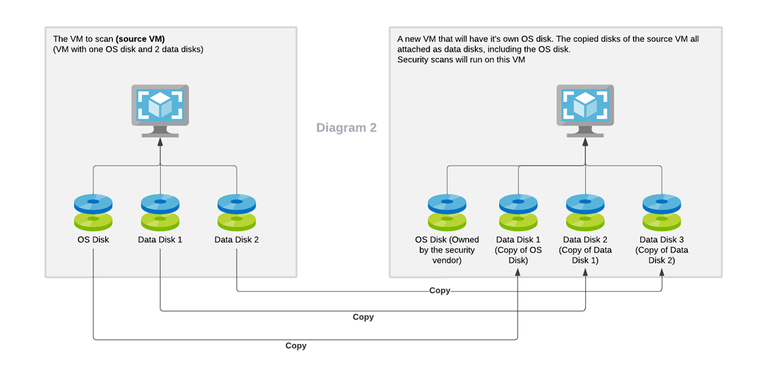

# ディスクの暗号化

本セクションでは、Azure におけるディスクの暗号化に関して解説します。

- 要点
  - 本共通基盤ガイドでは、当初、ADE (Azure Disk Encryption) を用いてディスクを暗号化していましたが、その後、PMK (Platform managed key) による DiskEncryptionAtHost 方式がサポートされるようになりました。この方式の方が圧倒的に容易にディスク暗号化に対応できるため、本共通基盤ガイドでも PMK による DiskEncryptionAtHost 方式を採用するように変更しています。構築デモビデオでは従来方式（ADE 方式）での構築を行っているため、ご注意ください。
  - PMK による DiskEncriptionAtHost 方式は、VM 作成時にオプションを指定するだけで済みます。手前の手順における "--encryption-at-host" オプションがこの作業に該当します。
- **重要**
  - ADE (Azure Disk Encryption) は、2028/09/15 に廃止予定になりました([詳細](https://azure.microsoft.com/ja-jp/updates?id=493779))。本ページの情報は残しておきますが、これから VM を作成する場合には、必ず DEH (Disk Encryption at Host) 方式をご利用ください。

以下に詳細な補足説明を記載します。参考にしてください。

## Azure におけるディスクの暗号化

Azure で利用可能なディスクの暗号化方式は、こちらの[ドキュメントページ](https://learn.microsoft.com/ja-jp/azure/virtual-machines/disk-encryption-overview#comparison)にまとめられています。それぞれにメリット・デメリットがありますが、要点としては以下になります。（Confidential Computing のケースは特殊なため、ここでは割愛します。）

- Azure Disk Storage のサーバ側暗号化 (Server-side Encryption)
  - Azure のマネージドディスクは、物理的には Blob Storage に格納されます。この Blob Storage が持っているデータ暗号化機能を利用する方式です。
  - もともと Blob Storage はデフォルト状態でも、Azure 基盤が管理しているキーで暗号化されています。このため、例えば Azure データセンタ内から物理ディスクが引き抜かれたとしても、そのデータを復号することはできません。
  - Azure 基盤が管理しているキーで暗号化されているため、ユーザーがキーを管理する必要はありませんが、これが気持ち悪い、という場合には CMK (Customer managed key) を使って暗号化させることもできます。（ただしその分、取り扱いは面倒になります。）
  - この方法では、**VM とディスク（OS からは直接アタッチされているように見えても実際にはリモートディスクです）間の通信は暗号化されません。**

- ADE (Azure Disk Encryption)
  - Windows OS であれば BitLocker, Linux OS であれば DM-Crypt によりディスクを暗号化する方式です。SSE と異なり、VM - ディスク間の通信も暗号化されます。
  - この方式では PMK 方式は利用できず、CMK 方式のみとなります。
  - ローカル PC の場合には、当該マシンの暗号モジュール（TPM, Trusted Platform Module）に保存されますが、クラウド上では VM のノード移動を可能にするため、Azure KeyVault にキーを保存する必要があります。
  - 鍵の乱立防止や鍵のローテーションのため、複数のマシンで一つのカギを使い回したくなりますが、これはできません。（一つの KeyVault にまとめることはできるが、鍵はマシン単位に作成される）
  - ディスクそのものが暗号化されるため、Azure ポータルからディスクのエクスポートを行っても、暗号化された状態のディスクしか引き抜くことができません。

- ホストでの暗号化（DiskEncriptionAtHost, DEAH）
  - 上述の ADE の利用上の難点・課題をクリアするために新しく登場した暗号化方式です。
    - DEAH 方式では VM - ディスク間の通信も暗号化することができるため、よりセキュアな環境を構築することができます。
    - Azure 基盤が管理しているキーを使うことができます（PMK）。
    - PMK 方式が気持ち悪い場合には、DiskEncryptionSet と呼ばれる機能を使うことにより、お客様管理のキーを使うことができ、なおかつ複数の VM に対してキーを束ねて管理することができます（CMK）。
  - 物理媒体上、VM - ディスク間通信ともに暗号化されていますが、OS 上からは暗号化されていません。このため、Azure ポータルからディスクのエクスポートを行うと、暗号化されていないディスクを引き抜くことができます。

## どの暗号化方式を使うべきか？

**特殊な要件がない場合には、PMK + DEAH 方式を使うことをお勧めします。** 主な理由は以下の通りです。

- 取り扱いが非常に容易です。ユーザ側での鍵管理の必要がなく、VM 作成時にオプションを指定するだけで済みます（--encryption-at-host）。
- また、追加の作業なく MDE のエージェントレススキャンに対応できます（後述）。
- SSE だけでは MCSB (Microsoft Cloud Security Benchmark) のセキュリティ要件を満たせませんが、PMK + DEAH 方式であれば満たすことができます。

規制要件等により PMK（プラットフォームキーによる暗号化）では不十分で CMK（顧客管理のキーによる暗号化）が必須とされている場合には、ADE 方式または CMK + DEAH 方式のいずれかを採用する必要があります。これらの方式を利用する場合には、以下に注意してください。

- ADE 方式と CMK + DEAH 方式のいずれを利用すべきか？
  - キーローテーションの要件がある場合には、CMK + DEAH 方式を利用した方が便利です。（[参考](https://learn.microsoft.com/en-us/azure/virtual-machines/windows/disks-enable-customer-managed-keys-powershell#set-up-an-azure-key-vault-and-diskencryptionset-optionally-with-automatic-key-rotation)）
  - ADE には「ポータルからのディスク引き抜き攻撃」（システム管理者による不正）に対する耐性があります。しかしポータルからディスクを引き抜ける管理者は、KeyVault に対する管理権限も有していることが多いため、セキュリティ的には大差なくなってしまう可能性もあることにご注意ください。
  - **(2025/09/30 追記) ADE は廃止予定になりました。今後の VM の作成には ADE ではなく DHE をご利用ください。**
- いずれの方式の場合でも注意すべき点
  - CMK 方式を利用する最大の難点は、エージェントレススキャンに対応するのが面倒になる点です。
    - エージェントレススキャンとは MDfC (Microsoft Defender for Cloud) が内部で利用している MDE (Microsoft Defender Endpoint) によるディスクのオフラインスキャン機能です。**稼働している VM に対して影響を与えることなく** 、背後でディスクのスナップショットを取り、これを別マシンに接続してスキャンすることで、OS やライブラリの脆弱性（パッチ適用漏れ）や、OS 構成設定の脆弱性（ミス）を検出します。  
      - 技術的詳細は以下のページを参照してください。
        - 概要 https://learn.microsoft.com/en-us/azure/defender-for-cloud/concept-agentless-data-collection
        - 技術 https://techcommunity.microsoft.com/t5/microsoft-defender-for-cloud/agentless-scanning-for-virtual-machines-in-the-cloud-technical/ba-p/4012256
        - 使い方 https://learn.microsoft.com/en-us/azure/defender-for-cloud/enable-agentless-scanning-vms
        - blog https://qiita.com/hisnakad/items/3633d4cca88c73462445
    - オンライン稼働に対してパフォーマンス影響を与えることがない、またすでに稼働しているシステムにエージェントをインストールしなくても脆弱性スキャンを行える、といったメリットからエージェントレススキャンへのニーズが高まっており、MDfC でも脆弱性スキャン機能の多くがエージェントレススキャンに依存するようになりました。
    - しかし **CMK 方式でエージェントレススキャンに対応するためには、スキャナーに対して KeyVault 内の鍵を貸し出す必要があります。** KeyVault のアクセス制御方式により異なりますが、RBAC 方式の場合には、以下のサービスプリンシパルに対して以下の RBAC 権限を付与する必要があります。
      - 対象 : Microsoft Defender for Cloud Servers Scanner Resource (0c7668b5-3260-4ad0-9f53-34ed54fa19b2)
      - ロール : Key Vault Crypto Service Encryption User (e147488a-f6f5-4113-8e2d-b22465e65bf6)

## （参考）サンプルスクリプト

以下は ADE, CMK+DEAH 方式を利用したい場合のサンプルスクリプトです。**本サンプルでは実行する必要はありません**が、CMK 方式を利用したい場合に参考にしてください。

### （参考）ADE を利用したい場合 ※ そのままの実行は不可、**今後廃止予定のためこの方法は使わないこと。**

```bash

# ADE (ディスク暗号化) の実施
# https://docs.microsoft.com/ja-jp/azure/virtual-machines/windows/disk-encryption-windows

for i in ${VDC_NUMBERS}; do
TEMP_LOCATION_NAME=${LOCATION_NAMES[$i]}
TEMP_LOCATION_PREFIX=${LOCATION_PREFIXS[$i]}

TEMP_RG_NAME="rg-ops-${TEMP_LOCATION_PREFIX}"

# KeyVault の作成 ※ KeyVault は一意名が必要なため、必要に応じて修正する
TEMP_ADE_KV_NAME="kv-ops-ade-${UNIQUE_SUFFIX}-${TEMP_LOCATION_PREFIX}"
# 以前の soft-deleted リソースが残っている場合はパージしてから作成
TEMP_RES_ID=$(az keyvault list-deleted  --query "[? name =='${TEMP_ADE_KV_NAME}'].id" -o tsv)
if [[ -n $TEMP_RES_ID ]]; then
  echo "Purging soft-deleted Keyvault : " $TEMP_RES_ID
  az rest --method POST --url "${TEMP_RES_ID}/purge?api-version=2022-07-01"
  while true
  do
    TEMP_RES_ID=$(az keyvault list-deleted  --query "[? name =='${TEMP_ADE_KV_NAME}'].id" -o tsv)
    echo "Waiting for purging..."
    if [[ -z $TEMP_RES_ID ]]; then
      break
    fi
    sleep 10 # Purge 完了待ち（直後に再作成すると conflict するため）
  done
fi
az keyvault create --name $TEMP_ADE_KV_NAME --resource-group ${TEMP_RG_NAME} --location ${TEMP_LOCATION_NAME} --enabled-for-disk-encryption --bypass AzureServices --default-action Deny

# Disk scanning Microsoft Entra app: "Microsoft Defender for Cloud Servers Scanner Resource Provider"
TEMP_RA_ID=$(uuidgen --sha1 --namespace @oid --name "Microsoft Defender for Cloud Servers Scanner Resource/Key Vault Crypto Service Encryption User/${TEMP_ADE_KV_NAME}")
az rest --method PUT --uri "/subscriptions/${SUBSCRIPTION_ID_MGMT}/resourceGroups/${TEMP_RG_NAME}/providers/Microsoft.KeyVault/vaults/${TEMP_ADE_KV_NAME}/providers/Microsoft.Authorization/roleAssignments/${TEMP_RA_ID}?api-version=2022-04-01" --body @- <<EOF
{
  "properties": {
    "roleDefinitionId": "/providers/Microsoft.Authorization/roleDefinitions/e147488a-f6f5-4113-8e2d-b22465e65bf6",
    "principalId": "0c7668b5-3260-4ad0-9f53-34ed54fa19b2",
    "principalType": "ServicePrincipal"
  }
}
EOF

done # TEMP_LOCATION

echo "Apply ADE to ${TEMP_VM_NAME}..."
az vm encryption enable --resource-group ${TEMP_RG_NAME} --name "vm-win03-eus" --disk-encryption-keyvault $TEMP_ADE_KV_NAME
az vm encryption enable --resource-group ${TEMP_RG_NAME} --name "vm-lnx03-eus" --disk-encryption-keyvault $TEMP_ADE_KV_NAME

```

### （参考）CMK + DEAH を利用したい場合 ※ そのままの実行は不可

```bash

# Disk Encryption Set の準備
# https://learn.microsoft.com/ja-jp/azure/virtual-machines/linux/disks-enable-host-based-encryption-cli

for i in ${VDC_NUMBERS}; do
TEMP_LOCATION_NAME=${LOCATION_NAMES[$i]}
TEMP_LOCATION_PREFIX=${LOCATION_PREFIXS[$i]}
TEMP_RG_NAME="rg-ops-${TEMP_LOCATION_PREFIX}"

TEMP_ADE_KV_NAME="kv-ops-ade-${UNIQUE_SUFFIX}-${TEMP_LOCATION_PREFIX}"

az keyvault update --name $TEMP_ADE_KV_NAME --resource-group ${TEMP_RG_NAME} --enable-purge-protection true 

TEMP_DES_NAME="des-ops-${TEMP_LOCATION_PREFIX}"
TEMP_DES_KEY_NAME="${TEMP_DES_NAME}-key"

# キー作成権限の付与が必要なので一時的に RBAC 権限を付与
TEMP_RES_ID=$(az keyvault show --name ${TEMP_ADE_KV_NAME} --query id -o tsv)
# Key Vault Administrator
TEMP_RBAC_ROLE_ID="/providers/Microsoft.Authorization/roleDefinitions/00482a5a-887f-4fb3-b363-3b7fe8e74483"
TEMP_USER_EMAIL=$(az account show --query user.name -o tsv)
TEMP_USER_PRINCIPAL_ID=$(az ad user show --id ${TEMP_USER_EMAIL} --query id -o tsv)
TEMP_RA_ID=$(uuidgen --sha1 --namespace @oid --name "${TEMP_USER_PRINCIPAL_ID}/${TEMP_RBAC_ROLE_ID}/${TEMP_RES_ID}")
az rest --method PUT --uri "${TEMP_RES_ID}/providers/Microsoft.Authorization/roleAssignments/${TEMP_RA_ID}?api-version=2022-04-01" --body @- <<EOF
{
  "properties": {
    "roleDefinitionId": "${TEMP_RBAC_ROLE_ID}",
    "principalId": "${TEMP_USER_PRINCIPAL_ID}",
    "principalType": "User"
  }
}
EOF
TEMP_RA_ID_FOR_DELETE="${TEMP_RES_ID}/providers/Microsoft.Authorization/roleAssignments/${TEMP_RA_ID}"

# Firewall を一時的に開放
az keyvault update --name $TEMP_ADE_KV_NAME --resource-group ${TEMP_RG_NAME} --enable-purge-protection true --public-network-access Enabled --default-action Allow

az keyvault key create --vault-name ${TEMP_ADE_KV_NAME} --name ${TEMP_DES_KEY_NAME} --protection software

TEMP_KEY_URL=$(az keyvault key show --vault-name ${TEMP_ADE_KV_NAME} --name ${TEMP_DES_KEY_NAME} --query [key.kid] -o tsv)
az disk-encryption-set create --name ${TEMP_DES_NAME} --resource-group ${TEMP_RG_NAME} --location ${TEMP_LOCATION_NAME} --key-url ${TEMP_KEY_URL} --enable-auto-key-rotation false

# オブジェクトができるまでループ処理
TEMP="NotFound"
while [[ ${TEMP} =~ "NotFound" ]]
do
  echo "Trying to get principal ID ${TEMP_DES_NAME}..."
  sleep 10
  TEMP=$(az disk-encryption-set show --name ${TEMP_DES_NAME} --resource-group ${TEMP_RG_NAME} --query [identity.principalId] -o tsv 2>&1)
done
TEMP_DES_ID=$TEMP

# RBAC でない場合
# az keyvault set-policy --name ${TEMP_ADE_KV_NAME} --resource-group ${TEMP_RG_NAME} --object-id ${TEMP_DES_ID} --key-permissions wrapkey unwrapkey get
# RBAC の場合
TEMP_RES_ID=$(az keyvault show --name ${TEMP_ADE_KV_NAME} --query id -o tsv)
# Key Vault Crypto Service Encryption User
TEMP_RBAC_ROLE_ID="/providers/Microsoft.Authorization/roleDefinitions/e147488a-f6f5-4113-8e2d-b22465e65bf6"
TEMP_RA_ID=$(uuidgen --sha1 --namespace @oid --name "${TEMP_DES_ID}/${TEMP_RBAC_ROLE_ID}/${TEMP_RES_ID}")
az rest --method PUT --uri "${TEMP_RES_ID}/providers/Microsoft.Authorization/roleAssignments/${TEMP_RA_ID}?api-version=2022-04-01" --body @- <<EOF
{
  "properties": {
    "roleDefinitionId": "${TEMP_RBAC_ROLE_ID}",
    "principalId": "${TEMP_DES_ID}",
    "principalType": "ServicePrincipal"
  }
}
EOF

# KeyVault へのアクセス権限を剥奪
az rest --method DELETE --uri "${TEMP_RA_ID_FOR_DELETE}?api-version=2022-04-01"
az keyvault update --name $TEMP_ADE_KV_NAME --resource-group ${TEMP_RG_NAME} --public-network-access Disabled --default-action Deny

done # TEMP_LOCATION

# DiskEncryptionAtHost (CMK) の適用

for i in ${VDC_NUMBERS}; do
TEMP_LOCATION_NAME=${LOCATION_NAMES[$i]}
TEMP_LOCATION_PREFIX=${LOCATION_PREFIXS[$i]}
TEMP_RG_NAME="rg-ops-${TEMP_LOCATION_PREFIX}"
TEMP_VNET_NAME="vnet-ops-${TEMP_LOCATION_PREFIX}"

TEMP_DES_NAME="des-ops-${TEMP_LOCATION_PREFIX}"
TEMP_DES_ID=$(az disk-encryption-set show -n ${TEMP_DES_NAME} -g ${TEMP_RG_NAME} --query [id] -o tsv)

# 作成する VM の定義
TEMP_VM_DEFS="\
vm-win04-${TEMP_LOCATION_PREFIX},Win2019DataCenter,DefaultSubnet \
vm-lnx04-${TEMP_LOCATION_PREFIX},canonical:0001-com-ubuntu-server-focal:20_04-lts-gen2:latest,DefaultSubnet \
"

for TEMP_VM_DEF in $TEMP_VM_DEFS; do
# 分解して利用
TEMP=(${TEMP_VM_DEF//,/ })
TEMP_VM_NAME=${TEMP[0]}
TEMP_VM_IMAGE=${TEMP[1]}
TEMP_SUBNET_NAME=${TEMP[2]}
TEMP_SUBNET_ID=$(az network vnet subnet show --resource-group ${TEMP_RG_NAME} --vnet-name ${TEMP_VNET_NAME} --name ${TEMP_SUBNET_NAME} --query id -o tsv)

echo "Creating ${TEMP_VM_NAME} (${TEMP_VM_IMAGE}) on ${TEMP_SUBNET_ID}..."
TEMP_VM_NIC_NAME="${TEMP_VM_NAME}-nic"

# NIC 作成
az network nic create --name "${TEMP_VM_NIC_NAME}" --subnet "${TEMP_SUBNET_ID}" --resource-group "${TEMP_RG_NAME}" --location ${TEMP_LOCATION_NAME}

# VM 作成
TEMP_DISK_SKU=$( [[ "$FLAG_USE_WORKLOAD_AZ" = true ]] && echo "Premium_ZRS" || echo "Premium_LRS" )
az vm create --name "${TEMP_VM_NAME}" --image ${TEMP_VM_IMAGE} --admin-username $ADMIN_USERNAME --admin-password $ADMIN_PASSWORD --nics "${TEMP_VM_NIC_NAME}" --resource-group "${TEMP_RG_NAME}" --location ${TEMP_LOCATION_NAME} --size Standard_D2s_v3 --storage-sku ${TEMP_DISK_SKU} --assign-identity [system] --encryption-at-host --os-disk-encryption-set $TEMP_DES_ID
done # TEMP_VM_DEF

done # TEMP_LOCATION

```
