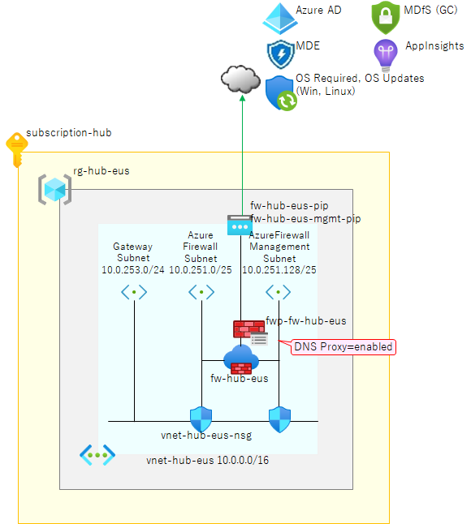

# Hub VNET と Azure Firewall の作成

ハブ＆スポーク型の仮想ネットワークを構成するため、まずハブサブスクリプションに Hub VNET を作成します。

  

- 今回のサンプルではオンプレミスとの接続は行いません。（GatewaySubnet を作成していますが、ERGW や VPNGW などは作成しません。）
- この Azure Firewall では DNS proxy 機能を有効化します。これは Spoke VNET からプライベート DNS ゾーンを解決するためですが、詳細は「04_03_PrivateDNSZonesの作成」にて解説します。
- 上図には出てきていませんが ＆ 本サンプルでは使いませんが、下記サンプルでは DefaultSubnet というサブネットも作成しています。ハブ VNET 内には様々な共有機能を作成する場合があり、そのようなケースではこのサブネットを利用してください。

```bash

# 共通基盤管理チーム／① 初期構築時の作業アカウントに切り替え
if ${FLAG_USE_SOD}; then if ${FLAG_USE_SOD_SP}; then TEMP_SP_NAME="sp_plat_dev"; az login --service-principal --username ${SP_APP_IDS[${TEMP_SP_NAME}]} --password '${SP_PWDS[${TEMP_SP_NAME}]}' --tenant ${PRIMARY_DOMAIN_NAME} --allow-no-subscriptions; else az account clear; az login -u "user_plat_dev@${PRIMARY_DOMAIN_NAME}" -p "${ADMIN_PASSWORD}"; fi; fi
 
# ハブサブスクリプションに切り替え
az account set -s "${SUBSCRIPTION_ID_HUB}"

for i in ${VDC_NUMBERS}; do
TEMP_LOCATION_NAME=${LOCATION_NAMES[$i]}
TEMP_LOCATION_PREFIX=${LOCATION_PREFIXS[$i]}

# HUB VNET 作成
TEMP_RG_NAME="rg-hub-${TEMP_LOCATION_PREFIX}"
TEMP_VNET_NAME="vnet-hub-${TEMP_LOCATION_PREFIX}"
TEMP_IP_PREFIX=${IP_HUB_PREFIXS[$i]}
TEMP_VNET_ADDRESS="${TEMP_IP_PREFIX}.0.0/16"
TEMP_SUBNET_DEFAULT="${TEMP_IP_PREFIX}.0.0/24"
TEMP_SUBNET_FW="${TEMP_IP_PREFIX}.251.0/25"
TEMP_SUBNET_FWMGMT="${TEMP_IP_PREFIX}.251.128/25"
TEMP_NSG_NAME="${TEMP_VNET_NAME}-nsg"
TEMP_UDR_NAME="${TEMP_VNET_NAME}-udr"

az group create --name ${TEMP_RG_NAME} --location ${TEMP_LOCATION_NAME}
az network nsg create --name ${TEMP_NSG_NAME} --resource-group ${TEMP_RG_NAME}
az network vnet create --resource-group ${TEMP_RG_NAME} --name ${TEMP_VNET_NAME} --address-prefixes ${TEMP_VNET_ADDRESS}
az network vnet subnet create --name "DefaultSubnet" --address-prefix ${TEMP_SUBNET_DEFAULT} --resource-group ${TEMP_RG_NAME} --vnet-name ${TEMP_VNET_NAME} --nsg ${TEMP_NSG_NAME}
az network vnet subnet create --name "AzureFirewallSubnet" --address-prefix ${TEMP_SUBNET_FW} --resource-group ${TEMP_RG_NAME} --vnet-name ${TEMP_VNET_NAME}
az network vnet subnet create --name "AzureFirewallManagementSubnet" --address-prefix ${TEMP_SUBNET_FWMGMT} --resource-group ${TEMP_RG_NAME} --vnet-name ${TEMP_VNET_NAME}

# 各 Hub VNET に Azure Firewall Standard を作成
TEMP_FW_NAME="fw-hub-${TEMP_LOCATION_PREFIX}"
TEMP_FW_PIP_NAME="${TEMP_FW_NAME}-pip"
TEMP_FW_MGMT_PIP_NAME="${TEMP_FW_NAME}-mgmt-pip"
TEMP_FWP_NAME="fw-hub-${TEMP_LOCATION_PREFIX}-fwp"
TEMP_FW_SKU="Standard" # DNS proxy 機能を利用するために Standard が必要

# Firewall Policy 作成
az network firewall policy create --name ${TEMP_FWP_NAME} --resource-group ${TEMP_RG_NAME} --sku Standard

TEMP_ZONE_REDUNDANCY=$( [ "$FLAG_USE_PLATFORM_AZ" = true ] && echo "--zone 1 2 3" || echo "" )
# パブリック IP、管理 IP を作成
az network public-ip create --name ${TEMP_FW_PIP_NAME} --resource-group ${TEMP_RG_NAME} --location ${TEMP_LOCATION_NAME} --allocation-method static --sku standard ${TEMP_ZONE_REDUNDANCY}
az network public-ip create --name ${TEMP_FW_MGMT_PIP_NAME} --resource-group ${TEMP_RG_NAME} --location ${TEMP_LOCATION_NAME} --allocation-method static --sku standard ${TEMP_ZONE_REDUNDANCY}
 
# ARM テンプレートで Azure Firewall を作成
ZONES_FLAGMENT='"zones": ["1", "2", "3"]'
cat <<EOF > tmp.json
{
  "\$schema": " https://schema.management.azure.com/schemas/2015-01-01/deploymentTemplate.json#",
  "contentVersion": "1.0.0.0",
  "resources": [
    {
      "type": "Microsoft.Network/azureFirewalls",
      "apiVersion": "2020-05-01",
      "name": "${TEMP_FW_NAME}",
      "location": "${TEMP_LOCATION_NAME}",
      $( [ "$FLAG_USE_PLATFORM_AZ" = true ] && echo "$ZONES_FLAGMENT," )
      "properties": {
                "ipConfigurations": [
                    {
                        "name": "${TEMP_FW_PIP_NAME}",
                        "properties": {
                            "subnet": {
                                "id": "$(az network vnet subnet show --name AzureFirewallSubnet --vnet-name ${TEMP_VNET_NAME} --resource-group ${TEMP_RG_NAME} --query id -o tsv)"
                            },
                            "publicIpAddress": {
                                "id": "$(az network public-ip show --name ${TEMP_FW_PIP_NAME} --resource-group ${TEMP_RG_NAME} --query id -o tsv)"
                            }
                        }
                    }
                ],
                "sku": {
                    "tier": "Standard"
                },
                "managementIpConfiguration": {
                    "name": "${TEMP_FW_MGMT_PIP_NAME}",
                    "properties": {
                        "subnet": {
                            "id": "$(az network vnet subnet show --name AzureFirewallManagementSubnet --vnet-name ${TEMP_VNET_NAME} --resource-group ${TEMP_RG_NAME} --query id -o tsv)"
                        },
                        "publicIPAddress": {
                            "id": "$(az network public-ip show --name ${TEMP_FW_MGMT_PIP_NAME} --resource-group ${TEMP_RG_NAME} --query id -o tsv)"
                        }
                    }
                },
                "firewallPolicy": {
                    "id": "$(az network firewall policy show --name "${TEMP_FWP_NAME}" --resource-group "${TEMP_RG_NAME}" --query id -o tsv)"
                }
      }
    }
  ]
}
EOF
az deployment group create --name ${TEMP_FW_NAME} --resource-group ${TEMP_RG_NAME} --template-file tmp.json --no-wait
 
# UDR 作成・割り当て
az network route-table create --resource-group ${TEMP_RG_NAME} --name ${TEMP_UDR_NAME}

# Azure Firewall のプロビジョニングが完了していないと IP アドレスが取得できないので待機
TEMP_FW_IP=$(az network firewall ip-config list -g ${TEMP_RG_NAME} -f ${TEMP_FW_NAME} --query "[0].privateIpAddress" --output tsv)
while [ -z $TEMP_FW_IP ]
do
  echo "Waiting for provisioning..."
  TEMP_FW_IP=$(az network firewall ip-config list -g ${TEMP_RG_NAME} -f ${TEMP_FW_NAME} --query "[0].privateIpAddress" --output tsv)
  sleep 10
done

az network route-table route create --resource-group ${TEMP_RG_NAME} --name default --route-table-name ${TEMP_UDR_NAME} --address-prefix 0.0.0.0/0 --next-hop-type VirtualAppliance --next-hop-ip-address ${TEMP_FW_IP}
az network vnet subnet update --resource-group ${TEMP_RG_NAME} --route-table ${TEMP_UDR_NAME} --ids $(az network vnet subnet show --resource-group ${TEMP_RG_NAME} --vnet-name $TEMP_VNET_NAME --name "DefaultSubnet" --query id -o tsv)

done # TEMP_LOCATION

```
