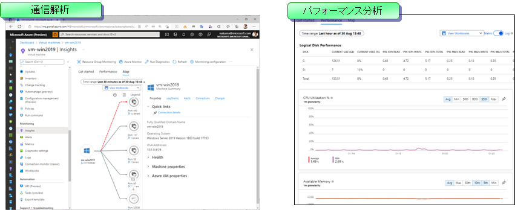
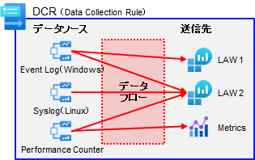

# VM Insights 用の事前準備

以降では、仮想マシンの管理などに必要となる共用リソースを作成していきます。まず最初に、VM Insights で利用する DCR (Data Collection Rule) の準備を行います。

- VM Insights とは...
  - 仮想マシンの詳細解析を行う Azure の機能です。
  - 通信を行っているプロセスとその通信先の解析を容易に行ったり、Windows/Linux で共通のパフォーマンス解析などを行ったりすることができます。非常に便利ですので、基本的には有効化していただくのがよいと思います。
  -   
- DCR, DCR-A とは...
  - VM Insights は、仮想マシンに AMA (Azure Monitor Agent) と DA (Dependency Agent)と呼ばれるエージェントを導入し、エージェントから LAW (Log Analytics Workspace)にログを吸い上げることによってデータ解析を行います。
  - AMA は DA 以外にも様々なエージェントからログを回収します。どのようなログを回収し、どこの LAW へデータを送るのかを決めるのが DCR と DCR-A です。
  - DCR はデータの収集ルールを定義したもので、これを仮想マシンに割り当てて利用します。この割り当てのことを DCR-A (DCR Association) と呼びます。
  - DCR は複数の VM で共用できるため、本ステップではまず DCR を作成しておきます。（DCR の割り当て作業は後で行います。）
  -   
- DCR の構造について
  - DCR は、データソース、送信先、その組み合わせ（データフロー）を定義したものです。
  - 1 つの DCR に様々なデータソースや送信先を定義することができますが、割り当ての柔軟性を高めるために DCR をある程度分けておくようにします。本サンプルでは、LAW 単位に DCR を分けています。
  -   

```bash

# 共通基盤管理チーム／① 初期構築時の作業アカウントに切り替え
if ${FLAG_USE_SOD} ; then az account clear ; az login -u "user_plat_dev@${PRIMARY_DOMAIN_NAME}" -p "${ADMIN_PASSWORD}" ; fi
 
# 運用管理サブスクリプションに切り替え
az account set -s "${SUBSCRIPTION_ID_MGMT}"
 
# DCR を MGMT サブスクリプション側に作成しておく
for i in ${VDC_NUMBERS}; do
TEMP_LOCATION_NAME=${LOCATION_NAMES[$i]}
TEMP_LOCATION_PREFIX=${LOCATION_PREFIXS[$i]}

TEMP_RG_NAME="rg-vdc-${TEMP_LOCATION_PREFIX}"
TEMP_LAW_NAME="law-vdc-${TEMP_LOCATION_PREFIX}"
TEMP_LAW_RESOURCE_ID="/subscriptions/${SUBSCRIPTION_ID_MGMT}/resourcegroups/rg-vdc-${TEMP_LOCATION_PREFIX}/providers/microsoft.operationalinsights/workspaces/${TEMP_LAW_NAME}"
TEMP_DCE_ID="/subscriptions/${SUBSCRIPTION_ID_MGMT}/resourcegroups/rg-vdc-${TEMP_LOCATION_PREFIX}/providers/microsoft.insights/datacollectionendpoints/dce-vdc-${TEMP_LOCATION_PREFIX}"

TEMP_DCR_AMA_WIN_NAME="dcr-law-vdc-${TEMP_LOCATION_PREFIX}-ama-win"
TEMP_DCR_AMA_LINUX_NAME="dcr-law-vdc-${TEMP_LOCATION_PREFIX}-ama-linux"
TEMP_DCR_VMI_NAME="dcr-law-vdc-${TEMP_LOCATION_PREFIX}-vmi"
 
# イベントログとパフォーマンスカウンタ情報の収集ルール (DCR) の作成
cat <<EOF > dcr.json
{
    "location": "${TEMP_LOCATION_NAME}",
    "kind": "Windows",
    "properties": {
        "description": "Data collection rule for Windows",
        "dataCollectionEndpointId": "${TEMP_DCE_ID}",
        "dataSources": {
            "performanceCounters": [
                {
                    "streams": [
                        "Microsoft-Perf"
                    ],
                    "samplingFrequencyInSeconds": 60,
                    "counterSpecifiers": [
                        "\\\\Processor Information(_Total)\\\\% Processor Time",
                        "\\\\Processor Information(_Total)\\\\% Privileged Time",
                        "\\\\Processor Information(_Total)\\\\% User Time",
                        "\\\\Processor Information(_Total)\\\\Processor Frequency",
                        "\\\\System\\\\Processes",
                        "\\\\Process(_Total)\\\\Thread Count",
                        "\\\\Process(_Total)\\\\Handle Count",
                        "\\\\System\\\\System Up Time",
                        "\\\\System\\\\Context Switches/sec",
                        "\\\\System\\\\Processor Queue Length",
                        "\\\\Memory\\\\% Committed Bytes In Use",
                        "\\\\Memory\\\\Available Bytes",
                        "\\\\Memory\\\\Committed Bytes",
                        "\\\\Memory\\\\Cache Bytes",
                        "\\\\Memory\\\\Pool Paged Bytes",
                        "\\\\Memory\\\\Pool Nonpaged Bytes",
                        "\\\\Memory\\\\Pages/sec",
                        "\\\\Memory\\\\Page Faults/sec",
                        "\\\\Process(_Total)\\\\Working Set",
                        "\\\\Process(_Total)\\\\Working Set - Private",
                        "\\\\LogicalDisk(_Total)\\\\% Disk Time",
                        "\\\\LogicalDisk(_Total)\\\\% Disk Read Time",
                        "\\\\LogicalDisk(_Total)\\\\% Disk Write Time",
                        "\\\\LogicalDisk(_Total)\\\\% Idle Time",
                        "\\\\LogicalDisk(_Total)\\\\Disk Bytes/sec",
                        "\\\\LogicalDisk(_Total)\\\\Disk Read Bytes/sec",
                        "\\\\LogicalDisk(_Total)\\\\Disk Write Bytes/sec",
                        "\\\\LogicalDisk(_Total)\\\\Disk Transfers/sec",
                        "\\\\LogicalDisk(_Total)\\\\Disk Reads/sec",
                        "\\\\LogicalDisk(_Total)\\\\Disk Writes/sec",
                        "\\\\LogicalDisk(_Total)\\\\Avg. Disk sec/Transfer",
                        "\\\\LogicalDisk(_Total)\\\\Avg. Disk sec/Read",
                        "\\\\LogicalDisk(_Total)\\\\Avg. Disk sec/Write",
                        "\\\\LogicalDisk(_Total)\\\\Avg. Disk Queue Length",
                        "\\\\LogicalDisk(_Total)\\\\Avg. Disk Read Queue Length",
                        "\\\\LogicalDisk(_Total)\\\\Avg. Disk Write Queue Length",
                        "\\\\LogicalDisk(_Total)\\\\% Free Space",
                        "\\\\LogicalDisk(_Total)\\\\Free Megabytes",
                        "\\\\Network Interface(*)\\\\Bytes Total/sec",
                        "\\\\Network Interface(*)\\\\Bytes Sent/sec",
                        "\\\\Network Interface(*)\\\\Bytes Received/sec",
                        "\\\\Network Interface(*)\\\\Packets/sec",
                        "\\\\Network Interface(*)\\\\Packets Sent/sec",
                        "\\\\Network Interface(*)\\\\Packets Received/sec",
                        "\\\\Network Interface(*)\\\\Packets Outbound Errors",
                        "\\\\Network Interface(*)\\\\Packets Received Errors"
                    ],
                    "name": "perfCounterDataSource10"
                }
            ],
            "windowsEventLogs": [
                {
                    "streams": [
                        "Microsoft-Event"
                    ],
                    "xPathQueries": [
                        "Application!*[System[(Level=1 or Level=2 or Level=3 or Level=4 or Level=5)]]",
                        "Security!*[System[(band(Keywords,13510798882111488))]]",
                        "System!*[System[(Level=1 or Level=2 or Level=3 or Level=4 or Level=5)]]"
                    ],
                    "name": "eventLogsDataSource"
                }
            ]
        },
        "destinations": {
            "logAnalytics": [
                {
                    "workspaceResourceId": "${TEMP_LAW_RESOURCE_ID}",
                    "name": "law"
                }
            ]
        },
        "dataFlows": [
            {
                "streams": [
                    "Microsoft-Perf"
                ],
                "destinations": [
                    "law"
                ]
            },
            {
                "streams": [
                    "Microsoft-Event"
                ],
                "destinations": [
                    "law"
                ]
            }
        ]
    }
}
EOF
 
az monitor data-collection rule create --name ${TEMP_DCR_AMA_WIN_NAME} --resource-group "${TEMP_RG_NAME}" --location "${TEMP_LOCATION_NAME}" --rule-file dcr.json
 
cat <<EOF > dcr.json
{
    "location": "${TEMP_LOCATION_NAME}",
    "kind": "Linux",
    "properties": {
        "description": "Data collection rule for Linux",
        "dataCollectionEndpointId": "${TEMP_DCE_ID}",
        "dataSources": {
            "syslog": [
                {
                    "streams": [
                        "Microsoft-Syslog"
                    ],
                    "facilityNames": [
                        "auth",
                        "authpriv",
                        "cron",
                        "daemon",
                        "mark",
                        "kern",
                        "local0",
                        "local1",
                        "local2",
                        "local3",
                        "local4",
                        "local5",
                        "local6",
                        "local7",
                        "lpr",
                        "mail",
                        "news",
                        "syslog",
                        "user",
                        "uucp"
                    ],
                    "logLevels": [
                        "Debug",
                        "Info",
                        "Notice",
                        "Warning",
                        "Error",
                        "Critical",
                        "Alert",
                        "Emergency"
                    ],
                    "name": "sysLogsDataSource"
                }
            ],
            "performanceCounters": [
                {
                    "counterSpecifiers": [
                        "Processor(*)\\\\% Processor Time",
                        "Processor(*)\\\\% Idle Time",
                        "Processor(*)\\\\% User Time",
                        "Processor(*)\\\\% Nice Time",
                        "Processor(*)\\\\% Privileged Time",
                        "Processor(*)\\\\% IO Wait Time",
                        "Processor(*)\\\\% Interrupt Time",
                        "Processor(*)\\\\% DPC Time",
                        "Memory(*)\\\\Available MBytes Memory",
                        "Memory(*)\\\\% Available Memory",
                        "Memory(*)\\\\Used Memory MBytes",
                        "Memory(*)\\\\% Used Memory",
                        "Memory(*)\\\\Pages/sec",
                        "Memory(*)\\\\Page Reads/sec",
                        "Memory(*)\\\\Page Writes/sec",
                        "Memory(*)\\\\Available MBytes Swap",
                        "Memory(*)\\\\% Available Swap Space",
                        "Memory(*)\\\\Used MBytes Swap Space",
                        "Memory(*)\\\\% Used Swap Space",
                        "Logical Disk(*)\\\\% Free Inodes",
                        "Logical Disk(*)\\\\% Used Inodes",
                        "Logical Disk(*)\\\\Free Megabytes",
                        "Logical Disk(*)\\\\% Free Space",
                        "Logical Disk(*)\\\\% Used Space",
                        "Logical Disk(*)\\\\Logical Disk Bytes/sec",
                        "Logical Disk(*)\\\\Disk Read Bytes/sec",
                        "Logical Disk(*)\\\\Disk Write Bytes/sec",
                        "Logical Disk(*)\\\\Disk Transfers/sec",
                        "Logical Disk(*)\\\\Disk Reads/sec",
                        "Logical Disk(*)\\\\Disk Writes/sec",
                        "Network(*)\\\\Total Bytes Transmitted",
                        "Network(*)\\\\Total Bytes Received",
                        "Network(*)\\\\Total Bytes",
                        "Network(*)\\\\Total Packets Transmitted",
                        "Network(*)\\\\Total Packets Received",
                        "Network(*)\\\\Total Rx Errors",
                        "Network(*)\\\\Total Tx Errors",
                        "Network(*)\\\\Total Collisions"
                    ],
                    "samplingFrequencyInSeconds": 60,
                    "streams": [
                        "Microsoft-Perf"
                    ],
                    "scheduledTransferPeriod": "PT1M",
                    "name": "perfCounterDataSource10"
                }
            ]
        },
        "destinations": {
            "logAnalytics": [
                {
                    "workspaceResourceId": "${TEMP_LAW_RESOURCE_ID}",
                    "name": "law"
                }
            ]
        },
        "dataFlows": [
            {
                "streams": [
                    "Microsoft-Perf"
                ],
                "destinations": [
                    "law"
                ]
            },
            {
                "streams": [
                    "Microsoft-Syslog"
                ],
                "destinations": [
                    "law"
                ]
            }
        ]
    }
}
EOF
 
az monitor data-collection rule create --name ${TEMP_DCR_AMA_LINUX_NAME} --resource-group "${TEMP_RG_NAME}" --location "${TEMP_LOCATION_NAME}" --rule-file dcr.json
 
# VM Insights 用の DCR の作成
 
cat <<EOF > dcr.json
{
    "location": "${TEMP_LOCATION_NAME}",
    "properties": {
        "description": "Data collection rule for VM Insights.",
        "dataCollectionEndpointId": "${TEMP_DCE_ID}",
        "dataSources": {
            "performanceCounters": [
                {
                    "name": "VMInsightsPerfCounters",
                    "streams": [
                        "Microsoft-InsightsMetrics"
                    ],
                    "scheduledTransferPeriod": "PT1M",
                    "samplingFrequencyInSeconds": 60,
                    "counterSpecifiers": [
                        "\\VmInsights\\DetailedMetrics"
                    ]
                }
            ],
            "extensions": [
                {
                    "streams": [
                        "Microsoft-ServiceMap"
                    ],
                    "extensionName": "DependencyAgent",
                    "extensionSettings": {},
                    "name": "DependencyAgentDataSource"
                }
            ]
        },
        "destinations": {
            "logAnalytics": [
                {
                    "workspaceResourceId": "${TEMP_LAW_RESOURCE_ID}",
                    "name": "VMInsightsPerf-Logs-Dest"
                }
            ],
            "azureMonitorMetrics": {
                "name": "azureMonitorMetrics-default"
            }
        },
        "dataFlows": [
            {
                "streams": [
                    "Microsoft-InsightsMetrics"
                ],
                "destinations": [
                    "azureMonitorMetrics-default"
                ]
            },
            {
                "streams": [
                    "Microsoft-InsightsMetrics"
                ],
                "destinations": [
                    "VMInsightsPerf-Logs-Dest"
                ]
            },
            {
                "streams": [
                    "Microsoft-ServiceMap"
                ],
                "destinations": [
                    "VMInsightsPerf-Logs-Dest"
                ]
            }
        ]
    }
}
EOF
az monitor data-collection rule create --name ${TEMP_DCR_VMI_NAME} --resource-group "${TEMP_RG_NAME}" --location "${TEMP_LOCATION_NAME}" --rule-file dcr.json
 
done # TEMP_LOCATION

```
