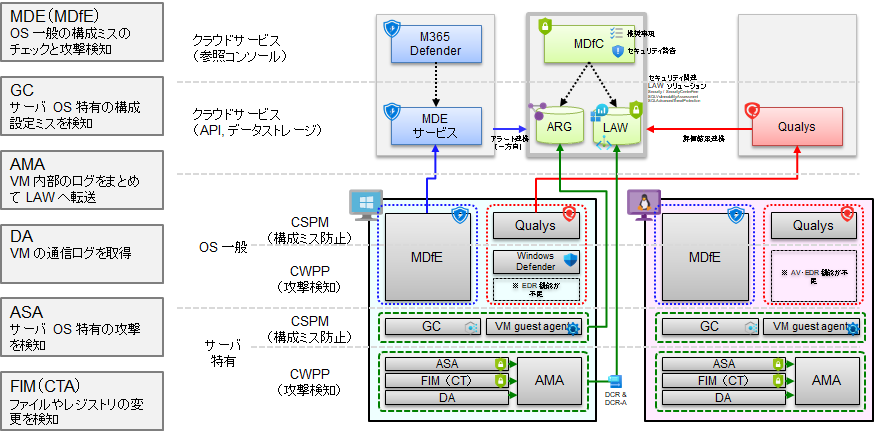

# MDfS 用の事前準備

クラウドのセキュリティを管理する機能である MDfC (Microsoft Defender for Cloud) のうち、サーバ（仮想マシン）向けセキュリティ管理機能のことを MDfS (Microsoft Defender for Servers) と呼びます。ここでは MDfS が利用する DCR の準備を行います。

- MDfS について
  - サーバのセキュリティ維持のために行うべき作業は、大別して以下の 4 つに分類されます。
    - 構成設定ミスの防止（CSPM）：OS 一般論と、サーバ特有のものでさらに 2 つに分かれます。
    - 攻撃検知（CWPP）：OS 一般論と、サーバ特有のものでさらに 2 つに分かれます。
  - MDfS は複数のエージェントを併用してこれらの機能を実現します。
    -   
- 仮想マシンで利用される代表的なエージェントについて
  - 仮想マシンで利用される主なエージェントは以下の通りです。
    - MDE (Microsoft Defender for Endpoint) : OS 一般の CSPM・CWPP 機能を提供します。Windows OS のクライアントマシンなどでもよく使われているものです。
    - Qualys : MDE の代替として Qualys を利用することもできます。（もともと MDE がサーバ向けに提供されていなかった頃に代替ソリューションとして利用されていたものです。現在は MDE が Windows, Linux 両方に対応して機能を拡充してきていますので、MDE をご利用いただくのがよいと思います。）
    - GC (Guest Configuraton Agent) : サーバ用途で仮想マシンを構成する際の、OS の構成設定をチェックするものです。
    - VM guest agent : Azure の仮想マシンを管理するためのエージェントです。
    - AMA (Azure Monitor Agent) : 各種のエージェントのログデータを LAW に効率的に転送するためのエージェントです。割り当てられた DCR の情報に基づいてログを転送します。
    - ASA (Azure Security Agent) : サーバ特有の攻撃を検知するセキュリティエージェントです。
    - FIM (File Integrity Monitoring) : ファイルやレジストリの変更をモニタリングするエージェントです。CTA (Change Tracking Agent) とも呼ばれます。
    - DA (Dependency Agent) : VM Insights が利用するエージェントです。プロセス情報やネットワーク通信の情報を読み取ります。（※ このエージェントは厳密には MDfS の機能ではなく VM Insights のエージェントですが、まとめてここに示しました。）
  - これらのエージェントは一枚岩で実装されておらず、小分けにされています。このため、一部のみ 3rd party 製ソリューションなどに置き換えたりすることもできます。
  - 上記のエージェントのうち、ASA, FIM, DA は DCR を必要とします。また、イベントログやパフォーマンスカウンタ、syslog などの標準ログデータの転送は AMA のみで可能ですが、そのための DCR が必要です。
- 本ステップで行う作業について
  - 上記の DCR のうち、MDfS に関わるもの（ASA, FIM）を用意します。
  - Log Analytics Workspace に LAW ソリューションをインストールします。これにより、Log Analytics Workspace のスキーマを拡張し、MDfS に関わるログデータを受け付けられるようにします。

なお、スクリプトの実行に関して、以下 2 点に注意してください。

- スクリプトは LAW ソリューションのインストール → DCR の作成の順に進みますが、DCR 作成時に LAW ソリューションのインストールによる LAW スキーマ拡張が完了していないとエラーが返される場合があります。この場合は、しばらく（数分程度）待ってからスクリプトを再実行してください。
- この作業はスクリプトが極めて長く、貼り付け時にうまく動作しない場合があります。このため、いったんアカウント切り替え処理＋サブスクリプション切り替え処理を行い、これが完了した後に、以降の DCR 作成作業を行ってください。

## スクリプト（ログイン処理）

```bash
# 共通基盤管理チーム／① 初期構築時の作業アカウントに切り替え
if ${FLAG_USE_SOD} ; then az account clear ; az login -u "user_plat_dev@${PRIMARY_DOMAIN_NAME}" -p "${ADMIN_PASSWORD}" ; fi
 
# 運用管理サブスクリプションに切り替え
az account set -s "${SUBSCRIPTION_ID_MGMT}"

```

## スクリプト（DCR 作成処理、"Data collection rule is invalid" というエラーが出た場合には再実行）

```bash
# LAWS へのソリューションのインストール
# DCR の作成（ASA, FIM）
 
for i in ${VDC_NUMBERS}; do
  TEMP_LOCATION_NAME=${LOCATION_NAMES[$i]}
  TEMP_LOCATION_PREFIX=${LOCATION_PREFIXS[$i]}
 
  TEMP_RG_NAME="rg-vdc-${TEMP_LOCATION_PREFIX}"
  TEMP_LAW_NAME="law-vdc-${TEMP_LOCATION_PREFIX}"
  TEMP_LAW_RESOURCE_ID="/subscriptions/${SUBSCRIPTION_ID_MGMT}/resourcegroups/rg-vdc-${TEMP_LOCATION_PREFIX}/providers/microsoft.operationalinsights/workspaces/${TEMP_LAW_NAME}"
  TEMP_DCE_ID="/subscriptions/${SUBSCRIPTION_ID_MGMT}/resourcegroups/rg-vdc-${TEMP_LOCATION_PREFIX}/providers/microsoft.insights/datacollectionendpoints/dce-vdc-${TEMP_LOCATION_PREFIX}"
 
TEMP_DCR_ASA_NAME="dcr-law-vdc-${TEMP_LOCATION_PREFIX}-asa" # Microsoft-Security-dcr
TEMP_DCR_FIM_NAME="dcr-law-vdc-${TEMP_LOCATION_PREFIX}-fim"
 
cat <<EOF > tmp.json
{
  "\$schema": " https://schema.management.azure.com/schemas/2015-01-01/deploymentTemplate.json#",
    "contentVersion": "1.0.0.0",
    "parameters": {
        "solutions": {
            "type": "array",
            "defaultValue": [
                "Security",
                "SecurityCenterFree",
                "SQLAdvancedThreatProtection",
                "SQLVulnerabilityAssessment",
                "ChangeTracking"
            ]
        },
        "workspaceName": {
            "type": "string",
            "defaultValue": "${TEMP_LAW_NAME}"
        },
        "workspaceId": {
            "type": "string",
            "defaultValue": "${TEMP_LAW_RESOURCE_ID}"
        }
    },
    "resources": [
        {
            "name": "[concat(parameters('solutions')[CopyIndex()], '(', parameters('workspaceName'), ')')]",
            "type": "Microsoft.OperationsManagement/solutions",
            "apiVersion": "2015-11-01-preview",
            "location": "${TEMP_LOCATION_NAME}",
            "tags": {},
            "plan": {
                "name": "[concat(parameters('solutions')[CopyIndex()], '(', parameters('workspaceName'), ')')]",
                "publisher": "Microsoft",
                "promotionCode": "",
                "product": "[concat('OMSGallery/', parameters('solutions')[CopyIndex()])]"
            },
            "properties": {
                "workspaceResourceId": "${TEMP_LAW_RESOURCE_ID}",
                "containedResources": [
                    "[concat(parameters('workspaceId'), '/views/', parameters('solutions')[CopyIndex()], '(', parameters('workspaceName'), ')')]"
                ]
            },
            "copy": {
                "name": "solutionAssignment",
                "count": "[length(parameters('solutions'))]"
            }
        }
    ]
}
EOF
az deployment group create --name "SolutionDeploy-${TEMP_LAW_NAME}" --resource-group $TEMP_RG_NAME --template-file tmp.json
 
# DCR の作成
 
cat <<EOF > dcr.json
{
    "location": "${TEMP_LOCATION_NAME}",
    "properties": {
        "description": "Data collection rule for Microsoft Defender for Cloud. Deleting this rule will break the detection of security vulnerabilities.",
        "dataCollectionEndpointId": "${TEMP_DCE_ID}",
        "dataSources": {
            "windowsEventLogs": [
                {
                    "streams": [
                        "Microsoft-RomeDetectionEvent"
                    ],
                    "xPathQueries": [
                        "Security!*",
                        "Microsoft-Windows-AppLocker/EXE and DLL!*"
                    ],
                    "name": "RomeDetectionEventDataSource"
                }
            ],
            "extensions": [
                {
                    "streams": [
                        "Microsoft-OperationLog",
                        "Microsoft-ProtectionStatus",
                        "Microsoft-ProcessInvestigator",
                        "Microsoft-Auditd"
                    ],
                    "extensionName": "AzureSecurityLinuxAgent",
                    "extensionSettings": {},
                    "name": "AscLinuxDataSource"
                },
                {
                    "streams": [
                        "Microsoft-OperationLog",
                        "Microsoft-ProtectionStatus",
                        "Microsoft-ProcessInvestigator"
                    ],
                    "extensionName": "AzureSecurityWindowsAgent",
                    "extensionSettings": {},
                    "name": "AsaWindowsDataSource"
                },
                {
                    "streams": [
                        "Microsoft-DefenderForSqlAlerts",
                        "Microsoft-DefenderForSqlLogins",
                        "Microsoft-SqlAtpStatus-DefenderForSql",
                        "Microsoft-DefenderForSqlTelemetry"
                    ],
                    "extensionName": "AdvancedThreatProtection",
                    "extensionSettings": {},
                    "name": "AdvancedThreatProtection"
                },
                {
                    "streams": [
                        "Microsoft-DefenderForSqlScanEvents",
                        "Microsoft-DefenderForSqlScanResults",
                        "Microsoft-DefenderForSqlTelemetry"
                    ],
                    "extensionName": "VulnerabilityAssessment",
                    "name": "VulnerabilityAssessment"
                }
            ]
        },
        "destinations": {
            "logAnalytics": [
                {
                    "workspaceResourceId": "${TEMP_LAW_RESOURCE_ID}",
                    "name": "LogAnalyticsDest"
                }
            ]
        },
        "dataFlows": [
            {
                "streams": [
                    "Microsoft-OperationLog",
                    "Microsoft-ProtectionStatus",
                    "Microsoft-Auditd",
                    "Microsoft-RomeDetectionEvent",
                    "Microsoft-ProcessInvestigator",
                    "Microsoft-DefenderForSqlAlerts",
                    "Microsoft-DefenderForSqlLogins",
                    "Microsoft-SqlAtpStatus-DefenderForSql",
                    "Microsoft-DefenderForSqlTelemetry",
                    "Microsoft-DefenderForSqlScanEvents",
                    "Microsoft-DefenderForSqlScanResults"
                ],
                "destinations": [
                    "LogAnalyticsDest"
                ]
            }
        ]
    }
}
EOF
az monitor data-collection rule create --name ${TEMP_DCR_ASA_NAME} --resource-group "${TEMP_RG_NAME}" --location "${TEMP_LOCATION_NAME}" --rule-file dcr.json
 
cat <<EOF > dcr.json
{
    "location": "${TEMP_LOCATION_NAME}",
    "properties": {
        "description": "Data collection rule for change tracking agent.",
        "dataCollectionEndpointId": "${TEMP_DCE_ID}",
        "dataSources": {
            "extensions": [
                {
                    "streams": [
                        "Microsoft-ConfigurationChange"
                    ],
                    "extensionName": "ChangeTracking-Windows",
                    "extensionSettings": {
                        "enableFiles": true,
                        "enableSoftware": true,
                        "enableRegistry": true,
                        "enableServices": false,
                        "enableInventory": true,
                        "registrySettings": {
                            "registryCollectionFrequency": 3000,
                            "registryInfo": [
                                {
                                    "name": "Registry_1",
                                    "groupTag": "Recommended",
                                    "enabled": true,
                                    "recurse": false,
                                    "description": "",
                                    "keyName": "HKEY_LOCAL_MACHINE\\\\Software\\\\Microsoft\\\\Windows\\\\CurrentVersion\\\\Group Policy\\\\Scripts\\\\Startup",
                                    "valueName": ""
                                },
                                {
                                    "name": "Registry_2",
                                    "groupTag": "Recommended",
                                    "enabled": true,
                                    "recurse": false,
                                    "description": "",
                                    "keyName": "HKEY_LOCAL_MACHINE\\\\Software\\\\Microsoft\\\\Windows\\\\CurrentVersion\\\\Group Policy\\\\Scripts\\\\Shutdown",
                                    "valueName": ""
                                },
                                {
                                    "name": "Registry_3",
                                    "groupTag": "Recommended",
                                    "enabled": true,
                                    "recurse": true,
                                    "description": "",
                                    "keyName": "HKEY_LOCAL_MACHINE\\\\SOFTWARE\\\\Wow6432Node\\\\Microsoft\\\\Windows\\\\CurrentVersion\\\\Run",
                                    "valueName": ""
                                },
                                {
                                    "name": "Registry_4",
                                    "groupTag": "Recommended",
                                    "enabled": true,
                                    "recurse": true,
                                    "description": "",
                                    "keyName": "HKEY_LOCAL_MACHINE\\\\SOFTWARE\\\\Microsoft\\\\Active Setup\\\\Installed Components",
                                    "valueName": ""
                                },
                                {
                                    "name": "Registry_5",
                                    "groupTag": "Recommended",
                                    "enabled": true,
                                    "recurse": true,
                                    "description": "",
                                    "keyName": "HKEY_LOCAL_MACHINE\\\\Software\\\\Classes\\\\Directory\\\\ShellEx\\\\ContextMenuHandlers",
                                    "valueName": ""
                                },
                                {
                                    "name": "Registry_6",
                                    "groupTag": "Recommended",
                                    "enabled": true,
                                    "recurse": true,
                                    "description": "",
                                    "keyName": "HKEY_LOCAL_MACHINE\\\\Software\\\\Classes\\\\Directory\\\\Background\\\\ShellEx\\\\ContextMenuHandlers",
                                    "valueName": ""
                                },
                                {
                                    "name": "Registry_7",
                                    "groupTag": "Recommended",
                                    "enabled": true,
                                    "recurse": true,
                                    "description": "",
                                    "keyName": "HKEY_LOCAL_MACHINE\\\\Software\\\\Classes\\\\Directory\\\\Shellex\\\\CopyHookHandlers",
                                    "valueName": ""
                                },
                                {
                                    "name": "Registry_8",
                                    "groupTag": "Recommended",
                                    "enabled": true,
                                    "recurse": true,
                                    "description": "",
                                    "keyName": "HKEY_LOCAL_MACHINE\\\\Software\\\\Microsoft\\\\Windows\\\\CurrentVersion\\\\Explorer\\\\ShellIconOverlayIdentifiers",
                                    "valueName": ""
                                },
                                {
                                    "name": "Registry_9",
                                    "groupTag": "Recommended",
                                    "enabled": true,
                                    "recurse": true,
                                    "description": "",
                                    "keyName": "HKEY_LOCAL_MACHINE\\\\Software\\\\Wow6432Node\\\\Microsoft\\\\Windows\\\\CurrentVersion\\\\Explorer\\\\ShellIconOverlayIdentifiers",
                                    "valueName": ""
                                },
                                {
                                    "name": "Registry_10",
                                    "groupTag": "Recommended",
                                    "enabled": true,
                                    "recurse": true,
                                    "description": "",
                                    "keyName": "HKEY_LOCAL_MACHINE\\\\Software\\\\Microsoft\\\\Windows\\\\CurrentVersion\\\\Explorer\\\\Browser Helper Objects",
                                    "valueName": ""
                                },
                                {
                                    "name": "Registry_11",
                                    "groupTag": "Recommended",
                                    "enabled": true,
                                    "recurse": true,
                                    "description": "",
                                    "keyName": "HKEY_LOCAL_MACHINE\\\\Software\\\\Wow6432Node\\\\Microsoft\\\\Windows\\\\CurrentVersion\\\\Explorer\\\\Browser Helper Objects",
                                    "valueName": ""
                                },
                                {
                                    "name": "Registry_12",
                                    "groupTag": "Recommended",
                                    "enabled": true,
                                    "recurse": true,
                                    "description": "",
                                    "keyName": "HKEY_LOCAL_MACHINE\\\\Software\\\\Microsoft\\\\Internet Explorer\\\\Extensions",
                                    "valueName": ""
                                },
                                {
                                    "name": "Registry_13",
                                    "groupTag": "Recommended",
                                    "enabled": true,
                                    "recurse": true,
                                    "description": "",
                                    "keyName": "HKEY_LOCAL_MACHINE\\\\Software\\\\Wow6432Node\\\\Microsoft\\\\Internet Explorer\\\\Extensions",
                                    "valueName": ""
                                },
                                {
                                    "name": "Registry_14",
                                    "groupTag": "Recommended",
                                    "enabled": true,
                                    "recurse": true,
                                    "description": "",
                                    "keyName": "HKEY_LOCAL_MACHINE\\\\Software\\\\Microsoft\\\\Windows NT\\\\CurrentVersion\\\\Drivers32",
                                    "valueName": ""
                                },
                                {
                                    "name": "Registry_15",
                                    "groupTag": "Recommended",
                                    "enabled": true,
                                    "recurse": true,
                                    "description": "",
                                    "keyName": "HKEY_LOCAL_MACHINE\\\\Software\\\\Wow6432Node\\\\Microsoft\\\\Windows NT\\\\CurrentVersion\\\\Drivers32",
                                    "valueName": ""
                                },
                                {
                                    "name": "Registry_16",
                                    "groupTag": "Recommended",
                                    "enabled": true,
                                    "recurse": true,
                                    "description": "",
                                    "keyName": "HKEY_LOCAL_MACHINE\\\\System\\\\CurrentControlSet\\\\Control\\\\Session Manager\\\\KnownDlls",
                                    "valueName": ""
                                },
                                {
                                    "name": "Registry_17",
                                    "groupTag": "Recommended",
                                    "enabled": true,
                                    "recurse": true,
                                    "description": "",
                                    "keyName": "HKEY_LOCAL_MACHINE\\\\SOFTWARE\\\\Microsoft\\\\Windows NT\\\\CurrentVersion\\\\Winlogon\\\\Notify",
                                    "valueName": ""
                                }
                            ]
                        },
                        "fileSettings": {
                            "fileCollectionFrequency": 2700,
                            "fileinfo": [
                            ]
                        },
                        "softwareSettings": {
                            "softwareCollectionFrequency": 1800
                        },
                        "inventorySettings": {
                            "inventoryCollectionFrequency": 36000
                        },
                        "servicesSettings": {
                            "serviceCollectionFrequency": 1800
                        }
                    },
                    "name": "CTDataSource-Windows"
                },
                {
                    "streams": [
                        "Microsoft-ConfigurationChange"
                    ],
                    "extensionName": "ChangeTracking-Linux",
                    "extensionSettings": {
                        "enableFiles": true,
                        "enableSoftware": true,
                        "enableRegistry": false,
                        "enableServices": false,
                        "enableInventory": true,
                        "fileSettings": {
                            "fileCollectionFrequency": 900,
                            "fileInfo": [
                                {
                                    "name": "ChangeTrackingLinuxPath_default",
                                    "enabled": true,
                                    "destinationPath": "/etc/.*.conf",
                                    "useSudo": true,
                                    "recurse": true,
                                    "maxContentsReturnable": 5000000,
                                    "pathType": "File",
                                    "type": "File",
                                    "links": "Follow",
                                    "maxOutputSize": 500000,
                                    "groupTag": "Recommended"
                                }
                            ]
                        },
                        "softwareSettings": {
                            "softwareCollectionFrequency": 300
                        },
                        "inventorySettings": {
                            "inventoryCollectionFrequency": 36000
                        },
                        "servicesSettings": {
                            "serviceCollectionFrequency": 1800
                        }
                    },
                    "name": "CTDataSource-Linux"
                }
            ]
        },
        "destinations": {
            "logAnalytics": [
                {
                    "workspaceResourceId": "${TEMP_LAW_RESOURCE_ID}",
                    "name": "Microsoft-CT-Dest"
                }
            ]
        },
        "dataFlows": [
            {
                "streams": [
                    "Microsoft-ConfigurationChange"
                ],
                "destinations": [
                    "Microsoft-CT-Dest"
                ]
            }
        ]
    }
}
EOF
az monitor data-collection rule create --name "${TEMP_DCR_FIM_NAME}" --resource-group "${TEMP_RG_NAME}" --location "${TEMP_LOCATION_NAME}" --rule-file dcr.json
 
done
 
# DCR 作成で以下のエラーが出た場合には、最初の LAW Solution のインストールが終わっていない
# その場合は数分置いてからスクリプトを再実行する
#(InvalidPayload) Data collection rule is invalid
#Code: InvalidPayload
#Message: Data collection rule is invalid
#Exception Details:      (InvalidOutputTable) Table for output stream 'Microsoft-ConfigurationChange' is not available for destination 'Microsoft-CT-Dest'.
#        Code: InvalidOutputTable
#        Message: Table for output stream 'Microsoft-ConfigurationChange' is not available for destination 'Microsoft-CT-Dest'.
#        Target: properties.dataFlows[0]

```
