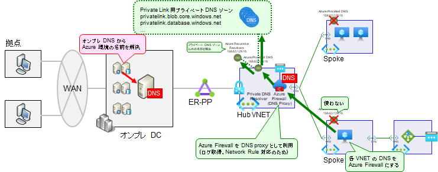
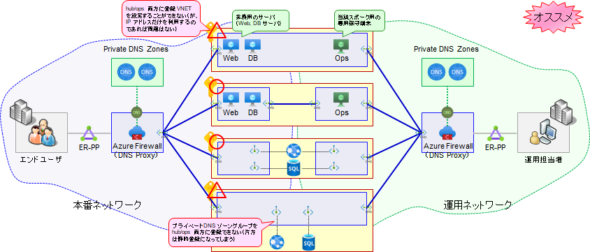

# Private DNS Zones の作成

本デモでは各スポーク環境（業務システムの VNET）にてプライベートエンドポイントを利用しますが、プライベートエンドポイントの利用には DNS の偽装が必要になります（DNS を引いた際に、パブリック IP アドレスではなくプライベートエンドポイントのプライベート IP アドレスが返されるように構成する必要があります）。この目的で利用されるのがプライベート DNS ゾーンです。

プライベート DNS ゾーンの構成方法は何通りかありますが、本デモでは下図のように構成します。要点は以下の通りです。

- 大きくわけて、本番と運用のネットワークに分割する。
  - 本番ネットワーク：Hub VNET と地繋がりで、オンプレミスからアクセスされる環境
  - 運用ネットワーク：Ops VNET と地繋がりで、運用管理作業・保守作業に利用されるネットワーク
- 地繋がりの部分は、原則として単一の DNS で管理を行う。
  - 各サブシステム（Spoke VNET）ごとに DNS 管理を行うのではなく、単一 DNS を利用する
  - Hub, Ops VNET にある Azure Firewall の DNS プロキシ機能を有効化し、これを各ネットワークの DNS として利用する
- 各サブシステム（Spoke VNET）は、以下の考え方で DNS を参照する。
  - 各サブシステムのうち、本番ネットワーク経由でアクセスされるリソースの DNS は、Hub VNET につないだ private DNS ゾーンにより管理する
  - 各サブシステムのうち、運用ネットワーク経由でアクセスされるリソースの DNS は、Ops VNET につないだ private DNS ゾーンにより管理する
- 各サブシステム（Spoke VNET）は、VNET Peering を通して、Hub VNET または Ops VNET の Azure Firewall を DNS サーバとして利用する。
  - 隔離型 VNET は個別にプライベート DNS ゾーンを用いて管理を行う
- 東西リージョンそれぞれに、個別に private DNS ゾーンを作成します

下図は Hub VNET を用いた DNS 名前解決の考え方を示したものです。

  

全体としてのネットワーク構成（本番NW／運用NW分離）の考え方は下図の通りです。今回のサンプルでは、プライベート DNS は分離し、VNET については分離しない（hub/ops から同一の VNET に接続する）形で構成しています。

  

※（参考）デモビデオでは mgmt サブスクリプションで単一の private DNS ゾーンを作成し、これを hub/ops で共用する設計としていましたが、本番／運用ネットワークの分離独立性を高めるため、現在はスクリプトを修正し、上記のような DNS 設計に変更しています。

```bash

# 共通基盤管理チーム／① 初期構築時の作業アカウントに切り替え
if ${FLAG_USE_SOD} ; then az account clear ; az login -u "user_plat_dev@${PRIMARY_DOMAIN_NAME}" -p "${ADMIN_PASSWORD}" ; fi
 
# Private DNS ゾーン一覧は下記参照
# https://learn.microsoft.com/en-us/azure/private-link/private-endpoint-dns
# 上記をすべて登録するのではなく、必要なものだけ登録する
# ※ Private Link を構成していないものまで登録すると正しく動作しなくなることがある
# 例）privatelink.guestconfiguration.azure.com は PLS を構成していないと Azure Provided DNS (168.63.129.16) が agentserviceapi.guestconfiguration.azure.com を正しく引けなくなる
TEMP_PRIVATE_DNS_ZONE_NAMES="privatelink.azurewebsites.net privatelink.database.windows.net"
# なおここではサンプルとして事前にゾーン作成しているが、プライベートエンドポイント作成時に必要なものを適宜追加していく方法でもよい

for i in ${VDC_NUMBERS}; do
TEMP_LOCATION_NAME=${LOCATION_NAMES[$i]}
TEMP_LOCATION_PREFIX=${LOCATION_PREFIXS[$i]}

# ハブサブスクリプションに切り替え
az account set -s "${SUBSCRIPTION_ID_HUB}"
# Hub 側
TEMP_RG_NAME="rg-hub-${TEMP_LOCATION_PREFIX}"
for TEMP_PRIVATE_DNS_ZONE_NAME in ${TEMP_PRIVATE_DNS_ZONE_NAMES}; do
az network private-dns zone create --resource-group ${TEMP_RG_NAME} --name ${TEMP_PRIVATE_DNS_ZONE_NAME}
# Hub VNET へリンク
TEMP_VNET_NAME="vnet-hub-${TEMP_LOCATION_PREFIX}"
TEMP_VNET_ID="/subscriptions/${SUBSCRIPTION_ID_HUB}/resourceGroups/rg-hub-${TEMP_LOCATION_PREFIX}/providers/Microsoft.Network/virtualNetworks/${TEMP_VNET_NAME}"
az network private-dns link vnet create --resource-group $TEMP_RG_NAME --zone-name $TEMP_PRIVATE_DNS_ZONE_NAME --name $TEMP_VNET_NAME --virtual-network $TEMP_VNET_ID --registration-enabled false
done # TEMP_PRIVATE_DNS_ZONE_NAME

# 管理サブスクリプションに切り替え
az account set -s "${SUBSCRIPTION_ID_MGMT}"
# Ops 側
TEMP_RG_NAME="rg-ops-${TEMP_LOCATION_PREFIX}"
for TEMP_PRIVATE_DNS_ZONE_NAME in ${TEMP_PRIVATE_DNS_ZONE_NAMES}; do
az network private-dns zone create --resource-group ${TEMP_RG_NAME} --name ${TEMP_PRIVATE_DNS_ZONE_NAME}
# Ops VNET へリンク
TEMP_VNET_NAME="vnet-ops-${TEMP_LOCATION_PREFIX}"
TEMP_VNET_ID="/subscriptions/${SUBSCRIPTION_ID_MGMT}/resourceGroups/rg-ops-${TEMP_LOCATION_PREFIX}/providers/Microsoft.Network/virtualNetworks/${TEMP_VNET_NAME}"
az network private-dns link vnet create --resource-group $TEMP_RG_NAME --zone-name $TEMP_PRIVATE_DNS_ZONE_NAME --name $TEMP_VNET_NAME --virtual-network $TEMP_VNET_ID --registration-enabled false
done # TEMP_PRIVATE_DNS_ZONE_NAME

done # TEMP_LOCATION

```
