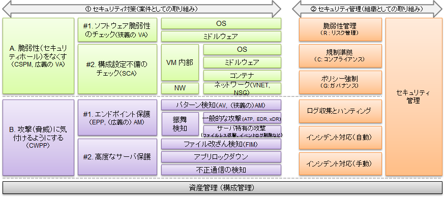
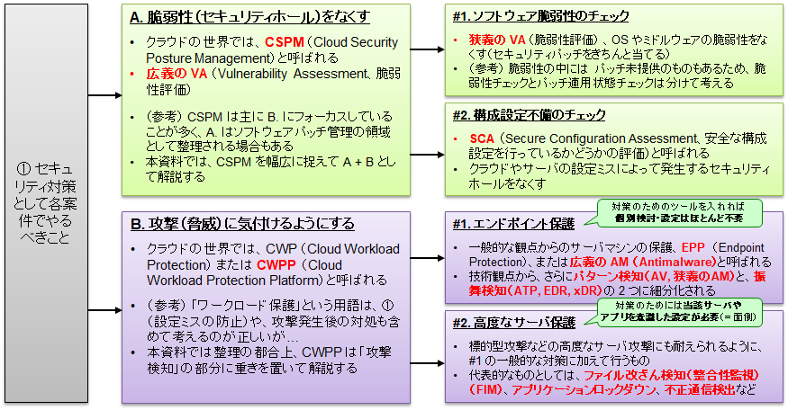
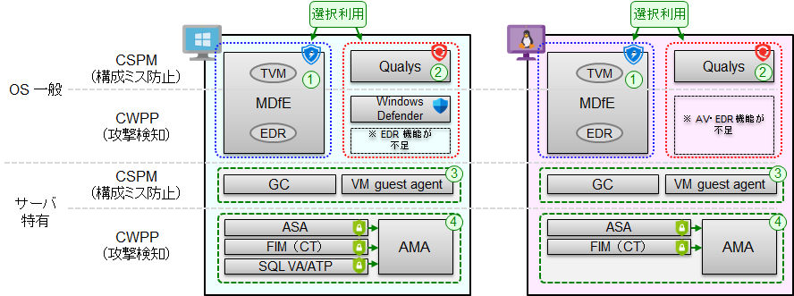
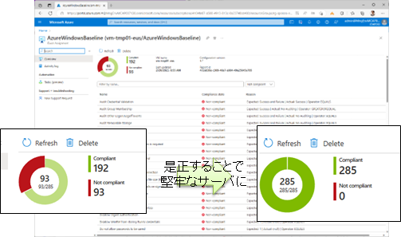

# コンプライアンススクリプト実行の前処理

業務システムには様々なセキュリティリスクが付きまといますが、中でも仮想マシンは数が多いこともあり、セキュリティ対策がずさんになっている場合が少なくありません。クラウド環境ではオンプレミスにも増してセキュリティ対策に注力する必要があるため、仮想マシンに対して必須とするセキュリティ対策を予めルールとして定めておき、それを適用するためのスクリプト群を用意しておくと便利です。本セクションではこれを「仮想マシンのコンプライアンス対応」作業と称して、一連の作業を自動化するためのスクリプトを示しています。ちょうど Ops VNET に運用管理作業用の VM を作成したので、まずはこの VM を対象として、コンプライアンス対応のためのスクリプトを流していくことにします。

※ 作業手順をお急ぎの方は、このページ末尾のスクリプトを実行後、05_01～05_09 の各スクリプトを順次実行してください。ここでは 05_01～05_09 の各スクリプトの意味・位置づけを説明します。

## 一般的なクラウドセキュリティの整理

仮想マシンのセキュリティ対策として何を行うべきか？ に関しては、以下のように整理するとよいでしょう。

- 一般にクラウドのセキュリティ対策は、以下の 2 つに大別される。
  - ① 案件としての取り組み = 脆弱性をなくす（CSPM）＋攻撃を検知する（CWPP）
  - ② 組織としての取り組み = GRC を行う＋横断的に攻撃を監視し対応する
  -   
- ① 案件としての取り組みは、さらに以下のように分類される。
  - A. 脆弱性をなくす（CSPM） ＝ VA + SCA
    - VA (Vulnerability Assessment) : OS やミドルウェアのパッチをちゃんと適用する
    - SCA (Secure Configuration Assessment) : クラウドやサーバの設定ミスをなくす
  - B. 攻撃を検知する（CWPP） ＝ EDR + 高度なサーバ保護
    - EPP (Endpoint Protection) : 一般的な観点からのマシンの保護を行う
    - 高度なサーバ保護 : 標的型攻撃などの高度なサーバ攻撃にも耐えられるように追加で行う保護
  -   
- MDfS の場合、上記は以下の機能の組み合わせにより実現される。
  -   

上記の機能を順次インストールしつつ、同時にサーバのハードニングを行っていきます。

## サーバのハードニングについて

現在のサーバ系 OS は、昔に比べるとデフォルトインストール状態でも比較的堅牢化されています。しかし、例えばインターネットに直接面するような Web サーバを立てたり、あるいは CIS 準拠の高セキュリティを仮想マシンでも実現したいとなると、デフォルトインストール状態ではまだまだ十分堅牢とは言えません。このために、サーバの設定を変更してハードニング（堅牢化）を行う必要があります。

マイクロソフトでは、Windows OS, Linux OS について、より堅牢なサーバ OS を構成するための具体的な方法として、CSB (Compute Security Baseline) と呼ばれるベースライン設定を示しています。

- Compute Security Baseline (CSB)
  - [Windows Security Baseline](https://learn.microsoft.com/ja-jp/azure/governance/policy/samples/guest-configuration-baseline-windows) 
  - [Linux Security Baseline](https://learn.microsoft.com/ja-jp/azure/governance/policy/samples/guest-configuration-baseline-linux)
  - [Docker Host Security Baseline](https://learn.microsoft.com/ja-jp/azure/governance/policy/samples/guest-configuration-baseline-docker)

Windows, Linux OS 用には 200～300 個ほどのチェック内容が規定されています。手作業でこれをチェックするのは非現実的なため、実際にはエージェントのひとつである Guest Configuration Agent (GC) によりチェックをかけます。OS のデフォルトインストール状態では、だいたい 1/3 程度のチェック項目が NG 判定となりますが、OS をきちんとハードニングしたい場合には、これらを是正していく必要があります。

  

この是正作業を手作業で行うのは大変なため、Windows Security Baseline, Linux Security Baseline に関しては、自動是正機能が提供されています。これを利用すると、非常に堅牢なサーバ OS 構成を容易に実現することができます。

極めて便利な機能のため、ぜひご活用いただければと思いますが、利用に際しては何点か注意があります。

- すでに稼働しているシステムへの適用には当然リスクが伴います。このため、新規に Azure 上に VM を立てる場合などにご利用いただくのがオススメです。
- GC CSB による OS のハードニング機能（自動是正機能）は、「適用時に一度限りで是正を実施」「その後は、そこからの構成ドリフト（ずれ）の検出は行うが、自動是正はしない」という動きをします。
  - これはサーバにミドルウェアやアプリを入れた際に、CSB に違反するような構成変更が加わる場合があり、これを自動是正するとミドルウェアやアプリが動かなくなる場合があるためです。
  - GC CSB 適用後に構成ドリフトが検知された場合には、適宜、人手による確認や介入を行ってください。
- GC CSB はほとんどの項目を自動是正しますが、一部、（原理的に）自動是正できない項目があります。
  - 典型例は、「ゲストアカウントをリネームする」という項目です。リネーム先のアカウントを固定的に定めてしまうと、それが新たなセキュリティリスクに繋がります。こうした項目については、手作業で是正してください。
- ご参考までに、Windows OS において手作業での是正が必要な項目は以下の通りです。
  - ゲストアカウントのリネーム
  - Windows Defender Exploit Guard の有効化
  - TLS 1.2 以外のセキュリティプロトコルの無効化（→ ここではデモの目的で 11_12 の項目で対応しています）

### （参考）詳細な技術解説が必要な場合

仮想マシンのセキュリティ確保に関する詳細な技術解説が必要な場合には、以下の資料をご参照ください。

- [Azure 技術情報インデックス](https://github.com/Azure/jp-techdocs)
  - IaaS VM 管理ガイド（nakama 作成）（ppt, mp4）

### 仮想マシンのコンプライアンス対応のためのスクリプトについて

コンプラ対応のためのスクリプトは何度も再利用することになりますので、ここでは「サブスクリプション内の VM を自動検索して処理する」ようなスクリプトを用意しています。以下の設定を実行したのち、05_01～05_09 の各スクリプトを順次実行してください。

```bash
# 以下の設定で、各コンプライアンススクリプトを実行
 
# 共通基盤管理チーム／① 初期構築時の作業アカウントに切り替え
if ${FLAG_USE_SOD} ; then az account clear ; az login -u "user_plat_dev@${PRIMARY_DOMAIN_NAME}" -p "${ADMIN_PASSWORD}" ; fi
# 対象サブスクリプションの指定
TEMP_TARGET_SUBSCRIPTION_IDS=$SUBSCRIPTION_ID_MGMT

```
