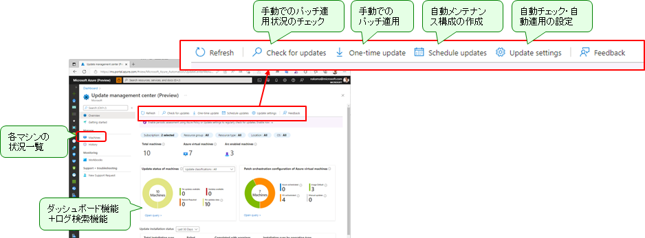

# ★ Azure Update Manager 有効化

Azure 上の仮想マシンのセキュリティパッチ管理については、OS イメージに標準インストールされている Azure 仮想マシンのゲストエージェントに実装されており、特に追加のエージェントを入れることなく利用することができます。主にできることは以下の 3 つです。

- ① パッチ適用状況のチェック （手動／日次）
- ② パッチの適用 （手動／スケジュール）
- ③ パッチの適用状況の分析

これらの機能は、UMC (Update Management Center) と呼ばれるコンソールから利用することかできます。

  

本ステップでは、Azure Update Manager の機能を有効化し、毎晩、定期的にセキュリティパッチ評価を行う（インストールは自動では行わない）ようにシステムを構成しています。

```bash

# 各 VM の構成設定を変更し、メンテナンス構成（メンテナンス時間など）を設定

for TEMP_SUBSCRIPTION_ID in $TEMP_TARGET_SUBSCRIPTION_IDS; do
echo "Setting Azure Update Manager... ${TEMP_SUBSCRIPTION_ID}"
az account set -s "${TEMP_SUBSCRIPTION_ID}"

for i in ${VDC_NUMBERS}; do
TEMP_LOCATION_NAME=${LOCATION_NAMES[$i]}
TEMP_LOCATION_PREFIX=${LOCATION_PREFIXS[$i]}

# 当該リージョンのリソースグループを拾って処理
for TEMP_RG_NAME in $(az group list --query "[?location == '${TEMP_LOCATION_NAME}' ].name" -o tsv); do

# https://learn.microsoft.com/ja-jp/rest/api/compute/virtual-machines/create-or-update?tabs=HTTP
# Windows マシンへ適用
for TEMP_VM_NAME in $(az vm list --resource-group ${TEMP_RG_NAME} --query "[?storageProfile.osDisk.osType=='Windows'].name" -o tsv); do
echo ${TEMP_VM_NAME}
az rest --method patch --url "https://management.azure.com/subscriptions/${TEMP_SUBSCRIPTION_ID}/resourceGroups/${TEMP_RG_NAME}/providers/Microsoft.Compute/virtualMachines/${TEMP_VM_NAME}?api-version=2023-03-01" --body @- <<EOF
{
  "location": "${TEMP_LOCATION_NAME}", 
  "properties": { 
    "osProfile": { 
      "windowsConfiguration": { 
        "patchSettings": { 
          "assessmentMode": "AutomaticByPlatform", 
          "patchMode": "AutomaticByPlatform", 
          "automaticByPlatformSettings": { 
            "rebootSetting": "Never", 
            "bypassPlatformSafetyChecksOnUserSchedule": true 
          }
        }
      }
    }
  }
}
EOF
done # TEMP_VM_NAME

# Linux マシンへ適用
for TEMP_VM_NAME in $(az vm list --resource-group ${TEMP_RG_NAME} --query "[?storageProfile.osDisk.osType=='Linux'].name" -o tsv); do
echo ${TEMP_VM_NAME}
az rest --method patch --url "https://management.azure.com/subscriptions/${TEMP_SUBSCRIPTION_ID}/resourceGroups/${TEMP_RG_NAME}/providers/Microsoft.Compute/virtualMachines/${TEMP_VM_NAME}?api-version=2023-03-01" --body @- <<EOF
{
  "location": "${TEMP_LOCATION_NAME}", 
  "properties": { 
    "osProfile": { 
      "windowsConfiguration": { 
        "patchSettings": { 
          "assessmentMode": "AutomaticByPlatform", 
          "patchMode": "AutomaticByPlatform", 
          "automaticByPlatformSettings": { 
            "rebootSetting": "Never", 
            "bypassPlatformSafetyChecksOnUserSchedule": true 
          }
        }
      }
    }
  }
}
EOF
done # TEMP_VM_NAME

# 当該リソースグループ内に 1 台でもマシンがある場合にはメンテナンス構成を作成
if [ -z $(az vm list --query [0].name -o tsv --resource-group ${TEMP_RG_NAME}) ]; then
echo "リソースグループ ${TEMP_RG_NAME} 内にはマシンがありません。"
else
echo "リソースグループ ${TEMP_RG_NAME} 内にはマシンがあるので、メンテナンス構成を作成して割り当てます。"

# メンテナンス構成の作成
TEMP_MC_NAME="mc-daily-patching"

# 翌日の夜 1 時から有効になるメンテナンス構成を作成
TEMP_DATE=$(date "+%Y-%m-%d" -d "1 days")

cat <<EOF > tmp.json
{
  "\$schema": " https://schema.management.azure.com/schemas/2019-04-01/deploymentTemplate.json#",
  "contentVersion": "1.0.0.0",
  "resources": [
    {
      "type": "Microsoft.Maintenance/maintenanceConfigurations",
      "apiVersion": "2021-09-01-preview",
      "name": "${TEMP_MC_NAME}",
      "location": "${TEMP_LOCATION_NAME}",
      "properties": {
        "maintenanceScope": "InGuestPatch",
        "installPatches": {
          "linuxParameters": {
            "classificationsToInclude": [
              "Critical",
              "Security"
            ],
            "packageNameMasksToExclude": null,
            "packageNameMasksToInclude": null
          },
          "windowsParameters": {
            "classificationsToInclude": [
              "Critical",
              "Security"
            ],
            "kbNumbersToExclude": null,
            "kbNumbersToInclude": null
          },
          "rebootSetting": "RebootIfRequired"
        },
        "extensionProperties": {
          "InGuestPatchMode": "User"
        },
        "maintenanceWindow": {
          "startDateTime": "${TEMP_DATE} 01:00",
          "duration": "03:55",
          "timeZone": "Tokyo Standard Time",
          "expirationDateTime": null,
          "recurEvery": "1Day"
        }
      }
    }
  ]
}
EOF
az deployment group create --name ${TEMP_MC_NAME} --resource-group ${TEMP_RG_NAME} --template-file tmp.json

# VM をメンテナンス構成へ関連付ける

for TEMP_VM_NAME in $(az vm list --resource-group ${TEMP_RG_NAME} --query [].name -o tsv); do
echo ${TEMP_VM_NAME}
az rest --method put --url "https://management.azure.com/subscriptions/${TEMP_SUBSCRIPTION_ID}/resourceGroups/${TEMP_RG_NAME}/providers/Microsoft.Compute/virtualMachines/${TEMP_VM_NAME}/providers/Microsoft.Maintenance/configurationAssignments/${TEMP_MC_NAME}Assignment?api-version=2021-09-01-preview" --body @- <<EOF
{
  "location": "${TEMP_LOCATION_NAME}",
  "properties": {
    "maintenanceConfigurationId": "/subscriptions/${TEMP_SUBSCRIPTION_ID}/resourcegroups/${TEMP_RG_NAME}/providers/Microsoft.Maintenance/maintenanceConfigurations/${TEMP_MC_NAME}" 
  }
}
EOF
done # TEMP_VM_NAME

fi # 仮想マシンの存否チェック

done # TEMP_RG_NAME
done # TEMP_LOCATION_NAME
done # TEMP_SUBSCRIPTION_ID

```
