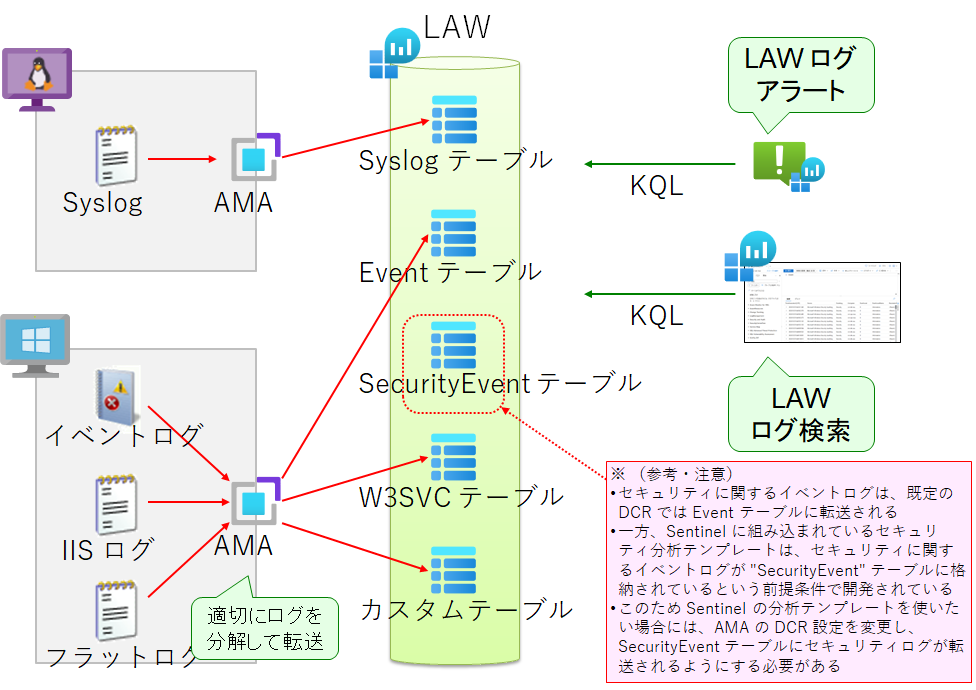
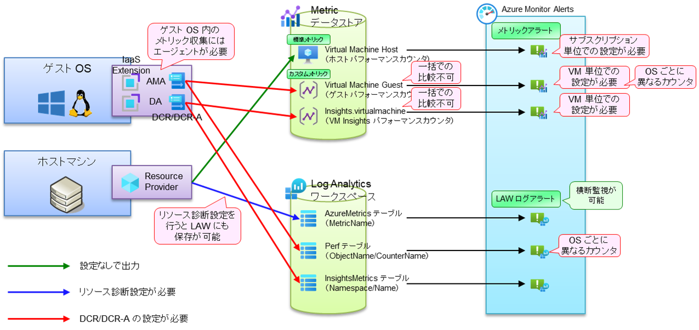

# ★ プラットフォームメトリックの LAW への出力

仮想マシンからは様々なログを回収する必要がありますが、回収するログは大別して以下の 2 つに分けられます。

- テキスト系ログ（ログ監視）
  - イベントログや syslog、Web サーバログなどの、テキスト系のログデータです。AMA を利用して、LAW へ回収します。
  - 収集した情報は、LAW の各テーブルに分割して保存されます。複数マシンから回収したログデータに対してクエリ検索をかけて、横断監視を実現します。
  -   
- 数値系ログ（メトリック監視）
  - パフォーマンスカウンタなどの、数値系のログデータです。Azure ではテキスト系ログと区別して、「メトリック」と呼ばれます。
  - データの取得方法と転送先に複数の選択肢があります（都合 6 通り）が、ほとんどの場合でデータ出力のための追加設定が必要になります。
  -   

ここでは仮想マシンの性能を横断監視できるようにするため、リソース診断ログを設定し、ホストマシンから取得される仮想マシンの性能データを LAW へ転送するようにします。（※ 01_04 で示しているリソース診断ログ出力の一括設定機能でも同様の設定が可能ですが、ここでは仮想マシンに絞って適用できるように切り出して示しています。）

```bash
# ■ 仮想マシンのプラットフォームメトリックログの LAW へのエクスポート
# IOPS データはゲスト診断からでは取れないため、プラットフォームメトリックも利用
# データは AzureMetrics テーブルに出力される
 
for TEMP_SUBSCRIPTION_ID in $TEMP_TARGET_SUBSCRIPTION_IDS; do
az account set -s "${TEMP_SUBSCRIPTION_ID}"
 
for i in ${VDC_NUMBERS}; do
TEMP_LOCATION_NAME=${LOCATION_NAMES[$i]}
TEMP_LOCATION_PREFIX=${LOCATION_PREFIXS[$i]}
 
# 当該リージョンの VM を拾って処理
for TEMP_VM_ID in $(az vm list --query "[? location == '${TEMP_LOCATION_NAME}' ].id" --subscription ${TEMP_SUBSCRIPTION_ID} -o tsv); do
TEMP_VM_NAME="${TEMP_VM_ID##*/}"
 
################# 診断設定
echo "Write Diagnostics Settings on ${TEMP_VM_ID}"
TEMP_RESOURCE_ID=${TEMP_VM_ID}
TEMP_LAW_NAME="law-vdc-${TEMP_LOCATION_PREFIX}"
TEMP_LAW_RESOURCE_ID="/subscriptions/${SUBSCRIPTION_ID_MGMT}/resourcegroups/rg-vdc-${TEMP_LOCATION_PREFIX}/providers/microsoft.operationalinsights/workspaces/${TEMP_LAW_NAME}"
 
# 設定可能な診断ログを確認
TEMP_LOG_CATEGORIES=$(az rest --method GET --uri "https://management.azure.com/${TEMP_RESOURCE_ID}/providers/Microsoft.Insights/diagnosticSettingsCategories?api-version=2021-05-01-preview" --query "value[?properties.categoryType == 'Logs'].name" -o tsv)
 
TEMP_METRICS_CATEGORIES=$(az rest --method GET --uri "https://management.azure.com/${TEMP_RESOURCE_ID}/providers/Microsoft.Insights/diagnosticSettingsCategories?api-version=2021-05-01-preview" --query "value[?properties.categoryType == 'Metrics'].name" -o tsv)
 
TEMP=""
for TEMP_LOG_CATEGORY in $TEMP_LOG_CATEGORIES; do
    TEMP+=",{\"category\": \"${TEMP_LOG_CATEGORY}\", \"enabled\": true}"
done
TEMP_JSON_LOGS='"logs": ['
TEMP_JSON_LOGS+=${TEMP:1}
TEMP_JSON_LOGS+=']'
 
TEMP=""
for TEMP_METRICS_CATEGORY in $TEMP_METRICS_CATEGORIES; do
    TEMP+=",{\"category\": \"${TEMP_METRICS_CATEGORY}\", \"enabled\": true}"
done
TEMP_JSON_METRICS='"metrics": ['
TEMP_JSON_METRICS+=${TEMP:1}
TEMP_JSON_METRICS+=']'
 
TEMP_JSON_SETTINGS="${TEMP_JSON_LOGS},${TEMP_JSON_METRICS},"
 
# https://learn.microsoft.com/ja-jp/rest/api/monitor/diagnostic-settings/create-or-update?tabs=HTTP
cat <<EOF > tmp.json
{
  "properties": {
    ${TEMP_JSON_SETTINGS}
    "workspaceId": "${TEMP_LAW_RESOURCE_ID}",
    "logAnalyticsDestinationType": "Dedicated"
  }
}
EOF
echo "Creating Diagnostics Settings..."
az rest --method PUT --uri  "${TEMP_RESOURCE_ID}/providers/Microsoft.Insights/diagnosticSettings/${TEMP_LAW_NAME}?api-version=2021-05-01-preview" --body @tmp.json
 
#################
 
done # TEMP_VM_ID
done # TEMP_LOCATION
done # TEMP_SUBSCRIPTION

```
