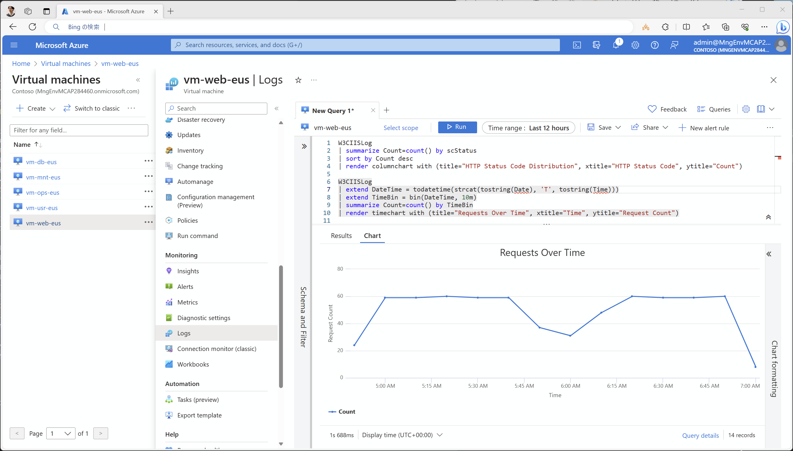

# （参考）IIS ログの回収

Application Insights を利用している場合は、それ単体で十分な解析ができるため、特に必要性を感じないかもしれませんが、Web サーバである IIS から発生したログは、Azure Monitor エージェントを利用して、Log Analytics ワークスペースの W3CIISLog テーブルに回収することができます。その方法について解説します。

- DCR の作成方法
- VM への割り当て
- KQL クエリによる分析

## DCR の作成方法

まず DCR を管理サブスクリプションに作成します。

```bash

# 共通基盤管理チーム／① 初期構築時の作業アカウントに切り替え
if ${FLAG_USE_SOD} ; then az account clear ; az login -u "user_plat_dev@${PRIMARY_DOMAIN_NAME}" -p "${ADMIN_PASSWORD}" ; fi

# DCR を MGMT サブスクリプション側に作成しておく
for i in ${VDC_NUMBERS}; do
TEMP_LOCATION_NAME=${LOCATION_NAMES[$i]}
TEMP_LOCATION_PREFIX=${LOCATION_PREFIXS[$i]}

TEMP_DCR_IIS_NAME="dcr-vdc-${TEMP_LOCATION_PREFIX}-iis"
TEMP_DCR_IIS_ID="/subscriptions/${SUBSCRIPTION_ID_MGMT}/resourceGroups/rg-vdc-${TEMP_LOCATION_PREFIX}/providers/Microsoft.Insights/dataCollectionRules/${TEMP_DCR_IIS_NAME}"
TEMP_DCE_ID="/subscriptions/${SUBSCRIPTION_ID_MGMT}/resourceGroups/rg-vdc-${TEMP_LOCATION_PREFIX}/providers/Microsoft.Insights/dataCollectionEndpoints/dce-vdc-${TEMP_LOCATION_PREFIX}"
TEMP_LAW_RES_ID="/subscriptions/${SUBSCRIPTION_ID_MGMT}/resourceGroups/rg-vdc-${TEMP_LOCATION_PREFIX}/providers/Microsoft.OperationalInsights/workspaces/law-vdc-${TEMP_LOCATION_PREFIX}"
TEMP_LAW_WS_ID=$(az rest --method GET --uri $TEMP_LAW_RES_ID?api-version=2022-10-01 --query properties.customerId -o tsv)

# フィルタリングする場合は transformKql に KQL を指定する
# "transformKql": "source | where TimeTaken < 10 | project-away csUserAgent",

az rest --method PUT --uri "${TEMP_DCR_IIS_ID}?api-version=2022-06-01" --body @- <<EOF
{
    "location": "${TEMP_LOCATION_NAME}",
    "properties": {
        "dataCollectionEndpointId": "${TEMP_DCE_ID}",
        "dataSources": {
            "iisLogs": [
                {
                    "streams": [
                        "Microsoft-W3CIISLog"
                    ],
                    "name": "iisLogsDataSource"
                }
            ]
        },
        "destinations": {
            "logAnalytics": [
                {
                    "workspaceResourceId": "${TEMP_LAW_RES_ID}",
                    "workspaceId": "${TEMP_LAW_WS_ID}",
                    "name": "law-vdc"
                }
            ]
        },
        "dataFlows": [
            {
                "streams": [
                    "Microsoft-W3CIISLog"
                ],
                "destinations": [
                    "law-vdc"
                ],
                "transformKql": "source",
                "outputStream": "Microsoft-W3CIISLog"
            }
        ]
    },
    "kind": "Windows"
}
EOF

done # i

```

## VM への割り当て

作成した DCR を VM（Web サーバ）に割り当てます。

```bash

# 業務システム統制チーム／③ 構成変更の作業アカウントに切り替え
if ${FLAG_USE_SOD} ; then az account clear ; az login -u "user_gov_change@${PRIMARY_DOMAIN_NAME}" -p "${ADMIN_PASSWORD}" ; fi
az account set -s "${SUBSCRIPTION_ID_SPOKE_A}"

for i in ${VDC_NUMBERS}; do
TEMP_LOCATION_NAME=${LOCATION_NAMES[$i]}
TEMP_LOCATION_PREFIX=${LOCATION_PREFIXS[$i]}

# DCR 割り当て
TEMP_VM_ID="/subscriptions/${SUBSCRIPTION_ID_SPOKE_A}/resourceGroups/rg-spokea-${TEMP_LOCATION_PREFIX}/providers/Microsoft.Compute/virtualMachines/vm-web-${TEMP_LOCATION_PREFIX}"
echo "Setting DCR on ${TEMP_VM_ID}..."
az monitor data-collection rule association create --name "${TEMP_DCR_IIS_NAME}-association" --rule-id ${TEMP_DCR_IIS_ID} --resource ${TEMP_VM_ID}
az rest --method put --url "${TEMP_VM_ID}/providers/microsoft.insights/dataCollectionRuleAssociations/configurationAccessEndpoint?api-version=2021-04-01" --body "{ \"properties\": { \"dataCollectionEndpointId\": \"${TEMP_DCE_ID}\" } }"

done # i

```

## KQL クエリによる分析

Log Analytics ワークスペースに収集したログについては、KQL クエリを利用して分析することができます。仮想マシンを選択し、ログから例えば下記のクエリを実行すると、HTTP ステータスコードの分布、リクエスト数の推移、User Agent の分布を確認することができます。

```KQLクエリ

W3CIISLog
| summarize Count=count() by scStatus
| sort by Count desc
| render columnchart with (title="HTTP Status Code Distribution", xtitle="HTTP Status Code", ytitle="Count")

W3CIISLog
| extend DateTime = todatetime(strcat(tostring(Date), 'T', tostring(Time)))
| extend TimeBin = bin(DateTime, 10m)
| summarize Count=count() by TimeBin
| render timechart with (title="Requests Over Time", xtitle="Time", ytitle="Request Count")

W3CIISLog
| summarize Count=count() by csUserAgent
| sort by Count desc
| limit 10
| render piechart with (title="Top 10 User Agents")

```

  
