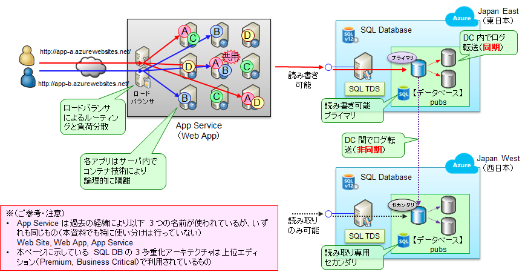

# PaaS 型 Web-DB システムについて

先のセクションでは IaaS VM を利用して Web-DB システムを構成しましたが、ベースになっている仮想マシンの準備などがかなり面倒でした。このため、特に新規開発などの場合には、PaaS 型サービスをご利用いただいてシステムを構築することをオススメします。特に、Azure には Web App (App Service) と SQL Database という非常に便利な PaaS サービスがあります。

- App Service （Web App） = クラスタリングされた、自動メンテナンスつき Web サーバ
- SQL Database = クラスタリングされた、自動メンテナンスつき SQL Server

どちらのサービスも Azure の黎明期から提供されており、すでに 10 年以上の稼働実績がありますが、現在でも解析機能などをはじめとしたサービス拡充が行われ続けている Azure の超重要サービスです。PaaS サービスであるため、基盤（OS・ミドルウェア）部分はマイクロソフトにお任せすることができ、ユーザ側はアプリやデータの部分に注力することができます。……といっても裏側で動作をしているのは IaaS VM だったりしますので、どんなものかを理解するには、下図のような昔ながらのサーバ構成図のようなものの方が理解しやすいかもしれません。エンジニア的にわかりやすく言うと、それぞれ以下のようなサービスです。

- Web App : ロードバランサ ＋ クラスタ化された Web サーバ上に、複数のアプリをコンテナ技術により隔離しながら搭載することができる
- SQL DB （上位 SKU の場合） : ログ転送の仕組みにより拠点内で 3 多重化されたデータベース、ログを別データセンタのセカンダリ DB へ非同期転送することで、ほぼリアルタイムに別リージョンへデータを複製できる（日本の東西環境の場合、平常時の遅延は 1 秒以下）

  

本デモでは .NET/SQL アプリを載せるための PaaS インフラとして Web App, SQL DB を利用していますが、これ以外にもコンテナや OSS DB など複数の選択肢があります。載せるアプリに応じて、適切なマネージドインフラを選択してください。

- Web サーバ
  - PaaS, CaaS, IaaS の選択肢があり、さらに複数の選択肢があります。
  - PaaS では AppService (Web App) と Functions、CaaS では AKS (Azure Kubernetes Services) と ACA (Azure Container Apps) が特に重要なサービスです。
  - 詳細は [こちら](https://github.com/Azure/jp-techdocs) の "IaaS/CaaS/PaaS の使い分け"(nakama) を参照してください。
  -   
- DB サーバ
  - SQL Database 以外の選択肢として、マネージドサービスとしての MySQL, MariaDBm, PostgreSQL があります。
  - Oracle に関しては、OCI (Oracle Cloud Infrastructure) との専用線接続サービスを利用することができます。
  - 詳細は [こちら](https://github.com/Azure/jp-techdocs) の "DB サービスの使い分け"(tfukuha) を参照してください。

本セクションでは、この Web App (App Service) と SQL Databsae を利用して、前セクションと同様の Web-DB システムを構築します。
