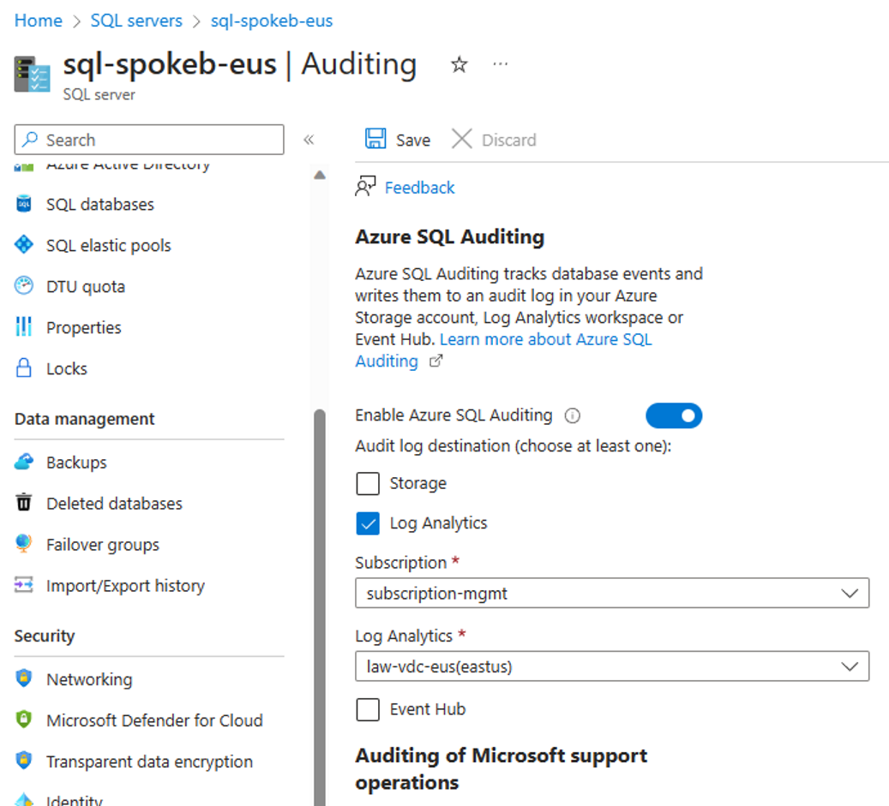

# SQL Database の作成

PaaS 型 SQL Server である SQL Database を作成します。

- まず SQL Server (論理サーバ) を作成します。
  - 論理サーバ（logical server）と呼ばれているのは SQL DB が共有型サービスであるためです。SQL Database は、下図のように、事前に用意された多数の SQL Server 物理ノード上に作成されます。ユーザが自分の DB にアクセスする場合には、SQL TDS と呼ばれるゲートウェイ的なサーバにまずアクセスすることになりますが、このサーバにアクセスする際に論理サーバ名を利用します。
  -   
- 次に、SQL Database（データベース）を作成します。
  - 作成したデータベースは、クラスタリングされた物理 SQL Server ノードの中から少なくとも 3 ノード以上に複製・保持されます。（Premium または Business Critical SKU の場合）
  - この 3 つのデータベースはプライマリノードが決められており、ユーザがデータベースに接続しようとすると、SQL TDS 経由でプライマリノードに接続されます。プライマリノードへの書き込みで発生したログデータはセカンダリノードに複製され（トランザクションレプリケーション）、半数以上のノードから ACK 応答が返されると書き込みコミットの扱いになる、という仕組みで動作します。
- 作成後、Audit 機能を有効化します。

ご参考までに、SQL Database は内部的に以下のように動作します。

- 障害発生時には、セカンダリノードの一つが自動的にプライマリに選出され、再構成が行われます。
  - クライアントアプリから見るとセッション切断となります（＝再接続が必要です）。
  - ホットスタンバイ型であるため、フェイルオーバは極めて高速です。
  - トランザクション複製は同期型で行われているため、フェイルオーバ時に、コミット済みデータが失われることはありません。
- データベースサーバへの自動パッチ適用処理の際は、自動的にレプリカノードが増やされ、その後、自動フェイルオーバが発生します。
  - このためパッチ適用時であっても、レプリカ数が 3 未満になることはありません。
- セカンダリノードは read-only 目的で利用することができます。（負荷分散ができます）

なお上記の説明は上位エディションの場合の挙動です。物理的に 3 ノード以上を利用するものの共有型サービスであるため、比較的安価にサービスが提供されています。ホットスタンバイ構成であるためフェイルオーバが超絶に速いことが最大の特徴である一方、そこまでのフェイルオーバ性能が必要ない場合は、ストレージベースで冗長性を確保する下位エディションを安価に利用することも可能です。内部アーキテクチャを知りたい場合には[こちら](https://learn.microsoft.com/ja-jp/azure/azure-sql/database/high-availability-sla?view=azuresql&tabs=azure-powershell)をご確認ください。

```bash

# 業務システム B チーム／① 初期構築の作業アカウントに切り替え
if ${FLAG_USE_SOD} ; then az account clear ; az login -u "user_spokeb_dev@${PRIMARY_DOMAIN_NAME}" -p "${ADMIN_PASSWORD}" ; fi

# Spoke B サブスクリプションで作業
az account set -s "${SUBSCRIPTION_ID_SPOKE_B}"

for i in ${VDC_NUMBERS}; do
TEMP_LOCATION_NAME=${LOCATION_NAMES[$i]}
TEMP_LOCATION_PREFIX=${LOCATION_PREFIXS[$i]}

# パラメータ
# （論理サーバはグローバル一意名が必要なため UNIQUE_SUFFIX を付与して名前を作る）
TEMP_SQL_SERVER_NAME="sql-spokeb-${UNIQUE_SUFFIX}-${TEMP_LOCATION_PREFIX}"
TEMP_SQL_DB_NAME="pubs"
TEMP_RG_NAME="rg-spokeb-${TEMP_LOCATION_PREFIX}"

# SQL Server（論理サーバ）の作成
az sql server create --name $TEMP_SQL_SERVER_NAME --resource-group $TEMP_RG_NAME --location $TEMP_LOCATION_NAME --admin-user $ADMIN_USERNAME --admin-password $ADMIN_PASSWORD --enable-public-network false --restrict-outbound-network-access true

# SQL Database の作成
TEMP_SQLDB_OPTIONS=$( [[ "$FLAG_USE_WORKLOAD_AZ" = true ]] && echo "--compute-model Serverless --edition GeneralPurpose --family Gen5 --capacity 1 --zone-redundant true --backup-storage-redundancy Geo" || echo "--edition Basic --capacity 5" )
az sql db create --server $TEMP_SQL_SERVER_NAME --resource-group $TEMP_RG_NAME --name $TEMP_SQL_DB_NAME $TEMP_SQLDB_OPTIONS

done # TEMP_LOCATION

# ガバナンス管理のアカウントに切り替え
if ${FLAG_USE_SOD} ; then az account clear ; az login -u "user_gov_change@${PRIMARY_DOMAIN_NAME}" -p "${ADMIN_PASSWORD}" ; fi

# スポーク B 上で作業
az account set -s "${SUBSCRIPTION_ID_SPOKE_B}"

for i in ${VDC_NUMBERS}; do
TEMP_LOCATION_NAME=${LOCATION_NAMES[$i]}
TEMP_LOCATION_PREFIX=${LOCATION_PREFIXS[$i]}

TEMP_SQL_SERVER_NAME="sql-spokeb-${UNIQUE_SUFFIX}-${TEMP_LOCATION_PREFIX}"
TEMP_SQL_DB_NAME="pubs"
TEMP_RG_NAME="rg-spokeb-${TEMP_LOCATION_PREFIX}"

TEMP_LAW_ID="/subscriptions/${SUBSCRIPTION_ID_MGMT}/resourcegroups/rg-vdc-${TEMP_LOCATION_PREFIX}/providers/microsoft.operationalinsights/workspaces/law-vdc-${TEMP_LOCATION_PREFIX}"

# サーバ監査の有効化
az sql server audit-policy update --resource-group $TEMP_RG_NAME --name $TEMP_SQL_SERVER_NAME --state Enabled --lats Enabled --lawri ${TEMP_LAW_ID}

# データベース監査の有効化
az sql db audit-policy update --resource-group $TEMP_RG_NAME --server $TEMP_SQL_SERVER_NAME --name $TEMP_SQL_DB_NAME --state Enabled --lats Enabled --lawri ${TEMP_LAW_ID}

done # TEMP_LOCATION

```

なお、監査機能は Azure ポータルサイトから有効化することもできます。有効化する場合には、サーバ監査、データベース監査の両方を有効化してください。

  
