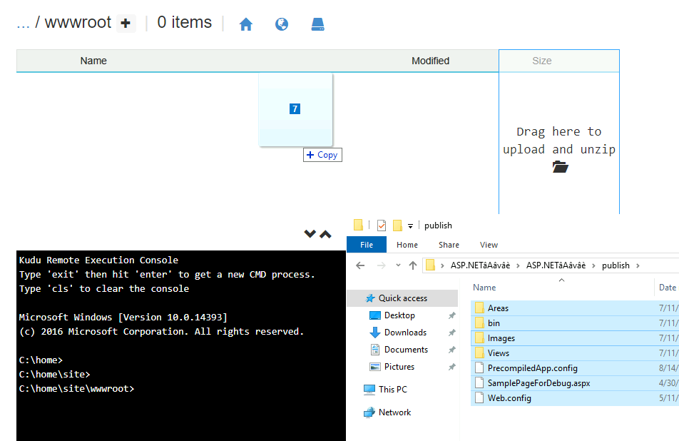

# Web アプリセットアップ

引き続き、前セクションで構築した PaaS Web App, SQL DB に、実際に稼働する簡単な .NET アプリとデータを載せます。なお、作業にサーバ名などを利用しますが、これらはいったん bash コマンドで生成しておくと便利です。

```bash

cat << EOF
以下を利用します。
WebApp : https://webapp-spokeb-${UNIQUE_SUFFIX}-${TEMP_LOCATION_PREFIX}.azurewebsites.net/
Kudu : https://webapp-spokeb-${UNIQUE_SUFFIX}-${TEMP_LOCATION_PREFIX}.scm.azurewebsites.net/
SQLDB : sql-spokeb-${UNIQUE_SUFFIX}-${TEMP_LOCATION_PREFIX}.database.windows.net
UserID : user_spokeb_change@${PRIMARY_DOMAIN_NAME}
EOF

```

主な作業は以下の通りです。

## ① vm-ops-* 作業端末に Bastion でログオンし、必要なファイルをダウンロード

- Edge ブラウザのインストール
- 管理者モードで PowerShell を立ち上げて以下を実行

```PowerShell
Start-BitsTransfer -Source "https://aka.ms/edge-msi" -Destination "$env:USERPROFILE\Downloads\MicrosoftEdgeEnterpriseX64.msi"
Start-Process -Wait -Filepath msiexec.exe -Argumentlist "/i $env:UserProfile\Downloads\MicrosoftEdgeEnterpriseX64.msi /q"
start microsoft-edge:
```

- SQL Server Developer Edition のメディアと SSMS のメディアをダウンロード（※ 前セクションで実施済みの場合には不要です。）
  - SQL Management Studio (SSMS)
    - https://docs.microsoft.com/en-us/sql/ssms/download-sql-server-management-studio-ssms
    - ダウンロード後、SSMS-Setup-ENU.exe を vm-ops 端末上で実行して SSMS をインストールする
  - SQL Server Developer Edition
    - https://www.microsoft.com/en-us/sql-server/sql-server-downloads
    - ダウンロード後、SQL2019-SSEI-Dev.exe を実行して Download Media を実施し、ISO イメージを入手
- サンプルアプリをダウンロード
  - 以下をダウンロード
    - https://download.microsoft.com/download/a/c/8/ac880230-c893-49f3-b32d-3e70e8ac6f22/2021_05_31_FgCF_IaaS_IsolatedVNET_ReferenceArchitecture_v0.11_docs.zip
  - zip を解凍（パスワードは mskk）
    - 利用するのは以下の 2 つのファイル
      - サンプルアプリ > ASP.NETアプリ.zip (ファイルの中の publish フォルダ内に入っている ASP.NET MVC のサンプルアプリを使う)
      - サンプルアプリ > pubs_azure_timestampつき.txt
    - この 2 つのファイルを zip ファイル内から取り出しておく

## ② SQL Database のセットアップ

- vm-ops-XXX 端末で SSMS を起動し、以下の設定で接続
  - Server name : sql-spokeb-XXX-XXX.database.windows.net
  - Authentication : SQL Server Authentication
  - Login : azrefadmin
  - Password : p&ssw0rdp&ssw0rd
- pubs データベースに入った後、以下のファイルの SQL を実行してデータを作成
  - pubs_azure_timestampつき.txt

## ③ Web App  のセットアップ

- vm-ops-XXX 端末で Edge ブラウザを起動し、Kudu を開く
  - https://webapp-spokeb-XXX-XXX.scm.azurewebsites.net/ へアクセスします（サーバ名は適宜書き換えてください）
- AAD ログイン画面が出るので、Website Contributor 権限を持つ user_spokeb_change@[tenant] でアクセス（※ 平常運用作業としてアプリを差し替え）
  - Debug Console を開き、site > wwwroot に移動
  - hostingstart.html ファイルを削除
  - ASP.NET サンプルアプリの .zip ファイルを vm-ops-XXX 上の D:\temp などにいったん展開し、publish フォルダ下の中身を site > wwwroot 下にコピー
  - ファイルのドラッグ＆ドロップの際、フォルダ画面の左側（name 列のあたり）にドロップしてください。右側（Size 列のあたり）は zip ファイルの解凍機能付きのため、うまくファイルコピーできない場合があります。

※ MFA 強制などにより user_spokeb_change@[tenant] でのアクセスができない場合には、管理者アカウントで上記の作業を実施してください。

  

- az cli にて Web App の connectionString を設定する

```bash

if ${FLAG_USE_SOD}; then if ${FLAG_USE_SOD_SP}; then TEMP_SP_NAME="sp_spokeb_dev"; az login --service-principal --username ${SP_APP_IDS[${TEMP_SP_NAME}]} --password ${SP_PWDS[${TEMP_SP_NAME}]} --tenant ${PRIMARY_DOMAIN_NAME} --allow-no-subscriptions; else az account clear; az login -u "user_spokeb_dev@${PRIMARY_DOMAIN_NAME}" -p "${ADMIN_PASSWORD}"; fi; fi

# Spoke B サブスクリプションで作業
az account set -s "${SUBSCRIPTION_ID_SPOKE_B}"

for i in ${VDC_NUMBERS}; do
TEMP_LOCATION_NAME=${LOCATION_NAMES[$i]}
TEMP_LOCATION_PREFIX=${LOCATION_PREFIXS[$i]}

TEMP_RG_NAME="rg-spokeb-${TEMP_LOCATION_PREFIX}"
TEMP_WEBAPP_NAME="webapp-spokeb-${UNIQUE_SUFFIX}-${TEMP_LOCATION_PREFIX}"
TEMP_SQL_SERVER_NAME="sql-spokeb-${UNIQUE_SUFFIX}-${TEMP_LOCATION_PREFIX}"
TEMP_SQL_DB_NAME="pubs"

az webapp config connection-string set --name ${TEMP_WEBAPP_NAME} --resource-group ${TEMP_RG_NAME} --connection-string-type SQLAzure --settings PubsConnection="Server=tcp:${TEMP_SQL_SERVER_NAME}.database.windows.net,1433;Initial Catalog=pubs;Persist Security Info=False;User ID=${ADMIN_USERNAME};Password=${ADMIN_PASSWORD};MultipleActiveResultSets=False;Encrypt=True;TrustServerCertificate=True;ConnectRetryCount=3;ConnectRetryInterval=30;Connection Timeout=60;Language=Japanese;"

done #i

```

- vm-ops-XXX に戻り、ブラウザからアクセスを確認
  - http://webapp-spokeb-XXX-eus.azurewebsites.net/ へアクセスします（サーバ名は適宜書き換えてください）
  - アプリが動作することを確認
- コマンドラインからサーバに継続的にリクエスト発行し、サーバを利用している状況を作る

```bash

echo "https://webapp-spokeb-${UNIQUE_SUFFIX}-${TEMP_LOCATION_PREFIX}.scm.azurewebsites.net/"
echo "for /l %i in () do (timeout 5 & curl http://webapp-spokeb-${UNIQUE_SUFFIX}-${TEMP_LOCATION_PREFIX}.azurewebsites.net/Home/Ping)"

```
