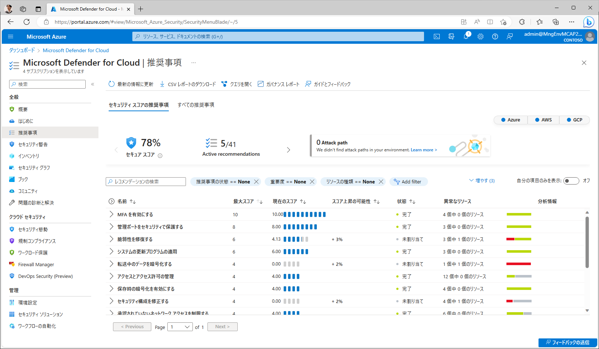
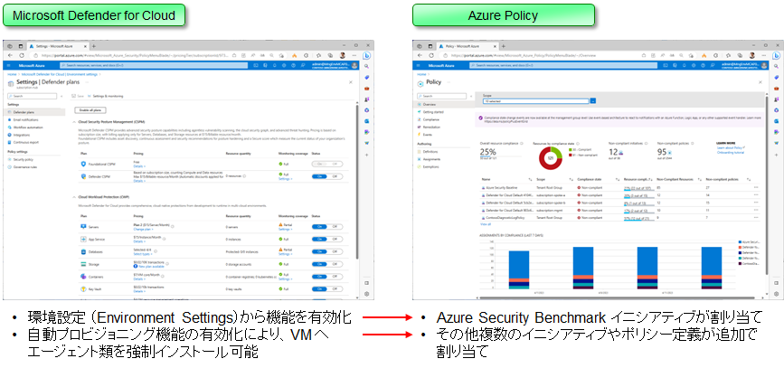
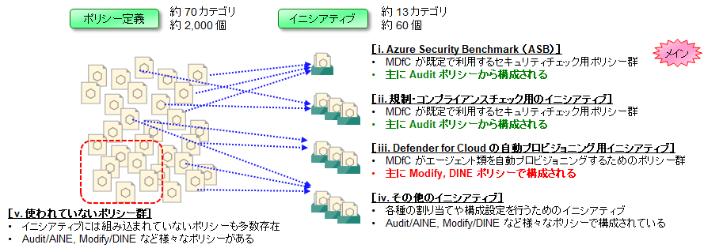
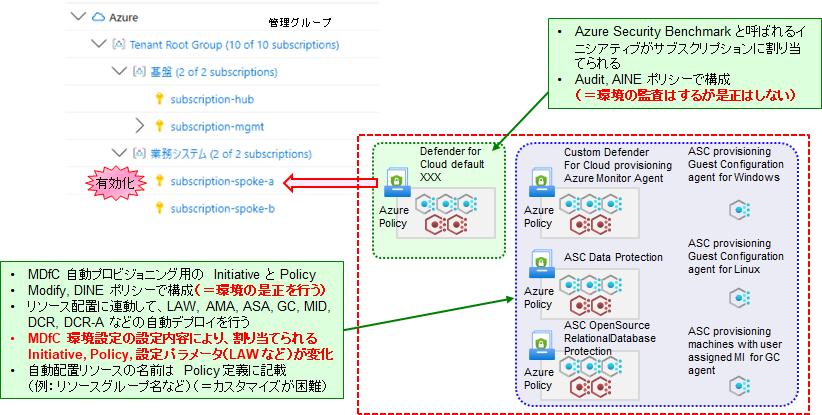

# Azure Policy ガバナンスと MDfC セキュリティ

既定では、MDfC は Azure Security Benchmark に基づく構成セキュリティ評価を行い、その結果を「推奨事項」や「セキュアスコア」としてユーザに通知します。「とりあえず作った環境」は、多くの “Unhealthy” 項目が通知され、セキュアスコアも 50～60 点前後ということがよくあります。しかし適切な是正処理と免除処理を進めると、100 点に近いセキュアスコアを目指していくことができると同時に、環境の構成脆弱性を潰していくことができます。本セクションでは、MDfC セキュリティと Azure Policy ガバナンスを適切に利用することで、環境の安全性確保（セキュリティガバナンス）を進めていきます。

  

このページでは具体的な手法に入る前に、知っておくとよい MDfC, Azure Policy の仕組み・内部動作について簡単に説明します。

## Azure Policy の役割

Azure のセキュリティは MDfC により管理されていますが、このうち CSPM 部分（構成セキュリティ）については内部的に Azure Policy が利用されています。具体的には、構成設定情報の確認やリソースの是正処理にAzure Policy が利用されており、MDfC の環境設定や自動プロビジョニング機能の有効化などを行うと、裏側で Azure Policy が操作されています。

  

Azure Policy には既定で約 2,000 個のポリシー（ルール）が含まれており、これらを適宜組み合わせて、各種のセキュリティや規制コンプライアンスのチェックを行っています。このうち最も基本となるのが “Azure Security Benchmark” と呼ばれるポリシーセットで、これ以外に、自動プロビジョニングを行う Azure Policy や、PCIDSS など各種の規制コンプライアンスチェックを行うセットが用意されています。MDfC の ”環境設定” や “自動プロビジョニング” 設定を変更すると、背後でこれらのポリシー割り当てが調整されることになります。

  

## Azure Policy の割り当て

MDfC から環境設定を行うと、Azure Policy が各サブスクリプションに対して割り当てられ、環境のチェックや自動是正が行われるようになります。しかし、MDfC は管理グループを意識したポリシー割り当てを行わないため、大規模な Azure 環境の管理の場合は、このポリシー割り当てを手動で行うことが望ましいです。具体的には、以下の作業を行います。

- MDfC による自動割り当てをいったん解除したうえで、管理グループに対して適切な Azure Policy セット（イニシアティブ）の割り当てを手動で行う（※ ポリシーセットのことをイニシアティブと呼びます）
- さらに必要に応じて、カスタムポリシーを開発し、追加の割り当てを行っていく

  

## 本デモでの作業の流れについて

上記を踏まえて、本デモでは以下の流れで作業を進めます。

- ① ポリシーの再割り当て
  - 既存のポリシー割り当ての全削除
  - ルート管理グループへの Azure Security Benchmark の割り当て
- ② カスタムポリシーの開発と割り当て
  - 業務システム用の追加チェック項目に関するカスタムポリシーの準備
  - カスタムポリシーの割り当て
- ③ 各業務システムに対するポリシーの適用除外とリソース是正
  - 各業務システムでのポリシー違反の確認
  - 適用除外またはリソース是正の実施
  - 適用するポリシー自体の見直し

## （参考）命名規約

本サンプルでは以下のように名前付けしています。

|  | | name | displayName | description | category |
| - | - | ---- | ----------- | ----------- | -------- |
| Audit/AINE | カスタムポリシー定義 | custom-policy-check-network-udr-no-internet-route | UDR にインターネット向けルートが含まれていない | UDR の Next Hop としてインターネットが含まれていないことを確認します。 | Custom Policy - Check - Network
|  | カスタムイニシアティブ定義 | custom-initiative-check-landingzones | Landing Zone 検査用ルールセット | Landing Zone を検査するための Audit/AINE カスタムポリシー群です。 | Custom Initiative - Check
|  | 割り当て | custom-check-lz | Landing Zone を検査する | Landing Zone を Audit/AINE カスタムポリシーで検査します。 | -
Modify/DINE | カスタムポリシー定義 | custom-policy-remediate-[category]-[rule] |   |   | Custom Policy - Remediate - [Category]
|  | カスタムイニシアティブ定義 | custom-initiative-remediate-[target] |   |   | Custom Initiative - Remediate
|  | 割り当て | custom-remed-[target] |   |   | -
