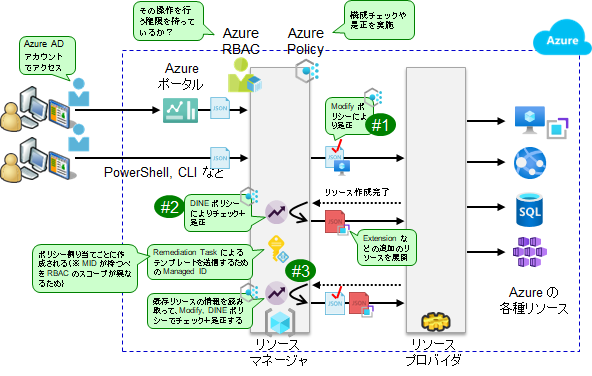

# ポリシー作成 : カスタム Audit, AINE ポリシーの作成

ランディングゾーン（業務システムサブスクリプション）の検査内容のうち、ASB ではカバーされない内容をチェックするためのカスタムポリシーを作成します。

## (参考) Audit ポリシー、AINE ポリシーとは

Audit ポリシー、AINE ポリシーを理解するためには、Azure Policy が何なのかを理解する必要があります。これを簡単に説明します。

まず Azure Policy は、技術的に言えば、Azure RBAC と組み合わせて利用される、Azure 操作を調整するための機能です。

- Azure リソースに対する操作は、リソースマネージャを介してリソースプロバイダに伝わり、リソースプロバイダが実際のリソース（仮想マシンやネットワーク、Web App や SQL DB など）を操作する。
- リソースマネージャには、要求された操作に対するチェックや是正を行うための 2 つの機能が備わっている。
  - Azure RBAC : 操作を要求したユーザが、その操作を行う権限を持っているか否かを確認する仕組み
  - Azure Policy : 要求された操作の「内容」（プロパティ）が、適切であるか否かを確認したり是正したりする仕組み

  

- Azure Policy にはいくつかのタイプがある。大別すると以下の 3 種類。
  - Deny ポリシー : ルールに反する処理を拒絶する
  - Audit ポリシー, AINE ポリシー : チェック（監査）のみを行う
  - Modify ポリシー, DINE ポリシー : ルールに反している場合、設定内容を変更したり、追加でリソースをデプロイしたりして是正する
- ポリシー種別のうち、AINE ポリシーと DINE ポリシーは遅延処理を行う。
  - AINE (Audit If Not Exist) ポリシーとは...
    - 一連のリソース操作が終わった後で、リソースの存否チェックを行う
  - DINE (Deploy If Not Exist) ポリシーとは...
    - 一連のリソース操作が終わった後で、リソースが存在しない場合には、追加リソースのデプロイを行う
- このような遅延処理を行うのは、関連リソースが正しくデプロイされたか否かをェックするため。
  - 例えば仮想マシンをデプロイする場合、各種の拡張機能 (Extension) が正しくデプロイされているか否かは非常に重要だが、これらは別リソースであるため、仮想マシンだけを見ていても、正しくデプロイされているかどうかが確認できない。
  - 通常、こうした関連リソースは、親リソースの配置に併せて一括展開されていることが多いため、「親リソースの操作に関連する操作も含めて終わった後でリソースの存否をチェックする」のが AINE ポリシーと DINE ポリシー。

## 本デモで作成するカスタムポリシーについて

以降のスクリプトでは、環境チェックを行う Audit, AINE カスタムポリシーを作成します。今回のサンプルでは一例として以下のようなカスタムポリシーを示しますが、必要に応じてカスタムポリシーの追加開発を行ってください。

- ネットワーク閉域性チェックに関するルール
  - UDR にインターネット向けルートが含まれていない
  - サブネットに UDR が割り当てられている
  - サブネットにサービスエンドポイントが設定されていない
- ログ収集に関するルール
  - 最低限行うべきリソース診断ログ出力の設定が行われている
- その他のルール
  - 特殊なリソースが使われていないことを確認する
  - 規制要件に準拠していないリージョンを使っていない

```bash

if ${FLAG_USE_SOD} ; then az account clear ; az login -u "user_gov_change@${PRIMARY_DOMAIN_NAME}" -p "${ADMIN_PASSWORD}" ; fi
 
TEMP_MG_TRG_ID=$(az account management-group list --query "[?displayName=='Tenant Root Group'].id" -o tsv)
 
# カスタムポリシーの作成
cat > temp.json << EOF
{
    "\$schema": " https://schema.management.azure.com/schemas/2018-05-01/subscriptionDeploymentTemplate.json#",
    "contentVersion": "1.0.0.0",
    "resources": [
        {
            "type": "Microsoft.Authorization/policyDefinitions",
            "name": "custom-policy-check-network-udr-no-internet-route",
            "apiVersion": "2019-09-01",
            "properties": {
                "DisplayName": "UDR にインターネット向けルートが含まれていない",
                "Description": "UDR の Next Hop としてインターネットが含まれていないことを確認します。",
                "metadata": {
                    "category": "Custom Policy - Check - Network"
                },
                "Mode": "Indexed",
                "PolicyType": "Custom",
                "PolicyRule": {
                    "if": {
                        "anyOf": [
                            {
                                "allOf": [
                                    {
                                        "equals": "Microsoft.Network/routeTables",
                                        "field": "type"
                                    },
                                    {
                                        "count": {
                                            "field": "Microsoft.Network/routeTables/routes[*]",
                                            "where": {
                                                "equals": "Internet",
                                                "field": "Microsoft.Network/routeTables/routes[*].nextHopType"
                                            }
                                        },
                                        "greater": 0
                                    }
                                ]
                            },
                            {
                                "allOf": [
                                    {
                                        "equals": "Microsoft.Network/routeTables/routes",
                                        "field": "type"
                                    },
                                    {
                                        "equals": "Internet",
                                        "field": "Microsoft.Network/routeTables/routes/nextHopType"
                                    }
                                ]
                            }
                        ]
                    },
                    "then": {
                        "effect": "audit"
                    }
                }
            }
        },
        {
            "type": "Microsoft.Authorization/policyDefinitions",
            "name": "custom-policy-check-network-subnet-with-udr",
            "apiVersion": "2019-09-01",
            "properties": {
                "DisplayName": "サブネットに UDR が割り当てられている",
                "Description": "UDR が割り当てられていないサブネットが存在しないことを確認します。",
                "metadata": {
                    "category": "Custom Policy - Check - Network"
                },
                "Mode": "Indexed",
                "PolicyType": "Custom",
                "PolicyRule": {
                    "if": {
                        "anyOf": [
                            {
                                "allOf": [
                                    {
                                        "equals": "Microsoft.Network/virtualNetworks",
                                        "field": "type"
                                    },
                                    {
                                        "count": {
                                            "field": "Microsoft.Network/virtualNetworks/subnets[*]",
                                            "where": {
                                                "allOf": [
                                                    {
                                                        "exists": "false",
                                                        "field": "Microsoft.Network/virtualNetworks/subnets[*].routeTable.id"
                                                    },
                                                    {
                                                        "field": "Microsoft.Network/virtualNetworks/subnets[*].name",
                                                        "notIn": [
                                                            "AzureFirewallSubnet",
                                                            "AzureBastionSubnet"
                                                        ]
                                                    }
                                                ]
                                            }
                                        },
                                        "notEquals": 0
                                    }
                                ]
                            },
                            {
                                "allOf": [
                                    {
                                        "field": "type",
                                        "equals": "Microsoft.Network/virtualNetworks/subnets"
                                    },
                                    {
                                        "field": "name",
                                        "notIn": [
                                            "AzureFirewallSubnet",
                                            "AzureBastionSubnet"
                                        ]
                                    },
                                    {
                                        "field": "Microsoft.Network/virtualNetworks/subnets/routeTable.id",
                                        "exists": "false"
                                    }
                                ]
                            }
                        ]
                    },
                    "then": {
                        "effect": "audit"
                    }
                }
            }
        },
        {
            "type": "Microsoft.Authorization/policyDefinitions",
            "name": "custom-policy-check-network-no-service-endpoint",
            "apiVersion": "2019-09-01",
            "properties": {
                "DisplayName": "サブネットにサービスエンドポイントが設定されていない",
                "Description": "サブネットにサービスエンドポイントが設定されていないことを確認します。",
                "metadata": {
                    "category": "Custom Policy - Check - Network"
                },
                "Mode": "Indexed",
                "PolicyType": "Custom",
                "policyRule": {
                    "if": {
                        "allOf": [
                            {
                                "field": "type",
                                "equals": "Microsoft.Network/virtualNetworks/subnets"
                            },
                            {
                                "field": "Microsoft.Network/virtualNetworks/subnets/serviceEndpoints[*].service",
                                "exists": "true"
                            }
                        ]
                    },
                    "then": {
                        "effect": "audit"
                    }
                }
 
            }
        },
        {
            "type": "Microsoft.Authorization/policyDefinitions",
            "name": "custom-policy-check-monitoring-diagnostic-logs-enabled",
            "apiVersion": "2019-09-01",
            "properties": {
                "DisplayName": "最低限行うべきリソース診断ログ出力の設定が行われている",
                "Description": "ログを出力すべきリソースに対して診断ログ出力の設定が有効化されていることを確認します。",
                "metadata": {
                    "category": "Custom Policy - Check - Monitoring"
                },
                "Mode": "Indexed",
                "PolicyType": "Custom",
                "policyRule": {
                    "if": {
                        "anyOf": [
                            {
                                "field": "type",
                                "in": [
                                    "Microsoft.Network/azureFirewalls",
                                    "Microsoft.Network/applicationGateways",
                                    "Microsoft.Network/azureFirewalls",
                                    "Microsoft.Network/bastionHosts",
                                    "Microsoft.Network/networkSecurityGroups",
                                    "Microsoft.Network/publicIPAddresses",
                                    "Microsoft.Storage/storageAccounts",
                                    "Microsoft.KeyVault/vaults",
                                    "Microsoft.RecoveryServices/vaults",
                                    "Microsoft.OperationalInsights/workspaces"
                                ]
                            }
                        ]
                    },
                    "then": {
                        "effect": "AuditIfNotExists",
                        "details": {
                            "type": "Microsoft.Insights/diagnosticSettings",
                            "existenceCondition": {
                                "allOf": [
                                    {
                                        "field": "Microsoft.Insights/diagnosticSettings/logs.enabled",
                                        "equals": "true"
                                    },
                                    {
                                        "field": "Microsoft.Insights/diagnosticSettings/workspaceId",
                                        "exists": "true"
                                    }
                                ]
                            }
                        }
                    }
                }
            }
        },
        {
            "type": "Microsoft.Authorization/policyDefinitions",
            "name": "custom-policy-check-resource-uncommon",
            "apiVersion": "2019-09-01",
            "properties": {
                "DisplayName": "特殊なリソースが使われていないことを確認する",
                "Description": "一般的でないリソースが使われていた場合に警告を上げます。",
                "metadata": {
                    "category": "Custom Policy - Check - Resource"
                },
                "Mode": "Indexed",
                "PolicyType": "Custom",
                "policyRule": {
                    "if": {
                        "allOf": [
                            {
                                "field": "type",
                                "notIn": [
                                    "microsoft.alertsmanagement/smartDetectorAlertRules",
                                    "microsoft.alertsmanagement/actionrules",
                                    "Microsoft.Compute/disks",
                                    "Microsoft.Compute/restorePointCollections",
                                    "Microsoft.Compute/virtualMachines",
                                    "Microsoft.Compute/virtualMachines/extensions",
                                    "microsoft.dashboard/grafana",
                                    "microsoft.insights/actiongroups",
                                    "microsoft.insights/actiongroupsMicrosoft.Dashboard/grafana",
                                    "microsoft.insights/activitylogalerts",
                                    "Microsoft.Insights/components",
                                    "Microsoft.Insights/dataCollectionEndpoints",
                                    "Microsoft.Insights/dataCollectionRules",
                                    "microsoft.insights/metricalerts",
                                    "microsoft.insights/scheduledqueryrules",
                                    "Microsoft.Maintenance/maintenanceConfigurations",
                                    "microsoft.insights/webtests",
                                    "Microsoft.KeyVault/vaults",
                                    "Microsoft.Maintenance/maintenanceConfigurations",
                                    "Microsoft.ManagedIdentity/userAssignedIdentities",
                                    "Microsoft.Network/applicationGateways",
                                    "Microsoft.Network/azureFirewalls",
                                    "Microsoft.Network/bastionHosts",
                                    "Microsoft.Network/firewallPolicies",
                                    "Microsoft.Network/networkInterfaces",
                                    "Microsoft.Network/networkSecurityGroups",
                                    "Microsoft.Network/networkWatchers",
                                    "Microsoft.Network/networkWatchers/flowLogs",
                                    "Microsoft.Network/privateDnsZones",
                                    "Microsoft.Network/privateDnsZones/virtualNetworkLinks",
                                    "Microsoft.Network/privateEndpoints",
                                    "Microsoft.Network/publicIPAddresses",
                                    "Microsoft.Network/routeTables",
                                    "Microsoft.Network/virtualNetworks",
                                    "Microsoft.OperationalInsights/workspaces",
                                    "Microsoft.OperationsManagement/solutions",
                                    "Microsoft.Portal/dashboards",
                                    "Microsoft.RecoveryServices/vaults",
                                    "Microsoft.Security/automations",
                                    "Microsoft.Security/automationsMicrosoft.Compute/disks",
                                    "Microsoft.Sql/servers",
                                    "Microsoft.Sql/servers/databases",
                                    "Microsoft.SqlVirtualMachine/SqlVirtualMachines",
                                    "Microsoft.Storage/storageAccounts",
                                    "Microsoft.Web/serverFarms",
                                    "Microsoft.Web/sites"
                                ]
                            }
                        ]
                    },
                    "then": {
                        "effect": "audit"
                    }
                }
            }
        },
        {
            "type": "Microsoft.Authorization/policyDefinitions",
            "name": "custom-policy-check-resource-location",
            "apiVersion": "2019-09-01",
            "properties": {
                "DisplayName": "規制要件に準拠していないリージョンを使っていない",
                "Description": "特定リージョン以外を利用している場合に警告を上げます。GDPR のような利用リージョンの規制要件がある場合に利用します。",
                "metadata": {
                    "category": "Custom Policy - Check - Resource"
                },
                "Mode": "Indexed",
                "PolicyType": "Custom",
                "policyRule": {
                    "if": {
                        "not": {
                            "field": "location",
                            "in": [
                                "global",
                                "eastus",
                                "eastus2",
                                "westus",
                                "westus2",
                                "centralus",
                                "southcentralus",
                                "northcentralus",
                                "japanwest",
                                "japaneast",
                                "southeastasia",
                                "eastasia",
                                "westcentralus"
                            ]
                        }
                    },
                    "then": {
                        "effect": "audit"
                    }
                }
            }
        }    
    ]
}
EOF
 
TEMP=(${TEMP_MG_TRG_ID//\// })
az deployment mg create --location ${LOCATION_NAMES[0]} --name "custom-policies" --template-file temp.json --management-group-id "${TEMP[3]}"
 
# ※（参考）westcentralus リージョンは、Canary リージョンに次いで最も早く変更がデプロイされるリージョン。このためミッションクリティカルシステムではこのリージョンにパイロットシステムを配置してチェックしておくと、変更の確認などが行える

```
