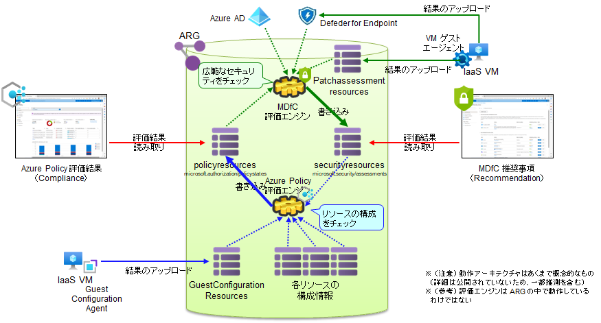
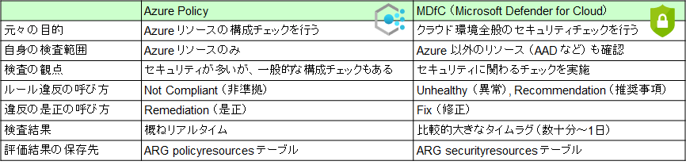

# ポリシー作成 : ポリシー評価のトリガー

ポリシーを割り当てた後で、ポリシーの評価をトリガーすると、速やかに環境チェックを行うことができます。

```bash

if ${FLAG_USE_SOD} ; then az account clear ; az login -u "user_gov_change@${PRIMARY_DOMAIN_NAME}" -p "${ADMIN_PASSWORD}" ; fi

for TEMP_SUBSCRIPTION_ID in $SUBSCRIPTION_IDS; do
    az account set -s $TEMP_SUBSCRIPTION_ID
    echo "${TEMP_SUBSCRIPTION_ID} $(az account show --name $TEMP_SUBSCRIPTION_ID --query name -o tsv) : trigger-scan"
    az policy state trigger-scan --no-wait
done

```

## （参考）Azure Policy と MDfC 推奨事項の評価・反映までのタイムラグについて

Azure Policy や MDfC 推奨事項を利用している際に戸惑うのが、上記のスキャン処理を走らせてもすぐに Azure Policy 画面や MDfC 推奨画面に反映されない場合がよくあることです。これは動作原理的にやむを得ない部分があります。

  

  

要点を以下に示します。

- Azure Policy と MDfC はそれぞれの担当範囲のチェックを行い、ARG (Azure Resource Graph) と呼ばれるグラフデータベースの中で、相互に情報を取り込みあっています。
  - もともと Azure Policy と MDfC は担当範囲が異なっており、Azure Policy はリソースの構成チェックを、MDfC はクラウド全般のセキュリティチェックを担っていました。しかし実態としては機能的に重なる部分が非常に大きく、現在では互いに情報を取り込みあう形で動作しています。
  - このため、以下のようになっています。
    - Azure Policy の評価結果の中には、MDfC エンジンが評価した結果も含まれている。
    - MDfC 推奨事項の結果の中には、Azure Policy エンジンが評価した結果も含まれている。
- 一般論として、スキャン間隔や反映は Azure Policy の方が短いため、Azure Policy で見られるものはそちらで見たほうが素早く現況を確認できます。
  - Azure Policy は Azure のリソース構成をチェックするため、素早くスキャンを行える場合が多いです。一方で、MDfC は MDE や Azure AD など外部リソースの情報を読み取ってセキュリティ評価をしているものも多く、このためスキャン間隔が比較的長かったり、そもそもスキャンを手動でトリガーできないものがほとんどです。
  - とはいえ上記は一般論で、Azure Policy の中にも評価サイクルが長いものや評価に時間がかかるものもあります。例えば...
    - 実態は MDfC 側でチェックされているもの。例えばアンチマルウェアのインストール状態などは MDfC 側でチェックされたものを Azure Policy 側に取り込んでいます。
    - Guest Configuration に関わるもの。GC エージェントが VM 内でチェックを行い、評価結果をアップロードしていますが、GC エージェントの動きは Azure Policy のエンジンと連動していません。
- az policy state trigger-scan 命令は Azure Policy のポリシー評価エンジンを動作させるものですが、以下のようになっているため、一部の評価結果については最新化されません。
  - MDfC で評価されるものについては、MDfC の評価結果を取り込むのみです。
  - Guest Configuration で評価されるものについては、VM からアップロードされている情報を取り込むのみです。

上記のような挙動特性があるために、Azure Policy, MDfC 推奨事項のどちらも、リソースを是正したからといってすぐにコンソール画面に反映されるわけではない、という形になっています。リフレッシュインターバル（更新間隔）については、Azure Policy ではわかりづらいですが、MDfC 推奨事項の画面には記載があるため、なかなか反映されない場合には、MDfC 推奨事項の画面で確認してみるとよいでしょう。
