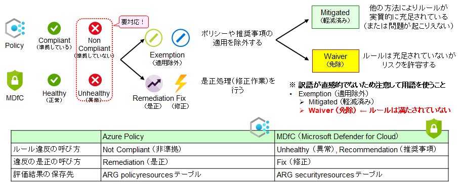
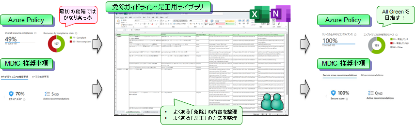
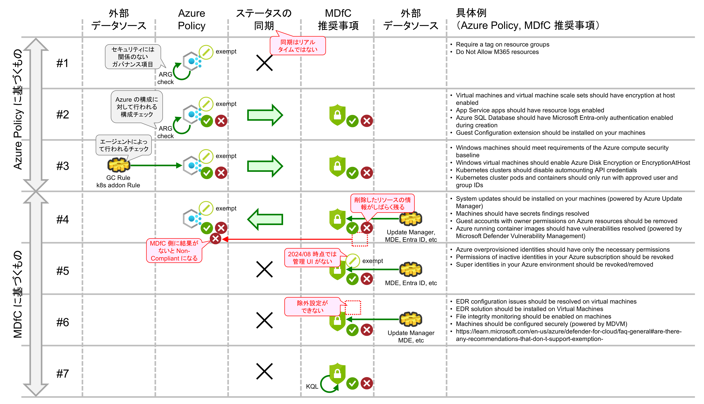
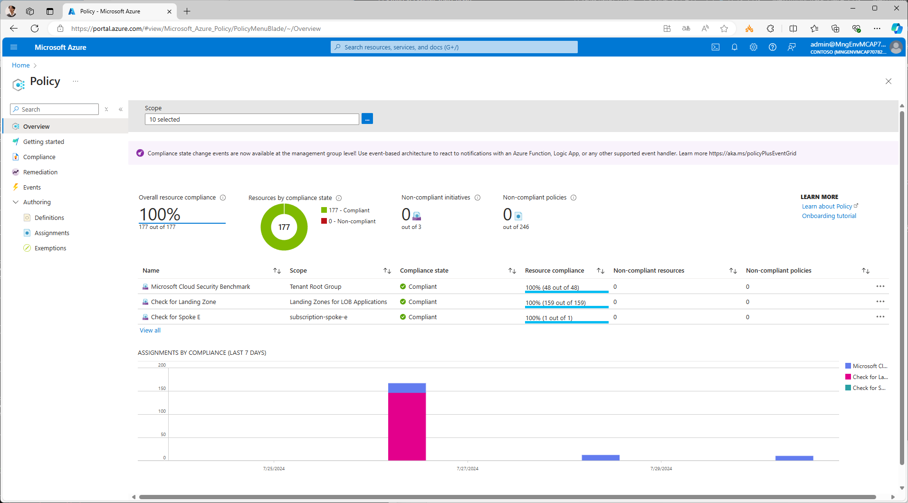
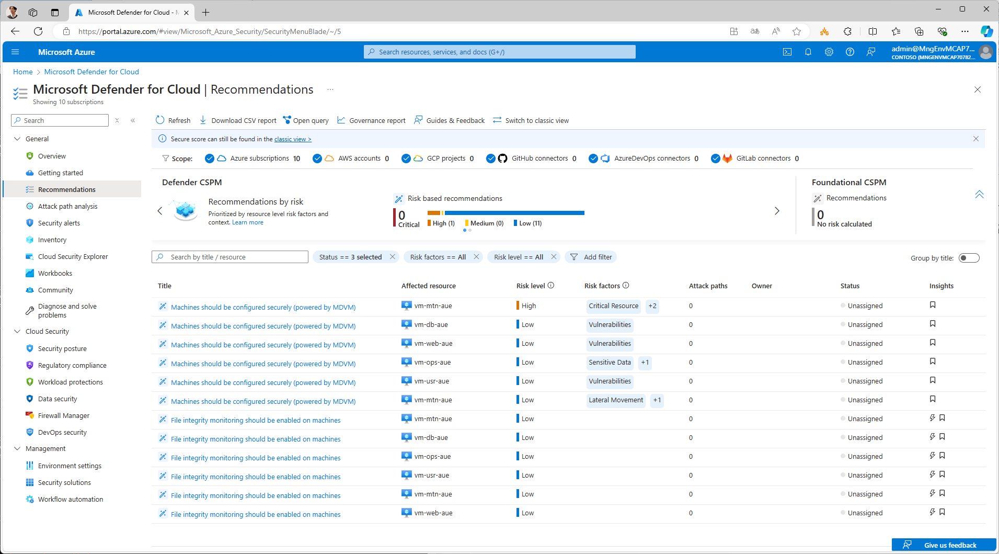

# 是正処理 (Remediation) と適用除外 (Exemption) について

ポリシーにより環境をチェックした結果として、非準拠（または異常）が見つかった場合には、是正処理（修正作業）を実施するか、適用を除外する必要があります。

## 用語について

是正処理と適用除外については、Azure Policy と MDfC で、利用している用語が異なること、また間違えやすい用語があるため、以下に整理します。

  

特に注意すべき点は、ポリシーの適用を除外（Exemption）する場合の理由付けです。ポリシーの適用除外（Exemption）は、以下の 2 つに分類されます。

- Mitigated (軽減済み)
  - 他の方法によりルールが実質的に充足されている、あるいは論理的に問題が起こりえない状況であるために、**当該ルールを適用する必要がない**、と判断される場合です。
- Waiver (免除)
  - **ルールは充足されていない**が、それによって生じるリスクを許容する、という場合です。よくあるケースは、本当はやった方が適切だが、PoC であるためにコストがかけられないのでやらないと判断するような場合です。

Exemption, Waiver, Mitigated には、それぞれ適用除外、軽減済み、免除という訳語が割り当てられていますが、これらの訳語は直感と必ずしもそぐわないところがあります。（例：「軽減済み」は、リスクは残っているけれどもリスクが軽減されているので OK とみなす＝Waiver に相当するような意味に解釈したり、「免除」を Exemption の意味で解釈してしまうような誤解が生じやすいです）

いずれの訳語を利用しても、人によって解釈がぶれやすく、誤解も生じやすいため、**敢えて英語表記のまま利用する** (Exemption, Mitigated, Waiver の用語を使う) のも一手です。本デモでは、Mitigated, Waiver の用語を積極的に利用しています。

## ポリシーの無効化

またポリシーによっては、「そもそもそのポリシーを無効化した方がよい」場合もあります。例えば以下のようなポリシーです。

- カスタムロールの作成
- エージェントの自動配布機能

これらのポリシーは、ずさんに設計された環境では意味のあるものです。しかし本デモでの環境設計の場合、厳密な権限分掌のためにカスタムロールを作成したり、厳密な環境管理のためにエージェントは手動セットアップを行ったりしていますので、むしろ邪魔なポリシーといえます。ですので、これらのポリシーは無効化する、という対応の方が適切です。

## 具体的な対応について

以上を踏まえて、Non Compliant (Unhealthy) 項目について、以下のいずれかの対応をしていきます。

- 是正処理 (Remediation) : リソースの問題を修正する
- 適用除外 (Exemption) - 軽減済み (Mitigated) : 実質的にルールが充足されている or そもそも問題が起こらない
- 適用除外 (Exemption) - 免除 (Waiver) : ルールは満たされていないが許容する
- ポリシーそのものの無効化 : 自社環境には適していないのでポリシーを無効化する

なお、Exemption と Remediation を効率的に行っていくため、組織として、適用除外ガイドラインや是正処理ライブラリを整備していくことをオススメします。ひな形となる Excel シートを readme.md に示しておきましたので、現場にてご活用ください。

  

## （重要）MDfC 推奨事項と Azure Policy の関係性と情報同期について（2024/08 追記）

MDfC 推奨事項と Azure Policy は密接に関係していますが、近年、セキュリティとしてチェックすべき対象が Azure 以外にも拡大したことや、実際の構成脆弱性見直しにあたっては優先順位付けしたアプローチが必要になることなどから、Azure Policy と MDfC 推奨事項の関係性が複雑化してきています。特に適用除外（Exemption）やポリシー無効化などを行う上では、各推奨事項・ポリシーの完成性や挙動を正確に理解していないと戸惑うことになりますので、これについて以降に解説します。

※ なお、以降の解説はあくまで 2024/08 時点のものであり、今後、製品改善の中で動作アーキテクチャが変更されることもあることにご注意ください。

### 歴史的経緯

まず、現在の Azure Policy と MDfC 推奨事項には、以下の違いがあります。

| 特性 | Azure Policy | MDfC 推奨事項 |
| --- | --- | --- |
| 利用目的 | ガバナンス（統治） | セキュリティの維持・向上 |
| 対象領域 | コスト、リソース一貫性、セキュリティなど | セキュリティのみ |
| 取り扱い | ベースライン | ガイドライン | 
| 強制度合い | 絶対順守 | リスクベースアプローチ |
| 不適合項目の扱い | Non Compliant (ルールを守っていない) | Unhealthy (健全でない) |

端的に言えば、Azure Policy は「絶対順守（血の掟）」、MDfC は「推奨事項（優先度の高いものから出来る限り守る）」、という違いがあります。当初は MDfC も Azure Policy と同様、「すべての項目を満たせ」というスタンスでしたが、実際には CIS ベンチマークのような基本・一般的なセキュリティ基準であっても守れていない場合は多く、しかもその基準から大きく外れているケースも少なくありません。セキュリティの世界には「一番危ないところから潰しこんでいく（weakest link）」という考え方があり、そのために、満たしていないセキュリティ上の構成ルールのうち、特にリスクの高いものから改善していくことができるように MDfC の機能強化が図られてきました。

また、MDfC (Microsoft Defender for Cloud) はもともと Azure Defender と呼ばれる Azure 環境のみを対象としたセキュリティツールでしたが、セキュリティの重要性の向上、そしてその保護対象も Entra ID や AWS, GCP などと広がっていくことになり（そのために製品名も MDfC に変更されました）、結果として、Azure 以外のリソースも保護・管理していくようになりました。

### 現在の動作アーキテクチャ

その結果として、現在の Azure Policy 及び MDfC 推奨事項は、セキュリティ項目によって異なる、さまざまな方法で動作する形となりました。それを示したのが下図になります。

  

- まず、構成チェックを「実際に」行っているのがどちらであるかにより、大きく 2 つに大別することができる。
  - Azure Policy エンジンが中心となって構成チェックを行っているもの。（上図の #1～#3）
  - MDfC 推奨事項エンジンが中心となって構成チェックを行っているもの。（上図の #4～#7）
- 当初のアーキテクチャは、
  - 基本的に、上図の #1～#4 までのアーキテクチャで動作していた。
  - セキュリティに関する項目に関しては #2～#4 のアーキテクチャで動いており、Azure Policy と MDfC 推奨事項の情報が相互に同期されていた。
- しかし現在では、
  - 従来のアーキテクチャに、#5～#7 のパターンが加わった。
  - これらは、「セキュリティに関する項目であり、MDfC 推奨事項一覧の中には出てくるが、Azure Policy 側に対応するポリシーがなく、Azure Policy 側には情報が同期されない」ものになっている。

上記の #5～#7 のパターンに該当するものとしては、Azure に関係しないもの（例：AWS, GCP, オンプレ環境のセキュリティチェック結果）が中心になりますが、一部、Azure に関するものも含まれます（例：FIM が有効化されていない、Azure サブスクリプションに過剰な権限割り当てが行われている、など）。

現時点ではどの推奨事項がどのパターンで動作するのかのドキュメントがまとめられていませんが、各推奨事項にはキー値（Assessment Key）が振られており、対応する Azure Policy が存在するか否かは以下のコマンドにより確認することができます。

```bash
az security assessment-metadata list --query "[].{name:name,policyDefinitionId:policyDefinitionId,displayName:displayName,severity:severity}" -o table
```

上図からわかるように、**構成セキュリティの管理を行う際は、Azure Policy ではなく MDfC 推奨事項を中心に作業を行う必要があります**。GUI（ポータル画面）から適用除外設定（Exemption）を行う際も、Azure Policy ではなく MDfC 推奨事項の画面から除外設定を行うと、内部動作が #1～#7 のいずれであるのかを意識することなく除外設定を行うことができます。

### 推奨事項の除外方法（Exemption）

しかし、かといって Azure Policy を無視できるわけではありません。その理由は以下の通りです。

- 対応する Azure Policy が存在する場合、適用除外の設定 (Exemption) の情報は Azure Policy の Exemption として管理される。
  - これは MDfC 側が中心となってセキュリティチェックをしているパターン #4 のケースでも同様です。
  - コマンドラインや REST API から除外設定を行う場合は、Azure Policy の exemption を作成することになります。
- 大企業における大規模 Azure 環境では、セキュリティ以外のガバナンス項目に関わる Azure Policy が利用される。
  - コスト管理やリソース管理に関わる Azure Policy も利用されるため、Azure Policy も直接操作する必要があります。

また、小規模環境であれば MDfC 推奨事項画面から適当・場当たり的に除外設定を行ってもあまり問題にはなりませんが、大規模 Azure 環境で同じことを行うと、背後の Azure Policy の Exemption が非常に汚らしい状況に陥りやすく、管理性を著しく損なうことになります。環境ガバナンスを考えると、大規模環境では除外管理を正確・厳格に行い、Azure Policy の情報をクリーンに保つ必要があります。

こうした理由により、大規模な Azure 共通基盤では、技術的には複雑であってもここで示したような内部アーキテクチャを正確に理解して、除外管理を行っていくことが望ましいと言えます。

### 除外設定ができない一部の MDfC 推奨事項について

また注意すべき点として、こちらの [URL](https://learn.microsoft.com/en-us/azure/defender-for-cloud/faq-general#are-there-any-recommendations-that-don-t-support-exemption-) に列挙されている推奨事項に関しては、2024/08 時点において、適用除外の設定を行うことができません。例えば以下のような項目です。

- EDR configuration issues should be resolved on virtual machines
- EDR solution should be installed on Virtual Machines
- File integrity monitoring should be enabled on machines
- Machines should be configured securely (powered by MDVM)

この結果として、是正処理（remediation）や除外処理（Exemption）を正しく行って Azure Policy で 100% compliant を実現しても、MDfC 推奨事項を 100% healthy にできない場合があることにご注意ください。（現時点での製品仕様による制限ですのでご容赦ください。）

  

  
