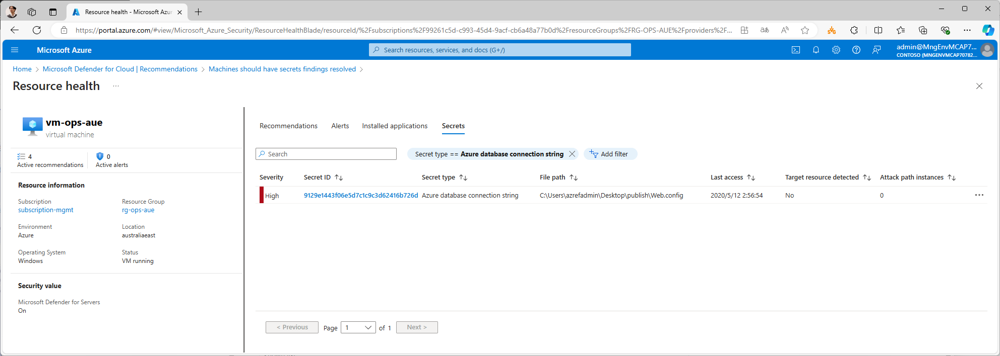

# 是正処理 (Remediation) : よくある是正処理

是正可能なものは適宜修正を行う必要があります。ここでは、以下の是正処理を行います。

- System updates should be installed on your machines (powered by Azure Update Manager)
  - 未適用のセキュリティパッチがある場合、MDE がこれを検出し、推奨事項（非準拠事項）として報告してきます。セキュリティパッチは速やかに適用するようにしてください。
  - セキュリティパッチの適用は、Azure Update Manager (旧称 UMC, Update Management Center) と呼ばれる機能を使って行うことができます。仮想マシンに標準インストールされている VM ゲストエージェントの機能が利用されるため、特に追加のエージェントのインストールは不要です。
  - なお Azure Update Manager は一つでもセキュリティパッチが未適用の場合には Unhealthy/Non Compliant として報告が行われますが、パターンファイルがほぼ毎日配信されているため、結果として毎日のように Unhealthy/Non Compliant が報告されます。あまりにも頻繁に Unhealthy/Non Compliant が報告されると煩わしい、という場合には、この項目については敢えて無効化し、更新適用については定期的に Azure Update Manager を見て手動で確認・管理する、という方法も考えられます（この方が実際の現実の運用に即している場合も多いでしょう）。このあたりは実際のシステムの特性・要件などに併せて調整してください。

- Machines should have secrets findings resolved
  - マシン上に接続文字列などのシークレット（秘匿すべき情報）を放置していた場合、MDE がこれを検出して報告してきます。
  - MDfC 推奨事項の画面から上記項目を選び、そこから Findings を確認すると、どこのなんのシークレットが問題であるかがわかりますので、適宜是正します。
  - 例えば下図の場合、vm-ops-xxx 上でアプリケーション配置のために web.config ファイルをデスクトップにコピーして置いてあり、それが検出されています。この場合にはデスクトップから該当ファイルを削除します。

  

```bash

# 業務システム統制チーム／③ 構成変更の作業アカウントに切り替え
if ${FLAG_USE_SOD}; then if ${FLAG_USE_SOD_SP}; then TEMP_SP_NAME="sp_gov_change"; az login --service-principal --username ${SP_APP_IDS[${TEMP_SP_NAME}]} --password "${SP_PWDS[${TEMP_SP_NAME}]}" --tenant ${PRIMARY_DOMAIN_NAME} --allow-no-subscriptions; else az account clear; az login -u "user_gov_change@${PRIMARY_DOMAIN_NAME}" -p "${ADMIN_PASSWORD}"; fi; fi

#####################################
# セキュリティパッチの適用指示

# 運用管理の日常作業担当者のアカウントに切り替え
if ${FLAG_USE_SOD}; then if ${FLAG_USE_SOD_SP}; then TEMP_SP_NAME="sp_mgmt_ops"; az login --service-principal --username ${SP_APP_IDS[${TEMP_SP_NAME}]} --password "${SP_PWDS[${TEMP_SP_NAME}]}" --tenant ${PRIMARY_DOMAIN_NAME} --allow-no-subscriptions; else az account clear; az login -u "user_mgmt_ops@${PRIMARY_DOMAIN_NAME}" -p "${ADMIN_PASSWORD}"; fi; fi

# パッチのアセスメント
#for TEMP_SUBSCRIPTION_ID in $SUBSCRIPTION_IDS; do
#az account set -s $TEMP_SUBSCRIPTION_ID
#for TEMP_VM_ID in $(az vm list --query [].id -o tsv); do
#echo ${TEMP_VM_ID}
#az rest --method post --url "${TEMP_VM_ID}/assessPatches?api-version=2021-03-01"
#done
#done
 
# パッチの適用
for TEMP_SUBSCRIPTION_ID in $SUBSCRIPTION_IDS; do
az account set -s $TEMP_SUBSCRIPTION_ID
for TEMP_VM_ID in $(az vm list --query [].id -o tsv); do
echo ${TEMP_VM_ID}
az rest --method post --url "${TEMP_VM_ID}/installPatches?api-version=2022-03-01" --body "{ \"maximumDuration\": \"PT4H\", \"rebootSetting\": \"IfRequired\", \"windowsParameters\": { \"classificationsToInclude\": [ \"Critical\", \"Security\", \"UpdateRollUp\", \"FeaturePack\", \"ServicePack\", \"Definition\", \"Tools\", \"Updates\" ] }, \"linuxParameters\": { \"classificationsToInclude\": [ \"Critical\", \"Security\", \"Other\" ] } }"
done
done

# 業務システム統制チーム／③ 構成変更の作業アカウントに切り替え
if ${FLAG_USE_SOD}; then if ${FLAG_USE_SOD_SP}; then TEMP_SP_NAME="sp_gov_change"; az login --service-principal --username ${SP_APP_IDS[${TEMP_SP_NAME}]} --password "${SP_PWDS[${TEMP_SP_NAME}]}" --tenant ${PRIMARY_DOMAIN_NAME} --allow-no-subscriptions; else az account clear; az login -u "user_gov_change@${PRIMARY_DOMAIN_NAME}" -p "${ADMIN_PASSWORD}"; fi; fi
TEMP_SUBSCRIPTION_IDS=$SUBSCRIPTION_IDS

```

## System updates should be installed on your machines (powered by Azure Update Manager) の適用を無効化（除外）する場合

```bash

# 業務システム統制チーム／③ 構成変更の作業アカウントに切り替え
if ${FLAG_USE_SOD}; then if ${FLAG_USE_SOD_SP}; then TEMP_SP_NAME="sp_gov_change"; az login --service-principal --username ${SP_APP_IDS[${TEMP_SP_NAME}]} --password "${SP_PWDS[${TEMP_SP_NAME}]}" --tenant ${PRIMARY_DOMAIN_NAME} --allow-no-subscriptions; else az account clear; az login -u "user_gov_change@${PRIMARY_DOMAIN_NAME}" -p "${ADMIN_PASSWORD}"; fi; fi

# ■ 以下は全体に共通
TEMP_MG_TRG_ID=$(az account management-group list --query "[?displayName=='Tenant Root Group'].id" -o tsv)
TEMP_ASSIGNMENT_ID=$(az policy assignment list --scope $TEMP_MG_TRG_ID --query "[? displayName == 'Microsoft Cloud Security Benchmark'].id" -o tsv)

# System updates should be installed on your machines (powered by Azure Update Manager) f85bf3e0-d513-442e-89c3-1784ad63382b systemUpdatesV2Monitoring

TEMP_EXEMPTION_NAME="Exemption-SystemUpdateCheck"
cat > temp.json << EOF
{
  "properties": {
    "policyAssignmentId": "${TEMP_ASSIGNMENT_ID}",
    "policyDefinitionReferenceIds": [
      "systemUpdatesV2Monitoring"
    ],
    "exemptionCategory": "Waiver",
    "displayName": "Azure Update Manager による未適用パッチの存在報告を除外 (Waiver)",
    "description": "報告頻度がほぼ日次であり、頻繁すぎるため（かわりに手動で Azure Update Manager を確認する）"
  }
}
EOF
 
az rest --method PUT --uri "${TEMP_MG_TRG_ID}/providers/Microsoft.Authorization/policyExemptions/${TEMP_EXEMPTION_NAME}?api-version=2022-07-01-preview" --body @temp.json

```
