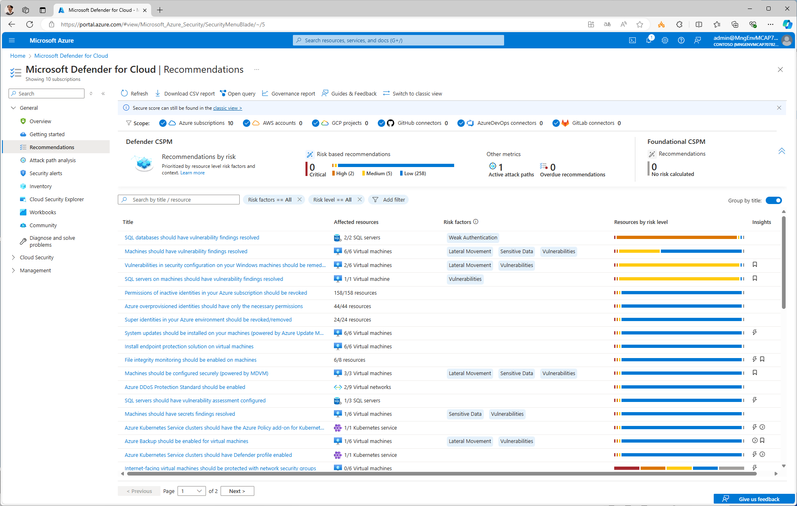
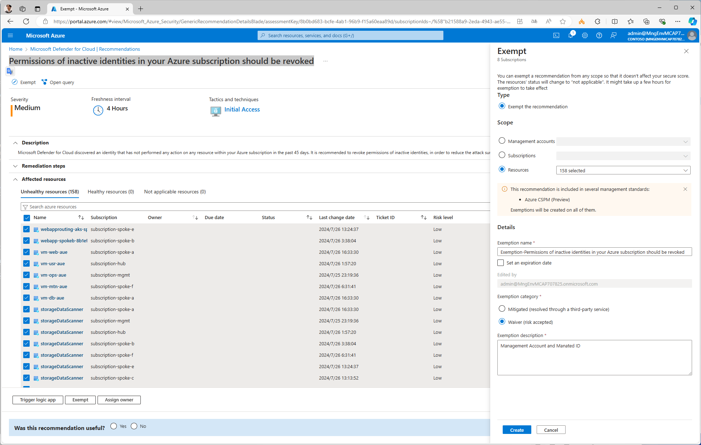

# 適用除外(Exemption) 推奨事項からの除外

MDfC の推奨事項の画面上には、Azure Policy ではなく MDfC 単体で評価される項目も表示されます。このうち Entra ID に関連する以下の 3 つの推奨事項に関しては注意が必要です。

- Permissions of inactive identities in your Azure subscription should be revoked
- Azure overprovisioned identities should have only the necessary permissions
- Super identities in your Azure environment should be revoked/removed

これらの推奨事項は、

- 管理者アカウントや環境管理用の Service Principal、Managed ID なども検査対象になっている。
- 作成直後やテスト環境では「ほぼ使われていない」とみなされて Unhealthy として報告される。

といった特徴があります。このため、内容を確認したうえで適宜除外を行ってください。

なお、適用除外作業を行う際は、一括指定で行うと便利です。以下の手順で除外を行ってください。

- MDfC の推奨事項画面を出す
- "Group by title" オプションを有効化
- 推奨事項を選ぶと、複数の ID を対象としてまとめて適用除外処理ができます。

  

  
