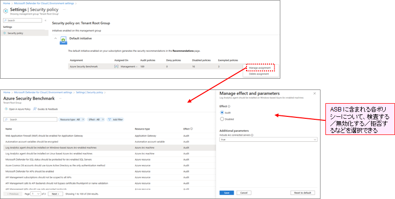
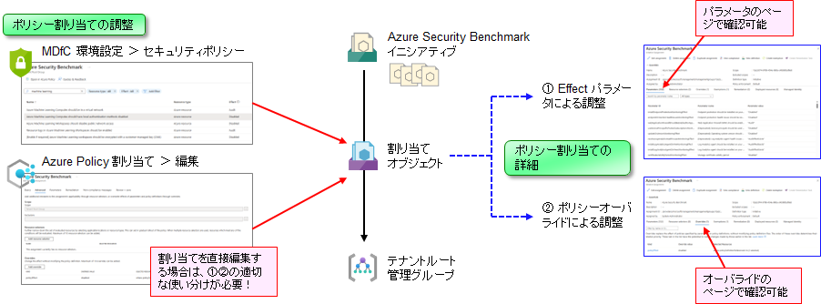
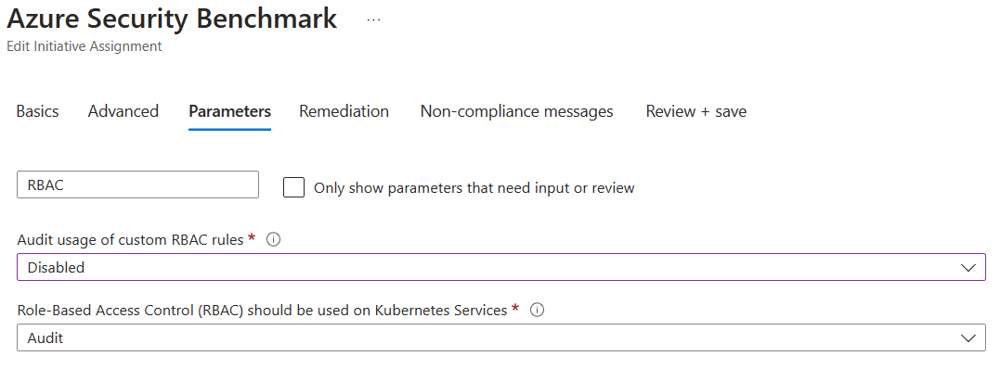
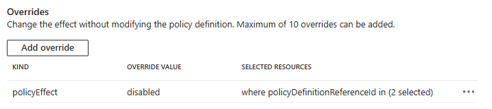
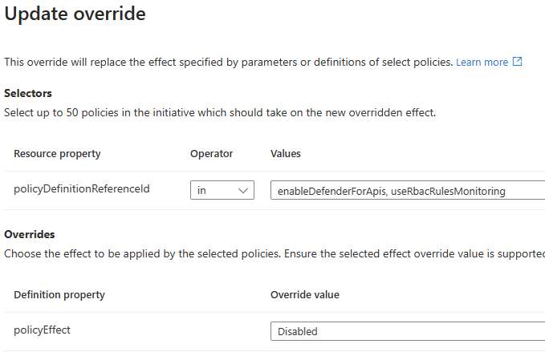

# 適用するポリシーの見直し（ポリシーの無効化）

Microsoft Cloud Security Benchmark を適切に運用していくにあたっては、時としてセキュリティポリシーを見直す必要があります。

## 適用を見直すべきポリシー

### 自社にそぐわないセキュリティポリシーの見直し

例えば以下のセキュリティポリシーは、既定では有効化されているものの、今回のデモ環境の設計・運用にはそぐわないため、無効化すべきです。

- Auto provisioning of the Log Analytics agent should be enabled on your subscription (475aae12-b88a-4572-8b36-9b712b2b3a17)
  - Log Analytics Agent の自動プロビジョニング機能を有効化するように構成されているかをチェックするポリシーです。
  - 本デモの Landing Zone では、以下の前提条件で環境設計をしているため、このポリシーは無効化すべきです。
    - Azure Policy が勝手に運用環境を書き換えるようにはしない
    - そもそもルール違反が起きないように、VM 構築時点でエージェント一式をデプロイするようにスクリプトを構成している
    - 万が一ルールに適していない場合には、Audit ポリシーで発見した後、ユーザが手作業で是正する想定で設計している

### preview 段階のセキュリティポリシー

以下のような Preview 段階のセキュリティポリシーは、無効化しておいてもよいでしょう。

- [Preview]: Microsoft Defender for APIs should be enabled (7926a6d1-b268-4586-8197-e8ae90c877d7)

なお、MDfC, Azure Policy は、preview 段階のセキュリティポリシーに関して、「評価はするがセキュアスコアには組み込まない」という方針になっています。このため、ポリシーを無効化するのではなくそのままにしておき、GA 前に適切に対処いただく、という形にした方がよい場合もあります。この点は各社の実態に併せて運用方法を決めてください。

### すでに discon になっているが、互換性などの目的で有効化状態が保たれているポリシー

以下のような MMA (Microsoft Monitoring) 関連のポリシーは、すでに MMA が discon になっているため、無効化してもよいでしょう。（2024/08 時点においては下方互換性のため、まだ無効化あるいは削除されていないものがあります。）

- Vulnerabilities in security configuration on your machines should be remediated	e1e5fd5d-3e4c-4ce1-8661-7d1873ae6b15
- Monitor missing Endpoint Protection in Microsoft Defender for Cloud	af6cd1bd-1635-48cb-bde7-5b15693900b9
- Endpoint protection should be installed on your machines	1f7c564c-0a90-4d44-b7e1-9d456cffaee8
- Endpoint protection health issues should be resolved on your machines	8e42c1f2-a2ab-49bc-994a-12bcd0dc4ac2
- Endpoint protection solution should be installed on virtual machine scale sets	26a828e1-e88f-464e-bbb3-c134a282b9de
- Endpoint protection solution should be installed on virtual machine scale sets	26a828e1-e88f-464e-bbb3-c134a282b9de
- Log Analytics agent should be installed on your virtual machine for Azure Security Center monitoring	a4fe33eb-e377-4efb-ab31-0784311bc499
- Log Analytics agent should be installed on your virtual machine for Azure Security Center monitoring	a4fe33eb-e377-4efb-ab31-0784311bc499
- [Preview] Log Analytics agent should be installed on your Windows-based Azure Arc-enabled machines	d69b1763-b96d-40b8-a2d9-ca31e9fd0d3e
- [Preview] Log Analytics agent should be installed on your Linux-based Azure Arc-enabled machines	842c54e8-c2f9-4d79-ae8d-38d8b8019373
- Auto provisioning of the Log Analytics agent should be enabled on subscriptions	475aae12-b88a-4572-8b36-9b712b2b3a17

### 機能的に重複しているポリシー

以下のポリシーは、ARG で評価するものと GC で評価するものとが別実装となっており、片方のみで十分です。（ADE を使わない場合は ARG で評価するもので十分です）

- GC で評価するもの（古いもの）
  - Linux virtual machines should enable Azure Disk Encryption or EncryptionAtHost.	ca88aadc-6e2b-416c-9de2-5a0f01d1693f
  - Windows virtual machines should enable Azure Disk Encryption or EncryptionAtHost.	3dc5edcd-002d-444c-b216-e123bbfa37c0
- ARG で評価するもの（新しいもの、ただし ADE は評価対象外）
  - Virtual machines and virtual machine scale sets should have encryption at host enabled	fc4d8e41-e223-45ea-9bf5-eada37891d87

### MDfC 推奨事項としては取り扱われていないが Azure Policy としては評価されているポリシー

比較的稀ですが、MDfC 推奨事項の実装と Azure Policy の実装ズレにより、「MDfC 推奨事項として Unhealthy が報告されないのに、Azure Policy では Non Compliant が報告される」というものがあります。MDfC 推奨事項の Unhealthy が最も重要なため、そのまま放置しても構わないのですが、Azure Policy 側に Non-Compliant 項目が残っているのは気持ち悪い、という場合もあると思います。このような場合は、当該 Azure Policy を無効化します。今回の場合は以下のポリシーが該当します。

- Endpoint protection should be installed on your machines (1f7c564c-0a90-4d44-b7e1-9d456cffaee8)
- Endpoint protection health issues should be resolved on your machines (8e42c1f2-a2ab-49bc-994a-12bcd0dc4ac2)
- Audit usage of custom RBAC roles (a451c1ef-c6ca-483d-87ed-f49761e3ffb5)

このような Azure Policy が存在する理由はいくつかありますが、最も大きな理由は、「従来は MDfC 推奨事項として取り扱われていたが、セキュリティ基準の見直しにより MDfC 推奨事項からは除外された」というものです。例えば上記 3 つのポリシーのうち、上 2 つは、より洗練された Azure Policy が新規に作成されてそちらが利用されるようになった（が、互換性のために残されている）もの、また最後の一つはセキュリティ基準の見直しにより MDfC 推奨事項からは除外されたが Azure Policy としては残されている、というものです。

いずれも MDfC 推奨事項でのみセキュリティ管理をしている場合には無視してよいものですが、Azure Policy 管理画面を開いて利用することがある場合には、無効化しておくとよいでしょう。

### ~~バグってる~~仕様上の問題によりうまく動作していないポリシー

稀に~~バグってる~~仕様上の問題によりうまく動作しないポリシーがあります。例えば以下のポリシーは、SQL Server が当該マシンに入っていない場合には MDfC が情報を出力せず、これを Azure Policy が拾えないために "NotFound" として Non-Compliant 扱いになります。しかし SQL Server が入っていない場合にはこれは正常な動作であり、MDfC が情報を出力しないのは仕様上の問題です。Exemption/Mitigated で扱っていくこともできますが、SQL Server が入っていないマシンの方が普通であるため、このポリシーは無効化した方がよいこともあるでしょう。

- SQL servers on machines should have vulnerability findings resolved (6ba6d016-e7c3-4842-b8f2-4992ebc0d72d)

### (自社にとって)厳しすぎるセキュリティポリシーの見直し

ガバナンスを適切に行うためには、安易に適用を免除しないことが極めて重要です。

Azure Security Benchmark は CIS をベースに作成されており、指摘している事項は相応に根拠・理由があります。このため、適用除外するにしても、Mitigated （軽減済み）なのか Waiver （免除）なのかをはっきりさせることが重要ですし、**特に本番環境では、原則として Waiver なし、とすることが重要**です。

**守れないルールやポリシーは実質的に機能していないのと同じです**。Waiver が多発するならルールを見直す必要がある（当該ルールを無効化する）ことも検討してください。

## ポリシーの無効化作業

ポリシーの無効化作業は、以下の 2 ステップにより行います。

### MDfC 環境設定

まず、MDfC の環境設定のセキュリティポリシー画面からポリシーの無効化作業を行います。これは、ポリシーの無効化方法が内部的に 2 通りあり、容易に判別できないためです。

- ① Effect パラメータによる調整（古いポリシーはこの方法で無効化される）
- ② ポリシーオーバーライドによる調整（新しいポリシーはこの方法で無効化される）

  

  

しかしこの方法では、無効化したいすべてのポリシーが無効化できない場合があります。これは、一部の Azure Policy は MDfC 推奨事項としては取り扱われない（無視される）ため、MDfC の環境設定のセキュリティポリシー画面には現れないためです。このようなポリシーについては、Azure Policy の割り当て画面から無効化する必要があります。

### Azure Policy 割り当て

MDfC 環境設定画面から "Open in Azure Policy" を開くと、Azure Policy の割り当ての編集画面が現れます。ここでさらに無効化したい Azure Policy を指定します。以下のいずれに相当するのかは個別に判断が必要ですが、すべて②で対応していただいても構いません。

- ① Effect パラメータによる調整（古いポリシーはこの方法で無効化される）
- ② ポリシーオーバーライドによる調整（新しいポリシーはこの方法で無効化される）

今回の場合には、以下のようになります。

### MDfC 環境設定から無効化するポリシー

| パラメータ名 | ポリシー名 | ポリシー ID |
| ---- | ---- | ---- |
| gcLinuxDiskEncryptionMonitoringEffect | Linux virtual machines should enable Azure Disk Encryption or EncryptionAtHost. | ca88aadc-6e2b-416c-9de2-5a0f01d1693f |
| gcWindowsDiskEncryptionMonitoringEffect | Windows virtual machines should enable Azure Disk Encryption or EncryptionAtHost. | 3dc5edcd-002d-444c-b216-e123bbfa37c0 |
| serverVulnerabilityAssessmentEffect | A vulnerability assessment solution should be enabled on your virtual machines | 501541f7-f7e7-4cd6-868c-4190fdad3ac9 |
| systemConfigurationsMonitoringEffect | Vulnerabilities in security configuration on your machines should be remediated | e1e5fd5d-3e4c-4ce1-8661-7d1873ae6b15 |
| endpointprotectionmonitoringeffect | Monitor missing Endpoint Protection in Microsoft Defender for Cloud | af6cd1bd-1635-48cb-bde7-5b15693900b9 |
| installendpointprotectionmonitoringeffect | Endpoint protection should be installed on your machines | 1f7c564c-0a90-4d44-b7e1-9d456cffaee8 |
| endpointprotectionhealthissuesmonitoringeffect | Endpoint protection health issues should be resolved on your machines | 8e42c1f2-a2ab-49bc-994a-12bcd0dc4ac2 |
| vmssEndpointProtectionMonitoringEffect | Endpoint protection solution should be installed on virtual machine scale sets | 26a828e1-e88f-464e-bbb3-c134a282b9de |
| installloganalyticsagentonvmmonitoringeffect | Endpoint protection solution should be installed on virtual machine scale sets | 26a828e1-e88f-464e-bbb3-c134a282b9de |
| installloganalyticsagentonvmssmonitoringeffect | Log Analytics agent should be installed on your virtual machine for Azure Security Center monitoring | a4fe33eb-e377-4efb-ab31-0784311bc499 |
| arcwindowsmonitoringeffect | [Preview] Log Analytics agent should be installed on your Windows-based Azure Arc-enabled machines | d69b1763-b96d-40b8-a2d9-ca31e9fd0d3e |
| arclinuxmonitoringeffect | [Preview] Log Analytics agent should be installed on your Linux-based Azure Arc-enabled machines | 842c54e8-c2f9-4d79-ae8d-38d8b8019373 |
| autoprovisioningoftheloganalyticsagentshouldbeenabledonyoursubscriptionmonitoringeffect | Auto provisioning of the Log Analytics agent should be enabled on subscriptions | 475aae12-b88a-4572-8b36-9b712b2b3a17 |
| containerRegistryVulnerabilityAssessmentEffect | Azure registry container images should have vulnerabilities resolved (powered by Qualys) | 090c7b07-b4ed-4561-ad20-e9075f3ccaff |
| adaptiveApplicationControlsMonitoringEffect | Adaptive application controls for defining safe applications should be enabled on your machines | 47a6b606-51aa-4496-8bb7-64b11cf66adc |
| adaptiveApplicationControlsUpdateMonitoringEffect | Allowlist rules in your adaptive application control policy should be updated | 123a3936-f020-408a-ba0c-47873faf1534 |
| useRbacRulesMonitoringEffect | Audit usage of custom RBAC roles | a451c1ef-c6ca-483d-87ed-f49761e3ffb5 |
| serverSqlDbVulnerabilityAssesmentMonitoringEffect | SQL servers on machines should have vulnerability findings resolved | 6ba6d016-e7c3-4842-b8f2-4992ebc0d72d |
| adaptiveNetworkHardeningsMonitoringEffect | Adaptive network hardening recommendations should be applied on internet facing virtual machines | 08e6af2d-db70-460a-bfe9-d5bd474ba9d6 |

### Azure Policy 割り当て編集から無効化するポリシー

- Audit usage of custom RBAC roles (a451c1ef-c6ca-483d-87ed-f49761e3ffb5)
- SQL server-targeted autoprovisioning should be enabled for SQL servers on machines plan (c6283572-73bb-4deb-bf2c-7a2b8f7462cb)

カスタム RBAC ロールチェックの無効化は、Azure Policy の割り当て編集画面にて設定します。（ここでは①②両方を設定しておきます）

  

  

  

今回は作業簡素化のため、以下のスクリプトにより無効化してください。

### （参考）AKS 関連のポリシー無効化について

以下のポリシーも無効化していますが、詳細については Spoke E の[解説](../55.Spoke%20E%20(AKS)%20セキュリティ・ガバナンス/55_02_k8s 用 Azure Policy の調整.md)を参照してください。

- allowedContainerImagesInKubernetesClusterEffect
- allowedServicePortsInKubernetesClusterEffect

```bash

if ${FLAG_USE_SOD}; then if ${FLAG_USE_SOD_SP}; then TEMP_SP_NAME="sp_gov_change"; az login --service-principal --username ${SP_APP_IDS[${TEMP_SP_NAME}]} --password "${SP_PWDS[${TEMP_SP_NAME}]}" --tenant ${PRIMARY_DOMAIN_NAME} --allow-no-subscriptions; else az account clear; az login -u "user_gov_change@${PRIMARY_DOMAIN_NAME}" -p "${ADMIN_PASSWORD}"; fi; fi

TEMP_MG_TRG_ID=$(az account management-group list --query "[?displayName=='Tenant Root Group'].id" -o tsv)
TEMP_MAIN_LOCATION=${LOCATION_NAMES[0]}

cat > temp.json << EOF
{
  "properties": {
    "displayName": "Microsoft Cloud Security Benchmark",
    "scope": "${TEMP_MG_TRG_ID}",
    "notScopes": [],
    "policyDefinitionId": "/providers/Microsoft.Authorization/policySetDefinitions/1f3afdf9-d0c9-4c3d-847f-89da613e70a8",
    "enforcementMode": "Default",
    "parameters": {
      "gcLinuxDiskEncryptionMonitoringEffect": {
        "value": "Disabled"
      },
      "gcWindowsDiskEncryptionMonitoringEffect": {
        "value": "Disabled"
      },

      "serverVulnerabilityAssessmentEffect": {
        "value": "Disabled"
      },
      "systemConfigurationsMonitoringEffect": {
        "value": "Disabled"
      },
      "endpointprotectionmonitoringeffect": {
        "value": "Disabled"
      },
      "installendpointprotectionmonitoringeffect": {
        "value": "Disabled"
      },
      "endpointprotectionhealthissuesmonitoringeffect": {
        "value": "Disabled"
      },
      "vmssEndpointProtectionMonitoringEffect": {
        "value": "Disabled"
      },
      "installloganalyticsagentonvmmonitoringeffect": {
        "value": "Disabled"
      },
      "installloganalyticsagentonvmssmonitoringeffect": {
        "value": "Disabled"
      },
      "arcwindowsmonitoringeffect": {
        "value": "Disabled"
      },
      "arclinuxmonitoringeffect": {
        "value": "Disabled"
      },
      "autoprovisioningoftheloganalyticsagentshouldbeenabledonyoursubscriptionmonitoringeffect": {
        "value": "Disabled"
      },
      "systemUpdatesAutoAssessmentModeEffect": {
        "value": "Disabled"
      },
      "containerRegistryVulnerabilityAssessmentEffect": {
        "value": "Disabled"
      },
      "adaptiveApplicationControlsMonitoringEffect": {
        "value": "Disabled"
      },
      "adaptiveApplicationControlsUpdateMonitoringEffect": {
        "value": "Disabled"
      },
      "useRbacRulesMonitoringEffect": {
        "value": "Disabled"
      },
      "serverSqlDbVulnerabilityAssesmentMonitoringEffect": {
        "value": "Disabled"
      },
      "adaptiveNetworkHardeningsMonitoringEffect": {
        "value": "Disabled"
      },

      "allowedContainerImagesInKubernetesClusterEffect": {
        "value": "Disabled"
      },
      "allowedServicePortsInKubernetesClusterEffect": {
        "value": "Disabled"
      }
    },
    "nonComplianceMessages": [],
    "resourceSelectors": [],
    "overrides": [
      {
        "kind": "policyEffect",
        "selectors": [
          {
            "in": [
              "useRbacRulesMonitoring",
              "SQLServerTargetedAutoprovisioningShouldBeEnabledForSQLServersOnMachinesPlan"
            ],
            "kind": "policyDefinitionReferenceId"
          }
        ],
        "value": "disabled"
      }
    ]
  },
  "identity": {
    "type": "SystemAssigned"
  },
  "location": "${LOCATION_NAMES[0]}"
}
EOF

## いったん削除してから...
az rest --method DELETE --uri "${TEMP_MG_TRG_ID}/providers/Microsoft.Authorization/policyAssignments/mcsb?api-version=2024-04-01"
sleep 10

# 再割り当て
az rest --method PUT --uri "${TEMP_MG_TRG_ID}/providers/Microsoft.Authorization/policyAssignments/mcsb?api-version=2024-04-01" --body @temp.json

```
