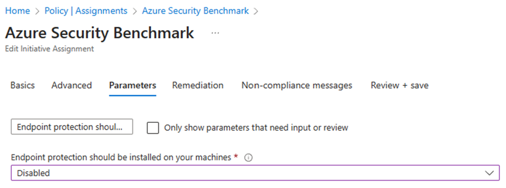
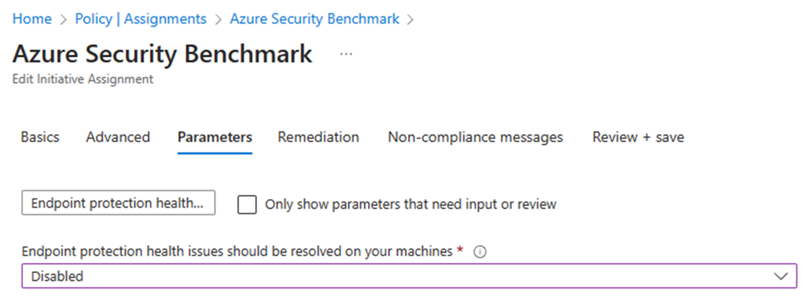

# 適用するポリシーの見直し（ポリシーの無効化）

Azure Security Benchmark を適切に運用していくにあたっては、時としてセキュリティポリシーを見直す必要があります。主な見直しポイントは 2 つあります。

## (自社にとって)そぐわないセキュリティポリシーの見直し

例えば以下の 2 つのセキュリティポリシーは、既定では有効化されているものの、今回のデモ環境の設計・運用にはそぐわないため、無効化すべきです。

- Auto provisioning of the Log Analytics agent should be enabled on your subscription (475aae12-b88a-4572-8b36-9b712b2b3a17)
  - Log Analytics Agent の自動プロビジョニング機能を有効化するように構成されているかをチェックするポリシーです。
  - 本デモの Landing Zone では、以下の前提条件で環境設計をしているため、このポリシーは無効化すべきです。
    - Azure Policy が勝手に運用環境を書き換えるようにはしない
    - そもそもルール違反が起きないように、VM 構築時点でエージェント一式をデプロイするようにスクリプトを構成している
    - 万が一ルールに適していない場合には、Audit ポリシーで発見した後、ユーザが手作業で是正する想定で設計している
- Audit usage of custom RBAC roles (a451c1ef-c6ca-483d-87ed-f49761e3ffb5)
  - カスタム RBAC ロールが利用されていた場合に警告するポリシーです。
  - カスタム RBAC ロールは正しく管理しないと破綻しやすいため、一般的にはあまり利用すべきでないとされています。しかし本デモでは、規制業界における適切な権限分掌を想定しているため、カスタム RBAC ロールを正しく設計・運用する想定をしています。このため、このポリシーは無効化すべきです。

## preview 段階のセキュリティポリシー

以下のような Preview 段階のセキュリティポリシーは、無効化しておいてもよいでしょう。

- [Preview]: Microsoft Defender for APIs should be enabled (7926a6d1-b268-4586-8197-e8ae90c877d7)

なお、MDfC, Azure Policy は、preview 段階のセキュリティポリシーに関して、「評価はするがセキュアスコアには組み込まない」という方針になっています。このため、ポリシーを無効化するのではなくそのままにしておき、GA 前に適切に対処いただく、という形にした方がよい場合もあります。この点は各社の実態に併せて運用方法を決めてください。

## MDfC 推奨事項の実装と Azure Policy の実装ズレ

比較的稀ですが、MDfC 推奨事項の実装と Azure Policy の実装ズレにより、「MDfC 推奨事項として Unhealthy が報告されないのに、Azure Policy では Non Compliant が報告される」という場合があります。~~というよりこれはバグな気がしなくも。。。~~　MDfC 推奨事項の Unhealthy が最も重要なため、そのまま放置しても構わないのですが、Azure Policy 側に Non-Compliant 項目が残っているのは気持ち悪い、という場合もあると思います。このような場合は、当該 Azure Policy を無効化してください。（具体例はこのページの末尾に書いてあります。）

## (自社にとって)厳しすぎるセキュリティポリシーの見直し

ガバナンスを適切に行うためには、安易に適用を免除しないことが極めて重要です。

Azure Security Benchmark は CIS をベースに作成されており、指摘している事項は相応に根拠・理由があります。このため、適用除外するにしても、Mitigated （軽減済み）なのか Waiver （免除）なのかをはっきりさせることが重要ですし、**特に本番環境では、原則として Waiver なし、とすることが重要**です。

**守れないルールやポリシーは実質的に機能していないのと同じです**。Waiver が多発するならルールを見直す必要がある（当該ルールを無効化する）ことも検討してください。


```bash

 
```

## （参考）MDfC 推奨事項の実装と Azure Policy の実装ズレ

下記の EDR 関連ポリシーは MDfC 側からデータが報告されないため、Azure Policy 側では not compliant 扱いになってしまいます。このため、割り当て時のパラメータを調整（Disabled 化）するとよいでしょう。

| MDfC 推奨事項 （日本語） | MDfC 推奨事項 （英語） | ID (Microsoft.Security/assessments) | Azure Policy （日本語） | Azure Policy （英語語） | ID |
| --- | --- | --- | --- | --- | --- |
| エンドポイント保護をマシンにインストールする必要がある | Endpoint protection should be installed on machines | 4fb67663-9ab9-475d-b026-8c544cced439 | エンドポイント保護をお使いのマシンにインストールする必要がある | Endpoint protection should be installed on your machines | 1f7c564c-0a90-4d44-b7e1-9d456cffaee8 |
| マシンのエンドポイント保護の正常性の問題を解決する必要がある | Endpoint protection health issues on machines should be resolved | 37a3689a-818e-4a0e-82ac-b1392b9bb000 | Endpoint Protection の正常性の問題を、お使いのコンピューターで解決する必要があります | Endpoint protection health issues should be resolved on your machines | 8e42c1f2-a2ab-49bc-994a-12bcd0dc4ac2 |

内容としては以下でカバーされています。(EPP = EDR + Update Management)

| MDfC 推奨事項 （日本語） | MDfC 推奨事項 （英語） | ID (Microsoft.Security/assessments) | Azure Policy （日本語） | Azure Policy （英語語） | ID |
| --- | --- | --- | --- | --- | --- |
| マシンには脆弱性評価ソリューションが必要 | Machines should have a vulnerability assessment solution | ffff0522-1e88-47fc-8382-2a80ba848f5d | 脆弱性評価ソリューションを仮想マシンで有効にする必要があります | A vulnerability assessment solution should be enabled on your virtual machines | 501541f7-f7e7-4cd6-868c-4190fdad3ac9 |
| マシンでは、脆弱性の検出結果が解決されている必要がある | Machines should have vulnerability findings resolved | 1195afff-c881-495e-9bc5-1486211ae03f |   |   |   |
| システム更新プログラムがマシンにインストールされている必要がある (Update Management センターを利用) | System updates should be installed on your machines (powered by Update management center) | e1145ab1-eb4f-43d8-911b-36ddf771d13f | [プレビュー]: システム更新プログラムがマシンにインストールされている必要がある (更新センターを利用) | [Preview]: System updates should be installed on your machines (powered by Update Center) | f85bf3e0-d513-442e-89c3-1784ad63382b |
| 不足しているシステム更新プログラムを定期的に確認するようにマシンを構成する必要がある | Machines should be configured to periodically check for missing system updates | 90386950-71ca-4357-a12e-486d1679427c | [プレビュー]: 不足しているシステム更新プログラムを定期的に確認するようにマシンを構成する必要がある | [Preview]: Machines should be configured to periodically check for missing system updates | bd876905-5b84-4f73-ab2d-2e7a7c4568d9 |

ASB 内部でのパラメータ名は以下の 2 つです。既定値では下方互換性のため AuditIfNotExist になっていますが、これらを Disabled にしていただくことで Azure Policy 側でのチェックを無効化（MDfC からのデータ取り込みを無視）できます。（カッコ内は日本語名）

- installEndpointProtectionMonitoringEffect （エンドポイント保護をお使いのマシンにインストールする必要がある）
- endpointProtectionHealthIssuesMonitoringEffect（Endpoint Protection の正常性の問題を、お使いのコンピューターで解決する必要があります）

  

  
