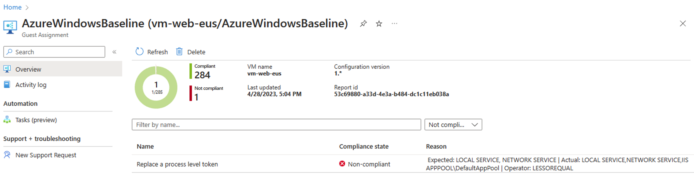
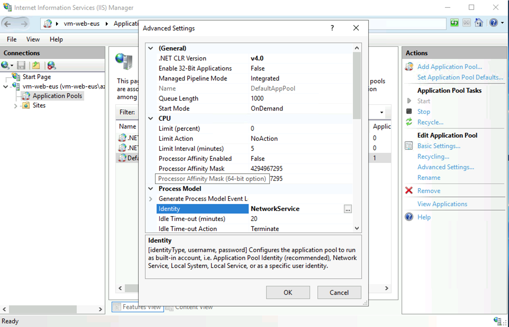

# 是正処理 : （参考）よくある是正サンプルスクリプト

```bash
 
■ NSG、UDR 設定漏れの修正
 
TEMP_VNET_NAME="vnet-spokebdmz-eus"
TEMP_NSG_NAME="${TEMP_VNET_NAME}-nsg"
TEMP_UDR_NAME="${TEMP_VNET_NAME}-udr"
TEMP_RG_NAME="rg-spokebdmz-eus"
TEMP_SUBNET_NAME="PrivateEndpointSubnet"
 
az network nsg create --name ${TEMP_NSG_NAME} --resource-group ${TEMP_RG_NAME}
az network route-table create --resource-group ${TEMP_RG_NAME} --name ${TEMP_UDR_NAME}
az network vnet subnet update --resource-group ${TEMP_RG_NAME} --route-table ${TEMP_UDR_NAME} --ids $(az network vnet subnet show --resource-group ${TEMP_RG_NAME} --vnet-name $TEMP_VNET_NAME --name ${TEMP_SUBNET_NAME} --query id -o tsv) --disable-private-endpoint-network-policies false
 
■ KeyVault のネットワークファイアウォールの有効化
 
TEMP_SUBSCRIPTION_ID="${SUBSCRIPTION_ID_SPOKE_A}"
TEMP_RG_NAME="rg-test"
TEMP_KV_NAME="kv-test-spokea"
 
az account set -s $TEMP_SUBSCRIPTION_ID
az keyvault update --name $TEMP_KV_NAME --resource-group $TEMP_RG_NAME --default-action Deny
 
■ Storage Account のネットワークファイアウォールの有効化
■ Blob へのパブリックアクセスを禁止
#[Preview]: Storage account public access should be disallowed
 
TEMP_SUBSCRIPTION_ID="${SUBSCRIPTION_ID_SPOKE_A}"
TEMP_RG_NAME="rg-test"
TEMP_STORAGE_NAME="testspokea"
 
az account set -s $TEMP_SUBSCRIPTION_ID
az storage account update --name ${TEMP_STORAGE_NAME} --resource-group $TEMP_RG_NAME --default-action Deny --allow-blob-public-access false
 
■ App Service の HTTP 通信を無効化し HTTPS のみにする
# App Service apps should only be accessible over HTTPS
 
TEMP_WEBAPP_NAME="webapp-spokeb-${UNIQUE_SUFFIX}-eus"
TEMP_RG_NAME="rg-spokeb-eus"
az account set -s "${SUBSCRIPTION_ID_SPOKE_B}"
 
az webapp update --https-only true --name "${TEMP_WEBAPP_NAME}" --resource-group "${TEMP_RG_NAME}"
 
■ IIS のワーカープロセスの動作アカウントを変更する
 
ワーカープロセス単位に割れているため修正が必要
 
Import-Module WebAdministration
Set-ItemProperty "IIS:\AppPools\DefaultAppPool" -name "processModel.identityType" -value "NetworkService"
（PowerShell が入っていないため GUI ツールから変更するとよい）
 

```



