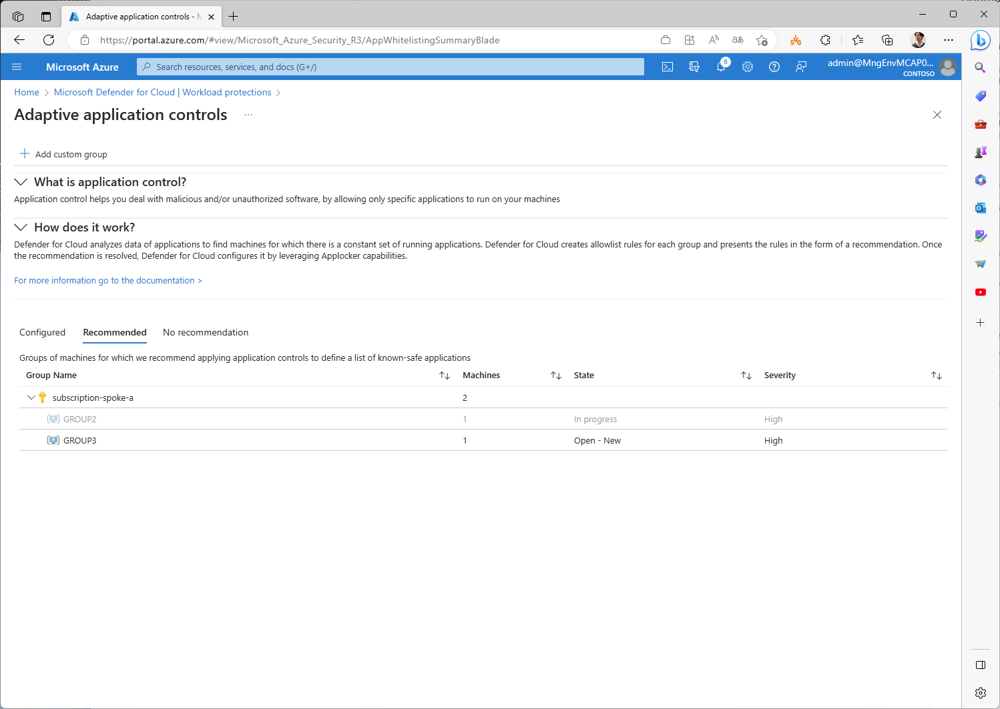
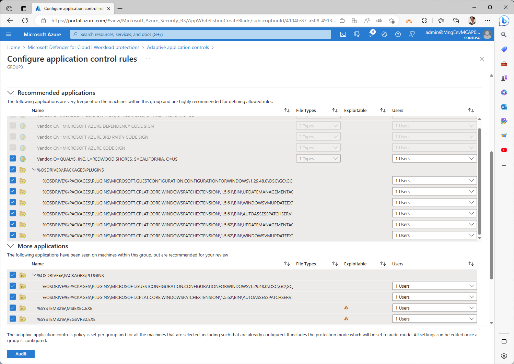

# （参考）是正や適用除外のサンプルスクリプト

**今回は利用しませんが**、よく利用されると思われる是正や適用除外のサンプルスクリプトをいくつか示します。必要な場合にカスタマイズしてご利用ください。

## 適用除外の例

### 作業アカウントに対する MFA の適用

```bash

# ■ MFA 適用を免除（※ テスト目的の場合のみ）
# Accounts with write permissions on Azure resources should be MFA enabled
# /providers/Microsoft.Authorization/policyDefinitions/931e118d-50a1-4457-a5e4-78550e086c52
# identityEnableMFAForWritePermissionsMonitoringEffect
# Accounts with owner permissions on Azure resources should be MFA enabled
# /providers/Microsoft.Authorization/policyDefinitions/e3e008c3-56b9-4133-8fd7-d3347377402a
# identityEnableMFAForOwnerPermissionsMonitoringNew
# MFA should be enabled on accounts with owner permissions on your subscription
# /providers/Microsoft.Authorization/policyDefinitions/aa633080-8b72-40c4-a2d7-d00c03e80bed
# identityEnableMFAForOwnerPermissionsMonitoring
# MFA should be enabled for accounts with write permissions on your subscription
# /providers/Microsoft.Authorization/policyDefinitions/9297c21d-2ed6-4474-b48f-163f75654ce3
# identityEnableMFAForWritePermissionsMonitoring
# Accounts with read permissions on Azure resources should be MFA enabled
# /providers/Microsoft.Authorization/policyDefinitions/81b3ccb4-e6e8-4e4a-8d05-5df25cd29fd4
# identityEnableMFAForReadPermissionsMonitoringNew
# MFA should be enabled on accounts with read permissions on your subscription
# /providers/Microsoft.Authorization/policyDefinitions/e3576e28-8b17-4677-84c3-db2990658d64
# identityEnableMFAForReadPermissionsMonitoring
# 以下 3 つのポリシーは 2023/05/04 の変更で除去されているので除外
#      "identityEnableMFAForOwnerPermissionsMonitoring",
#      "identityEnableMFAForWritePermissionsMonitoring",
#      "identityEnableMFAForReadPermissionsMonitoring",
 
cat > temp.json << EOF
{
  "properties": {
    "policyAssignmentId": "${TEMP_ASSIGNMENT_ID}",
    "policyDefinitionReferenceIds": [
      "identityEnableMFAForOwnerPermissionsMonitoringNew",   
      "identityEnableMFAForWritePermissionsMonitoringNew", 
      "identityEnableMFAForReadPermissionsMonitoringNew"
    ],
    "exemptionCategory": "Waiver",
    "displayName": "テスト目的での免除 - MFA を免除",
    "description": "テスト目的での免除 - MFA を免除"
  }
}
EOF
 
az rest --method PUT --uri "${TEMP_MG_TRG_ID}/providers/Microsoft.Authorization/policyExemptions/Test-MFA-Exemption?api-version=2022-07-01-preview" --body @temp.json

```

または以下のスクリプトを利用

```bash

# ■ MFA の適用除外（※ テスト目的の場合のみ）
# 特定アカウントのみ免除する場合は以下
for TEMP_SUBSCRIPTION_ID in $SUBSCRIPTION_IDS; do
 
TEMP_RESOURCE_ID="/subscriptions/${TEMP_SUBSCRIPTION_ID}"
 
for TEMP_POLICY_REF_ID in "identityEnableMFAForOwnerPermissionsMonitoring" "identityEnableMFAForOwnerPermissionsMonitoringNew" "identityEnableMFAForWritePermissionsMonitoring" "identityEnableMFAForWritePermissionsMonitoringEffect" "identityEnableMFAForReadPermissionsMonitoring" "identityEnableMFAForReadPermissionsMonitoringNew" ; do
 
TEMP_EXEMPTION_ID=$(uuidgen --sha1 --namespace @oid --name "${TEMP_RESOURCE_ID}_${TEMP_POLICY_REF_ID}_${TEMP_ASSIGNMENT_ID}")
az policy exemption create \
	--name "${TEMP_EXEMPTION_ID}" \
	--exemption-category Waiver \
	--policy-definition-reference-ids "${TEMP_POLICY_REF_ID}" \
	--scope ${TEMP_RESOURCE_ID} \
	--policy-assignment "${TEMP_ASSIGNMENT_ID}"
done
done

```

### Cloud Shell 用のストレージアカウントに対するセキュリティ適用免除

```bash
 
# ■ Cloud Shell 用のストレージに対するネットワークセキュリティ確保の適用免除
# Storage accounts should restrict network access using virtual network rules
# /providers/Microsoft.Authorization/policyDefinitions/2a1a9cdf-e04d-429a-8416-3bfb72a1b26f
# storageAccountsShouldRestrictNetworkAccessUsingVirtualNetworkRulesMonitoringEffect
# Storage accounts should use private link
# /providers/Microsoft.Authorization/policyDefinitions/6edd7eda-6dd8-40f7-810d-67160c639cd9
# storageAccountShouldUseAPrivateLinkConnectionMonitoringEffect
# [Preview]: Storage account public access should be disallowed
# /providers/Microsoft.Authorization/policyDefinitions/4fa4b6c0-31ca-4c0d-b10d-24b96f62a751
# StorageDisallowPublicAccess
# Storage accounts should restrict network access
# /providers/Microsoft.Authorization/policyDefinitions/34c877ad-507e-4c82-993e-3452a6e0ad3c
# disableUnrestrictedNetworkToStorageAccountMonitoring
 
TEMP_EXEMPTION_NAME="Test-Exemption-CloudShell"
cat > temp.json << EOF
{
  "properties": {
    "policyAssignmentId": "${TEMP_ASSIGNMENT_ID}",
    "policyDefinitionReferenceIds": [
      "storageAccountsShouldRestrictNetworkAccessUsingVirtualNetworkRulesMonitoringEffect",
      "storageAccountShouldUseAPrivateLinkConnectionMonitoringEffect",   
      "StorageDisallowPublicAccess",
      "disableUnrestrictedNetworkToStorageAccountMonitoring"
    ],
    "exemptionCategory": "Waiver",
    "displayName": "テスト目的での免除 - Cloud Shell の検査を免除",
    "description": "テスト目的での免除 - Cloud Shell の検査を免除",
    "metadata": {
      "reason": "テストのため"
    }
  }
}
EOF
 
# 以下は要修正
TEMP_RESOURCE_ID="/subscriptions/903c6183-3adc-4577-9114-b3fef417ff28/resourcegroups/cloud-shell-storage-southeastasia/providers/microsoft.storage/storageaccounts/cs11003200268ab0a3c"
az rest --method PUT --uri "${TEMP_RESOURCE_ID}/providers/Microsoft.Authorization/policyExemptions/${TEMP_EXEMPTION_NAME}?api-version=2022-07-01-preview" --body @temp.json

```

### エージェントの自動プロビジョニング機能の適用除外

```bash

# ■ エージェントの自動プロビジョニング機能の利用の適用を除外 (Mitigated)
# エージェントの自動配置は行わないため
# Auto provisioning of the Log Analytics agent should be enabled on your subscription
# /providers/Microsoft.Authorization/policyDefinitions/475aae12-b88a-4572-8b36-9b712b2b3a17
# autoProvisioningOfTheLogAnalyticsAgentShouldBeEnabledOnYourSubscriptionMonitoringEffect
 
TEMP_EXEMPTION_NAME="Exemption-MDfC-AgentAutoProvisioning"
cat > temp.json << EOF
{
  "properties": {
    "policyAssignmentId": "${TEMP_ASSIGNMENT_ID}",
    "policyDefinitionReferenceIds": [
      "autoProvisioningOfTheLogAnalyticsAgentShouldBeEnabledOnYourSubscriptionMonitoringEffect"
    ],
    "exemptionCategory": "Mitigated",
    "displayName": "エージェントの自動プロビジョニング機能の利用を除外 (Mitigated)",
    "description": "エージェントの自動配置は行わないため"
  }
}
EOF
 
for TEMP_RESOURCE_ID in $(az account subscription list --query [].id -o tsv); do
az rest --method PUT --uri "${TEMP_RESOURCE_ID}/providers/Microsoft.Authorization/policyExemptions/${TEMP_EXEMPTION_NAME}?api-version=2022-07-01-preview" --body @temp.json
done

```

### カスタムロールの Audit の除外

```bash

# ■ 作成しているカスタムロールを Audit 対象から除外 (Mitigated)
# 既定ではカスタムロールの作成そのものが Audit 対象になっているため。Mitigated を作成して承認済みであることを登録しておく
# ※ 下記スクリプトでは簡単のためにすべてのカスタムロールを一括で除外対象としたが、実際にはひとつずつ確認して除外すること
# ※ サブスクリプション単位の除外が必要 ⇒ Tenant Root Group レベルでカスタムロールを定義している場合、サブスクリプションが増えるつど設定が必要なため厄介。カスタムロールをフル活用する前提であれば、useRbacRulesMonitoringEffect を disabled にすることで対応。
# Audit usage of custom RBAC roles
# /providers/Microsoft.Authorization/policyDefinitions/a451c1ef-c6ca-483d-87ed-f49761e3ffb5
# useRbacRulesMonitoring
 
TEMP_EXEMPTION_NAME="Exemption-CustomRole"
cat > temp.json << EOF
{
  "properties": {
    "policyAssignmentId": "${TEMP_ASSIGNMENT_ID}",
    "policyDefinitionReferenceIds": [
      "useRbacRulesMonitoring"
    ],
    "exemptionCategory": "Mitigated",
    "displayName": "承認されたカスタム RBAC ロール",
    "description": "承認されたカスタム RBAC ロール"
  }
}
EOF

for TEMP_SUBSCRIPTION_ID in ${SUBSCRIPTION_IDS}; do
az account set -s ${TEMP_SUBSCRIPTION_ID}
 
for TEMP_RESOURCE_ID in $(az role definition list --custom-role-only true --query [].id -o tsv); do
 
az rest --method PUT --uri "${TEMP_RESOURCE_ID}/providers/Microsoft.Authorization/policyExemptions/${TEMP_EXEMPTION_NAME}?api-version=2022-07-01-preview" --body @temp.json
 
done # TEMP_RESOURCE_ID
done # TEMP_SUBSCRIPTION_ID
 

```

### Preview ポリシーの適用除外

```bash

# ■ ポリシーがまだ preview であるため audit 対象から除外
# 例）[Preview]: Microsoft Defender for APIs should be enabled
# /providers/Microsoft.Authorization/policyDefinitions/7926a6d1-b268-4586-8197-e8ae90c877d7
enableDefenderForApis
 
TEMP_EXEMPTION_NAME="Exemption-PreviewPolicy-enableDefenderForApis"
TEMP_EXPIRATION_DATETIME=$(date -u -d "+6 month" "+%Y-%m-%dT%H:%M:%SZ")
 
cat > temp.json << EOF
{
  "properties": {
    "policyAssignmentId": "${TEMP_ASSIGNMENT_ID}",
    "policyDefinitionReferenceIds": [
      "enableDefenderForApis"
    ],
    "exemptionCategory": "Waiver",
    "displayName": "現時点では Preview ポリシーのため適用を免除",
    "description": "現時点では Preview ポリシーのため適用を免除",
    "expiresOn": "${TEMP_EXPIRATION_DATETIME}"
  }
}
EOF
 
for TEMP_SUBSCRIPTION_ID in $(az account subscription list --query [].subscriptionId -o tsv); do
az account set -s ${TEMP_SUBSCRIPTION_ID}
 
TEMP_RESOURCE_ID="/subscriptions/${TEMP_SUBSCRIPTION_ID}"
az rest --method PUT --uri "${TEMP_RESOURCE_ID}/providers/Microsoft.Authorization/policyExemptions/${TEMP_EXEMPTION_NAME}?api-version=2022-07-01-preview" --body @temp.json
 
done # TEMP_SUBSCRIPTION_ID

```

### ADE 用の KeyVault に対するネットワークセキュリティ確保の適用除外

```bash

# ■ ADE 用の KeyVault に対するネットワークセキュリティ確保の適用除外 (Mitigated)
# 内部利用のため、プライベートエンドポイントの作成は不要
# Azure Key Vaults should use private link
# /providers/Microsoft.Authorization/policyDefinitions/a6abeaec-4d90-4a02-805f-6b26c4d3fbe9
# privateEndpointShouldBeConfiguredForKeyVaultMonitoringEffect

#TEMP_RESOURCE_IDS[1]="/subscriptions/4104fe87-a508-4913-813c-0a23748cd402/resourcegroups/rg-test/providers/microsoft.keyvault/vaults/kv-test-spokea"
#TEMP_RESOURCE_IDS[2]="/subscriptions/903c6183-3adc-4577-9114-b3fef417ff28/resourcegroups/rg-ops-eus/providers/microsoft.keyvault/vaults/kv-ops-ade-20299-eus"

TEMP_EXEMPTION_NAME="Exemption-ADEKeyVault"
cat > temp.json << EOF
{
  "properties": {
    "policyAssignmentId": "${TEMP_ASSIGNMENT_ID}",
    "policyDefinitionReferenceIds": [
      "privateEndpointShouldBeConfiguredForKeyVaultMonitoringEffect"
    ],
    "exemptionCategory": "Mitigated",
    "displayName": "ADE 用の KeyVault であるため適用を除外 (Mitigated)",
    "description": "ADE 用の KeyVault であるためプライベートエンドポイントの作成は不要"
  }
}
EOF

TEMP_RESOURCE_IDS=()
j=0
for i in ${VDC_NUMBERS}; do
TEMP_LOCATION_PREFIX=${LOCATION_PREFIXS[$i]}

TEMP_RG_NAME="rg-spokea-${TEMP_LOCATION_PREFIX}"
TEMP_ADE_KV_NAME="kv-spokea-ade-${UNIQUE_SUFFIX}-${TEMP_LOCATION_PREFIX}"
TEMP_RESOURCE_IDS[j]="/subscriptions/${SUBSCRIPTION_ID_SPOKE_A}/resourcegroups/${TEMP_RG_NAME}/providers/microsoft.keyvault/vaults/${TEMP_ADE_KV_NAME}"

j=`expr $j + 1`

TEMP_RG_NAME="rg-ops-${TEMP_LOCATION_PREFIX}"
TEMP_ADE_KV_NAME="kv-ops-ade-${UNIQUE_SUFFIX}-${TEMP_LOCATION_PREFIX}"
TEMP_RESOURCE_IDS[j]="/subscriptions/${SUBSCRIPTION_ID_MGMT}/resourcegroups/${TEMP_RG_NAME}/providers/microsoft.keyvault/vaults/${TEMP_ADE_KV_NAME}"
j=`expr $j + 1`

TEMP_RG_NAME="rg-hub-${TEMP_LOCATION_PREFIX}"
TEMP_ADE_KV_NAME="kv-hub-ade-${UNIQUE_SUFFIX}-${TEMP_LOCATION_PREFIX}"
TEMP_RESOURCE_IDS[j]="/subscriptions/${SUBSCRIPTION_ID_HUB}/resourcegroups/${TEMP_RG_NAME}/providers/microsoft.keyvault/vaults/${TEMP_ADE_KV_NAME}"
j=`expr $j + 1`

done

for TEMP_RESOURCE_ID in ${TEMP_RESOURCE_IDS[@]}; do
az rest --method PUT --uri "${TEMP_RESOURCE_ID}/providers/Microsoft.Authorization/policyExemptions/${TEMP_EXEMPTION_NAME}?api-version=2022-07-01-preview" --body @temp.json
done

```

### ADE を適用しているマシンへの Disk Encryption At Host の適用除外

```bash

# ■ ADE が適用されている VM に対する Host Encryption の適用を除外(Mitigated)

TEMP_EXEMPTION_NAME="Exemption-EncryptionAtHostLevelWithADE"
cat > temp.json << EOF
{
  "properties": {
    "policyAssignmentId": "${TEMP_ASSIGNMENT_ID}",
    "policyDefinitionReferenceIds": [
      "virtualMachinesAndVirtualMachineScaleSetsShouldHaveEncryptionAtHostEnabled"
    ],
    "exemptionCategory": "Mitigated",
    "displayName": "ADE が適用されている VM に対して EncryptionAtHost の適用を除外 (Mitigated)",
    "description": "ADE が適用されている場合は EncryptionAtHost の適用は不要"
  }
}
EOF
 
TEMP_RESOURCE_IDS=()
j=0
for TEMP_SUBSCRIPTION_ID in $SUBSCRIPTION_IDS; do
az account set -s $TEMP_SUBSCRIPTION_ID
for TEMP_VM_ID in $(az vm list --query [].id -o tsv); do
TEMP_ENC_STATE=$(az vm encryption show --ids $TEMP_VM_ID --query "disks[0].statuses[0].code" -o tsv)
if [[ $TEMP_ENC_STATE == "EncryptionState/encrypted" ]]; then
  echo $TEMP_VM_ID $TEMP_ENC_STATE
  TEMP_RESOURCE_IDS[j]=$TEMP_VM_ID
  j=`expr $j + 1`
fi
done #TEMP_VM_ID
done #TEMP_SUBSCRIPTION_ID

for TEMP_RESOURCE_ID in ${TEMP_RESOURCE_IDS[@]}; do
az rest --method PUT --uri "${TEMP_RESOURCE_ID}/providers/Microsoft.Authorization/policyExemptions/${TEMP_EXEMPTION_NAME}?api-version=2022-07-01-preview" --body @temp.json
done

```

### CSB の適用除外

- IIS, SQL などのミドルウェアをセットアップすると CSB 標準から外れる部分が出る場合があります。
- CSB の中の一部の項目のみ適用除外とするのが正しいですが、細かい設定ができないため、ここでは CSB をまるごと適用除外としています。

```bash

# ■ CSB の適用除外
# ミドルウェア（IIS, SQL Server など）による設定変更が CSB ルールに抵触するため除外
# Windows machines should meet requirements of the Azure compute security baseline
# /providers/Microsoft.Authorization/policyDefinitions/72650e9f-97bc-4b2a-ab5f-9781a9fcecbc
# windowsGuestConfigBaselinesMonitoring
 
TEMP_EXEMPTION_NAME="Exemption-CSB"
cat > temp.json << EOF
{
  "properties": {
    "policyAssignmentId": "${TEMP_ASSIGNMENT_ID}",
    "policyDefinitionReferenceIds": [
      "windowsGuestConfigBaselinesMonitoring"
    ],
    "exemptionCategory": "Waiver",
    "displayName": "ミドルウェア (IIS, SQL) が CSB に抵触するため適用を免除 (Waiver)",
    "description": "いったん CSB によるハードニングを行った上でミドルウェアをインストールしているため、他の項目については充足されている"
  }
}
EOF
 
for i in ${VDC_NUMBERS}; do
  TEMP_LOCATION_PREFIX=${LOCATION_PREFIXS[$i]}
 
TEMP_RESOURCE_ID="/subscriptions/${SUBSCRIPTION_ID_SPOKE_A}/resourcegroups/rg-spokea-${TEMP_LOCATION_PREFIX}/providers/microsoft.compute/virtualmachines/vm-db-${TEMP_LOCATION_PREFIX}"
 
az rest --method PUT --uri "${TEMP_RESOURCE_ID}/providers/Microsoft.Authorization/policyExemptions/${TEMP_EXEMPTION_NAME}?api-version=2022-07-01-preview" --body @temp.json
 
TEMP_RESOURCE_ID="/subscriptions/${SUBSCRIPTION_ID_SPOKE_A}/resourcegroups/rg-spokea-${TEMP_LOCATION_PREFIX}/providers/microsoft.compute/virtualmachines/vm-web-${TEMP_LOCATION_PREFIX}"
 
az rest --method PUT --uri "${TEMP_RESOURCE_ID}/providers/Microsoft.Authorization/policyExemptions/${TEMP_EXEMPTION_NAME}?api-version=2022-07-01-preview" --body @temp.json

done

```

### Cloud Shell で利用するストレージに対するセキュリティ強化ポリシー

- 現在ではエフェメラルセッション（永続ストレージを使わない方法）が提供されるようになったので、そちらを利用することを推奨します。

```bash

# ■ Cloud Shell ストレージアカウントへのセキュリティ強化ルールの適用除外 (Waiver)
 
TEMP_EXEMPTION_NAME="Exemption-StorageAccountForCloudShell"
cat > temp.json << EOF
{
  "properties": {
    "policyAssignmentId": "${TEMP_ASSIGNMENT_ID}",
    "policyDefinitionReferenceIds": [
      "storageAccountsShouldRestrictNetworkAccessUsingVirtualNetworkRulesMonitoringEffect",
      "storageAccountShouldUseAPrivateLinkConnectionMonitoringEffect",
      "storageAccountsShouldPreventSharedKeyAccess"
    ],
    "exemptionCategory": "Waiver",
    "displayName": "Cloud Shell ストレージアカウントへのセキュリティ強化ルールの適用除外 (Waiver)",
    "description": "PoC 環境のため"
  }
}
EOF

for TEMP_SUBSCRIPTION_ID in $SUBSCRIPTION_IDS; do
az account set -s $TEMP_SUBSCRIPTION_ID
for TEMP_RG_NAME in $(az group list --query "[?starts_with(name,'cloud-shell-storage-')].name" -o tsv); do
for TEMP_RESOURCE_ID in $(az storage account list --resource-group $TEMP_RG_NAME --query "[].id" -o tsv); do
echo $TEMP_RESOURCE_ID
az rest --method PUT --uri "${TEMP_RESOURCE_ID}/providers/Microsoft.Authorization/policyExemptions/${TEMP_EXEMPTION_NAME}?api-version=2022-07-01-preview" --body @temp.json

done #TEMP_STORAGE_ID
done #TEMP_RG_NAME
done #TEMP_SUBSCRIPTION_ID

```

### ADE 用の KeyVault に対する削除保護の適用免除 (テスト用)

```bash

# ■ ADE 用の KeyVault に対する削除保護の適用免除
# Key vaults should have deletion protection enabled
# /providers/Microsoft.Authorization/policyDefinitions/0b60c0b2-2dc2-4e1c-b5c9-abbed971de53
# keyVaultsShouldHavePurgeProtectionEnabledMonitoringEffect

TEMP_EXEMPTION_NAME="Test-Exemption-KeyVaultPurgeProtection"
cat > temp.json << EOF
{
  "properties": {
    "policyAssignmentId": "${TEMP_ASSIGNMENT_ID}",
    "policyDefinitionReferenceIds": [
      "keyVaultsShouldHavePurgeProtectionEnabledMonitoringEffect"
    ],
    "exemptionCategory": "Waiver",
    "displayName": "テスト目的での免除 - ADE 用の KeyVault に対する削除保護の適用免除",
    "description": "テスト目的での免除 - ADE 用の KeyVault に対する削除保護の適用免除"
  }
}
EOF

TEMP_RESOURCE_IDS=()
j=0
for i in ${VDC_NUMBERS}; do
TEMP_LOCATION_PREFIX=${LOCATION_PREFIXS[$i]}
TEMP_RG_NAME="rg-spokea-${TEMP_LOCATION_PREFIX}"
TEMP_ADE_KV_NAME="kv-spokea-ade-${UNIQUE_SUFFIX}-${TEMP_LOCATION_PREFIX}"
TEMP_RESOURCE_IDS[j]="/subscriptions/${SUBSCRIPTION_ID_SPOKE_A}/resourcegroups/${TEMP_RG_NAME}/providers/microsoft.keyvault/vaults/${TEMP_ADE_KV_NAME}"
j=`expr $j + 1`

TEMP_RG_NAME="rg-ops-${TEMP_LOCATION_PREFIX}"
TEMP_ADE_KV_NAME="kv-ops-ade-${UNIQUE_SUFFIX}-${TEMP_LOCATION_PREFIX}"
TEMP_RESOURCE_IDS[j]="/subscriptions/${SUBSCRIPTION_ID_MGMT}/resourcegroups/${TEMP_RG_NAME}/providers/microsoft.keyvault/vaults/${TEMP_ADE_KV_NAME}"
j=`expr $j + 1`

TEMP_RG_NAME="rg-hub-${TEMP_LOCATION_PREFIX}"
TEMP_ADE_KV_NAME="kv-hub-ade-${UNIQUE_SUFFIX}-${TEMP_LOCATION_PREFIX}"
TEMP_RESOURCE_IDS[j]="/subscriptions/${SUBSCRIPTION_ID_HUB}/resourcegroups/${TEMP_RG_NAME}/providers/microsoft.keyvault/vaults/${TEMP_ADE_KV_NAME}"
j=`expr $j + 1`

done

for TEMP_RESOURCE_ID in ${TEMP_RESOURCE_IDS[@]}; do
az rest --method PUT --uri "${TEMP_RESOURCE_ID}/providers/Microsoft.Authorization/policyExemptions/${TEMP_EXEMPTION_NAME}?api-version=2022-07-01-preview" --body @temp.json
done

```

## 是正処理の例

## NSG、UDR 設定漏れの修正

```bash
TEMP_VNET_NAME="vnet-spokebdmz-eus"
TEMP_NSG_NAME="${TEMP_VNET_NAME}-nsg"
TEMP_UDR_NAME="${TEMP_VNET_NAME}-udr"
TEMP_RG_NAME="rg-spokebdmz-eus"
TEMP_SUBNET_NAME="PrivateEndpointSubnet"
 
az network nsg create --name ${TEMP_NSG_NAME} --resource-group ${TEMP_RG_NAME}
az network route-table create --resource-group ${TEMP_RG_NAME} --name ${TEMP_UDR_NAME}
az network vnet subnet update --resource-group ${TEMP_RG_NAME} --route-table ${TEMP_UDR_NAME} --ids $(az network vnet subnet show --resource-group ${TEMP_RG_NAME} --vnet-name $TEMP_VNET_NAME --name ${TEMP_SUBNET_NAME} --query id -o tsv) --disable-private-endpoint-network-policies false
```

## KeyVault のネットワークファイアウォールの有効化

```bash
TEMP_SUBSCRIPTION_ID="${SUBSCRIPTION_ID_SPOKE_A}"
TEMP_RG_NAME="rg-test"
TEMP_KV_NAME="kv-test-spokea"
 
az account set -s $TEMP_SUBSCRIPTION_ID
az keyvault update --name $TEMP_KV_NAME --resource-group $TEMP_RG_NAME --default-action Deny
```

## Storage Account のネットワークファイアウォールの有効化

```bash
# Blob へのパブリックアクセスを禁止
# [Preview]: Storage account public access should be disallowed
 
TEMP_SUBSCRIPTION_ID="${SUBSCRIPTION_ID_SPOKE_A}"
TEMP_RG_NAME="rg-test"
TEMP_STORAGE_NAME="testspokea"
 
az account set -s $TEMP_SUBSCRIPTION_ID
az storage account update --name ${TEMP_STORAGE_NAME} --resource-group $TEMP_RG_NAME --default-action Deny --allow-blob-public-access false
```

## App Service の HTTP 通信を無効化し HTTPS のみにする

```bash
# App Service apps should only be accessible over HTTPS
 
TEMP_WEBAPP_NAME="webapp-spokeb-${UNIQUE_SUFFIX}-eus"
TEMP_RG_NAME="rg-spokeb-eus"
az account set -s "${SUBSCRIPTION_ID_SPOKE_B}"
 
az webapp update --https-only true --name "${TEMP_WEBAPP_NAME}" --resource-group "${TEMP_RG_NAME}"
```

## IIS のワーカープロセスの動作アカウントを変更する

ワーカープロセス単位に動作アカウントが異なることに注意。

```bash
Import-Module WebAdministration
Set-ItemProperty "IIS:\AppPools\DefaultAppPool" -name "processModel.identityType" -value "NetworkService"
```

PowerShell が入っていない場合は GUI ツールから直接変更してもよい。


## Adaptive Application Control

- 環境を1週間ほど放置しておくと、AAC (Adaptive Appliation Control) に関する警告が上がってくる
- アプリケーションの挙動を監視し、過去になかったアプリが起動してきていないかを確認するもの
- 推奨事項などに警告が上がったら適宜確認し、監査を行うようにする

  

  
```bash
# ■ ポリシーがまだ preview であるため audit 対象から除外
# 例）[Preview]: Microsoft Defender for APIs should be enabled
# /providers/Microsoft.Authorization/policyDefinitions/7926a6d1-b268-4586-8197-e8ae90c877d7

```

### MDE (TVM, EDR) の有効化 (Windows OS)

```bash

# ① MDE インストール
az vm extension set --vm-name "${TEMP_VM_NAME}" --resource-group ${TEMP_RG_NAME} --name "MDE.Windows"  --publisher "Microsoft.Azure.AzureDefenderForServers" --enable-auto-upgrade false --no-auto-upgrade-minor-version true --settings "{\"azureResourceId\":\"${TEMP_RESOURCE_ID}\", \"defenderForServersWorkspaceId\":\"${TEMP_SUBSCRIPTION_ID}\", \"vNextEnabled\":\"true\", \"forceReOnboarding\":true, \"provisionedBy\":\"Manual\" }" --protected-settings "{ \"defenderForEndpointOnboardingScript\":\"${TEMP_BASE64ENCODING_ONBOARDING_PACKAGE_WINDOWS}\"}"

# ② IaaSAntimalware インストール
cat <<EOF > tmp.json
{
    "\$schema": "https://schema.management.azure.com/schemas/2015-01-01/deploymentTemplate.json#",
    "contentVersion": "1.0.0.0",
    "resources": [
        {
            "name": "${TEMP_VM_NAME}/IaaSAntimalware",
            "type": "Microsoft.Compute/virtualMachines/extensions",
            "location": "${TEMP_LOCATION_NAME}",
            "apiVersion": "2015-06-15",
            "properties": {
                "publisher": "Microsoft.Azure.Security",
                "type": "IaaSAntimalware",
                "typeHandlerVersion": "1.3",
                "autoUpgradeMinorVersion": true,
                "settings": {
                    "AntimalwareEnabled": true,
                    "RealtimeProtectionEnabled": true,
                    "ScheduledScanSettings": {
                        "isEnabled": true,
                        "day": 7,
                        "time": 120,
                        "scanType": "Quick"
                    },
                    "Exclusions": {
                        "Extensions": "",
                        "Paths": "",
                        "Processes": ""
                    }
                }
            }
        }
    ]
}
EOF
if [ -z "$(az vm extension list --vm-name "${TEMP_VM_NAME}" --resource-group ${TEMP_RG_NAME} --query "[?name=='IaaSAntimalware']" -o tsv)" ]; then
  echo "Installing IaaSAntimalware to ${TEMP_VM_NAME}..."
az deployment group create --name "${TEMP_VM_NAME}_IaaSAntimalware" --resource-group "${TEMP_RG_NAME}" --template-file tmp.json
fi

```

### Update Management の有効化

```bash

az rest --method patch --url "https://management.azure.com/subscriptions/${TEMP_SUBSCRIPTION_ID}/resourceGroups/${TEMP_RG_NAME}/providers/Microsoft.Compute/virtualMachines/${TEMP_VM_NAME}?api-version=2021-03-01" --body "{ \"location\": \"${TEMP_LOCATION_NAME}\", \"properties\": { \"osProfile\": { \"windowsConfiguration\": { \"patchSettings\": { \"assessmentMode\": \"AutomaticByPlatform\", \"patchMode\": \"AutomaticByPlatform\" } } } } }"

# Windows Update を適用
az rest --method post --url "https://management.azure.com/subscriptions/${TEMP_SUBSCRIPTION_ID}/resourceGroups/${TEMP_RG_NAME}/providers/Microsoft.Compute/virtualMachines/${TEMP_VM_NAME}/installPatches?api-version=2022-03-01" --body "{ \"maximumDuration\": \"PT4H\", \"rebootSetting\": \"IfRequired\", \"windowsParameters\": { \"classificationsToInclude\": [ \"Critical\", \"Security\", \"UpdateRollUp\", \"FeaturePack\", \"ServicePack\", \"Definition\", \"Tools\", \"Updates\" ] }, \"linuxParameters\": { \"classificationsToInclude\": [ \"Critical\", \"Security\", \"Other\" ] } }"

```

### ADE の適用

```bash

az vm encryption enable --resource-group ${TEMP_RG_NAME} --name $TEMP_VM_NAME --disk-encryption-keyvault $TEMP_ADE_KV_NAME

```

### フローログの有効化

- NSG フローログを収集するようにシステムを構成します。
- NSG フローログの収集にはストレージアカウントが必要ですが、作成したストレージアカウントに対しても ASB によるチェックがかかります。

```bash

#####################################
# フローログの有効化

if ${FLAG_USE_SOD}; then if ${FLAG_USE_SOD_SP}; then TEMP_SP_NAME="sp_plat_dev"; az login --service-principal --username ${SP_APP_IDS[${TEMP_SP_NAME}]} --password "${SP_PWDS[${TEMP_SP_NAME}]}" --tenant ${PRIMARY_DOMAIN_NAME} --allow-no-subscriptions; else az account clear; az login -u "user_plat_dev@${PRIMARY_DOMAIN_NAME}" -p "${ADMIN_PASSWORD}"; fi; fi

# FlowLog 用ストレージアカウントの作成 (リージョン別)
az account set -s "${SUBSCRIPTION_ID_MGMT}"
for i in ${VDC_NUMBERS}; do
  TEMP_LOCATION_NAME=${LOCATION_NAMES[$i]}
  TEMP_LOCATION_PREFIX=${LOCATION_PREFIXS[$i]}
 
  TEMP_RG_NAME="rg-vdc-${TEMP_LOCATION_PREFIX}"
  TEMP_LAW_NAME="law-vdc-${TEMP_LOCATION_PREFIX}"
  TEMP_DCE_NAME="dce-vdc-${TEMP_LOCATION_PREFIX}"
  TEMP_FLOWLOG_STORAGE_NAME="stvdcfl${TEMP_LOCATION_PREFIX}${UNIQUE_SUFFIX}"
 
  az storage account create --name ${TEMP_FLOWLOG_STORAGE_NAME} --resource-group ${TEMP_RG_NAME} --location $TEMP_LOCATION_NAME --sku Standard_LRS --allow-blob-public-access false --public-network-access Disabled --default-action Deny --allow-shared-key-access false
done
 
if ${FLAG_USE_SOD}; then if ${FLAG_USE_SOD_SP}; then TEMP_SP_NAME="sp_nw_change"; az login --service-principal --username ${SP_APP_IDS[${TEMP_SP_NAME}]} --password "${SP_PWDS[${TEMP_SP_NAME}]}" --tenant ${PRIMARY_DOMAIN_NAME} --allow-no-subscriptions; else az account clear; az login -u "user_nw_change@${PRIMARY_DOMAIN_NAME}" -p "${ADMIN_PASSWORD}"; fi; fi
 
# FlowLog 設定
for i in ${VDC_NUMBERS}; do
  TEMP_LOCATION_NAME=${LOCATION_NAMES[$i]}
  TEMP_LOCATION_PREFIX=${LOCATION_PREFIXS[$i]}
 
  TEMP_RG_NAME="rg-vdc-${TEMP_LOCATION_PREFIX}"
  TEMP_LAW_NAME="law-vdc-${TEMP_LOCATION_PREFIX}"
  TEMP_FLOWLOG_STORAGE_NAME="stvdcfl${TEMP_LOCATION_PREFIX}${UNIQUE_SUFFIX}"
 
TEMP_LAW_RESOURCE_ID="/subscriptions/${SUBSCRIPTION_ID_MGMT}/resourcegroups/${TEMP_RG_NAME}/providers/microsoft.operationalinsights/workspaces/${TEMP_LAW_NAME}"
TEMP_FLOWLOG_STORAGE_RESOURCE_ID="/subscriptions/${SUBSCRIPTION_ID_MGMT}/resourceGroups/${TEMP_RG_NAME}/providers/Microsoft.Storage/storageAccounts/${TEMP_FLOWLOG_STORAGE_NAME}"
 
# 各リージョン内の NIC を上記ストレージと LAW に入れる
for TEMP_SUBSCRIPTION_ID in $SUBSCRIPTION_IDS; do
 
az account set -s $TEMP_SUBSCRIPTION_ID
 
# NSG を検索して NSG フローログを有効化
for TEMP_NSG_ID in $(az resource list --query "[?type == 'Microsoft.Network/networkSecurityGroups' && location == '${TEMP_LOCATION_NAME}'].id" -o tsv); do
  echo $TEMP_NSG_ID
  TEMP=(${TEMP_NSG_ID//\// })
  TEMP_RG_NAME=${TEMP[3]}
  TEMP_NSG_NAME=${TEMP[7]}
  echo $TEMP_RG_NAME $TEMP_NSG_NAME
  az network watcher flow-log create --location ${TEMP_LOCATION_NAME} --name ${TEMP_NSG_NAME} --nsg ${TEMP_NSG_ID} --workspace ${TEMP_LAW_RESOURCE_ID} --storage-account ${TEMP_FLOWLOG_STORAGE_RESOURCE_ID}  --traffic-analytics true --interval 10
done # TEMP_NSG_ID
 
done # TEMP_SUBSCRIPTION_ID
done # VDC
 
# フローログは同一リージョンの LAW に対してしかデータ送信できない

```

### フローログ保存用のストレージに対するネットワークセキュリティ確保

```bash

# ■ フローログ保存用のストレージに対するネットワークセキュリティ確保の適用除外 (Mitigated)
# 内部利用のため、プライベートエンドポイントの作成は不要
# Storage accounts should use private link
# /providers/Microsoft.Authorization/policyDefinitions/6edd7eda-6dd8-40f7-810d-67160c639cd9
# storageAccountShouldUseAPrivateLinkConnectionMonitoringEffect
 
TEMP_EXEMPTION_NAME="Exemption-FlowLogStorage"
cat > temp.json << EOF
{
  "properties": {
    "policyAssignmentId": "${TEMP_ASSIGNMENT_ID}",
    "policyDefinitionReferenceIds": [
      "storageAccountShouldUseAPrivateLinkConnectionMonitoringEffect"
    ],
    "exemptionCategory": "Mitigated",
    "displayName": "フローログ用のストレージであるためプライベートエンドポイントの作成を除外 (Mitigated)",
    "description": "フローログ用のストレージであるためプライベートエンドポイントの作成は不要"
  }
}
EOF
 
for i in ${VDC_NUMBERS}; do
  TEMP_LOCATION_PREFIX=${LOCATION_PREFIXS[$i]}
  TEMP_RG_NAME="rg-vdc-${TEMP_LOCATION_PREFIX}"
  TEMP_FLOWLOG_STORAGE_NAME="stvdcfl${TEMP_LOCATION_PREFIX}${UNIQUE_SUFFIX}"
 
TEMP_RESOURCE_ID="/subscriptions/${SUBSCRIPTION_ID_MGMT}/resourcegroups/${TEMP_RG_NAME}/providers/microsoft.storage/storageaccounts/${TEMP_FLOWLOG_STORAGE_NAME}"
 
az rest --method PUT --uri "${TEMP_RESOURCE_ID}/providers/Microsoft.Authorization/policyExemptions/${TEMP_EXEMPTION_NAME}?api-version=2022-07-01-preview" --body @temp.json
done

```

### Application Gateway v2 に割り当てられている Subnet への NSG 適用ルールの除外

※ 現在では Application Gateway v2 の Subnet に NSG 割り当てができるようになっています。このため NSG を適用することを推奨します。
 
```bash

# ■ Application Gateway v2 に割り当てられている Subnet には NSG が付与できないため NSG 適用ルールを除外 (Mitigated)
# Subnets should be associated with a Network Security Group
# e71308d3-144b-4262-b144-efdc3cc90517

TEMP_EXEMPTION_NAME="Exemption-NSGonAppGatewaySubnet"
cat > temp.json << EOF
{
  "properties": {
    "policyAssignmentId": "${TEMP_ASSIGNMENT_ID}",
    "policyDefinitionReferenceIds": [
      "networkSecurityGroupsOnSubnetsMonitoring"
    ],
    "exemptionCategory": "Mitigated",
    "displayName": "Application Gateway が利用するサブネットへの NSG 適用の除外 (Mitigated)",
    "description": "Application Gateway が利用するサブネットには NSG が適用できないため"
  }
}
EOF
 
TEMP_RESOURCE_IDS=()
j=0
for i in ${VDC_NUMBERS}; do
  TEMP_LOCATION_PREFIX=${LOCATION_PREFIXS[$i]}
TEMP_RG_NAME="rg-spokebdmz-${TEMP_LOCATION_PREFIX}"
TEMP_VNET_NAME="vnet-spokebdmz-${TEMP_LOCATION_PREFIX}"
 
TEMP_RESOURCE_IDS[j]="/subscriptions/${SUBSCRIPTION_ID_SPOKE_B}/resourcegroups/${TEMP_RG_NAME}/providers/microsoft.network/virtualnetworks/${TEMP_VNET_NAME}/subnets/dmzsubnet"
j=`expr $j + 1`
done
 
for TEMP_RESOURCE_ID in ${TEMP_RESOURCE_IDS[@]}; do
az rest --method PUT --uri "${TEMP_RESOURCE_ID}/providers/Microsoft.Authorization/policyExemptions/${TEMP_EXEMPTION_NAME}?api-version=2022-07-01-preview" --body @temp.json
done

```

### Application Gateway v2 にシステム的に割り当てられた NSG の診断ログ出力設定を除外

```bash

# ■ Application Gateway v2 にシステム的に割り当てられた NSG の診断ログ出力設定を除外 (Mitigated)

TEMP_EXEMPTION_NAME="Exemption-DiagnosticsSettingsForNSGonAppGatewaySubnet"
cat > temp.json << EOF
{
  "properties": {
    "policyAssignmentId": "/providers/Microsoft.Management/managementGroups/landingzones/providers/Microsoft.Authorization/policyAssignments/custom-check-lz",
    "policyDefinitionReferenceIds": [
      "custom-policy-check-monitoring-diagnostic-logs-enabled"
    ],
    "exemptionCategory": "Mitigated",
    "displayName": "Application Gateway v2 にシステム的に割り当てられた NSG の診断ログ出力設定を除外 (Mitigated)",
    "description": "AppGateway が利用する NSG はシステム的に管理されているため"
  }
}
EOF
 
TEMP_RESOURCE_IDS=()
j=0
for i in ${VDC_NUMBERS}; do
  TEMP_LOCATION_PREFIX=${LOCATION_PREFIXS[$i]}
  TEMP_LOCATION_NAME=${LOCATION_NAMES[$i]}
TEMP_RG_NAME="rg-spokebdmz-${TEMP_LOCATION_PREFIX}"
TEMP_NSG_NAME="vnet-spokebdmz-${TEMP_LOCATION_PREFIX}-DmzSubnet-nsg-${TEMP_LOCATION_NAME}"

if [ -z $(az network nsg list --resource-group $TEMP_RG_NAME --subscription ${SUBSCRIPTION_ID_SPOKE_B} --query "[? name == \"${TEMP_NSG_NAME}\" ]" -o tsv
) ]; then
  echo "NSG が存在しないため処理を行いません。"
else
  echo "NSG が存在するので処理します。"
TEMP_RESOURCE_IDS[j]="/subscriptions/${SUBSCRIPTION_ID_SPOKE_B}/resourcegroups/${TEMP_RG_NAME}/providers/microsoft.network/networksecuritygroups/${TEMP_NSG_NAME}"
j=`expr $j + 1`
fi

done
 
for TEMP_RESOURCE_ID in ${TEMP_RESOURCE_IDS[@]}; do
az rest --method PUT --uri "${TEMP_RESOURCE_ID}/providers/Microsoft.Authorization/policyExemptions/${TEMP_EXEMPTION_NAME}?api-version=2022-07-01-preview" --body @temp.json
done

```

### Private Endpoint サブネットへの UDR 適用の除外

※ 現在では Private Endpoint を作成するサブネットへも NSG, UDR の適用が可能になりました。このため、NSG, UDR の適用を行うことを推奨します。

```bash
# ■ Private Endpoint サブネットへの UDR 適用除外 (Mitigated)
# （カスタムポリシー用）
 
TEMP_EXEMPTION_NAME="Exemption-UDRonPrivateEndpointSubnet"
cat > temp.json << EOF
{
  "properties": {
    "policyAssignmentId": "/providers/Microsoft.Management/managementGroups/landingzones/providers/Microsoft.Authorization/policyAssignments/custom-check-lz",
    "policyDefinitionReferenceIds": [
      "custom-policy-check-network-subnet-with-udr"
    ],
    "exemptionCategory": "Mitigated",
    "displayName": "Private Endpoint サブネットへの UDR 適用除外 (Mitigated)",
    "description": "Private Endpoint サブネットからの outbound 通信は通常存在しないため。"
  }
}
EOF

TEMP_RESOURCE_IDS=()
j=0
for i in ${VDC_NUMBERS}; do
  TEMP_LOCATION_PREFIX=${LOCATION_PREFIXS[$i]}
TEMP_RG_NAME="rg-spokeb-${TEMP_LOCATION_PREFIX}"
TEMP_VNET_NAME="vnet-spokeb-${TEMP_LOCATION_PREFIX}"
 
TEMP_RESOURCE_IDS[j]="/subscriptions/${SUBSCRIPTION_ID_SPOKE_B}/resourcegroups/${TEMP_RG_NAME}/providers/Microsoft.Network/virtualNetworks/${TEMP_VNET_NAME}"
j=`expr $j + 1`
done
 
for TEMP_RESOURCE_ID in ${TEMP_RESOURCE_IDS[@]}; do
az rest --method PUT --uri "${TEMP_RESOURCE_ID}/providers/Microsoft.Authorization/policyExemptions/${TEMP_EXEMPTION_NAME}?api-version=2022-07-01-preview" --body @temp.json
done

```

### IaaS SQL VM 関連の脆弱性対策

```bash

# ■ サンプルアプリのため、IaaS SQL VM 関連のセキュリティ対策を免除
# ★ SQL VM がインストールされていない PC に対しても non-compliant が出てしまうので何かしら不具合がある可能性がある
 
# SQL servers on machines should have vulnerability findings resolved
# /providers/Microsoft.Authorization/policyDefinitions/6ba6d016-e7c3-4842-b8f2-4992ebc0d72d
# serverSqlDbVulnerabilityAssesmentMonitoring
 
TEMP_EXEMPTION_NAME="Test-Exemption-SQLDBVulnerabilityAssessment"
cat > temp.json << EOF
{
  "properties": {
    "policyAssignmentId": "${TEMP_ASSIGNMENT_ID}",
    "policyDefinitionReferenceIds": [
      "serverSqlDbVulnerabilityAssesmentMonitoring"
    ],
    "exemptionCategory": "Waiver",
    "displayName": "テスト目的での免除 - IaaS SQL VM の構成脆弱性排除の適用免除",
    "description": "テスト目的での免除 - IaaS SQL VM の構成脆弱性排除"
  }
}
EOF
 
TEMP_RESOURCE_IDS=()
j=0
for i in ${VDC_NUMBERS}; do
  TEMP_LOCATION_PREFIX=${LOCATION_PREFIXS[$i]}
 
TEMP_RESOURCE_IDS[j]="/subscriptions/${SUBSCRIPTION_ID_SPOKE_A}/resourcegroups/rg-spokea-${TEMP_LOCATION_PREFIX}/providers/microsoft.compute/virtualmachines/vm-db-${TEMP_LOCATION_PREFIX}"
j=`expr $j + 1`
TEMP_RESOURCE_IDS[j]="/subscriptions/${SUBSCRIPTION_ID_SPOKE_A}/resourcegroups/rg-spokea-${TEMP_LOCATION_PREFIX}/providers/microsoft.compute/virtualmachines/vm-web-${TEMP_LOCATION_PREFIX}"
j=`expr $j + 1`
TEMP_RESOURCE_IDS[j]="/subscriptions/${SUBSCRIPTION_ID_MGMT}/resourcegroups/rg-ops-${TEMP_LOCATION_PREFIX}/providers/microsoft.compute/virtualmachines/vm-ops-${TEMP_LOCATION_PREFIX}"
j=`expr $j + 1`
TEMP_RESOURCE_IDS[j]="/subscriptions/${SUBSCRIPTION_ID_HUB}/resourcegroups/rg-hub-${TEMP_LOCATION_PREFIX}/providers/microsoft.compute/virtualmachines/vm-usr-${TEMP_LOCATION_PREFIX}"
j=`expr $j + 1`
done
 
for TEMP_RESOURCE_ID in ${TEMP_RESOURCE_IDS[@]}; do
az rest --method PUT --uri "${TEMP_RESOURCE_ID}/providers/Microsoft.Authorization/policyExemptions/${TEMP_EXEMPTION_NAME}?api-version=2022-07-01-preview" --body @temp.json
done

```

### CSB の適用除外

- vm-mtn-xxx マシンは最初に CSB によりハードニングを行いましたが、その後、WSL などのツールのセットアップにより CSB 基準を満たせなくなることがあります。（また、場合によってはこれらのツールが CSB と干渉してうまくモニタリングできなくなる場合もあります）
- 初回の CSB ハードニングにより一定のセキュリティは達成されたと考えて、ここでは CSB を適用除外とします。

```bash

# 業務システム統制チーム／③ 構成変更の作業アカウントに切り替え
if ${FLAG_USE_SOD}; then if ${FLAG_USE_SOD_SP}; then TEMP_SP_NAME="sp_gov_change"; az login --service-principal --username ${SP_APP_IDS[${TEMP_SP_NAME}]} --password "${SP_PWDS[${TEMP_SP_NAME}]}" --tenant ${PRIMARY_DOMAIN_NAME} --allow-no-subscriptions; else az account clear; az login -u "user_gov_change@${PRIMARY_DOMAIN_NAME}" -p "${ADMIN_PASSWORD}"; fi; fi

# ■ 以下は全体に共通
TEMP_MG_TRG_ID=$(az account management-group list --query "[?displayName=='Tenant Root Group'].id" -o tsv)
TEMP_ASSIGNMENT_ID=$(az policy assignment list --scope $TEMP_MG_TRG_ID --query "[? displayName == 'Microsoft Cloud Security Benchmark'].id" -o tsv)

# ■ CSB の適用除外
# Windows machines should meet requirements of the Azure compute security baseline
# /providers/Microsoft.Authorization/policyDefinitions/72650e9f-97bc-4b2a-ab5f-9781a9fcecbc
# windowsGuestConfigBaselinesMonitoring
 
TEMP_EXEMPTION_NAME="Exemption-CSB"
cat > temp.json << EOF
{
  "properties": {
    "policyAssignmentId": "${TEMP_ASSIGNMENT_ID}",
    "policyDefinitionReferenceIds": [
      "windowsGuestConfigBaselinesMonitoring"
    ],
    "exemptionCategory": "Waiver",
    "displayName": "VM に対する CSB を免除 (Waiver)",
    "description": "WSL などの追加インストールにより CSB が Non-compliant を報告する、またはエラーを通知するため"
  }
}
EOF
 
for i in ${VDC_NUMBERS}; do
TEMP_LOCATION_PREFIX=${LOCATION_PREFIXS[$i]}
TEMP_RESOURCE_ID="/subscriptions/${SUBSCRIPTION_ID_SPOKE_F}/resourcegroups/rg-spokefmtn-${TEMP_LOCATION_PREFIX}/providers/microsoft.compute/virtualmachines/vm-mtn-${TEMP_LOCATION_PREFIX}"
az rest --method PUT --uri "${TEMP_RESOURCE_ID}/providers/Microsoft.Authorization/policyExemptions/${TEMP_EXEMPTION_NAME}?api-version=2022-07-01-preview" --body @temp.json
done

```
