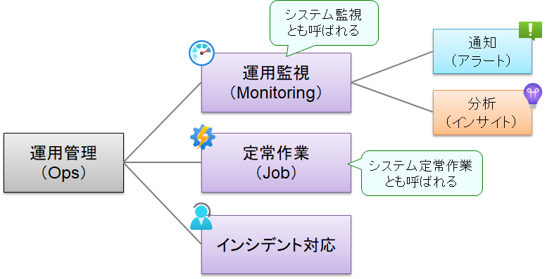
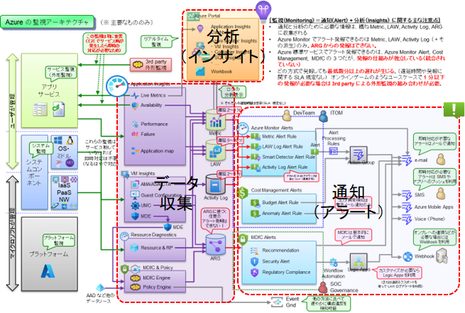
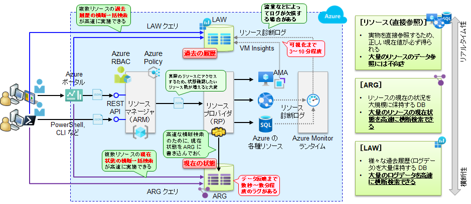
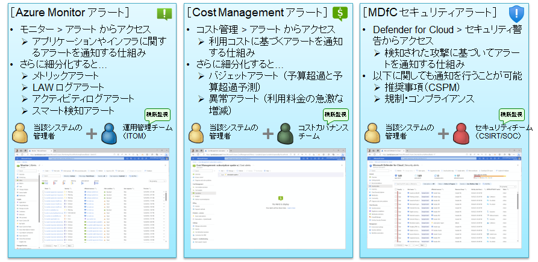
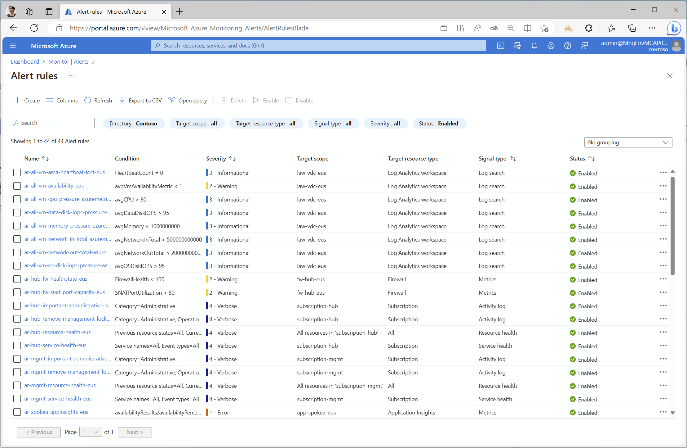
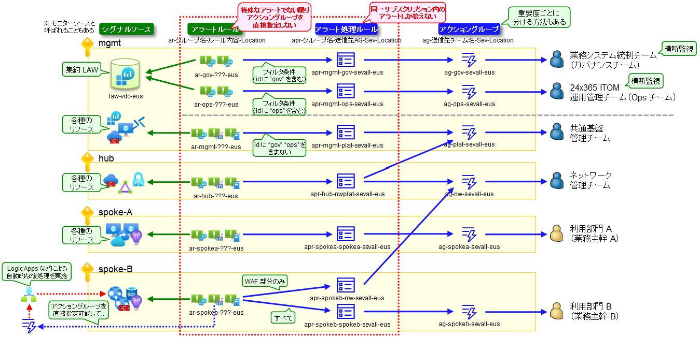

# 運用監視（モニタリング）の全体設計

## 本デモでの取り扱い範囲について

本セクションでは、運用管理作業のうち、運用監視部分についての構築方法を示します。

  

## Azure の運用監視（モニタリング）について

大雑把に言うと、Azure の運用監視（モニタリング）は、以下の 3 つの機能から構成されています。これらを相称して「モニタリング」と呼んでいます。

- データ収集機能 (ログ収集・メトリック収集)
- 通知機能 (アラート)
- 分析機能 (インサイト)
  
全体アーキテクチャを下図に示します。大まかなポイントとして、以下を押さえておいてください。

- 様々なデータソースからの情報が、以下のデータストアに収集・格納される
  - Metrics ストア : 性能データ（数値データ）を格納
  - LAW (Log Analytics Workspace) : ログデータ（文字データ）を格納
  - アクティビティログ : Azure の操作ログを格納
  - ARG (Azure Resource Graph) : Azure リソースの現在の状態を格納
- これらが通知と分析に利用される

  

## ARM, ARG, LAW の特性の違いについて

監視技術を理解する上で重要なのが、ARM, ARG, LAW の特性の違いを理解することです。

- ARG （Azure Resource Graph） : リソースの「現在状態」を保持する DB
- LAW （Log Analytics Workspace） : 各種のログ（過去の履歴）を保持する DB
- リソースそのものを直接呼び出す ARM REST API と比べた場合、いずれも横断検索が高速な一方で、状態反映やログの可視化までに一定のタイムラグが発生する

  

このため、ARG, LAW には以下のような特性が生じます。監視を設計する際には、このような特性の違いを意識する必要があります。

- データ可視化までのタイムラグ
  - ARG, LAW ともにタイムラグがある
    - リソース直接参照 < ARG < LAW
    - 大量データの処理やインデックス付けなどのため、データ可視化までに時間を要する
  - タイムラグの度合いはケースバイケース
    - ARG の場合、数 10 秒～数分程度
    - LAW の場合、数分～数 10 分程度（※ 初期設定時はさらにかかる場合も）
    - いずれもタイムラグに関する SLA の規定はない
- データの欠損
  - ARG, LAW には欠損やずれの可能性がある
    - ARG : プッシュ型でデータを書き込むため、書き込み失敗時にデータずれが発生する
    - LAW : スロットリング制限などに抵触した場合、ログが欠損する場合がある
  - このため、いずれも利用上の注意が必要
    - ARG : 素早い横断検索の目的で利用、正確な情報取得にはリソースを直接参照する
    - LAW : 業務的な監査や、エンドユーザ向けの課金根拠などの目的には利用しない
- ARG に含まれる履歴情報
  - ARG には、一部だが履歴情報が含まれる
    - セキュリティ警告、リソース更新履歴など
    - これらは「過去のイベント」の情報なので本来は LAW に保存すべきだが…
    - LAW に保存する場合は別途構成が必要 → 取り扱いが面倒になる
  - このため、こうした履歴情報は利便性のために ARG 上に保存されている
    - 長期保存を目的としたものではないことに注意
- ARG のメンテナンス（データの更新）
  - ARG はリソースプロバイダが更新している
    - リソースプロバイダからのプッシュによりデータが更新され、最新情報を保っている
    - どのような情報をプッシュするかはリソースプロバイダごとに異なっている
  - このため、以下の点に注意が必要
    - ARG からリソースに関するすべての情報を取得できるわけではない
    - 障害により、ARG と実リソースの情報に乖離が発生する場合がある

## アラート（通知）について

Azure には以下 3 種類のアラートが存在しており、これらは統合されておらず、利用するツールも個別に用意されています。利用者もそれぞれ異なりますので、これらのアラートは適切な使い分けが必要になります。

  

これらのアラートの中で、システム監視の観点で最も重要なのは Azure Monitor アラートです。本デモでは特に Azure Monitor アラートの使い方を解説します。

なお、方式ごとにアラートできる内容とタイムラグが異なりますが、いずれの方式でも秒単位でのアラート発報はできません。また、これらの通知および遅延（ラグ）に関する SLA はなく、通知項目によって遅延（ラグ）も大きく変わります。

## Azure Monitor アラートのアーキテクチャについて

Azure Monitor のアラートは、アラートルール、アラート処理ルール、アクショングループの 3 つの組み合わせにより実現されます。実際のシステムでは、膨大な数のアラートルールを管理することになるため、アラートルール、アラート処理ルール、アクショングループの 3 つを適切に設計しないと、容易に管理が破綻します。

  

設計の要点は以下の 3 つです。

- アラートルールは各サブスクリプションに作成
- アラートルールにアクショングループを直接紐づけない
- 通知先の制御はアラート処理ルールで行う

また設計制約として以下の 2 つがあります。

- アラート処理ルールで収集可能なアラートは、アラート処理ルールを作成するサブスクリプション内のもののみ。
- アラート処理ルールで、他のサブスクリプションからのアラートを集めることはできない。このため、アラートやサブスクリプションに対してアラート処理ルールを作成する。

これらを加味して、本デモでは以下のように全体設計しています。（※ 命名規約も図中に示しています。）

  
