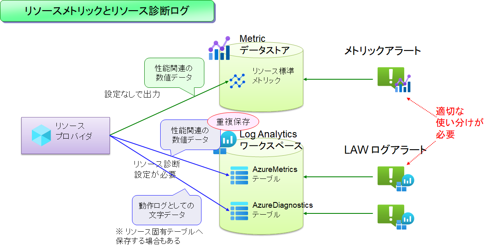

# アラートルールの作成 : 横断監視アラートルール

複数のリソースを一括で監視するためのアラートルールを作成します。

- 一般論として、「横断監視には Log Analytics Workspace を利用する」という方針を知っておいてください。
  - 例えば CPU やメモリなどの監視を行いたい場合、単一サーバ・単一リソースであれば、メトリクスストアに出力されている情報を元に監視を行うことができます。しかしメトリクスアラートは横断監視が苦手で、特定のメトリクスしか複数リソースの同時監視ができない、仮にできたとしても複数サブスクリプションにまたがる監視はできない、など複数の制約があります。
  - このような場合には、メトリックデータを Log Analytics Workspace に送信・保存しておき、これに対してアラート（ログアラート）を仕掛けます。LAW であれば、クエリの記述の工夫により横断監視が比較的容易に実現できます。

  

- 横断監視を LAW で行う方式の難点は、可視化までのタイムラグがメトリクス（1～数分程度）に比べて遅い（数分～数十分）、という点です。
  - このため、LAW ログクエリを利用した横断監視を全体に仕掛けておき...
  - 速やかなアラート通知が重要な場所に絞って、メトリクスアラートを仕掛ける、といった方法を取ることを検討するとよいでしょう。

```bash

# 業務システム統制チーム／③ 構成変更の作業アカウントに切り替え
if ${FLAG_USE_SOD}; then if ${FLAG_USE_SOD_SP}; then TEMP_SP_NAME="sp_gov_change"; az login --service-principal --username ${SP_APP_IDS[${TEMP_SP_NAME}]} --password '${SP_PWDS[${TEMP_SP_NAME}]}' --tenant ${PRIMARY_DOMAIN_NAME} --allow-no-subscriptions; else az account clear; az login -u "user_gov_change@${PRIMARY_DOMAIN_NAME}" -p "${ADMIN_PASSWORD}"; fi; fi
 
# ■ （横断監視）AppInsights の可用性ダウン
 
for i in ${VDC_NUMBERS}; do
TEMP_LOCATION_NAME=${LOCATION_NAMES[$i]}
TEMP_LOCATION_PREFIX=${LOCATION_PREFIXS[$i]}
 
TEMP_AR_NAME="ar-ops-appinsights-availabilitytest-${TEMP_LOCATION_PREFIX}"
TEMP_AR_ID="/subscriptions/${SUBSCRIPTION_ID_MGMT}/resourceGroups/rg-monitor-${TEMP_LOCATION_PREFIX}/providers/Microsoft.Insights/scheduledQueryRules/${TEMP_AR_NAME}"
cat > temp.json << EOF
{
    "location": "${TEMP_LOCATION_NAME}",
    "tags": {},
    "properties": {
        "displayName": "ar-all-appinsights-availabilitytest",
        "description": "AppInsights 可用性テストが 90% を下回った",
        "severity": 1,
        "enabled": true,
        "evaluationFrequency": "PT5M",
        "scopes": [
            "/subscriptions/${SUBSCRIPTION_ID_MGMT}/resourceGroups/rg-vdc-${TEMP_LOCATION_PREFIX}/providers/Microsoft.OperationalInsights/workspaces/law-vdc-${TEMP_LOCATION_PREFIX}"
        ],
        "targetResourceTypes": [
            "Microsoft.OperationalInsights/workspaces"
        ],
        "windowSize": "PT5M",
        "criteria": {
            "allOf": [
                {
                    "query": "AppAvailabilityResults\n| summarize total = count(), success = sumif(1, Success == true) by _ResourceId, Name, bin(TimeGenerated, 5m)\n| extend successRate = success * 1.0 / total * 100\n| project TimeGenerated, _ResourceId, Name, successRate\n\n",
                    "timeAggregation": "Average",
                    "metricMeasureColumn": "successRate",
                    "dimensions": [],
                    "resourceIdColumn": "_ResourceId",
                    "operator": "LessThan",
                    "threshold": 90,
                    "failingPeriods": {
                        "numberOfEvaluationPeriods": 1,
                        "minFailingPeriodsToAlert": 1
                    }
                }
            ]
        },
        "autoMitigate": true
    }
}
EOF
az rest --method PUT --uri "${TEMP_AR_ID}?api-version=2021-08-01" --body @temp.json
 
done #VDC
 
 
# ■ （横断監視）VM の可用性ダウン（VM 停止など。Deallocate は含まれない。）
 
# https://learn.microsoft.com/ja-jp/rest/api/monitor/scheduledqueryrule-2021-08-01/scheduled-query-rules/create-or-update?tabs=HTTP
for i in ${VDC_NUMBERS}; do
TEMP_LOCATION_NAME=${LOCATION_NAMES[$i]}
TEMP_LOCATION_PREFIX=${LOCATION_PREFIXS[$i]}
 
TEMP_AR_NAME="ar-ops-vm-availability-${TEMP_LOCATION_PREFIX}"
TEMP_AR_ID="/subscriptions/${SUBSCRIPTION_ID_MGMT}/resourceGroups/rg-monitor-${TEMP_LOCATION_PREFIX}/providers/Microsoft.Insights/scheduledQueryRules/${TEMP_AR_NAME}"
cat > temp.json << EOF
{
    "location": "${TEMP_LOCATION_NAME}",
    "tags": {},
    "properties": {
        "displayName": "${TEMP_AR_NAME}",
        "description": "VM がダウンした可能性がある",
        "severity": 2,
        "enabled": true,
        "evaluationFrequency": "PT5M",
        "scopes": [
            "/subscriptions/${SUBSCRIPTION_ID_MGMT}/resourceGroups/rg-vdc-${TEMP_LOCATION_PREFIX}/providers/Microsoft.OperationalInsights/workspaces/law-vdc-${TEMP_LOCATION_PREFIX}"
        ],
        "targetResourceTypes": [
            "Microsoft.OperationalInsights/workspaces"
        ],
        "windowSize": "PT5M",
        "criteria": {
            "allOf": [
                {
                    "query": "AzureMetrics\n| where ResourceProvider =~ \"Microsoft.Compute\" and ResourceId contains \"virtualMachines\"\n| where MetricName == \"VmAvailabilityMetric\"\n| summarize avgVmAvailabilityMetric = avg(todouble(Average)) by bin(TimeGenerated, 1m), ResourceId\n| project TimeGenerated, avgVmAvailabilityMetric, ResourceId\n\n",
                    "timeAggregation": "Average",
                    "metricMeasureColumn": "avgVmAvailabilityMetric",
                    "dimensions": [],
                    "resourceIdColumn": "ResourceId",
                    "operator": "LessThan",
                    "threshold": 1,
                    "failingPeriods": {
                        "numberOfEvaluationPeriods": 1,
                        "minFailingPeriodsToAlert": 1
                    }
                }
            ]
        },
        "autoMitigate": true
    }
}
EOF
az rest --method PUT --uri "${TEMP_AR_ID}?api-version=2021-08-01" --body @temp.json
 
done #VDC
 
# ■ （横断監視）AMA からのハートビート途絶
 
# https://learn.microsoft.com/ja-jp/rest/api/monitor/scheduledqueryrule-2021-08-01/scheduled-query-rules/create-or-update?tabs=HTTP
for i in ${VDC_NUMBERS}; do
TEMP_LOCATION_NAME=${LOCATION_NAMES[$i]}
TEMP_LOCATION_PREFIX=${LOCATION_PREFIXS[$i]}
 
TEMP_AR_NAME="ar-ops-vm-ama-heartbeat-lost-${TEMP_LOCATION_PREFIX}"
TEMP_AR_ID="/subscriptions/${SUBSCRIPTION_ID_MGMT}/resourceGroups/rg-monitor-${TEMP_LOCATION_PREFIX}/providers/Microsoft.Insights/scheduledQueryRules/${TEMP_AR_NAME}"
 
cat > temp.json << EOF
{
    "location": "${TEMP_LOCATION_NAME}",
    "tags": {},
    "properties": {
        "displayName": "${TEMP_AR_NAME}",
        "description": "AMA からのハートビートが途絶した",
        "severity": 3,
        "enabled": true,
        "evaluationFrequency": "PT5M",
        "scopes": [
            "/subscriptions/${SUBSCRIPTION_ID_MGMT}/resourceGroups/rg-vdc-${TEMP_LOCATION_PREFIX}/providers/Microsoft.OperationalInsights/workspaces/law-vdc-${TEMP_LOCATION_PREFIX}"
        ],
        "targetResourceTypes": [
            "Microsoft.OperationalInsights/workspaces"
        ],
        "windowSize": "PT5M",
        "overrideQueryTimeRange": "P2D",
        "criteria": {
            "allOf": [
                {
                    "query": "Heartbeat\n| where TimeGenerated > ago(1d)\n| project Computer, _ResourceId\n| distinct Computer, _ResourceId\n| join kind = leftouter ( \n    Heartbeat\n    | where TimeGenerated > ago(5m)\n    | summarize HeartbeatCount=count() by _ResourceId\n) on _ResourceId\n| project Computer, HeartbeatCount=coalesce(HeartbeatCount, 0), _ResourceId\n",
                    "timeAggregation": "Total",
                    "metricMeasureColumn": "HeartbeatCount",
                    "dimensions": [],
                    "resourceIdColumn": "_ResourceId",
                    "operator": "Equal",
                    "threshold": 0,
                    "failingPeriods": {
                        "numberOfEvaluationPeriods": 1,
                        "minFailingPeriodsToAlert": 1
                    }
                }
            ]
        },
        "autoMitigate": true
    }
}
EOF
az rest --method PUT --uri "${TEMP_AR_ID}?api-version=2021-08-01" --body @temp.json
 
done #VDC
 
# ■ （横断監視）VM キャパシティ圧迫（ホストメトリック／AzureMetrics テーブル利用）
 
for i in ${VDC_NUMBERS}; do
TEMP_LOCATION_NAME=${LOCATION_NAMES[$i]}
TEMP_LOCATION_PREFIX=${LOCATION_PREFIXS[$i]}
 
TEMP_AR_NAME="ar-ops-vm-cpu-pressure-azuremetrics-${TEMP_LOCATION_PREFIX}"
TEMP_AR_ID="/subscriptions/${SUBSCRIPTION_ID_MGMT}/resourceGroups/rg-monitor-${TEMP_LOCATION_PREFIX}/providers/Microsoft.Insights/scheduledQueryRules/${TEMP_AR_NAME}"
cat > temp.json << EOF
{
    "location": "${TEMP_LOCATION_NAME}",
    "tags": {},
    "properties": {
        "displayName": "${TEMP_AR_NAME}",
        "description": "CPU リソースが圧迫している",
        "severity": 3,
        "enabled": true,
        "evaluationFrequency": "PT5M",
        "scopes": [
            "/subscriptions/${SUBSCRIPTION_ID_MGMT}/resourceGroups/rg-vdc-${TEMP_LOCATION_PREFIX}/providers/Microsoft.OperationalInsights/workspaces/law-vdc-${TEMP_LOCATION_PREFIX}"
        ],
        "targetResourceTypes": [
            "Microsoft.OperationalInsights/workspaces"
        ],
        "windowSize": "PT5M",
        "criteria": {
            "allOf": [
                {
                    "query": "AzureMetrics\n| where ResourceProvider =~ \"Microsoft.Compute\" and ResourceId contains \"virtualMachines\"\n| where MetricName == \"Percentage CPU\"\n| summarize avgCPU = avg(todouble(Average)) by bin(TimeGenerated, 1m), ResourceId\n| project TimeGenerated, avgCPU, ResourceId\n\n",
                    "timeAggregation": "Average",
                    "metricMeasureColumn": "avgCPU",
                    "dimensions": [],
                    "resourceIdColumn": "ResourceId",
                    "operator": "GreaterThan",
                    "threshold": 80,
                    "failingPeriods": {
                        "numberOfEvaluationPeriods": 1,
                        "minFailingPeriodsToAlert": 1
                    }
                }
            ]
        },
        "autoMitigate": true
    }
}
EOF
az rest --method PUT --uri "${TEMP_AR_ID}?api-version=2021-08-01" --body @temp.json
 
TEMP_AR_NAME="ar-ops-vm-os-disk-iops-pressure-azuremetrics-${TEMP_LOCATION_PREFIX}"
TEMP_AR_ID="/subscriptions/${SUBSCRIPTION_ID_MGMT}/resourceGroups/rg-monitor-${TEMP_LOCATION_PREFIX}/providers/Microsoft.Insights/scheduledQueryRules/${TEMP_AR_NAME}"
cat > temp.json << EOF
{
    "location": "${TEMP_LOCATION_NAME}",
    "tags": {},
    "properties": {
        "displayName": "${TEMP_AR_NAME}",
        "description": "OS ディスクの IOPS リソースが圧迫している",
        "severity": 3,
        "enabled": true,
        "evaluationFrequency": "PT5M",
        "scopes": [
            "/subscriptions/${SUBSCRIPTION_ID_MGMT}/resourceGroups/rg-vdc-${TEMP_LOCATION_PREFIX}/providers/Microsoft.OperationalInsights/workspaces/law-vdc-${TEMP_LOCATION_PREFIX}"
        ],
        "targetResourceTypes": [
            "Microsoft.OperationalInsights/workspaces"
        ],
        "windowSize": "PT5M",
        "criteria": {
            "allOf": [
                {
                    "query": "AzureMetrics\n| where ResourceProvider =~ \"Microsoft.Compute\" and ResourceId contains \"virtualMachines\"\n| where MetricName == \"OS Disk IOPS Consumed Percentage\"\n| summarize avgOSDiskIOPS = avg(todouble(Average)) by bin(TimeGenerated, 1m), ResourceId\n| project TimeGenerated, avgOSDiskIOPS, ResourceId\n\n",
                    "timeAggregation": "Average",
                    "metricMeasureColumn": "avgOSDiskIOPS",
                    "dimensions": [],
                    "resourceIdColumn": "ResourceId",
                    "operator": "GreaterThan",
                    "threshold": 95,
                    "failingPeriods": {
                        "numberOfEvaluationPeriods": 1,
                        "minFailingPeriodsToAlert": 1
                    }
                }
            ]
        },
        "autoMitigate": true
    }
}
EOF
az rest --method PUT --uri "${TEMP_AR_ID}?api-version=2021-08-01" --body @temp.json
 
TEMP_AR_NAME="ar-ops-vm-data-disk-iops-pressure-azuremetrics-${TEMP_LOCATION_PREFIX}"
TEMP_AR_ID="/subscriptions/${SUBSCRIPTION_ID_MGMT}/resourceGroups/rg-monitor-${TEMP_LOCATION_PREFIX}/providers/Microsoft.Insights/scheduledQueryRules/${TEMP_AR_NAME}"
cat > temp.json << EOF
{
    "location": "${TEMP_LOCATION_NAME}",
    "tags": {},
    "properties": {
        "displayName": "${TEMP_AR_NAME}",
        "description": "データディスクの IOPS リソースが圧迫している",
        "severity": 3,
        "enabled": true,
        "evaluationFrequency": "PT5M",
        "scopes": [
            "/subscriptions/${SUBSCRIPTION_ID_MGMT}/resourceGroups/rg-vdc-${TEMP_LOCATION_PREFIX}/providers/Microsoft.OperationalInsights/workspaces/law-vdc-${TEMP_LOCATION_PREFIX}"
        ],
        "targetResourceTypes": [
            "Microsoft.OperationalInsights/workspaces"
        ],
        "windowSize": "PT5M",
        "criteria": {
            "allOf": [
                {
                    "query": "AzureMetrics\n| where ResourceProvider =~ \"Microsoft.Compute\" and ResourceId contains \"virtualMachines\"\n| where MetricName == \"Data Disk IOPS Consumed Percentage\"\n| summarize avgDataDiskIOPS = avg(todouble(Average)) by bin(TimeGenerated, 1m), ResourceId\n| project TimeGenerated, avgDataDiskIOPS, ResourceId\n\n",
                    "timeAggregation": "Average",
                    "metricMeasureColumn": "avgDataDiskIOPS",
                    "dimensions": [],
                    "resourceIdColumn": "ResourceId",
                    "operator": "GreaterThan",
                    "threshold": 95,
                    "failingPeriods": {
                        "numberOfEvaluationPeriods": 1,
                        "minFailingPeriodsToAlert": 1
                    }
                }
            ]
        },
        "autoMitigate": true
    }
}
EOF
az rest --method PUT --uri "${TEMP_AR_ID}?api-version=2021-08-01" --body @temp.json
 
TEMP_AR_NAME="ar-ops-vm-memory-pressure-azuremetrics-${TEMP_LOCATION_PREFIX}"
TEMP_AR_ID="/subscriptions/${SUBSCRIPTION_ID_MGMT}/resourceGroups/rg-monitor-${TEMP_LOCATION_PREFIX}/providers/Microsoft.Insights/scheduledQueryRules/${TEMP_AR_NAME}"
cat > temp.json << EOF
{
    "location": "${TEMP_LOCATION_NAME}",
    "tags": {},
    "properties": {
        "displayName": "${TEMP_AR_NAME}",
        "description": "空きメモリが圧迫している",
        "severity": 3,
        "enabled": true,
        "evaluationFrequency": "PT5M",
        "scopes": [
            "/subscriptions/${SUBSCRIPTION_ID_MGMT}/resourceGroups/rg-vdc-${TEMP_LOCATION_PREFIX}/providers/Microsoft.OperationalInsights/workspaces/law-vdc-${TEMP_LOCATION_PREFIX}"
        ],
        "targetResourceTypes": [
            "Microsoft.OperationalInsights/workspaces"
        ],
        "windowSize": "PT5M",
        "criteria": {
            "allOf": [
                {
                    "query": "AzureMetrics\n| where ResourceProvider =~ \"Microsoft.Compute\" and ResourceId contains \"virtualMachines\"\n| where MetricName == \"Available Memory Bytes\"\n| summarize avgMemory = avg(todouble(Average)) by bin(TimeGenerated, 1m), ResourceId\n| project TimeGenerated, avgMemory, ResourceId\n\n",
                    "timeAggregation": "Average",
                    "metricMeasureColumn": "avgMemory",
                    "dimensions": [],
                    "resourceIdColumn": "ResourceId",
                    "operator": "LessThan",
                    "threshold": 1000000000,
                    "failingPeriods": {
                        "numberOfEvaluationPeriods": 1,
                        "minFailingPeriodsToAlert": 1
                    }
                }
            ]
        },
        "autoMitigate": true
    }
}
EOF
az rest --method PUT --uri "${TEMP_AR_ID}?api-version=2021-08-01" --body @temp.json
 
TEMP_AR_NAME="ar-ops-vm-network-in-total-azuremetrics-${TEMP_LOCATION_PREFIX}"
TEMP_AR_ID="/subscriptions/${SUBSCRIPTION_ID_MGMT}/resourceGroups/rg-monitor-${TEMP_LOCATION_PREFIX}/providers/Microsoft.Insights/scheduledQueryRules/${TEMP_AR_NAME}"
cat > temp.json << EOF
{
    "location": "${TEMP_LOCATION_NAME}",
    "tags": {},
    "properties": {
        "displayName": "${TEMP_AR_NAME}",
        "description": "ネットワーク受信量が非常に大きい（DoS 攻撃などが疑われる）",
        "severity": 3,
        "enabled": true,
        "evaluationFrequency": "PT5M",
        "scopes": [
            "/subscriptions/${SUBSCRIPTION_ID_MGMT}/resourceGroups/rg-vdc-${TEMP_LOCATION_PREFIX}/providers/Microsoft.OperationalInsights/workspaces/law-vdc-${TEMP_LOCATION_PREFIX}"
        ],
        "targetResourceTypes": [
            "Microsoft.OperationalInsights/workspaces"
        ],
        "windowSize": "PT5M",
        "criteria": {
            "allOf": [
                {
                    "query": "AzureMetrics\n| where ResourceProvider =~ \"Microsoft.Compute\" and ResourceId contains \"virtualMachines\"\n| where MetricName == \"Network In Total\"\n| summarize avgNetworkInTotal = avg(todouble(Average)) by bin(TimeGenerated, 1m), ResourceId\n| project TimeGenerated, avgNetworkInTotal, ResourceId\n\n",
                    "timeAggregation": "Average",
                    "metricMeasureColumn": "avgNetworkInTotal",
                    "dimensions": [],
                    "resourceIdColumn": "ResourceId",
                    "operator": "GreaterThan",
                    "threshold": 500000000000,
                    "failingPeriods": {
                        "numberOfEvaluationPeriods": 1,
                        "minFailingPeriodsToAlert": 1
                    }
                }
            ]
        },
        "autoMitigate": true
    }
}
EOF
az rest --method PUT --uri "${TEMP_AR_ID}?api-version=2021-08-01" --body @temp.json
 
TEMP_AR_NAME="ar-ops-vm-network-out-total-azuremetrics-${TEMP_LOCATION_PREFIX}"
TEMP_AR_ID="/subscriptions/${SUBSCRIPTION_ID_MGMT}/resourceGroups/rg-monitor-${TEMP_LOCATION_PREFIX}/providers/Microsoft.Insights/scheduledQueryRules/${TEMP_AR_NAME}"
cat > temp.json << EOF
{
    "location": "${TEMP_LOCATION_NAME}",
    "tags": {},
    "properties": {
        "displayName": "${TEMP_AR_NAME}",
        "description": "ネットワーク送信量が非常に大きい（マルウェア汚染などが疑われる）",
        "severity": 3,
        "enabled": true,
        "evaluationFrequency": "PT5M",
        "scopes": [
            "/subscriptions/${SUBSCRIPTION_ID_MGMT}/resourceGroups/rg-vdc-${TEMP_LOCATION_PREFIX}/providers/Microsoft.OperationalInsights/workspaces/law-vdc-${TEMP_LOCATION_PREFIX}"
        ],
        "targetResourceTypes": [
            "Microsoft.OperationalInsights/workspaces"
        ],
        "windowSize": "PT5M",
        "criteria": {
            "allOf": [
                {
                    "query": "AzureMetrics\n| where ResourceProvider =~ \"Microsoft.Compute\" and ResourceId contains \"virtualMachines\"\n| where MetricName == \"Network Out Total\"\n| summarize avgNetworkOutTotal = avg(todouble(Average)) by bin(TimeGenerated, 1m), ResourceId\n| project TimeGenerated, avgNetworkOutTotal, ResourceId\n\n",
                    "timeAggregation": "Average",
                    "metricMeasureColumn": "avgNetworkOutTotal",
                    "dimensions": [],
                    "resourceIdColumn": "ResourceId",
                    "operator": "GreaterThan",
                    "threshold": 200000000000,
                    "failingPeriods": {
                        "numberOfEvaluationPeriods": 1,
                        "minFailingPeriodsToAlert": 1
                    }
                }
            ]
        },
        "autoMitigate": true
    }
}
EOF
az rest --method PUT --uri "${TEMP_AR_ID}?api-version=2021-08-01" --body @temp.json
 
done #VDC

```
