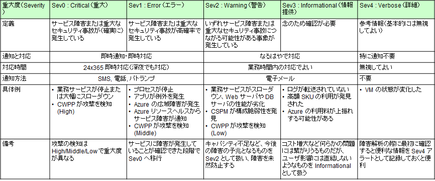

# アラートルールの作成 : 業務システム A アラートルール

業務システム A のアラートルールを仕掛けます。

- 業務システムの監視で最も重要なのは、外形監視（アプリ監視）です。Application Insights の可用性監視を最重要視してください。
- その上で、アプリケーションが提供しているサービスの停止に直結しかねないシステムの構成要素（コンポーネント）から順に、監視設定を行っていきます。

特に業務システムの監視では、以下の 2 点を意識したアラート設計を行ってください。

- Severity（重要度）の設定に一貫性を持たせる
  - Critical, Error, Warning, Informational, Verbose などの定義をはっきりさせ、むやみに高い重大度のアラート（Sev0, 1 など）を発生させないようにします。
- アラートを受け取った人間が、いつまでに何をやる必要があるのかを決めておく
  - これが決められない場合には、そもそもそのアラートが要らない可能性があります。

  

```bash

# 業務システム統制チーム／③ 構成変更の作業アカウントに切り替え
if ${FLAG_USE_SOD}; then if ${FLAG_USE_SOD_SP}; then TEMP_SP_NAME="sp_gov_change"; az login --service-principal --username ${SP_APP_IDS[${TEMP_SP_NAME}]} --password '${SP_PWDS[${TEMP_SP_NAME}]}' --tenant ${PRIMARY_DOMAIN_NAME} --allow-no-subscriptions; else az account clear; az login -u "user_gov_change@${PRIMARY_DOMAIN_NAME}" -p "${ADMIN_PASSWORD}"; fi; fi
 
############################### 業務システム A に対する監視
 
# ■ AppInsights の可用性ダウン
 
for i in ${VDC_NUMBERS}; do
TEMP_LOCATION_NAME=${LOCATION_NAMES[$i]}
TEMP_LOCATION_PREFIX=${LOCATION_PREFIXS[$i]}
 
# AppInsights 可用性ダウン
TEMP_AR_NAME="ar-spokea-appinsights-${TEMP_LOCATION_PREFIX}"
TEMP_AR_ID="/subscriptions/${SUBSCRIPTION_ID_SPOKE_A}/resourceGroups/rg-monitor-${TEMP_LOCATION_PREFIX}/providers/Microsoft.Insights/metricalerts/${TEMP_AR_NAME}"
cat > temp.json << EOF
{
    "location": "global",
    "tags": {},
    "properties": {
        "description": "AppInsights 可用性テストが 90% を下回った",
        "severity": 1,
        "enabled": true,
        "scopes": [
            "/subscriptions/${SUBSCRIPTION_ID_SPOKE_A}/resourceGroups/rg-spokea-${TEMP_LOCATION_PREFIX}/providers/Microsoft.Insights/components/app-spokea-${TEMP_LOCATION_PREFIX}"
        ],
        "evaluationFrequency": "PT1M",
        "windowSize": "PT5M",
        "criteria": {
            "allOf": [
                {
                    "threshold": 90,
                    "name": "Metric1",
                    "metricNamespace": "Microsoft.Insights/components",
                    "metricName": "availabilityResults/availabilityPercentage",
                    "operator": "LessThan",
                    "timeAggregation": "Average",
                    "skipMetricValidation": false,
                    "criterionType": "StaticThresholdCriterion"
                }
            ],
            "odata.type": "Microsoft.Azure.Monitor.SingleResourceMultipleMetricCriteria"
        },
        "autoMitigate": true,
        "targetResourceType": "Microsoft.Insights/components",
        "targetResourceRegion": "eastus",
        "actions": []
    }
}
EOF
az rest --method PUT --uri "${TEMP_AR_ID}?api-version=2018-03-01" --body @temp.json
 
done #VDC
 
# ■ VM 可用性に関するメトリクスアラート
 
for i in ${VDC_NUMBERS}; do
TEMP_LOCATION_NAME=${LOCATION_NAMES[$i]}
TEMP_LOCATION_PREFIX=${LOCATION_PREFIXS[$i]}
 
# Metric アラートに関する注意点
# ① displayName プロパティが利用できない
# ② 「サブスクリプション内のすべての VM」という動的な指定ができない（← LAW Log アラートでないと無理）
 
TEMP_VM_IDS_JSON=$(az vm list --query "[? location == '${TEMP_LOCATION_NAME}' ].id" --subscription ${SUBSCRIPTION_ID_SPOKE_A})
 
# VM 可用性
TEMP_AR_NAME="ar-spokea-vm-availability-${TEMP_LOCATION_PREFIX}"
TEMP_AR_ID="/subscriptions/${SUBSCRIPTION_ID_SPOKE_A}/resourceGroups/rg-monitor-${TEMP_LOCATION_PREFIX}/providers/Microsoft.Insights/metricalerts/${TEMP_AR_NAME}"
cat > temp.json << EOF
{
    "location": "global",
    "tags": {},
    "properties": {
        "description": "VM がダウンした可能性がある（可用性が落ちた）",
        "severity": 1,
        "enabled": true,
        "evaluationFrequency": "PT5M",
        "scopes": ${TEMP_VM_IDS_JSON},
        "windowSize": "PT5M",
        "criteria": {
            "allOf": [
                {
                    "threshold": 1,
                    "name": "Metric1",
                    "metricNamespace": "Microsoft.Compute/virtualMachines",
                    "metricName": "VmAvailabilityMetric",
                    "operator": "LessThan",
                    "timeAggregation": "Average",
                    "criterionType": "StaticThresholdCriterion"
                }
            ],
            "odata.type": "Microsoft.Azure.Monitor.MultipleResourceMultipleMetricCriteria"
        },
        "autoMitigate": true,
        "targetResourceType": "Microsoft.Compute/virtualMachines",
        "targetResourceRegion": "${TEMP_LOCATION_NAME}",
        "actions": []
    }
}
EOF
az rest --method PUT --uri "${TEMP_AR_ID}?api-version=2018-03-01" --body @temp.json
 
done #VDC
 
# ■ CPU、メモリ、ディスク IOPS、ネットワーク IO に関するメトリクスアラート
# 即時性は高いが、様々な難点がある
# ① 単一サブスクリプション内の VM 群に対してしか一括設定できない
# ② CPU、メモリ、ディスク IOPS、ネットワーク IO ごとにアラートの作成が必要
# ③ ネットワーク IO メトリクスでは複数 VM の一括監視ができない
# これらの問題は LAW Log アラートであれば解決できる。
# 即時性が必要でなければ LAW Log アラートを推奨。
 
for i in ${VDC_NUMBERS}; do
TEMP_LOCATION_NAME=${LOCATION_NAMES[$i]}
TEMP_LOCATION_PREFIX=${LOCATION_PREFIXS[$i]}
 
# Metric アラートに関する注意点
# ① displayName プロパティが利用できない
# ② 「サブスクリプション内のすべての VM」という動的な指定ができない（← LAW Log アラートでないと無理）
 
TEMP_VM_IDS_JSON=$(az vm list --query "[? location == '${TEMP_LOCATION_NAME}' ].id" --subscription ${SUBSCRIPTION_ID_SPOKE_A})
 
# CPU
TEMP_AR_NAME="ar-spokea-vm-cpu-pressure-${TEMP_LOCATION_PREFIX}"
TEMP_AR_ID="/subscriptions/${SUBSCRIPTION_ID_SPOKE_A}/resourceGroups/rg-monitor-${TEMP_LOCATION_PREFIX}/providers/Microsoft.Insights/metricalerts/${TEMP_AR_NAME}"
cat > temp.json << EOF
{
    "location": "global",
    "tags": {},
    "properties": {
        "description": "VM の CPU 使用率が 80% を超えている",
        "severity": 2,
        "enabled": true,
        "evaluationFrequency": "PT5M",
        "scopes": ${TEMP_VM_IDS_JSON},
        "windowSize": "PT5M",
        "criteria": {
            "allOf": [
                {
                    "threshold": 80,
                    "name": "MetricCPU",
                    "metricNamespace": "Microsoft.Compute/virtualMachines",
                    "metricName": "Percentage CPU",
                    "operator": "GreaterThan",
                    "timeAggregation": "Average",
                    "skipMetricValidation": false,
                    "criterionType": "StaticThresholdCriterion"
                }
            ],
            "odata.type": "Microsoft.Azure.Monitor.MultipleResourceMultipleMetricCriteria"
        },
        "autoMitigate": true,
        "targetResourceType": "Microsoft.Compute/virtualMachines",
        "targetResourceRegion": "${TEMP_LOCATION_NAME}",
        "actions": []
    }
}
EOF
az rest --method PUT --uri "${TEMP_AR_ID}?api-version=2018-03-01" --body @temp.json
 
# Memory
TEMP_AR_NAME="ar-spokea-vm-memory-pressure-${TEMP_LOCATION_PREFIX}"
TEMP_AR_ID="/subscriptions/${SUBSCRIPTION_ID_SPOKE_A}/resourceGroups/rg-monitor-${TEMP_LOCATION_PREFIX}/providers/Microsoft.Insights/metricalerts/${TEMP_AR_NAME}"
cat > temp.json << EOF
{
    "location": "global",
    "tags": {},
    "properties": {
        "description": "VM の空きメモリが 1GB を下回っている",
        "severity": 2,
        "enabled": true,
        "evaluationFrequency": "PT5M",
        "scopes": ${TEMP_VM_IDS_JSON},
        "windowSize": "PT5M",
        "criteria": {
            "allOf": [
                {
                    "threshold": 1000000000,
                    "name": "MetricAvailableMemoryBytes",
                    "metricNamespace": "Microsoft.Compute/virtualMachines",
                    "metricName": "Available Memory Bytes",
                    "operator": "LessThan",
                    "timeAggregation": "Average",
                    "criterionType": "StaticThresholdCriterion"
                }
            ],
            "odata.type": "Microsoft.Azure.Monitor.MultipleResourceMultipleMetricCriteria"
        },
        "autoMitigate": true,
        "targetResourceType": "Microsoft.Compute/virtualMachines",
        "targetResourceRegion": "${TEMP_LOCATION_NAME}",
        "actions": []
    }
}
EOF
az rest --method PUT --uri "${TEMP_AR_ID}?api-version=2018-03-01" --body @temp.json
 
# OS Disk IOPS
TEMP_AR_NAME="ar-spokea-vm-os-disk-iops-pressure-${TEMP_LOCATION_PREFIX}"
TEMP_AR_ID="/subscriptions/${SUBSCRIPTION_ID_SPOKE_A}/resourceGroups/rg-monitor-${TEMP_LOCATION_PREFIX}/providers/Microsoft.Insights/metricalerts/${TEMP_AR_NAME}"
cat > temp.json << EOF
{
    "location": "global",
    "tags": {},
    "properties": {
        "description": "VM の OS ディスクの IOPS が逼迫している",
        "severity": 2,
        "enabled": true,
        "evaluationFrequency": "PT5M",
        "scopes": ${TEMP_VM_IDS_JSON},
        "windowSize": "PT5M",
        "criteria": {
            "allOf": [
                {
                    "threshold": 95,
                    "name": "MetricOSDiskIOPS",
                    "metricNamespace": "Microsoft.Compute/virtualMachines",
                    "metricName": "OS Disk IOPS Consumed Percentage",
                    "operator": "GreaterThan",
                    "timeAggregation": "Average",
                    "criterionType": "StaticThresholdCriterion"
                }
            ],
            "odata.type": "Microsoft.Azure.Monitor.MultipleResourceMultipleMetricCriteria"
        },
        "autoMitigate": true,
        "targetResourceType": "Microsoft.Compute/virtualMachines",
        "targetResourceRegion": "${TEMP_LOCATION_NAME}",
        "actions": []
    }
}
EOF
az rest --method PUT --uri "${TEMP_AR_ID}?api-version=2018-03-01" --body @temp.json
 
# Data Disk IOPS
TEMP_AR_NAME="ar-spokea-vm-data-disk-iops-pressure-${TEMP_LOCATION_PREFIX}"
TEMP_AR_ID="/subscriptions/${SUBSCRIPTION_ID_SPOKE_A}/resourceGroups/rg-monitor-${TEMP_LOCATION_PREFIX}/providers/Microsoft.Insights/metricalerts/${TEMP_AR_NAME}"
cat > temp.json << EOF
{
    "location": "global",
    "tags": {},
    "properties": {
        "description": "VM のデータディスクの IOPS が逼迫している",
        "severity": 2,
        "enabled": true,
        "evaluationFrequency": "PT5M",
        "scopes": ${TEMP_VM_IDS_JSON},
        "windowSize": "PT5M",
        "criteria": {
            "allOf": [
                {
                    "threshold": 95,
                    "name": "MetricDataDiskIOPS",
                    "metricNamespace": "Microsoft.Compute/virtualMachines",
                    "metricName": "Data Disk IOPS Consumed Percentage",
                    "operator": "GreaterThan",
                    "timeAggregation": "Average",
                    "criterionType": "StaticThresholdCriterion"
                }
            ],
            "odata.type": "Microsoft.Azure.Monitor.MultipleResourceMultipleMetricCriteria"
        },
        "autoMitigate": true,
        "targetResourceType": "Microsoft.Compute/virtualMachines",
        "targetResourceRegion": "${TEMP_LOCATION_NAME}",
        "actions": []
    }
}
EOF
az rest --method PUT --uri "${TEMP_AR_ID}?api-version=2018-03-01" --body @temp.json
 
# Network In/Out Total メトリックは複数 VM の一括監視をサポートしていないため、アラートルールを複数作成する必要がある
for TEMP_VM_ID in $(az vm list --query "[? location == '${TEMP_LOCATION_NAME}' ].id" --subscription ${SUBSCRIPTION_ID_SPOKE_A} -o tsv); do
TEMP_VM_NAME="${TEMP_VM_ID##*/}"
 
TEMP_AR_NAME="ar-spokea-vm-network-in-total-${TEMP_VM_NAME}-${TEMP_LOCATION_PREFIX}"
TEMP_AR_ID="/subscriptions/${SUBSCRIPTION_ID_SPOKE_A}/resourceGroups/rg-monitor-${TEMP_LOCATION_PREFIX}/providers/Microsoft.Insights/metricalerts/${TEMP_AR_NAME}"
cat > temp.json << EOF
{
    "location": "global",
    "tags": {},
    "properties": {
        "description": "VM のネットワーク受信量が 500GB を超えている",
        "severity": 2,
        "enabled": true,
        "evaluationFrequency": "PT5M",
        "scopes": [ "${TEMP_VM_ID}" ],
        "windowSize": "PT5M",
        "criteria": {
            "allOf": [
                {
                    "threshold": 500000000000,
                    "name": "MetricNetworkInTotal",
                    "metricNamespace": "Microsoft.Compute/virtualMachines",
                    "metricName": "Network In Total",
                    "operator": "GreaterThan",
                    "timeAggregation": "Total",
                    "criterionType": "StaticThresholdCriterion"
                }
            ],
            "odata.type": "Microsoft.Azure.Monitor.MultipleResourceMultipleMetricCriteria"
        },
        "autoMitigate": true,
        "targetResourceType": "Microsoft.Compute/virtualMachines",
        "targetResourceRegion": "${TEMP_LOCATION_NAME}",
        "actions": []
    }
}
EOF
az rest --method PUT --uri "${TEMP_AR_ID}?api-version=2018-03-01" --body @temp.json
 
# Network Out Total
TEMP_AR_NAME="ar-spokea-vm-network-out-total-${TEMP_VM_NAME}-${TEMP_LOCATION_PREFIX}"
TEMP_AR_ID="/subscriptions/${SUBSCRIPTION_ID_SPOKE_A}/resourceGroups/rg-monitor-${TEMP_LOCATION_PREFIX}/providers/Microsoft.Insights/metricalerts/${TEMP_AR_NAME}"
cat > temp.json << EOF
{
    "location": "global",
    "tags": {},
    "properties": {
        "description": "VM のネットワーク送信量が 200GB を超えている",
        "severity": 2,
        "enabled": true,
        "evaluationFrequency": "PT5M",
        "scopes": [ "${TEMP_VM_ID}" ],
        "windowSize": "PT5M",
        "criteria": {
            "allOf": [
                {
                    "threshold": 200000000000,
                    "name": "MetricNetworkOutTotal",
                    "metricNamespace": "Microsoft.Compute/virtualMachines",
                    "metricName": "Network Out Total",
                    "operator": "GreaterThan",
                    "timeAggregation": "Total",
                    "criterionType": "StaticThresholdCriterion"
                }
            ],
            "odata.type": "Microsoft.Azure.Monitor.MultipleResourceMultipleMetricCriteria"
        },
        "autoMitigate": true,
        "targetResourceType": "Microsoft.Compute/virtualMachines",
        "targetResourceRegion": "${TEMP_LOCATION_NAME}",
        "actions": []
    }
}
EOF
az rest --method PUT --uri "${TEMP_AR_ID}?api-version=2018-03-01" --body @temp.json
 
done # TEMP_VM_ID
 
done #VDC

```
