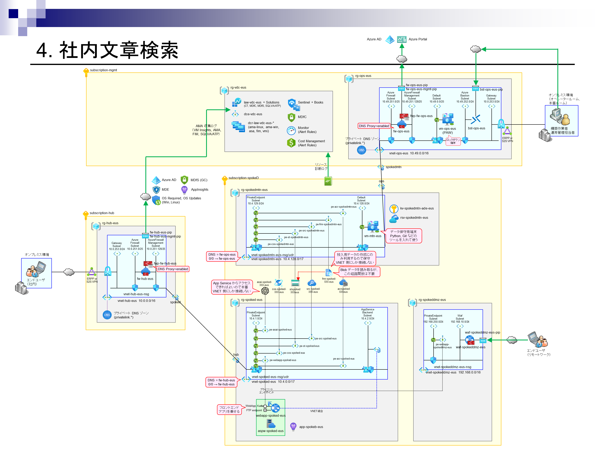
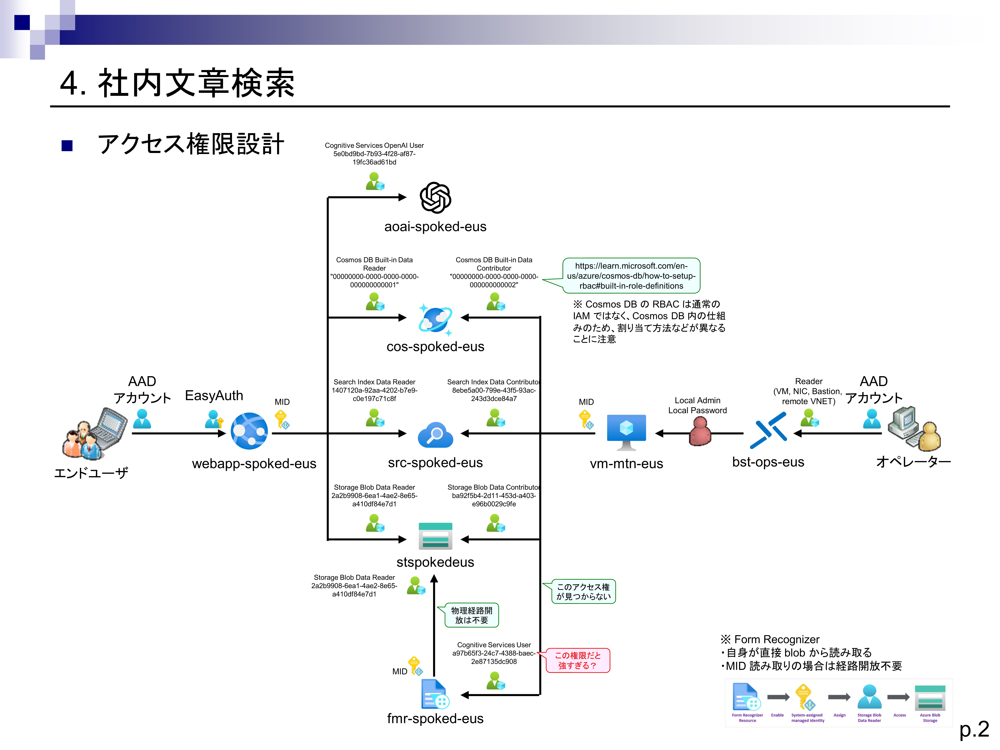

# 本サンプルについて

本サンプルは、エンプラ系規制業界での利用を想定し、AOAI リファレンスアーキテクチャ資料のサンプル 4. 社内文章検索システムを、Azure CAF Landing Zone 上に移植したものです。

## 全体アーキテクチャ



- 本サンプルは、Azure 共通基盤に接続する一つのシステムという位置づけにしています。このため、本スクリプトを実際に利用するためには、ベースとなる共通基盤部分が必要になります。
- ベースとなる共通基盤部分は、本 GitHub レポジトリの 00.環境準備 ～ 05.仮想マシンのコンプライアンス対応、および 11.Azure Policy ガバナンスと MDfC セキュリティ～12.運用監視（モニタリング）の各スクリプトを実行することにより作成することができます。
  - とはいえ実際にこの共通基盤を作成するためには、複数のサブスクリプションが必要になるなどかなり大変です。AOAI のサンプル部分だけを単体で動かしてみたい、という方は、本家の AOAI リファレンスアーキテクチャの方を動作させてみることをおすすめします。
  - すでに Hub-Spoke 構成の環境をお持ちの場合、そこに適合させる形で導入することは比較的容易だと思います。その場合は、本サンプルのスクリプトを適宜カスタマイズして再利用しながら環境を構築してください。

## オリジナル版からの変更点

- エンプラ系の規制業界でよく求められる、閉域構成のアーキテクチャを採用しています。
  - PaaS 系リソースへはパブリックアクセス不可、Web App も VNET 統合による閉域化を行っています。
  - このため、各リソースへの直接のデータ操作アクセスは、VNET の外部からでは行えません。データの中身を確認したい場合には、運用管理端末（vm-ops-XXX）や保守用端末（vm-mtn-XXX）にアクセスし、そこから行ってください。
  - アプリケーションへのアクセスも、VNET 内部からしか行えません。ユーザ端末から行ってください。
- オリジナルのアーキテクチャでは本番／運用分離が考慮されていませんが、規制業界での利用を想定し、データやアプリのメンテナンスを行うための環境（ネットワーク）と、社内文章を検索するための環境（ネットワーク）とを分離しています。
- オリジナルのサンプルでは、データの投入やアプリのメンテナンスをローカルマシンから実施していましたが、本サンプルではハードニングされた専用 VM （vm-mtn-XXX）を用意し、ここにツールを入れて、そこからデータの投入やアプリのメンテナンスを行えるように設計しています。
  - 本サンプルでは作業を簡単化するため、メンテナンス用の端末 (vm-mtn-XXX) からのインターネットアクセスを可能にしています。実際にはメンテナンス作業の端末から自由なインターネットアクセスは認められないことが多いと思いますので、適切な FQDN フィルタリングを行ってください。
  - 本サンプルでのメンテナンス端末上での作業のうち、インターネットアクセスを必要とするものは以下の通りです。これらの作業をメンテナンス端末上でできるようにするために FQDN を絞って開放するか、あるいは外部端末で行った成果物だけをこの環境に持ち込むようにするか、いずれかを選択してください。
    - サンプルファイルの取得
    - データのセットアップ作業
      - サンプルデータの取得
      - Python インストーラの取得
      - Python パッケージファイルの取得
    - アプリケーションが含まれたコンテナの作成
      - WSL および Docker のインストール
      - Docker ベースイメージの取得
      - Python パッケージファイルの取得
      - NPM パッケージファイルの取得

## アプリケーションコードの変更点

- 本閉域環境で動作させられるように、オリジナルのアプリケーションコードの一部を以下のように修正しています。
  - 全般
    - azd コマンドから動作させるために用意されている各種のラッパー処理をすべて削除し、必要最小限のファイルだけを aoai-sample4.zip ファイルに抽出しています。
  - prepdocs.py（インデックスを事前作成するための Python スクリプト）
    - オリジナル版では azd コマンドから処理を実行するためにクレデンシャルを AzureDeveloperCredential() から入手していますが、本サンプルでは VM 上から Managed ID を利用するため、DefaultAzureCredential() を利用するように変更しています。
  - webapp フォルダ
    - アプリケーションプログラム本体です。frontend フォルダ内に JavaScript アプリ（SPA 型 Web アプリ）が含まれており、backend フォルダ内に Python Flask アプリが含まれています。
    - オリジナル版ではこのアプリを直接 Web App for Linux 上に配置していますが、汎用性を考慮し、Docker コンテナ化したうえで、 Web App for Containers 上に展開するようにしています。
    - コンテナ内では Python Flask の開発サーバをそのまま利用しています。ローカル環境以外からのリクエストも受け付けられるように、app.py の最後の 2 行を以下のように修正しています。

```Python

if __name__ == '__main__':
    app.run(host='0.0.0.0', port=5000)

```

## 認証・認可設計



- リソースアクセスはすべて Managed Identity を利用する設計としています。共有キーアクセスは利用していません。
- リソースアクセス権限は、すべてリソーススコープで付与しています。（リソースグループスコープでの権限付与は行っていません。）
- リソースアクセス権限は Azure RBAC（DataAction を持つロール）で設定していますが、Cosmos DB は Cosmos DB 独自の RBAC で設定しています。
