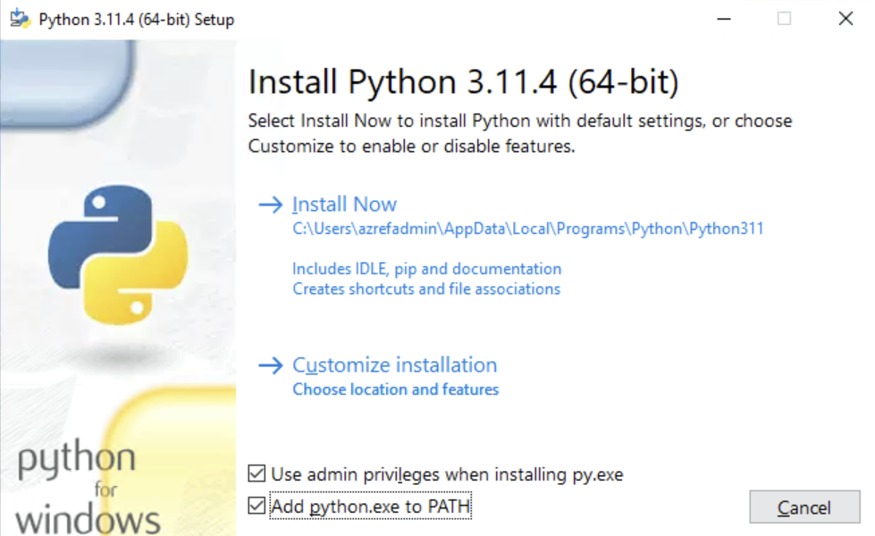

# データの準備

vm-mtn-XXX にログインし、データの準備を進めます。

## サンプルファイルの入手

- vm-mtn-XXX 上にて Edge ブラウザを開き、[サンプルアプリの zip ファイル](aoai-sample4.zip) をダウンロードします。
- ダウンロードしたファイルを、C:\Users\azrefadmin\src フォルダ下に展開します、
  - C:\Users\azrefadmin\src\prep
  - C:\Users\azrefadmin\src\webapp

## Python の準備

- vm-mtn-XXX 上にて Python のインストーラをダウンロードします。
  - https://www.python.org/ftp/python/3.12.4/python-3.12.4-amd64.exe
- ダウンロードしたインストーラを（Run as Administrators により Administrator として）起動して Python をセットアップします。
  - 「Add python.exe to PATH」 をインストール時に指定しておきます。これにより、コマンドラインから python が利用できるようになります。
  - ※ CSB (Compute Security Baseline) が適用されている場合、インストーラをそのままクリックしてインストールしようとすると、エラー 0x80070659 によりインストールできません。
  

## サンプルデータの入手

- サンプルデータとして利用する PDF ファイルを入手します。
  - 厚生労働省が公開している PDF ファイル（就労規約サンプル）を利用します。vm-mtn-XXX 上にて管理者権限のコマンドラインプロンプトを開き、以下を実行してください。
  - 他にも利用してみたいものがある場合には、pdf ファイルを data フォルダ下にコピーしてください。

```cmd

md C:\Users\azrefadmin\src\prep\data
curl https://www.mhlw.go.jp/content/001018385.pdf --output C:\Users\azrefadmin\src\prep\data\001018385.pdf

```

## Python モジュールのインストール

- vm-mtn-XXX 上にて管理者権限のコマンドラインプロンプトを開き、以下を実行してください。

```cmd

cd C:\Users\azrefadmin\src\prep
python -m pip install --upgrade pip
python -m pip install -r ./requirements.txt

```

## データの準備処理

- vm-mtn-XXX 上にてデータの準備処理を行います。
  - PDF ファイルを Form Recognizer により解析し、このデータをもとに検索インデックスの作成などを行います。
  - prepdocs.py によりこの処理を行いますが、ストレージアカウントや Form Recognizer などの名前をコマンドライン引数として与える必要があります。このコマンドラインを作成するため、**bash から以下の az cli を実行し**、vm-mtn-XXX 上で実行するコマンドラインを作成します。

```bash

if ${FLAG_USE_SOD} ; then az account clear ; az login -u "user_spoked_dev@${PRIMARY_DOMAIN_NAME}" -p "${ADMIN_PASSWORD}" ; fi
az account set -s "${SUBSCRIPTION_ID_SPOKE_D}"
 
for i in ${VDC_NUMBERS}; do
TEMP_LOCATION_NAME=${LOCATION_NAMES[$i]}
TEMP_LOCATION_PREFIX=${LOCATION_PREFIXS[$i]}

TEMP_RG_NAME="rg-spoked-${TEMP_LOCATION_PREFIX}"

TEMP_STORAGE_NAME="stspoked${UNIQUE_SUFFIX}${TEMP_LOCATION_PREFIX}"
TEMP_COSMOSDB_NAME="cos-spoked-${UNIQUE_SUFFIX}-${TEMP_LOCATION_PREFIX}"
TEMP_SEARCHSERVICE_NAME="src-spoked-${UNIQUE_SUFFIX}-${TEMP_LOCATION_PREFIX}"
TEMP_FORMRECOGNIZER_NAME="fmr-spoked-${UNIQUE_SUFFIX}-${TEMP_LOCATION_PREFIX}"
TEMP_AOAI_NAME="aoai-spoked-${UNIQUE_SUFFIX}-${TEMP_LOCATION_PREFIX}"

TEMP_COSMOSDB_SQLDB_NAME="ChatHistory"
TEMP_COSMOSDB_CONTAINER_NAME="Prompts"
TEMP_AOAI_DAVINCI_DEPLOYMENT_NAME="davinci"
TEMP_AOAI_GPT_35_TURBO_DEPLOYMENT_NAME="chat"
#TEMP_AOAI_GPT_4_32K_DEPLOYMENT=''
#TEMP_AOAI_GPT_4_DEPLOYMENT=''
#TEMP_AOAI_API_VERSION='2023-05-15'

cat <<EOF
python prepdocs.py ./data/*.pdf --storageaccount "${TEMP_STORAGE_NAME}" --container "content" --searchservice "${TEMP_SEARCHSERVICE_NAME}" --index "gptkbindex" --formrecognizerservice "${TEMP_FORMRECOGNIZER_NAME}" --verbose
EOF

done #LOCATION

```

- 上記の処理により、コマンドラインが入手できます。これをコピーして、vm-mtn-XXX 上で実行してください。

```cmd

※ 以下は一例です。環境により作成されるコマンドラインは異なりますが、正しく動作すると実行結果は以下のようになります。

C:\Users\azrefadmin\src\prep>python prepdocs.py ./data/*.pdf --storageaccount "stspoked07541eus" --container "content" --searchservice "src-spoked-07541-eus" --index "gptkbindex" --formrecognizerservice "fmr-spoked-07541-eus" --verbose
Ensuring search index gptkbindex exists
Creating gptkbindex search index
Processing files...
Processing './data\001018385.pdf'
        Uploading blob for page 0 -> 001018385-0.pdf
        Uploading blob for page 1 -> 001018385-1.pdf
        Uploading blob for page 2 -> 001018385-2.pdf
        Uploading blob for page 3 -> 001018385-3.pdf
        Uploading blob for page 4 -> 001018385-4.pdf
        Uploading blob for page 5 -> 001018385-5.pdf
        Uploading blob for page 6 -> 001018385-6.pdf
        Uploading blob for page 7 -> 001018385-7.pdf
        Uploading blob for page 8 -> 001018385-8.pdf
        Uploading blob for page 9 -> 001018385-9.pdf
        Uploading blob for page 10 -> 001018385-10.pdf
        Uploading blob for page 11 -> 001018385-11.pdf
        Uploading blob for page 12 -> 001018385-12.pdf
        Uploading blob for page 13 -> 001018385-13.pdf
        Uploading blob for page 14 -> 001018385-14.pdf
        Uploading blob for page 15 -> 001018385-15.pdf
        Uploading blob for page 16 -> 001018385-16.pdf
        Uploading blob for page 17 -> 001018385-17.pdf
        Uploading blob for page 18 -> 001018385-18.pdf
        Uploading blob for page 19 -> 001018385-19.pdf
        Uploading blob for page 20 -> 001018385-20.pdf
        Uploading blob for page 21 -> 001018385-21.pdf
        Uploading blob for page 22 -> 001018385-22.pdf
        Uploading blob for page 23 -> 001018385-23.pdf
        Uploading blob for page 24 -> 001018385-24.pdf
        Uploading blob for page 25 -> 001018385-25.pdf
        Uploading blob for page 26 -> 001018385-26.pdf
        Uploading blob for page 27 -> 001018385-27.pdf
        Uploading blob for page 28 -> 001018385-28.pdf
        Uploading blob for page 29 -> 001018385-29.pdf
        Uploading blob for page 30 -> 001018385-30.pdf
        Uploading blob for page 31 -> 001018385-31.pdf
        Uploading blob for page 32 -> 001018385-32.pdf
        Uploading blob for page 33 -> 001018385-33.pdf
        Uploading blob for page 34 -> 001018385-34.pdf
        Uploading blob for page 35 -> 001018385-35.pdf
        Uploading blob for page 36 -> 001018385-36.pdf
        Uploading blob for page 37 -> 001018385-37.pdf
        Uploading blob for page 38 -> 001018385-38.pdf
        Uploading blob for page 39 -> 001018385-39.pdf
        Uploading blob for page 40 -> 001018385-40.pdf
        Uploading blob for page 41 -> 001018385-41.pdf
        Uploading blob for page 42 -> 001018385-42.pdf
        Uploading blob for page 43 -> 001018385-43.pdf
        Uploading blob for page 44 -> 001018385-44.pdf
        Uploading blob for page 45 -> 001018385-45.pdf
        Uploading blob for page 46 -> 001018385-46.pdf
        Uploading blob for page 47 -> 001018385-47.pdf
        Uploading blob for page 48 -> 001018385-48.pdf
        Uploading blob for page 49 -> 001018385-49.pdf
        Uploading blob for page 50 -> 001018385-50.pdf
        Uploading blob for page 51 -> 001018385-51.pdf
        Uploading blob for page 52 -> 001018385-52.pdf
        Uploading blob for page 53 -> 001018385-53.pdf
        Uploading blob for page 54 -> 001018385-54.pdf
        Uploading blob for page 55 -> 001018385-55.pdf
        Uploading blob for page 56 -> 001018385-56.pdf
        Uploading blob for page 57 -> 001018385-57.pdf
        Uploading blob for page 58 -> 001018385-58.pdf
        Uploading blob for page 59 -> 001018385-59.pdf
        Uploading blob for page 60 -> 001018385-60.pdf
        Uploading blob for page 61 -> 001018385-61.pdf
        Uploading blob for page 62 -> 001018385-62.pdf
        Uploading blob for page 63 -> 001018385-63.pdf
        Uploading blob for page 64 -> 001018385-64.pdf
        Uploading blob for page 65 -> 001018385-65.pdf
        Uploading blob for page 66 -> 001018385-66.pdf
        Uploading blob for page 67 -> 001018385-67.pdf
        Uploading blob for page 68 -> 001018385-68.pdf
        Uploading blob for page 69 -> 001018385-69.pdf
        Uploading blob for page 70 -> 001018385-70.pdf
        Uploading blob for page 71 -> 001018385-71.pdf
        Uploading blob for page 72 -> 001018385-72.pdf
        Uploading blob for page 73 -> 001018385-73.pdf
        Uploading blob for page 74 -> 001018385-74.pdf
        Uploading blob for page 75 -> 001018385-75.pdf
        Uploading blob for page 76 -> 001018385-76.pdf
        Uploading blob for page 77 -> 001018385-77.pdf
        Uploading blob for page 78 -> 001018385-78.pdf
        Uploading blob for page 79 -> 001018385-79.pdf
        Uploading blob for page 80 -> 001018385-80.pdf
        Uploading blob for page 81 -> 001018385-81.pdf
        Uploading blob for page 82 -> 001018385-82.pdf
        Uploading blob for page 83 -> 001018385-83.pdf
        Uploading blob for page 84 -> 001018385-84.pdf
        Uploading blob for page 85 -> 001018385-85.pdf
        Uploading blob for page 86 -> 001018385-86.pdf
        Uploading blob for page 87 -> 001018385-87.pdf
        Uploading blob for page 88 -> 001018385-88.pdf
        Uploading blob for page 89 -> 001018385-89.pdf
        Uploading blob for page 90 -> 001018385-90.pdf
        Uploading blob for page 91 -> 001018385-91.pdf
        Uploading blob for page 92 -> 001018385-92.pdf
Extracting text from './data\001018385.pdf' using Azure Form Recognizer
Indexing sections from '001018385.pdf' into search index 'gptkbindex'
Splitting './data\001018385.pdf' into sections
Section ends with unclosed table, starting next section with the table at page 0 offset 0 table start 820
Section ends with unclosed table, starting next section with the table at page 11 offset 7625 table start 1113
Section ends with unclosed table, starting next section with the table at page 20 offset 15456 table start 1109
Section ends with unclosed table, starting next section with the table at page 25 offset 20392 table start 389
Section ends with unclosed table, starting next section with the table at page 26 offset 21683 table start 898
Section ends with unclosed table, starting next section with the table at page 27 offset 22497 table start 553
Section ends with unclosed table, starting next section with the table at page 31 offset 27961 table start 569
Section ends with unclosed table, starting next section with the table at page 32 offset 28456 table start 724
Section ends with unclosed table, starting next section with the table at page 32 offset 29077 table start 1126
Section ends with unclosed table, starting next section with the table at page 32 offset 30073 table start 804
Section ends with unclosed table, starting next section with the table at page 32 offset 30786 table start 610
Section ends with unclosed table, starting next section with the table at page 32 offset 31396 table start 600
Section ends with unclosed table, starting next section with the table at page 32 offset 31983 table start 1060
Section ends with unclosed table, starting next section with the table at page 32 offset 32892 table start 872
Section ends with unclosed table, starting next section with the table at page 53 offset 53182 table start 848
Section ends with unclosed table, starting next section with the table at page 54 offset 53944 table start 1074
        Indexed 94 sections, 94 succeeded

C:\Users\azrefadmin\src\prep>

```
