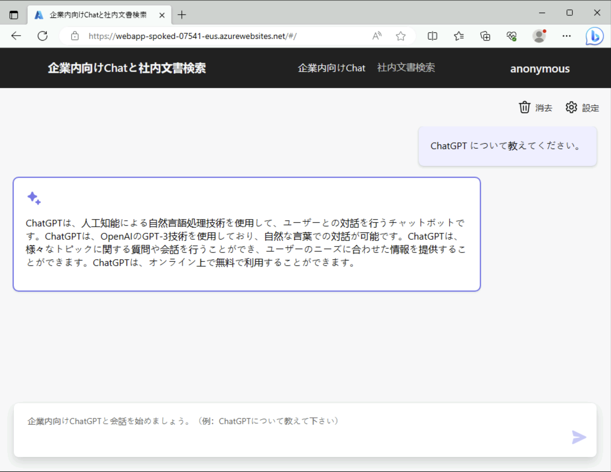
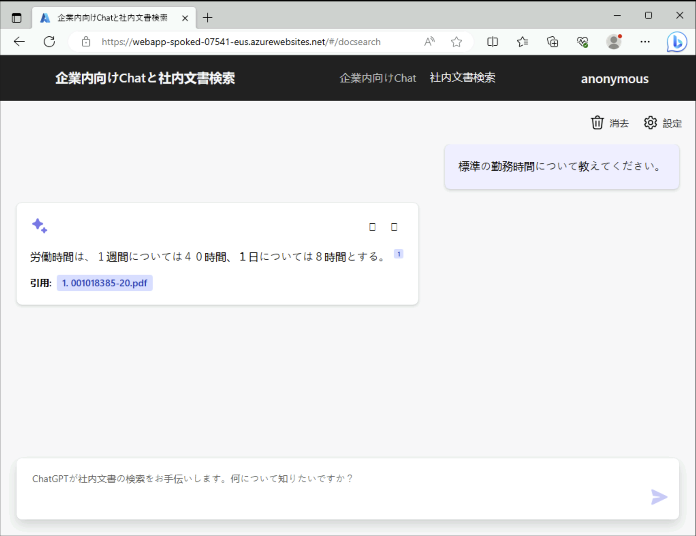

# アプリの動作確認

- Hub サブスクリプションの vm-usr-XXX にログインします。
- 以下の bash スクリプトで入手したアドレスに Edge ブラウザにアクセスします。
  - Web App で利用しているマシンサイズのより変わりますが、Python アプリは起動にかなりの時間がかかります。Web App の場合、初回起動時はタイムアウトを起こす場合がありますが、その場合は数分置いてから再度アクセスしてみてください。
  - アプリがうまく起動しない場合には、Azure Portal から Web App のデプロイセンターのログを確認してみてください。（なお、ストリームログは Web App への直接接続経路が必要なため、vm-mtn-XXX マシン上から Azure Portal に確認して利用してください。）

```bash

for i in ${VDC_NUMBERS}; do
TEMP_LOCATION_NAME=${LOCATION_NAMES[$i]}
TEMP_LOCATION_PREFIX=${LOCATION_PREFIXS[$i]}
TEMP_WEBAPP_NAME="webapp-spoked-${UNIQUE_SUFFIX}-${TEMP_LOCATION_PREFIX}"

echo "https://${TEMP_WEBAPP_NAME}.azurewebsites.net/"

done 

```

  

  
