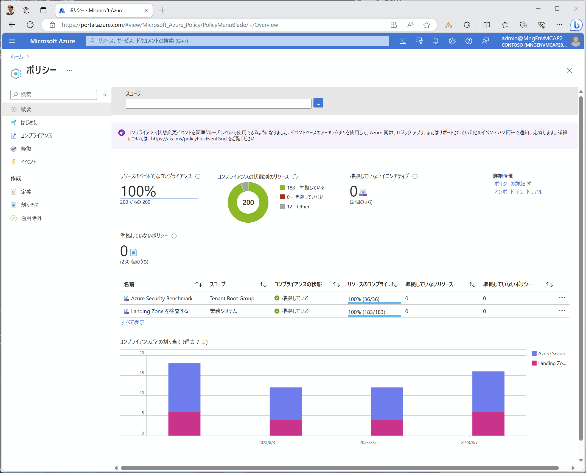

# Azure Policy 違反項目への対応

Azure Policy により発見された違反項目に対して、以下のいずれかの対応を行います。

- Remediation : リソースの構成違反を修正・是正する
- Exemption
  - Mitigated : 実質的に違反を起こしていない（ポリシーの意図は満たされている）ため、適用を除外する
  - Waiver : ポリシーの意図が満たされていないが、当該システムではリスクを受容する
  - Waiver - PoC/Test : ポリシーの意図が満たされていないが、テスト目的であるためリスクを受容する（＝本番環境ではきちんと是正すべき）
- Disabled : ポリシーそのものが何らかの理由により不適切であるため、ポリシーそのものを無効化する

これらの組み合わせにより、Azure Policy での準拠状況 100% を目指します。

  
