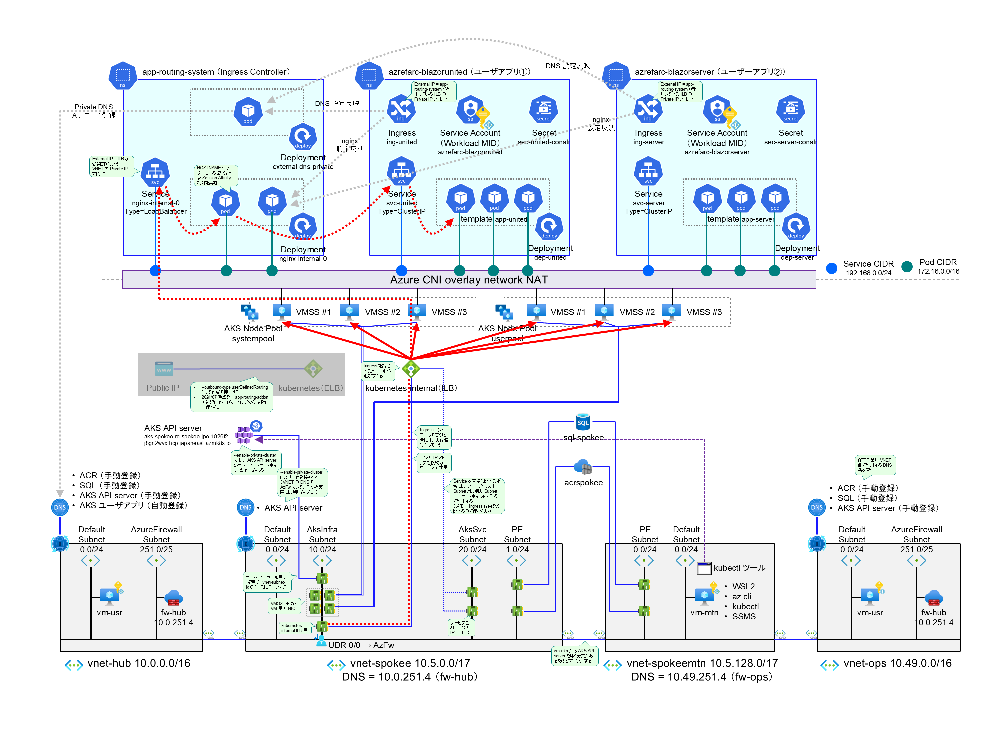

# k8s 型 Web DB システムについて

Azure で Kubernetes (k8s) を利用する場合、大別して以下の選択肢があります。

- AKS (Azure Kubernetes Services) : 素に近い Kubernetes を高度にカスタマイズしながら使いたい場合に利用
- AKS Automatic : AKS に推奨される各種のプラグインを追加し、より Managed な状態で使いたい場合に利用
- ACA (Azure Container Apps) : Kubernetes を使いたいが、煩わしいインフラ管理を避けたい場合
- ARO (Azure Redhat OpenShift) : Redhat OpenShift でコンテナを稼働させたい場合に利用

ここでは AKS を利用した Web DB システムについて解説します。

  
