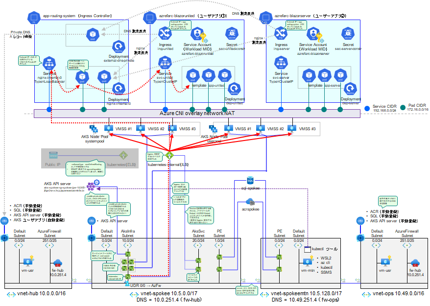

# 業務用 VNET 作成

  


```bash

# 業務システム E チーム／① 初期構築の作業アカウントに切り替え
if ${FLAG_USE_SOD}; then if ${FLAG_USE_SOD_SP}; then TEMP_SP_NAME="sp_spokee_dev"; az login --service-principal --username ${SP_APP_IDS[${TEMP_SP_NAME}]} --password '${SP_PWDS[${TEMP_SP_NAME}]}' --tenant ${PRIMARY_DOMAIN_NAME} --allow-no-subscriptions; else az account clear; az login -u "user_spokee_dev@${PRIMARY_DOMAIN_NAME}" -p "${ADMIN_PASSWORD}"; fi; fi
az account set -s "${SUBSCRIPTION_ID_SPOKE_E}"

for i in ${VDC_NUMBERS}; do
TEMP_LOCATION_NAME=${LOCATION_NAMES[$i]}
TEMP_LOCATION_PREFIX=${LOCATION_PREFIXS[$i]}
TEMP_RG_NAME="rg-spokee-${TEMP_LOCATION_PREFIX}"
az group create --name ${TEMP_RG_NAME} --location ${TEMP_LOCATION_NAME}
done # TEMP_LOCATION

# NW 構成管理チーム／③ 構成変更の作業アカウントに切り替え
if ${FLAG_USE_SOD}; then if ${FLAG_USE_SOD_SP}; then TEMP_SP_NAME="sp_nw_change"; az login --service-principal --username ${SP_APP_IDS[${TEMP_SP_NAME}]} --password '${SP_PWDS[${TEMP_SP_NAME}]}' --tenant ${PRIMARY_DOMAIN_NAME} --allow-no-subscriptions; else az account clear; az login -u "user_nw_change@${PRIMARY_DOMAIN_NAME}" -p "${ADMIN_PASSWORD}"; fi; fi
az account set -s "${SUBSCRIPTION_ID_SPOKE_E}"

for i in ${VDC_NUMBERS}; do
TEMP_LOCATION_NAME=${LOCATION_NAMES[$i]}
TEMP_LOCATION_PREFIX=${LOCATION_PREFIXS[$i]}

# SPOKE E アプリ用 VNET 作成
TEMP_RG_NAME="rg-spokee-${TEMP_LOCATION_PREFIX}"
TEMP_VNET_NAME="vnet-spokee-${TEMP_LOCATION_PREFIX}"
TEMP_IP_PREFIX=${IP_SPOKE_E_PREFIXS[$i]}
TEMP_VNET_ADDRESS="${TEMP_IP_PREFIX}.0.0/17"

TEMP_SUBNET_DEFAULT="${TEMP_IP_PREFIX}.0.0/24"
TEMP_SUBNET_PE="${TEMP_IP_PREFIX}.1.0/24"

# AKS Infrastructure Subnet - AKS 基盤が利用する IP アドレス
# VMSS や Private Master API、ILB Ingress Endpoint などに利用される
TEMP_SUBNET_AKS_INFRA="${TEMP_IP_PREFIX}.10.0/24"
# AKS Service CIDR - AKS が内部で利用する Service 用 IP アドレス
# 外部公開しないため、VNET 内のアドレスである必要はない
# ここでは Class B Private IP アドレスから利用
TEMP_SUBNET_AKS_SERVICE_CIDR="128.0.0.0/24"
# AKS Pod CIDR - AKS が内部で利用する Pod 用 IP アドレス
# 外部公開しないため、VNET 内のアドレスである必要はない
# ここでは Class C Private IP アドレスから利用
TEMP_SUBNET_AKS_POD_CIDR="192.168.0.0/16"

# AKS Internal Endpoint Subnet
# Service に対して裏口的にアクセスする経路を作る場合に利用するサブネット
# Ingress 経由でしか Service に入らない場合には作らなくても OK
TEMP_SUBNET_IES="${TEMP_IP_PREFIX}.20.0/24"

TEMP_NSG_NAME="${TEMP_VNET_NAME}-nsg"
TEMP_UDR_NAME="${TEMP_VNET_NAME}-udr"

az network nsg create --name ${TEMP_NSG_NAME} --resource-group ${TEMP_RG_NAME}
az network route-table create --resource-group ${TEMP_RG_NAME} --name ${TEMP_UDR_NAME}
az network vnet create --resource-group ${TEMP_RG_NAME} --name ${TEMP_VNET_NAME} --address-prefixes ${TEMP_VNET_ADDRESS}
az network vnet subnet create --name "DefaultSubnet" --address-prefix ${TEMP_SUBNET_DEFAULT} --resource-group ${TEMP_RG_NAME} --vnet-name ${TEMP_VNET_NAME} --nsg ${TEMP_NSG_NAME} --route-table ${TEMP_UDR_NAME}
az network vnet subnet create --name "PrivateEndpointSubnet" --address-prefix ${TEMP_SUBNET_PE} --resource-group ${TEMP_RG_NAME} --vnet-name ${TEMP_VNET_NAME} --nsg ${TEMP_NSG_NAME} --route-table ${TEMP_UDR_NAME}

az network vnet subnet create --name "AksInfrastructureSubnet" --address-prefix ${TEMP_SUBNET_AKS_INFRA} --resource-group ${TEMP_RG_NAME} --vnet-name ${TEMP_VNET_NAME} --nsg ${TEMP_NSG_NAME} --route-table ${TEMP_UDR_NAME}
az network vnet subnet create --name "AksInternalEndpointSubnet" --address-prefix ${TEMP_SUBNET_IES} --resource-group ${TEMP_RG_NAME} --vnet-name ${TEMP_VNET_NAME} --nsg ${TEMP_NSG_NAME} --route-table ${TEMP_UDR_NAME}

TEMP_FW_IP=$(az network firewall ip-config list -g "rg-hub-${TEMP_LOCATION_PREFIX}" -f "fw-hub-${TEMP_LOCATION_PREFIX}" --query "[0].privateIpAddress" --output tsv --subscription ${SUBSCRIPTION_NAME_HUB})

az network route-table route create --resource-group ${TEMP_RG_NAME} --name default --route-table-name ${TEMP_UDR_NAME} --address-prefix 0.0.0.0/0 --next-hop-type VirtualAppliance --next-hop-ip-address ${TEMP_FW_IP}

# VNET Peering HUB-spokef
TEMP_HUB_VNET_ID="/subscriptions/${SUBSCRIPTION_ID_HUB}/resourceGroups/rg-hub-${TEMP_LOCATION_PREFIX}/providers/Microsoft.Network/virtualNetworks/vnet-hub-${TEMP_LOCATION_PREFIX}"
TEMP_SPOKE_VNET_ID="/subscriptions/${SUBSCRIPTION_ID_SPOKE_E}/resourceGroups/${TEMP_RG_NAME}/providers/Microsoft.Network/virtualNetworks/${TEMP_VNET_NAME}"
# Hub → Spoke
az network vnet peering create --name spokee --resource-group "rg-hub-${TEMP_LOCATION_PREFIX}" --vnet-name "vnet-hub-${TEMP_LOCATION_PREFIX}" --remote-vnet $TEMP_SPOKE_VNET_ID --allow-vnet-access --subscription "${SUBSCRIPTION_NAME_HUB}"
# Spoke → Hub
az network vnet peering create --name hub --resource-group ${TEMP_RG_NAME} --vnet-name ${TEMP_VNET_NAME} --remote-vnet $TEMP_HUB_VNET_ID --allow-vnet-access --subscription "${SUBSCRIPTION_NAME_SPOKE_E}"

# DNS サーバ切り替え
az network vnet update --name ${TEMP_VNET_NAME} --resource-group ${TEMP_RG_NAME} --dns-servers ${TEMP_FW_IP}

done # TEMP_LOCATION

```
