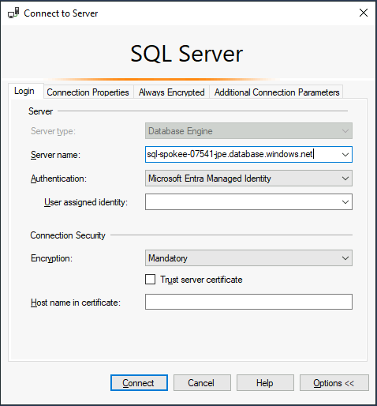

# SQL DB のセットアップ

- vm-mtn-xxx にログイン

- SQL Management Studio (SSMS) をダウンロードしてインストール
  - ダウンロードリンク（ https://aka.ms/ssmsfullsetup ）からファイルをダウンロード
  - ダウンロード後、SSMS-Setup-ENU.exe を vm-ops 端末上で実行して SSMS をインストールする

- SQL DB へ接続
  - sql-spokee-xxx-yyy.database.windows.net へ接続 （接続先は echo "sql-spokee-${UNIQUE_SUFFIX}-${LOCATION_PREFIXS[0]}.database.windows.net" で取得できる ）
  - 認証方式として Microsoft Entra Managed Identity を指定して接続
  - このマシン上からであれば、パスワードなしで管理者として接続できる

  

- pubs データベースのサンプルスクリプトを実行
  - クエリを開き、接続先データベースを pubs に切り替える
  - 業務テーブル群を作成する
    - https://github.com/nakamacchi/AzRefArc.SqlDb/raw/main/pubs_azure_with_timestamp.sql 上のスクリプトを張り付けて実行
  - pubs データベースが作成されたら、追加で以下のスクリプトを実行し、後で利用するサンプルアプリの暗号化キーを SQLDB で共有できるようにしておきます。

```T-SQL

CREATE TABLE [dbo].[DataProtectionKeys] ( [ID][int] IDENTITY(1, 1) NOT NULL PRIMARY KEY, [FriendlyName] [varchar] (64) NULL, [Xml][text] NULL)

```
