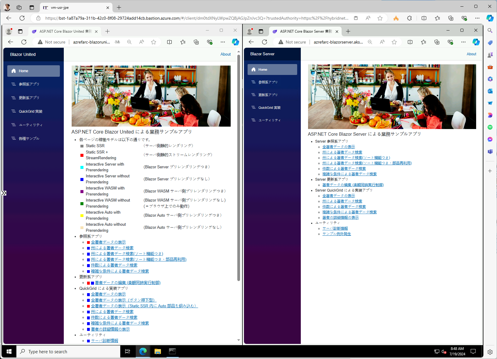

# アプリの動作確認

- Base64 エンコード部分の改行を取りつつ、vm-mtn 上で実行
- 終わったら以下で Pod, Service の起動状態を確認

```bash
kubectl get pods --namespace azrefarc-blazorunited
kubectl get services --namespace azrefarc-blazorunited
kubectl get ingress --namespace azrefarc-blazorunited

kubectl get pods --namespace azrefarc-blazorserver
kubectl get services --namespace azrefarc-blazorserver
kubectl get ingress --namespace azrefarc-blazorserver
```

## 実行結果の例

```bash

azrefadmin@vm-mtn-jpe:~$ kubectl get pods --namespace azrefarc-blazorunited
NAME                                READY   STATUS    RESTARTS   AGE
dep-blazorunited-6677b95d5d-hw6k7   1/1     Running   0          2m55s
dep-blazorunited-6677b95d5d-nhh6g   1/1     Running   0          2m55s
azrefadmin@vm-mtn-jpe:~$ kubectl get services --namespace azrefarc-blazorunited
NAME               TYPE        CLUSTER-IP      EXTERNAL-IP   PORT(S)   AGE
svc-blazorunited   ClusterIP   192.168.0.112   <none>        80/TCP    2m58s
azrefadmin@vm-mtn-jpe:~$ kubectl get ingress --namespace azrefarc-blazorunited
NAME               CLASS            HOSTS                                           ADDRESS     PORTS   AGE
ing-blazorunited   nginx-internal   azrefarc-blazorunited.aks-spokee-jpe.intranet   10.5.10.9   80      3m2s
azrefadmin@vm-mtn-jpe:~$ kubectl get pods --namespace azrefarc-blazorserver
NAME                                READY   STATUS    RESTARTS   AGE
dep-blazorserver-547765dcf8-c4hf9   1/1     Running   0          2m12s
dep-blazorserver-547765dcf8-d2dvc   1/1     Running   0          2m12s
azrefadmin@vm-mtn-jpe:~$ kubectl get services --namespace azrefarc-blazorserver
NAME               TYPE        CLUSTER-IP     EXTERNAL-IP   PORT(S)   AGE
svc-blazorserver   ClusterIP   192.168.0.88   <none>        80/TCP    2m16s
azrefadmin@vm-mtn-jpe:~$ kubectl get ingress --namespace azrefarc-blazorserver
NAME               CLASS            HOSTS                                           ADDRESS     PORTS   AGE
ing-blazorserver   nginx-internal   azrefarc-blazorserver.aks-spokee-jpe.intranet   10.5.10.9   80      2m20s
azrefadmin@vm-mtn-jpe:~$

```

## 動作確認の方法

- 上記のうち、10.5.10.9 が Ingress 経由のアクセス経路を示している。
- 2 つのホスト名がいずれも同一の IP アドレスを示しているが、これは同一の IP アドレスで 2 つのサービスへのリクエストを受け付けるように構成されているため。
- このため、IP アドレスでアクセスしてもうまくいかない。ブラウザなどから FQDN を使ってアクセスし、ホストヘッダーをつけて送ると、Ingress (nginx) がホストヘッダー名で転送先の Pod を正しく決めてくれる。
- approuting addon は private DNS zone (ここでは aks-spokee-jpe.intranet としている) とリンクさせておくことができ、本サンプルの場合は、Hub VNET に紐づく private DNS zone にリンクしている。Hub VNET の DNS を使うためには、Hub VNET 内の VM を使うか、または Hub VNET の DNS のプロキシとして機能している Hub VNET の Azure Firewall を DNS サーバとして利用する。

上記により、vm-usr-xxx マシンにログインし、Edge ブラウザを開いて以下の 2 つのアドレスでアクセスすると、AKS 上のアプリにアクセスすることができる。

- azrefarc-blazorunited.aks-spokee-jpe.intranet
- azrefarc-blazorserver.aks-spokee-jpe.intranet

  


うまくいかない場合は、vm-usr-xxx マシン上で nslookup を行い、上記アドレスが解決できるかを確認する。解決できない場合には、以下を実行し、すべての名前が 10.5.10.9 を向くようにしてしまうとよい。

```bash

# 必要に応じて以下は書き換える
TEMP_AKS_INGRESS_IP_ADDRESS="10.5.10.9"

for i in ${VDC_NUMBERS}; do
TEMP_LOCATION_NAME=${LOCATION_NAMES[$i]}
TEMP_LOCATION_PREFIX=${LOCATION_PREFIXS[$i]}

TEMP_RG_NAME="rg-hub-${TEMP_LOCATION_PREFIX}"
TEMP_PRIVATE_DNS_ZONE_NAME="aks-spokee-${TEMP_LOCATION_PREFIX}.intranet"

# NW 構成管理チーム／③ 構成変更の作業アカウントに切り替え
if ${FLAG_USE_SOD}; then if ${FLAG_USE_SOD_SP}; then TEMP_SP_NAME="sp_nw_change"; az login --service-principal --username ${SP_APP_IDS[${TEMP_SP_NAME}]} --password ${SP_PWDS[${TEMP_SP_NAME}]} --tenant ${PRIMARY_DOMAIN_NAME} --allow-no-subscriptions; else az account clear; az login -u "user_nw_change@${PRIMARY_DOMAIN_NAME}" -p "${ADMIN_PASSWORD}"; fi; fi
# ハブサブスクリプションに切り替え
az account set -s "${SUBSCRIPTION_ID_HUB}"

# プライベート DNS ゾーンを登録するサブスクリプション ID とリソースグループ、リンク先 VNET
# IP アドレスを登録する
az network private-dns record-set a add-record --resource-group ${TEMP_RG_NAME} --zone-name ${TEMP_PRIVATE_DNS_ZONE_NAME} --record-set-name "*" --ipv4-address ${TEMP_AKS_INGRESS_IP_ADDRESS} --subscription "${SUBSCRIPTION_ID_HUB}"

done # TEMP_LOCATION

```

## トラブルシュートが必要な場合

以下のコマンドを使う

```bash

kubectl describe service web --namespace azrefarc-blazorunited
kubectl describe pod web --namespace azrefarc-blazorunited

ログ参照
kubectl logs web-86c6c55487-5czw2 --namespace azrefarc-blazorunited

失敗した場合は
kubectl describe service web --namespace azrefarc-blazorunited

kubectl delete services web --namespace azrefarc-blazorunited

でやり直し

新しい latest イメージに更新したい場合

kubectl get deployments --namespace azrefarc-blazorunited
kubectl rollout restart deployment web --namespace azrefarc-blazorunited

```
