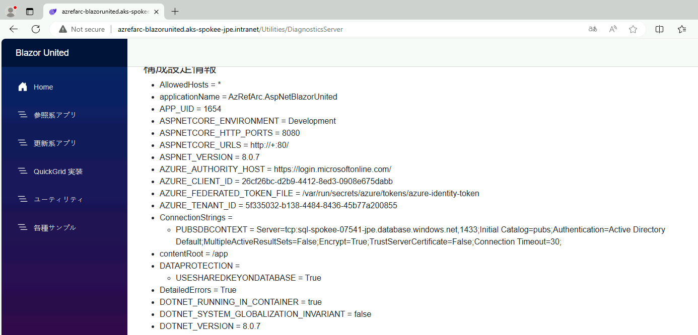

# MID 対応アプリの動作確認

動作確認を取る場合には以下のようにする。

- Step 52_12 と同様に、vm-usr-xxx からアプリへアクセスしてみる。
- その後、アプリメニュー内のリンクから「サーバ側診断情報」のページを開く。
- 設定されている環境変数を確認し、ConnectionStrings 内にユーザ名・パスワードではなく "Authentication=Active Directory Default" が含まれていれば、ワークロード MID でアプリが動作している。

  
