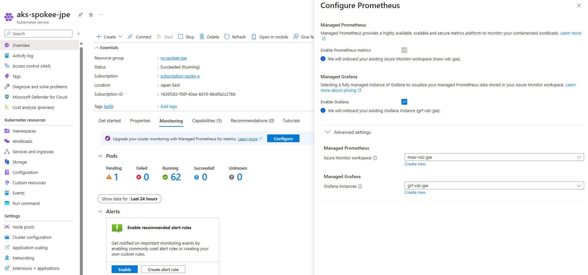
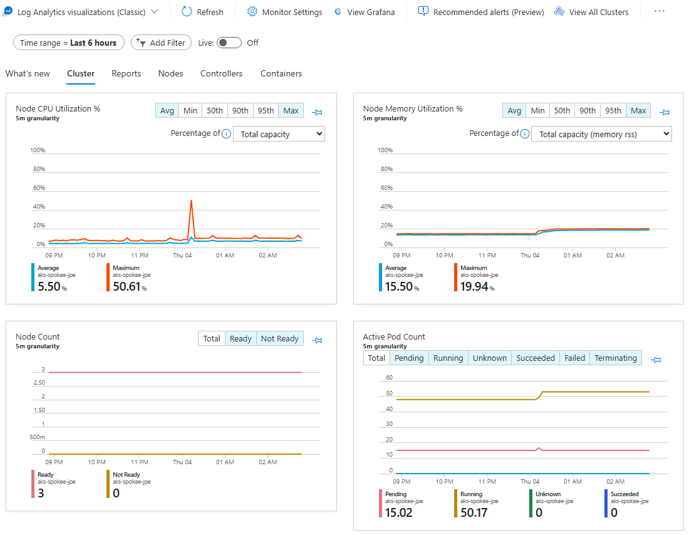

# Prometheus と Grafana の有効化

- Managed Prometheus + Grafana
- https://learn.microsoft.com/ja-jp/azure/aks/network-observability-managed-cli?tabs=non-cilium

## Managed Prometheus と Managed Grafana の有効化

```bash

for i in ${VDC_NUMBERS}; do
TEMP_LOCATION_NAME=${LOCATION_NAMES[$i]}
TEMP_LOCATION_PREFIX=${LOCATION_PREFIXS[$i]}

TEMP_RG_NAME="rg-vdc-${TEMP_LOCATION_PREFIX}"
TEMP_AMW_NAME="maw-vdc-${TEMP_LOCATION_PREFIX}"
TEMP_GRF_NAME="grf-vdc-${TEMP_LOCATION_PREFIX}"

# 共通基盤管理チーム／① 初期構築時の作業アカウントに切り替え
if ${FLAG_USE_SOD}; then if ${FLAG_USE_SOD_SP}; then TEMP_SP_NAME="sp_plat_dev"; az login --service-principal --username ${SP_APP_IDS[${TEMP_SP_NAME}]} --password '${SP_PWDS[${TEMP_SP_NAME}]}' --tenant ${PRIMARY_DOMAIN_NAME} --allow-no-subscriptions; else az account clear; az login -u "user_plat_dev@${PRIMARY_DOMAIN_NAME}" -p "${ADMIN_PASSWORD}"; fi; fi
az account set -s "${SUBSCRIPTION_ID_MGMT}"

# Azure Monitor Workspace の作成 (VDC 管理サブスクリプションに作成)
az monitor account create --name "${TEMP_AMW_NAME}" --resource-group "${TEMP_RG_NAME}" --location "${TEMP_LOCATION_NAME}"

# Azure Managed Grafana の作成 (VDC 管理サブスクリプションに作成)
# ロール割り当て作業が入るため(Microsoft.Authorization/roleAssignments/write)、アカウントを切り替えて作業
# 業務システム統制チーム／③ 構成変更の作業アカウントに切り替え
if ${FLAG_USE_SOD}; then if ${FLAG_USE_SOD_SP}; then TEMP_SP_NAME="sp_gov_change"; az login --service-principal --username ${SP_APP_IDS[${TEMP_SP_NAME}]} --password '${SP_PWDS[${TEMP_SP_NAME}]}' --tenant ${PRIMARY_DOMAIN_NAME} --allow-no-subscriptions; else az account clear; az login -u "user_gov_change@${PRIMARY_DOMAIN_NAME}" -p "${ADMIN_PASSWORD}"; fi; fi
az account set -s "${SUBSCRIPTION_ID_MGMT}"

az grafana create --name "${TEMP_GRF_NAME}" --resource-group "${TEMP_RG_NAME}"

## エンドポイントの表示
#az monitor account show --name "${TEMP_AMW_NAME}" --resource-group "${TEMP_RG_NAME}" --query metrics.prometheusQueryEndpoint -o tsv
#az grafana show  --name "${TEMP_GRF_NAME}" --resource-group "${TEMP_RG_NAME}" --query properties.endpoint -o tsv

# Microsoft.Monitor/accounts/write 権限が spoke E 側のユーザアカウントにはないので、gov_change アカウントで作業を実施
# 業務システム統制チーム／③ 構成変更の作業アカウントに切り替え
if ${FLAG_USE_SOD}; then if ${FLAG_USE_SOD_SP}; then TEMP_SP_NAME="sp_gov_change"; az login --service-principal --username ${SP_APP_IDS[${TEMP_SP_NAME}]} --password '${SP_PWDS[${TEMP_SP_NAME}]}' --tenant ${PRIMARY_DOMAIN_NAME} --allow-no-subscriptions; else az account clear; az login -u "user_gov_change@${PRIMARY_DOMAIN_NAME}" -p "${ADMIN_PASSWORD}"; fi; fi
az account set -s "${SUBSCRIPTION_ID_SPOKE_E}"

# AKS で Prometheus & Grafana を有効化
TEMP_AMW_RES_ID="/subscriptions/${SUBSCRIPTION_ID_MGMT}/resourcegroups/rg-vdc-${TEMP_LOCATION_PREFIX}/providers/microsoft.monitor/accounts/maw-vdc-${TEMP_LOCATION_PREFIX}"
TEMP_GRF_RES_ID="/subscriptions/${SUBSCRIPTION_ID_MGMT}/resourceGroups/rg-vdc-${TEMP_LOCATION_PREFIX}/providers/Microsoft.Dashboard/grafana/grf-vdc-${TEMP_LOCATION_PREFIX}"

TEMP_RG_NAME="rg-spokee-${TEMP_LOCATION_PREFIX}"
TEMP_AKS_CLUSTER_NAME="aks-spokee-${TEMP_LOCATION_PREFIX}"

az aks update --enable-azure-monitor-metrics --name ${TEMP_AKS_CLUSTER_NAME} --resource-group "${TEMP_RG_NAME}" --azure-monitor-workspace-resource-id "${TEMP_AMW_RES_ID}" --grafana-resource-id  "${TEMP_GRF_RES_ID}"

done #i

```

## Managed Prometheus visualization の有効化

ポータルから有効化する

  

  
