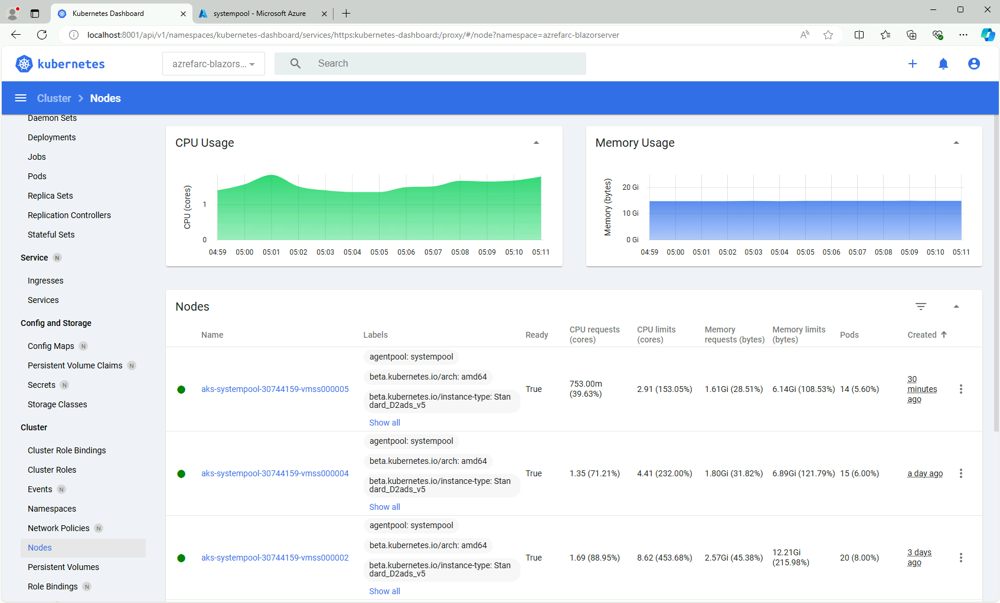

# Kubernetes Dashboard の有効化

以下の手順で k8s Dashboard を利用することができる。ユーザについては https://github.com/kubernetes/dashboard/blob/master/docs/user/access-control/creating-sample-user.md の手順に沿って作成。

vm-mtn-xxx で kubectl を使い、以下を実行

```bash
kubectl apply -f https://raw.githubusercontent.com/kubernetes/dashboard/v2.5.0/aio/deploy/recommended.yaml

kubectl apply -f - <<EOF
apiVersion: v1
kind: ServiceAccount
metadata:
  name: admin-user
  namespace: kubernetes-dashboard
---
apiVersion: rbac.authorization.k8s.io/v1
kind: ClusterRoleBinding
metadata:
  name: admin-user
roleRef:
  apiGroup: rbac.authorization.k8s.io
  kind: ClusterRole
  name: cluster-admin
subjects:
- kind: ServiceAccount
  name: admin-user
  namespace: kubernetes-dashboard
EOF

kubectl -n kubernetes-dashboard create token admin-user
```

上記で表示されるトークンをコピーしておく

```bash
kubectl proxy
```

上記を実行した後、以下の URL にアクセスすると k8s Dashboard が使える。ノードプールの CPU・メモリ要求状況などを簡単に調べることができる。

http://localhost:8001/api/v1/namespaces/kubernetes-dashboard/services/https:kubernetes-dashboard:/proxy/

  
