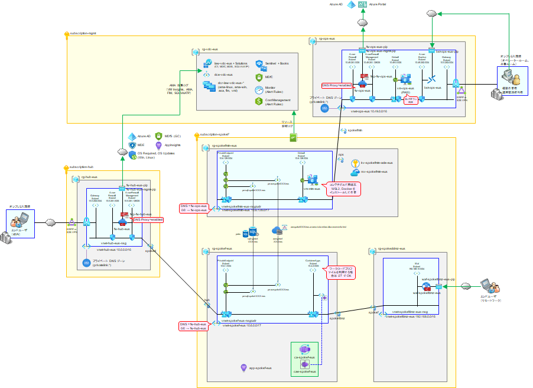
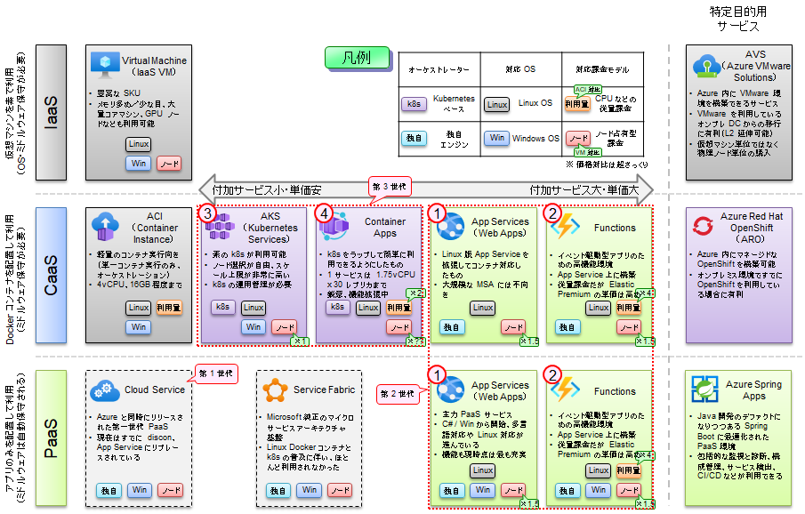
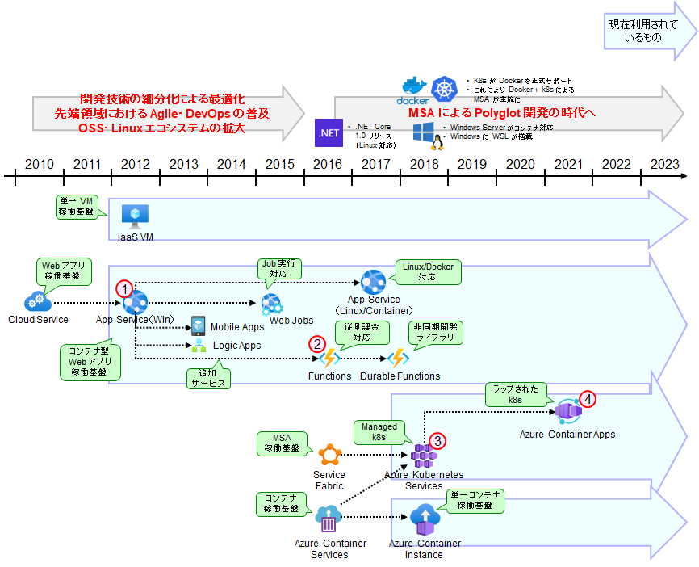

# CaaS 型 Web DB システムについて

Azure では、アプリケーションを動作させるために様々なインフラが利用できますが、コンテナとしてアプリケーションを稼働させたい場合、主に以下の選択肢があります。

- ACI (Azure Container Instance) : 単一のコンテナを VM のように稼働させたい場合に利用
- App Service for Containers : 一層型のコンテナ型 Web アプリを起動させたい場合に利用
- ACA (Azure Container Apps) : Kubernetes を使いたいが、煩わしいインフラ管理を避けたい場合
- AKS (Azure Kubernetes Services) : 素に近い Kubernetes を高度にカスタマイズしながら使いたい場合に利用
- ARO (Azure Redhat OpenShift) : Redhat OpenShift でコンテナを稼働させたい場合に利用

クラウド上でコンテナを稼働させる場合、第一選択として各クラウドベンダーのネイティブ k8s（AWS であれば EKS、GCP であれば GKE、Azure であれば AKS）が挙がることも多いと思います。しかし、ネイティブ k8s は自力で管理しなければならない範囲が広く、しっかりと構築・運用していくためには k8s に関する深い知見がどうしても必要になります。

k8s の良さ（Polyglot 開発や MSA への対応力）をキープしつつ、k8s の基盤管理・保守の煩わしさをマネージド化により排除したものが、ACA (Azure Container Apps) です。（個人的には ACA は Azure の中でも屈指の **神ソリューション** だと思います。よくぞあの複雑な k8s を、本当にやりたいことだけに特化できるようにマネージドサービス化してくれた、と感動します。）

- 主なメリット
  - ネイティブ k8s（AKS など）で必要だった、k8s の基盤管理・運用輔車が不要
  - YAML の記述も不要だが、しっかり Polyglot 開発や MSA 開発に対応できる
  - オートスケーラー、イングレス、MSA フレームワークなども組み込み済み
  - 従量課金モデルも用意されており、小規模なアプリにも適している
- 主な注意点
  - AKS より自由度は低め（組み込み済みのフレームワーク類を変更できないなど）
  - GPU ノードの利用不可、マシンサイズの上限は低め

コンテナ化を通した既存システムのモダナイゼーションや、新規のコンテナアプリ開発などで Azure を使うのであれば、必ず検討すべきソリューションです。リリース当初は VNET 閉域化（ingress/egress lockdown）ができませんでしたが、2023 年前半には対応が進み、エンプラ系でも十分活用できるようになりました。本節では、この ACA を利用して Web-DB アプリを構成します。

  

## （参考）コンピューティングサービスの選択肢について

ご参考までに、Azure のコンピューティングサービスの選択肢とここまでの経緯について示します。詳細は [jp-techdocs](https://github.com/Azure/jp-techdocs) 内の「IaaS/CaaS/PaaS の使い分け」の資料を参照してください。

  

  
