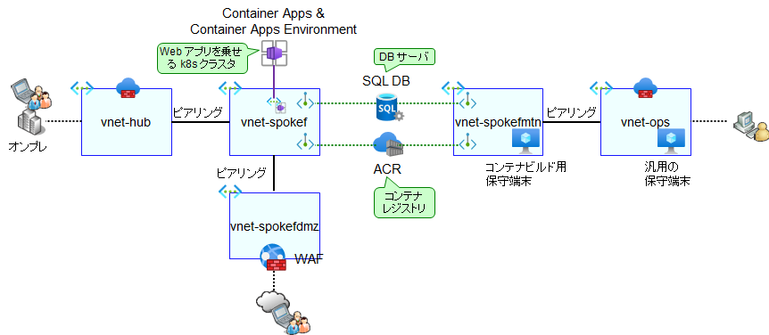

# メンテ用 VNET の作成

本サンプルでは、以下のような VNET 構成を採用しています。

- 本番系ネットワークと運用系ネットワークを分離する（hub に接続される本番系 NW と、ops に接続される運用系 NW とを分離する）
- 運用系 NW 側に、保守端末（コンテナビルド作業のための VM）を一台立てて利用する
- SQL DB, ACR (コンテナレジストリ) は運用保守時にアクセスが必要なため、vnet-spokefmtn-XXX ネットワークにプライベートエンドポイントを引き込んで利用する

なお、ACA（Azure Container Apps）を VNET に組み込む場合、Web Apps や SQL DB などとは異なる VNET 組み込み技術を利用します（＝プライベートエンドポイントやリージョナル VNET 統合などの機能を利用しません）。詳細は CAE (Container Apps Environment) のセクションで解説しますが、Container Apps は本番系 VNET に組み込み、運用系 VNET には接続しません。ACA の設定は Azure Portal から行うこと、また ACA は利用するコンテナさえ取得できればよいことから、運用 NW 側から ACA への直接のアクセス経路を設ける必要はありません。

※ このため、今回作成した Container Apps を呼び出すためには、**本番系 NW（オンプレや Hub VNET）側に、ユーザ端末相当のマシンが必要になります**。Hub 上にユーザ端末相当のマシンが立っていない場合には、[03_03 のスクリプト](../03.ハブサブスクリプションの作成/03_03_（オプション）ユーザVMの作成.md)を使って立てておくようにしてください。

  

まずはメンテ用 VNET を作成します。

```bash

# 業務システム F チーム／① 初期構築の作業アカウントに切り替え
if ${FLAG_USE_SOD} ; then az account clear ; az login -u "user_spokef_dev@${PRIMARY_DOMAIN_NAME}" -p "${ADMIN_PASSWORD}" ; fi
az account set -s "${SUBSCRIPTION_ID_SPOKE_F}"

for i in ${VDC_NUMBERS}; do
TEMP_LOCATION_NAME=${LOCATION_NAMES[$i]}
TEMP_LOCATION_PREFIX=${LOCATION_PREFIXS[$i]}
TEMP_RG_NAME="rg-spokefmtn-${TEMP_LOCATION_PREFIX}"
az group create --name ${TEMP_RG_NAME} --location ${TEMP_LOCATION_NAME}
done # TEMP_LOCATION

# NW 構成管理チーム／③ 構成変更の作業アカウントに切り替え
if ${FLAG_USE_SOD}; then if ${FLAG_USE_SOD_SP}; then TEMP_SP_NAME="sp_nw_change"; az login --service-principal --username ${SP_APP_IDS[${TEMP_SP_NAME}]} --password ${SP_PWDS[${TEMP_SP_NAME}]} --tenant ${PRIMARY_DOMAIN_NAME} --allow-no-subscriptions; else az account clear; az login -u "user_nw_change@${PRIMARY_DOMAIN_NAME}" -p "${ADMIN_PASSWORD}"; fi; fi
az account set -s "${SUBSCRIPTION_ID_SPOKE_F}"
 
for i in ${VDC_NUMBERS}; do
TEMP_LOCATION_NAME=${LOCATION_NAMES[$i]}
TEMP_LOCATION_PREFIX=${LOCATION_PREFIXS[$i]}

# Spoke F 作業用 VNET 作成
TEMP_RG_NAME="rg-spokefmtn-${TEMP_LOCATION_PREFIX}"
TEMP_VNET_NAME="vnet-spokefmtn-${TEMP_LOCATION_PREFIX}"
TEMP_IP_PREFIX=${IP_SPOKE_F_PREFIXS[$i]}
TEMP_VNET_ADDRESS="${TEMP_IP_PREFIX}.128.0/17"
TEMP_SUBNET_DEFAULT="${TEMP_IP_PREFIX}.128.0/24"
TEMP_SUBNET_PE="${TEMP_IP_PREFIX}.129.0/24"
TEMP_NSG_NAME="${TEMP_VNET_NAME}-nsg"
TEMP_UDR_NAME="${TEMP_VNET_NAME}-udr"

az network nsg create --name ${TEMP_NSG_NAME} --resource-group ${TEMP_RG_NAME}
az network route-table create --resource-group ${TEMP_RG_NAME} --name ${TEMP_UDR_NAME}

az network vnet create --resource-group ${TEMP_RG_NAME} --name ${TEMP_VNET_NAME} --address-prefixes ${TEMP_VNET_ADDRESS}
az network vnet subnet create --name "DefaultSubnet" --address-prefix ${TEMP_SUBNET_DEFAULT} --resource-group ${TEMP_RG_NAME} --vnet-name ${TEMP_VNET_NAME} --nsg ${TEMP_NSG_NAME} --route-table ${TEMP_UDR_NAME}
az network vnet subnet create --name "PrivateEndpointSubnet" --address-prefix ${TEMP_SUBNET_PE} --resource-group ${TEMP_RG_NAME} --vnet-name ${TEMP_VNET_NAME} --nsg ${TEMP_NSG_NAME} --route-table ${TEMP_UDR_NAME}

TEMP_FW_IP=$(az network firewall ip-config list -g "rg-ops-${TEMP_LOCATION_PREFIX}" -f "fw-ops-${TEMP_LOCATION_PREFIX}" --query "[0].privateIpAddress" --output tsv --subscription "${SUBSCRIPTION_NAME_MGMT}")
az network route-table route create --resource-group ${TEMP_RG_NAME} --name default --route-table-name ${TEMP_UDR_NAME} --address-prefix 0.0.0.0/0 --next-hop-type VirtualAppliance --next-hop-ip-address ${TEMP_FW_IP}

# VNET Peering
TEMP_OPS_VNET_ID="/subscriptions/${SUBSCRIPTION_ID_MGMT}/resourceGroups/rg-ops-${TEMP_LOCATION_PREFIX}/providers/Microsoft.Network/virtualNetworks/vnet-ops-${TEMP_LOCATION_PREFIX}"
TEMP_SPOKE_VNET_ID="/subscriptions/${SUBSCRIPTION_ID_SPOKE_F}/resourceGroups/${TEMP_RG_NAME}/providers/Microsoft.Network/virtualNetworks/${TEMP_VNET_NAME}"

# Ops → Spoke
az network vnet peering create --name spokefmtn --resource-group "rg-ops-${TEMP_LOCATION_PREFIX}" --vnet-name "vnet-ops-${TEMP_LOCATION_PREFIX}" --remote-vnet $TEMP_SPOKE_VNET_ID --allow-vnet-access --subscription "${SUBSCRIPTION_NAME_MGMT}"

# Spoke → Ops
az network vnet peering create --name ops --resource-group ${TEMP_RG_NAME} --vnet-name ${TEMP_VNET_NAME} --remote-vnet $TEMP_OPS_VNET_ID --allow-vnet-access --subscription "${SUBSCRIPTION_NAME_SPOKE_F}"

# DNS サーバ切り替え
az network vnet update --name ${TEMP_VNET_NAME} --resource-group ${TEMP_RG_NAME} --dns-servers ${TEMP_FW_IP}

done # TEMP_LOCATION

```
