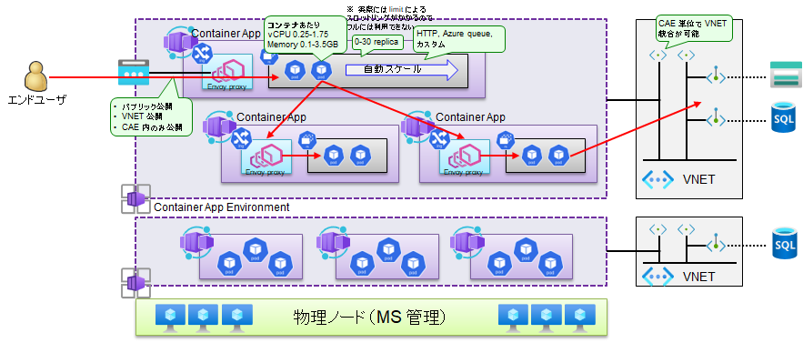

# CAE・CA の作成

続いて、コンテナを展開するためのコンテナアプリ (Container Apps) と、コンテナアプリをホストするための CAE (Container Apps Environment) を作成します。

- CAE (Container Apps Environment) は、コンテナアプリをホストするための「物理実行環境」に該当するものです。
  - k8s でいうところのクラスタに相当します。1 つのコンテナアプリ環境に、複数のコンテナアプリを載せて稼働させることができます。
- CA (Container Apps) が、実際に配置される「アプリケーション」になります。
  - k8s でいうところのレプリカセット＋サービスに相当します。
  - アプリケーションは、「k8s クラスタ内に閉じた形で構成する」「k8s クラスタ外に公開する形で構成する」の 2 パターンが可能です。
  - 後者の「k8s クラスタ外に公開する形で構成する」の場合、CAE が VNET 構成されていない場合にはインターネットに対して公開される形で構成され、CAE が VNET 構成されている場合には VNET 内に対して公開する形で構成されます。

CAE と CA、VNET への組み込みの関係性は下図の通りです。

- VNET への組み込みは CAE 単位に行う形になっています。
- 一つの CAE 内に大量の異なる種類の CA を載せることもできますが、通常は業務システム単位にサブスクリプションや VNET を分離します。このため、「CAE」を一つの業務システムとしての塊に対応させ、関係性のある CA のみを一つの CAE に配置していくという形にするのがよいでしょう。
  - すなわち、1 CAE = 1 業務システム = マイクロサービスとして構成された n 種類の CA、という形で構成するとよいでしょう。（下図の例では、1 つの業務システムが複数のマイクロサービス（CA）から構成されており、それが 1 つの CAE に乗っている、という形になっています。）
  - 今回配置するサンプルアプリはマイクロサービスとして構成されていない通常の Web アプリであるため、1 CAE = 1 業務システム = 1 CA という形で配置します。
  - （参考）もちろん、一つの大きな CAE を共用インフラ的に用意し、様々な種類の軽量な CA をまとめて乗せて使う、という使い方も可能ですが、その場合には CAE のインフラとしてのスケールアップ／スケールアウト上限に注意してください。（CAE/CA が容易に作成できることや、マイクロセグメンテーションの考え方に従うのであれば、インフラをむやみに一つにまとめることはオススメできません。とはいえこのあたりはケースバイケースで検討してください。）

 

本サンプルでは、以下のように構成しています。

- CAE について
  - vnet-spokef-XXX に組み込む形で構成しています。--internal-only true の設定を行い、組み込んだ VNET に UDR を設定することで、inbound と outbound のロックダウンを行います。
  - CAE を稼働させるため、少なくとも MCR (Microsoft Container Registry、マイクロソフトの公式イメージレポジトリ) への経路開放が必要です。このための Azure Firewall (Hub VNET 内)の経路開放も行っています。
- CA について
  - --target-port 80 --ingress external の設定を行うことにより、**k8s クラスタ外に対して**アプリケーションを公開するように設定しています。**CAE が VNET 統合されているため、VNET に対してアプリが公開される形になります**。（インターネットに対してアプリが公開されるわけではありません）　ここでいう "external" とは k8s クラスタに対して外部、という意味であり、パブリックネットワークという意味ではないことに注意してください。
  - 現時点では載せるアプリコンテナの準備が終わっていないため、マイクロソフトの公式サンプルイメージである mcr.microsoft.com/azuredocs/containerapps-helloworld:latest を載せています。（このイメージは MCR から取得することができます。）

```bash

# ==============================
# CAE の作成

# ワークロードプロファイル環境として作成する（UDR によるロックダウンはワークロードプロファイル環境でのみ可能）
# ロックダウン環境では MCR への経路開放が必要
# https://learn.microsoft.com/ja-jp/cli/azure/containerapp/env?view=azure-cli-latest#az-containerapp-env-create
# https://learn.microsoft.com/ja-jp/cli/azure/containerapp/env/workload-profile?view=azure-cli-latest
# ※ CAE は権限リークしている。（Network 権限がなくても CAE を VNET join させることができてしまう。）

# Azure Firewall への経路開放の追加
# NW 構成管理チーム／③ 構成変更の作業アカウントに切り替え
if ${FLAG_USE_SOD}; then if ${FLAG_USE_SOD_SP}; then TEMP_SP_NAME="sp_nw_change"; az login --service-principal --username ${SP_APP_IDS[${TEMP_SP_NAME}]} --password "${SP_PWDS[${TEMP_SP_NAME}]}" --tenant ${PRIMARY_DOMAIN_NAME} --allow-no-subscriptions; else az account clear; az login -u "user_nw_change@${PRIMARY_DOMAIN_NAME}" -p "${ADMIN_PASSWORD}"; fi; fi
az account set -s "${SUBSCRIPTION_ID_SPOKE_F}"

for i in ${VDC_NUMBERS}; do
TEMP_LOCATION_NAME=${LOCATION_NAMES[$i]}
TEMP_LOCATION_PREFIX=${LOCATION_PREFIXS[$i]}
TEMP_RG_NAME="rg-hub-${TEMP_LOCATION_PREFIX}"
TEMP_FWP_NAME="fw-hub-${TEMP_LOCATION_PREFIX}-fwp"
  
az network firewall policy rule-collection-group collection add-filter-collection \
  --resource-group ${TEMP_RG_NAME} --policy-name ${TEMP_FWP_NAME} --rcg-name "AdditionalApplicationRuleCollectionGroup" \
  --name "Spoke F ACAEnv" --rule-type ApplicationRule --collection-priority 50600 --action Allow \
  --rule-name "ACAEnv" \
  --target-fqdns "mcr.microsoft.com" "*.data.mcr.microsoft.com" \
  --source-addresses "*" --protocols Https=443 \
  --subscription ${SUBSCRIPTION_ID_HUB}

done #TEMP_LOCATION


# 業務システム F チーム／① 初期構築の作業アカウントに切り替え
if ${FLAG_USE_SOD}; then if ${FLAG_USE_SOD_SP}; then TEMP_SP_NAME="sp_spokef_dev"; az login --service-principal --username ${SP_APP_IDS[${TEMP_SP_NAME}]} --password "${SP_PWDS[${TEMP_SP_NAME}]}" --tenant ${PRIMARY_DOMAIN_NAME} --allow-no-subscriptions; else az account clear; az login -u "user_spokef_dev@${PRIMARY_DOMAIN_NAME}" -p "${ADMIN_PASSWORD}"; fi; fi
 
for i in ${VDC_NUMBERS}; do
TEMP_LOCATION_NAME=${LOCATION_NAMES[$i]}
TEMP_LOCATION_PREFIX=${LOCATION_PREFIXS[$i]}

TEMP_RG_NAME="rg-spokef-${TEMP_LOCATION_PREFIX}"
TEMP_CAE_NAME="cae-spokef-${TEMP_LOCATION_PREFIX}"
TEMP_VNET_NAME="vnet-spokef-${TEMP_LOCATION_PREFIX}"

TEMP_CAE_SUBNET_ID="/subscriptions/${SUBSCRIPTION_ID_SPOKE_F}/resourceGroups/${TEMP_RG_NAME}/providers/Microsoft.Network/virtualNetworks/${TEMP_VNET_NAME}/subnets/ContainerAppsSubnet"

# Subnet を ContainerAppsEnvironment に委任できるように設定
az network vnet subnet update --ids "${TEMP_CAE_SUBNET_ID}" --delegations "Microsoft.App/environments"
TEMP_CAE_OPTIONS=$( [[ "$FLAG_USE_WORKLOAD_AZ" = true ]] && echo "--zone-redundant" || echo "" )
az containerapp env create --resource-group "${TEMP_RG_NAME}" --name "${TEMP_CAE_NAME}" --location ${TEMP_LOCATION_NAME} --infrastructure-subnet-resource-id "${TEMP_CAE_SUBNET_ID}" --internal-only true --logs-destination azure-monitor --enable-workload-profiles $TEMP_CAE_OPTIONS

# 占有型マシンを追加する場合
# az containerapp env workload-profile add --resource-group "${TEMP_RG_NAME}" --name "${TEMP_CAE_NAME}" --workload-profile-name "wp-d4" --max-nodes 1 --min-nodes 1 --workload-profile-type "D4"

done # TEMP_LOCATION

# ==============================
# サンプル Container App の作成

# 業務システム F チーム／① 初期構築の作業アカウントに切り替え
if ${FLAG_USE_SOD}; then if ${FLAG_USE_SOD_SP}; then TEMP_SP_NAME="sp_spokef_dev"; az login --service-principal --username ${SP_APP_IDS[${TEMP_SP_NAME}]} --password "${SP_PWDS[${TEMP_SP_NAME}]}" --tenant ${PRIMARY_DOMAIN_NAME} --allow-no-subscriptions; else az account clear; az login -u "user_spokef_dev@${PRIMARY_DOMAIN_NAME}" -p "${ADMIN_PASSWORD}"; fi; fi

# Spoke F サブスクリプションで作業
az account set -s "${SUBSCRIPTION_ID_SPOKE_F}"
 
for i in ${VDC_NUMBERS}; do
TEMP_LOCATION_NAME=${LOCATION_NAMES[$i]}
TEMP_LOCATION_PREFIX=${LOCATION_PREFIXS[$i]}

TEMP_RG_NAME="rg-spokef-${TEMP_LOCATION_PREFIX}"
TEMP_CAE_NAME="cae-spokef-${TEMP_LOCATION_PREFIX}"
TEMP_VNET_NAME="vnet-spokef-${TEMP_LOCATION_PREFIX}"

TEMP_CA_NAME="ca-spokef-helloworld-${TEMP_LOCATION_PREFIX}"

# --ingress external にすると、VNET 内に対して公開を行う
# （--ingress internal にすると、ingress サービスが構成されず、k8s 内からしかアクセスできなくなる）
az containerapp create \
  --resource-group "${TEMP_RG_NAME}" \
  --name "${TEMP_CA_NAME}" \
  --target-port 80 \
  --container-name "${TEMP_CA_NAME}" \
  --ingress external \
  --image mcr.microsoft.com/azuredocs/containerapps-helloworld:latest \
  --environment "${TEMP_CAE_NAME}" \
  --workload-profile-name "Consumption" \
  --system-assigned

done # TEMP_LOCATION

```
