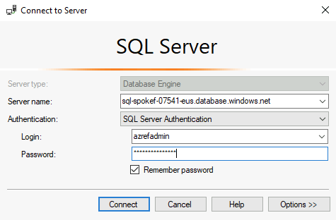

# SQL DB のセットアップ

続いて、業務アプリで利用する SQL DB のデータをセットアップします。作業にサーバ名などを利用しますが、これらはいったん bash コマンドで生成しておくと便利です。

```bash

cat << EOF
以下を利用します。
SQLDB : sql-spokef-${UNIQUE_SUFFIX}-${TEMP_LOCATION_PREFIX}.database.windows.net
EOF

```

※ （参考）以降の作業は、Spoke A (IaaS), Spoke B (PaaS) で行ったものと同じです。このため、もし vm-ops-XXX 上にすでに SSMS (SQL Server Management Studio) をセットアップしているようであれば、そこから Spoke F の SQL DB にアクセスして pubs データベースをセットアップしてください。ここでは vm-mtn-XXX 上に SSMS をセットアップしてサンプルデータベースを準備する方法を解説します。

## vm-mtn-XXX に Bastion 経由でログオンし、必要なファイルをダウンロード

- SQL Server Developer Edition のメディアと SSMS のメディアをダウンロード
  - SQL Management Studio (SSMS)
    - Edge ブラウザを立ち上げて、以下からダウンロード
    - https://learn.microsoft.com/en-us/sql/ssms/download-sql-server-management-studio-ssms
    - ダウンロード後、SSMS-Setup-ENU.exe を vm-ops 端末上で実行して SSMS をインストールする
- データベースのサンプルスクリプトをダウンロード
  - 以下をダウンロード
    - https://github.com/nakamacchi/AzRefArc.SqlDb/raw/main/pubs_azure_with_timestamp.sql

## SQL Database のセットアップ

- vm-mtn-XXX 端末で SSMS を起動し、以下の設定で接続
  - Server name : sql-spokef-XXX-XXX.database.windows.net
  - Authentication : SQL Server Authentication
  - Login : azrefadmin
  - Password : p&ssw0rdp&ssw0rd
- pubs データベースに入った後、以下のファイルの SQL 文を実行してテーブルとデータを作成
  - pubs_azure_with_timestamp.sql

DB 作成後、追加で以下の T-SQL を実行し、テーブルを作成してください。

```bash

CREATE TABLE [dbo].[DataProtectionKeys] ( [ID][int] IDENTITY(1, 1) NOT NULL PRIMARY KEY, [FriendlyName] [varchar] (64) NULL, [Xml][text] NULL)

```

  

  
