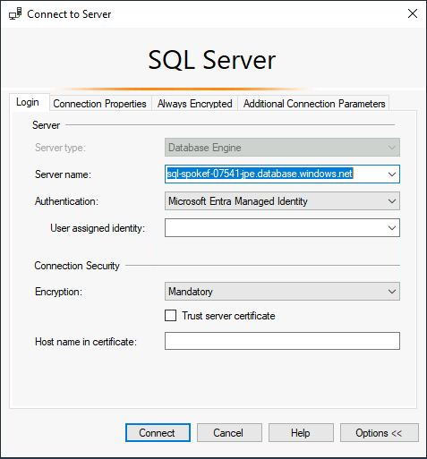
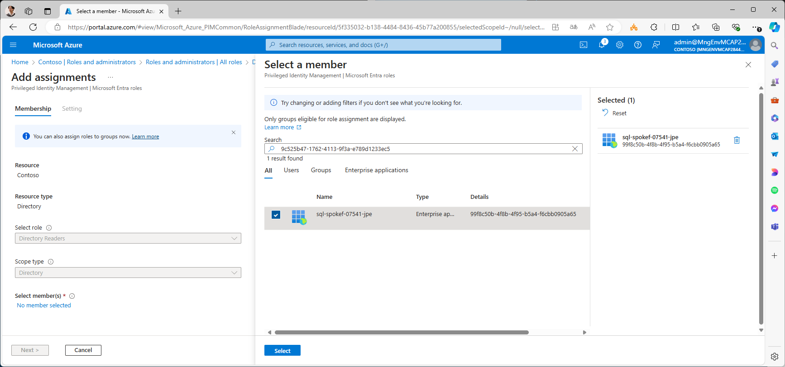
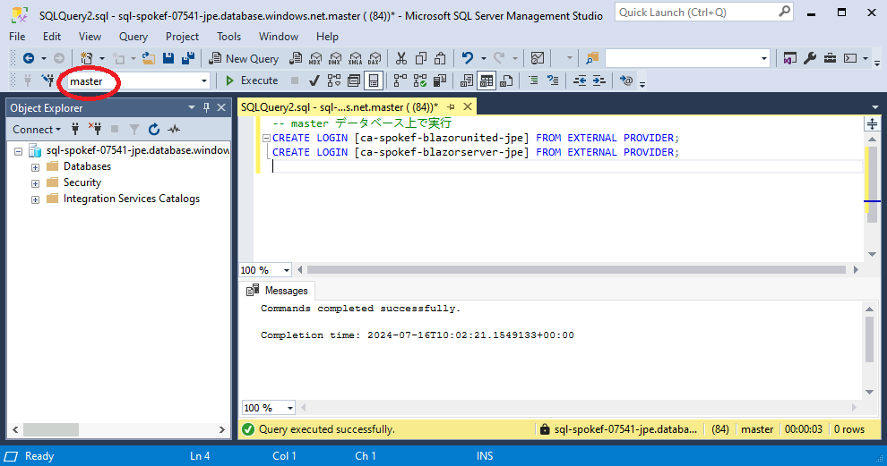
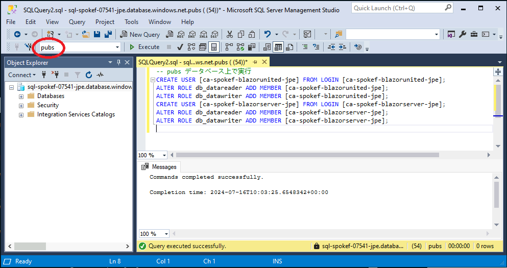
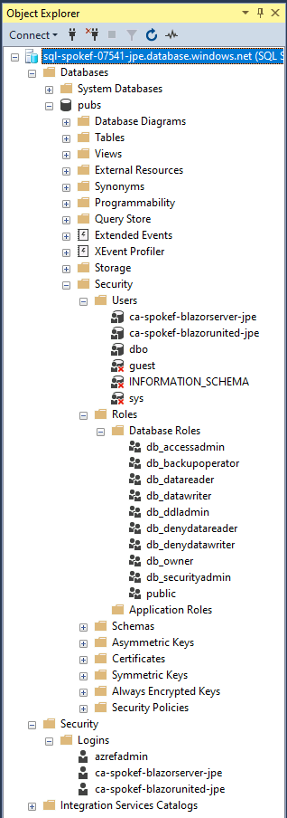

# SQL DB の認証方式の変更

ここまで SQL DB へのアクセス方法や認証方法には SQL Server 認証方式（ユーザ ID・パスワード）を利用してきましたが、クリアテキストパスワードを利用する方法はセキュリティ的には避けるべき方式です。ここでは、以下のような方式を取ることで、ユーザ ID・パスワードによる認証を Entra ID 認証に切り替えます。

- SQL 論理サーバで Entra ID による認証を有効化する
- vm-mtn-XXX からのアクセスを、システム割り当て Managed ID による認証に切り替える
- Container Apps からのアクセスを、システム割り当て Managed ID による認証に切り替える

最後の「Container Apps からのアクセスを、システム割り当て Managed ID による認証に切り替える」の作業は、さらに以下に細分化されます。

- SQL 論理サーバのシステム割り当て Managed ID の有効化と Directory Readers ロールの割り当て
- Container Apps のシステム割り当て Managed ID への SQL DB アクセス権限の付与
- Container Apps 用の Azure Firewall ルールの構成
- Container Apps の接続文字列の切り替え

以下に手順を示します。

## SQL 論理サーバでの Entra ID 認証の有効化

以下を実行し、SQL 論理サーバに Entra ID 管理者を追加します。

- 通常は Entra ID ユーザアカウントを追加しますが、ここでは vm-mtn-XXX の Managed ID を管理者として追加します。
- これにより vm-mtn-XXX から SQL DB へアクセスすると、パスワードなしで管理者としてアクセスできるようになります。
- さらに、SQL 論理サーバでの通常の SQL Server 認証を無効化します。これにより、このマシン以外からの管理者アクセスができなくなります。

```bash

# 業務システム F チーム／① 初期構築の作業アカウントに切り替え
if ${FLAG_USE_SOD}; then if ${FLAG_USE_SOD_SP}; then TEMP_SP_NAME="sp_spokef_dev"; az login --service-principal --username ${SP_APP_IDS[${TEMP_SP_NAME}]} --password "${SP_PWDS[${TEMP_SP_NAME}]}" --tenant ${PRIMARY_DOMAIN_NAME} --allow-no-subscriptions; else az account clear; az login -u "user_spokef_dev@${PRIMARY_DOMAIN_NAME}" -p "${ADMIN_PASSWORD}"; fi; fi

# Spoke F サブスクリプションで作業
az account set -s "${SUBSCRIPTION_ID_SPOKE_F}"

for i in ${VDC_NUMBERS}; do
TEMP_LOCATION_NAME=${LOCATION_NAMES[$i]}
TEMP_LOCATION_PREFIX=${LOCATION_PREFIXS[$i]}
TEMP_RG_NAME="rg-spokef-${TEMP_LOCATION_PREFIX}"

TEMP_SQL_SERVER_NAME="sql-spokef-${UNIQUE_SUFFIX}-${TEMP_LOCATION_PREFIX}"
TEMP_SQL_DB_NAME="pubs"

TEMP_VM_ID="/subscriptions/${SUBSCRIPTION_ID_SPOKE_F}/resourceGroups/rg-spokefmtn-${TEMP_LOCATION_PREFIX}/providers/Microsoft.Compute/virtualMachines/vm-mtn-${TEMP_LOCATION_PREFIX}"
TEMP_IDENTITY_ID=$(az vm show --id ${TEMP_VM_ID} --query identity.principalId -o tsv)

# SQL DB に Entra ID 管理者として vm-mtn の MID を追加する
az sql server ad-admin create \
    --resource-group ${TEMP_RG_NAME} \
    --server ${TEMP_SQL_SERVER_NAME} \
    --display-name "vm-mtn-${TEMP_LOCATION_PREFIX}" \
    --object-id ${TEMP_IDENTITY_ID}

# SQL DB の認証を Entra ID 認証に限定する
az sql server ad-only-auth enable --resource-group ${TEMP_RG_NAME} --name ${TEMP_SQL_SERVER_NAME}

done #i

```

## vm-mtn-XXX からのアクセス方式の切り替え

引き続き、vm-mtn-XXX にログインし、SQL Server Management Studio (SSMS) からのアクセスを Managed ID に切り替えます。

- SQL Server Management Studio 上で接続が残っている場合には、いったんすべて切断します。（そのまま使おうとしても再接続できません）
- 改めて SQL DB に接続しなおします。
  - Authentication として Microsoft Entra Managed Identity を選択
  - User assigned idnetity は空欄
- これにより、管理者として SQL DB へ接続することができます。

  

## SQL 論理サーバのシステム割り当て Managed ID の有効化と Directory Readers ロールの割り当て

Container Apps のシステム割り当て MID に SQL DB へのアクセス権限を与える際、SQL DB が Entra ID の情報を確認する必要があります。このため、以下の 2 つの作業を行います。

- SQL DB（SQL 論理サーバ）に対してシステム割り当て MID を有効化する
- システム割り当て MID に対して Entra ID RBAC を用いて Directory Readers ロールを割り当てる（※ コマンドラインからの実行が困難なため、GUI から Entra ID 管理者が行います）

まず、SQL DB（SQL 論理サーバ）に対してシステム割り当て MID を有効化します。実行後に得られる SQL 論理サーバの Principal ID をメモしておきます。

```bash

# 業務システム F チーム／① 初期構築の作業アカウントに切り替え
if ${FLAG_USE_SOD}; then if ${FLAG_USE_SOD_SP}; then TEMP_SP_NAME="sp_spokef_dev"; az login --service-principal --username ${SP_APP_IDS[${TEMP_SP_NAME}]} --password "${SP_PWDS[${TEMP_SP_NAME}]}" --tenant ${PRIMARY_DOMAIN_NAME} --allow-no-subscriptions; else az account clear; az login -u "user_spokef_dev@${PRIMARY_DOMAIN_NAME}" -p "${ADMIN_PASSWORD}"; fi; fi

# Spoke F サブスクリプションで作業
az account set -s "${SUBSCRIPTION_ID_SPOKE_F}"

for i in ${VDC_NUMBERS}; do
TEMP_LOCATION_NAME=${LOCATION_NAMES[$i]}
TEMP_LOCATION_PREFIX=${LOCATION_PREFIXS[$i]}
TEMP_RG_NAME="rg-spokef-${TEMP_LOCATION_PREFIX}"
TEMP_SQL_SERVER_NAME="sql-spokef-${UNIQUE_SUFFIX}-${TEMP_LOCATION_PREFIX}"
TEMP_SQL_DB_NAME="pubs"

# SQL DB の論理サーバに対して MID を有効化
az sql server update --resource-group ${TEMP_RG_NAME} --name ${TEMP_SQL_SERVER_NAME} --assign_identity

# SQL 論理サーバの Principal ID を取得
TEMP_SQL_SERVER_PRINCIPAL_ID=$(az sql server show --resource-group ${TEMP_RG_NAME} --name ${TEMP_SQL_SERVER_NAME} --query identity.principalId -o tsv)
echo $TEMP_SQL_SERVER_PRINCIPAL_ID

done #i

```

次に、SQL 論理サーバが Entra ID Directory を読み取れるようにするために、MID に Directory Readers ロールを割り当てます。この作業はコマンドラインからは難しいので、GUI から行います。

- ポータル > Microsoft Entra ID > Roles and administrators
- Directory Readers ロールを探し、+ Add assignments を実施
- 先に取得した Principal ID のオブジェクトをメンバーとして追加
- Assignment type = Active, Permanently assigned を選択し、Enter justification には適当な文字を入れる（例：For Entra ID Authentication）

  

## Container Apps のシステム割り当て Managed ID への SQL DB アクセス権限の付与

次に、Container Apps のシステム割り当て Managed ID へ、SQL DB のアクセス権限を付与します。付与すべき権限は以下の 2 つです。

- master データベース上で実施
  - SQL 論理サーバへのログイン権限
- pubs データベース上で実施
  - pubs データベースへのアクセス権限
  - pubs データベース内におけるデータの読み書き権限（db_datareader 及び db_datawriter ロールへの割り当て）

まず、以下のスクリプトを実行し、T-SQL スクリプトを作成します。

```bash

clear

for i in ${VDC_NUMBERS}; do
TEMP_LOCATION_NAME=${LOCATION_NAMES[$i]}
TEMP_LOCATION_PREFIX=${LOCATION_PREFIXS[$i]}

for TEMP_APP_NAME in "blazorunited" "blazorserver"; do
TEMP_USER_ASSIGNED_IDENTITY_NAME="ca-spokef-${TEMP_APP_NAME}-${TEMP_LOCATION_PREFIX}"

cat <<EOF
-- master データベース上で実行
CREATE LOGIN [${TEMP_USER_ASSIGNED_IDENTITY_NAME}] FROM EXTERNAL PROVIDER;

-- pubs データベース上で実行
CREATE USER [${TEMP_USER_ASSIGNED_IDENTITY_NAME}] FROM LOGIN [${TEMP_USER_ASSIGNED_IDENTITY_NAME}];
ALTER ROLE db_datareader ADD MEMBER [${TEMP_USER_ASSIGNED_IDENTITY_NAME}];
ALTER ROLE db_datawriter ADD MEMBER [${TEMP_USER_ASSIGNED_IDENTITY_NAME}];

EOF

done #TEMP_APP_NAME
done #TEMP_LOCATION

```

これにより以下のような T-SQL スクリプトが得られます。

```T-SQL

-- master データベース上で実行
CREATE LOGIN [ca-spokef-blazorunited-jpe] FROM EXTERNAL PROVIDER;

-- pubs データベース上で実行
CREATE USER [ca-spokef-blazorunited-jpe] FROM LOGIN [ca-spokef-blazorunited-jpe];
ALTER ROLE db_datareader ADD MEMBER [ca-spokef-blazorunited-jpe];
ALTER ROLE db_datawriter ADD MEMBER [ca-spokef-blazorunited-jpe];

-- master データベース上で実行
CREATE LOGIN [ca-spokef-blazorserver-jpe] FROM EXTERNAL PROVIDER;

-- pubs データベース上で実行
CREATE USER [ca-spokef-blazorserver-jpe] FROM LOGIN [ca-spokef-blazorserver-jpe];
ALTER ROLE db_datareader ADD MEMBER [ca-spokef-blazorserver-jpe];
ALTER ROLE db_datawriter ADD MEMBER [ca-spokef-blazorserver-jpe];

```

vm-mtn-XXX へログインし、SQL Server Management Studio へ管理者権限で接続して実行します。下図のように、接続先のデータベースを切り替えながら、上記のスクリプトを実行してください。

  

  

これにより、SQL Server ログインと DB ユーザが登録されます。

  

## Container Apps 用の Azure Firewall ルールの構成

Managed ID によるリソースアクセスを行う際のトークンを取得できるように、Azure Firewall ルールを構成します。

```bash

# NW 構成管理チーム／③ 構成変更の作業アカウントに切り替え
if ${FLAG_USE_SOD}; then if ${FLAG_USE_SOD_SP}; then TEMP_SP_NAME="sp_nw_change"; az login --service-principal --username ${SP_APP_IDS[${TEMP_SP_NAME}]} --password "${SP_PWDS[${TEMP_SP_NAME}]}" --tenant ${PRIMARY_DOMAIN_NAME} --allow-no-subscriptions; else az account clear; az login -u "user_nw_change@${PRIMARY_DOMAIN_NAME}" -p "${ADMIN_PASSWORD}"; fi; fi

# ハブサブスクリプションに切り替え
az account set -s "${SUBSCRIPTION_ID_HUB}"

for i in ${VDC_NUMBERS}; do
TEMP_LOCATION_NAME=${LOCATION_NAMES[$i]}
TEMP_LOCATION_PREFIX=${LOCATION_PREFIXS[$i]}

# 操作する Firewall Policy
TEMP_RG_NAME="rg-hub-${TEMP_LOCATION_PREFIX}"
TEMP_FWP_NAME="fw-hub-${TEMP_LOCATION_PREFIX}-fwp"
# 通信元
TEMP_IP_PREFIX=${IP_SPOKE_F_PREFIXS[$i]}
TEMP_SUBNET_CA="${TEMP_IP_PREFIX}.2.0/24"

az network firewall policy rule-collection-group collection add-filter-collection \
--resource-group ${TEMP_RG_NAME} --policy-name ${TEMP_FWP_NAME} --rcg-name "DefaultApplicationRuleCollectionGroup" \
--name "Spoke F ACA" --rule-type ApplicationRule --collection-priority 50600 --action Allow \
--rule-name "EntraID" \
--target-fqdns "*.identity.azure.net" "*.login.microsoft.com" \
--source-addresses ${TEMP_SUBNET_CA} --protocols Https=443

done # TEMP_LOCATION

```

## Container Apps の接続文字列の切り替え

最後に、Container Apps の接続文字列を切り替え、Managed ID を使った認証方式に切り替えます。

- 接続文字列として User ID=xxxx;Password=yyyy のかわりに Authentication=Active Directory Default を指定します。

```bash

# 2 つのアプリをデプロイする
for TEMP_APP_NAME in "blazorserver" "blazorunited"; do

# 業務システム F チーム／① 初期構築の作業アカウントに切り替え
if ${FLAG_USE_SOD}; then if ${FLAG_USE_SOD_SP}; then TEMP_SP_NAME="sp_spokef_dev"; az login --service-principal --username ${SP_APP_IDS[${TEMP_SP_NAME}]} --password "${SP_PWDS[${TEMP_SP_NAME}]}" --tenant ${PRIMARY_DOMAIN_NAME} --allow-no-subscriptions; else az account clear; az login -u "user_spokef_dev@${PRIMARY_DOMAIN_NAME}" -p "${ADMIN_PASSWORD}"; fi; fi

# Spoke F サブスクリプションで作業
az account set -s "${SUBSCRIPTION_ID_SPOKE_F}"

for i in ${VDC_NUMBERS}; do
TEMP_LOCATION_NAME=${LOCATION_NAMES[$i]}
TEMP_LOCATION_PREFIX=${LOCATION_PREFIXS[$i]}

TEMP_RG_NAME="rg-spokef-${TEMP_LOCATION_PREFIX}"
TEMP_SQL_SERVER_NAME="sql-spokef-${UNIQUE_SUFFIX}-${TEMP_LOCATION_PREFIX}"
TEMP_SQL_DB_NAME="pubs"

TEMP_CA_NAME="ca-spokef-${TEMP_APP_NAME}-${TEMP_LOCATION_PREFIX}"
TEMP_ACR_NAME="acrspokef${UNIQUE_SUFFIX}${TEMP_LOCATION_PREFIX}"
TEMP_IMAGE_NAME="${TEMP_ACR_NAME}.azurecr.io/azrefarc.${TEMP_APP_NAME}:latest"

# 接続文字列を変更したコンテナをデプロイする
az containerapp update --resource-group "${TEMP_RG_NAME}" --name "${TEMP_CA_NAME}" --image "${TEMP_IMAGE_NAME}" --workload-profile-name "Consumption" --set-env-vars "CONNECTIONSTRINGS__PUBSDBCONTEXT=Server=tcp:${TEMP_SQL_SERVER_NAME}.database.windows.net,1433;Initial Catalog=${TEMP_SQL_DB_NAME};Authentication=Active Directory Default;MultipleActiveResultSets=False;Encrypt=True;TrustServerCertificate=False;Connection Timeout=30;" "DATAPROTECTION__USESHAREDKEYONDATABASE=True" --min-replicas 3

done # TEMP_LOCATION

done # TEMP_APP_NAME

```

以上が完了したら、vm-usr-XXX などから Container Apps の稼働を確認してください。

