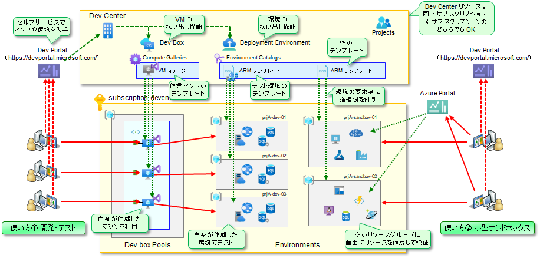

# DevCenter について

クラウドを活用してシステム開発の効率を高めていく（ひいてはシステム開発コストを低減していく）ためには、システム開発のやり方を、実機ベースの増分開発スタイルに変えていく必要があります。このために欠かせないのが、「開発者が実際に『触って試せる環境』をスムーズに提供できる機能」です。Azure にはこの目的に活用できる機能がいくつかあり、その中でも特に重要なものが以下の 2 つのサービスになります。

- DevBox : 開発者がオンデマンド・セルフサービスで入手できる開発用マシン
- Deployment Environment : 開発者がオンデマンド・セルフサービスで入手できる開発・テスト用環境

  

活用方法は多岐に渡りますが、真っ先に重要なのが「Deployment Environment を使った、自由に触れる Azure 環境の提供」です。

- 開発者が自由に触れる Azure 環境を提供することで、開発者が Azure の機能を自由に試せるようになる
- その結果として、
  - Azure の機能を活用したシステム開発のスキルを習得しやすくなる
  - 机上での検討だけでは見えてこなかった課題が見えてくるようになる
  - 設計精度が向上し、開発の手戻りを減らせるようになる

本モジュールでは、まず Deployment Environment を使った Azure 環境の提供方法を学び、その後に DevBox を使った開発環境の提供方法を学びます。
