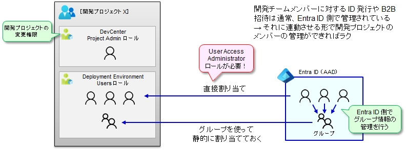

# プロジェクト管理者・開発者の割り当て

開発プロジェクトに、プロジェクト管理者と開発者の割り当てを行います。

- この作業により、以下が行えるようになります。
  - プロジェクト管理者 : 自プロジェクトで利用する DevBox, Deployment Envionment を DevCenter から選べるようになります。
  - 開発者 : セルフサービスポータル (devbox.microsoft.com) へアクセスして、開発マシンや開発環境の払い出しを行えるようになります。
- いずれも RBAC ロール割り当てにより行います。
  - プロジェクト管理者 : DevCenter の管理者ロールである、DevCenter Project Admin ロールを割り当てます。
  - 開発者 : DevCenter Dev Box User, Deployment Environments User ロールを割り当てます。

なお実際の運用で注意すべき点として、開発者の増減への対応方法を考えておく必要があります。RBAC ロール割り当て（IAM）を使ってメンバーの増減をするためには（＝開発者を各開発プロジェクトに直接 RBAC で割り当てるには）、User Access Administrator という高権限が必要になります。高権限割り当てを避けるためには、予め Entra ID (AAD) グループで開発メンバーを束ねておき、Azure RBAC としては固定的にロールを割り当てておく（そして開発メンバーの増減は Entra ID グループへのメンバーの増減で対応し、Azure RBAC はいじらない）方法がオススメです。

  

```bash

if ${FLAG_USE_SOD} ; then az account clear ; az login -u "user_dev1_dev@${PRIMARY_DOMAIN_NAME}" -p "${ADMIN_PASSWORD}" ; fi
az account set -s "${SUBSCRIPTION_ID_DEV1}"

TEMP_LOCATION_NAME=${LOCATION_NAMES[0]}
TEMP_LOCATION_PREFIX=${LOCATION_PREFIXS[0]}
TEMP_RG_NAME="rg-devcenter-${TEMP_LOCATION_PREFIX}"
TEMP_DC_NAME="dc-devcenter-${TEMP_LOCATION_PREFIX}"

TEMP_DEVCENTER_ID="/subscriptions/${SUBSCRIPTION_ID_DEV1}/resourceGroups/${TEMP_RG_NAME}/providers/Microsoft.DevCenter/devcenters/${TEMP_DC_NAME}"
TEMP_PROJECT_X_ID="/subscriptions/${SUBSCRIPTION_ID_DEV1}/resourceGroups/${TEMP_RG_NAME}/providers/Microsoft.DevCenter/projects/DevProjectX"
TEMP_PROJECT_Y_ID="/subscriptions/${SUBSCRIPTION_ID_DEV1}/resourceGroups/${TEMP_RG_NAME}/providers/Microsoft.DevCenter/projects/DevProjectY"

TEMP_GROUP_PROJECTX_ID=$(az ad group show --group group_projectx_devmembers --query id -o tsv)
TEMP_GROUP_PROJECTY_ID=$(az ad group show --group group_projecty_devmembers --query id -o tsv)

TEMP_ROLE_ASSIGNMENT_DEFS="\
user_projectx_admin@${PRIMARY_DOMAIN_NAME},DevCenter_Project_Admin,${TEMP_PROJECT_X_ID} \
user_projecty_admin@${PRIMARY_DOMAIN_NAME},DevCenter_Project_Admin,${TEMP_PROJECT_Y_ID} \
${TEMP_GROUP_PROJECTX_ID},DevCenter_Dev_Box_User,${TEMP_PROJECT_X_ID} \
${TEMP_GROUP_PROJECTX_ID},Deployment_Environments_User,${TEMP_PROJECT_X_ID} \
${TEMP_GROUP_PROJECTY_ID},DevCenter_Dev_Box_User,${TEMP_PROJECT_Y_ID} \
${TEMP_GROUP_PROJECTY_ID},Deployment_Environments_User,${TEMP_PROJECT_Y_ID} \
"

for TEMP_ROLE_ASSIGNMENT_DEF in $TEMP_ROLE_ASSIGNMENT_DEFS; do
  # 分解して利用
  TEMP=(${TEMP_ROLE_ASSIGNMENT_DEF//,/ })
  TEMP_USER_ID=${TEMP[0]}
  TEMP_ROLE_NAME=${TEMP[1]//_/ }
  TEMP_SCOPE_NAME=${TEMP[2]}
  echo $TEMP_USER_ID $TEMP_ROLE_NAME $TEMP_SCOPE_NAME

# すでに割り当て済みかを確認してから割り当てる
# 標準ロールの場合：割り当てが行われているかを確認
TEMP_RA_EXISTS=$(az role assignment list --assignee "${TEMP_USER_ID}" --scope "${TEMP_SCOPE_NAME}" --query "[? roleDefinitionName == '${TEMP_ROLE_NAME}']" -o tsv)
if [ -z "${TEMP_RA_EXISTS}" ]; then
  # カスタムロールの場合：割り当てが行われているかを確認
  TEMP_RA_EXISTS=$(az role assignment list --assignee "${TEMP_USER_ID}" --scope "${TEMP_SCOPE_NAME}" --query "[? ends_with(roleDefinitionId , '${TEMP_ROLE_NAME}')]" -o tsv)
  if [ -z "${TEMP_RA_EXISTS}" ]; then
    TEMP_ROLE_ASSIGNMENT_ID=$(uuidgen --sha1 --namespace @oid --name "${TEMP_ROLE_ASSIGNMENT_DEF}")
    echo "Role assignmet does not exist. Creating assignments... ${TEMP_ROLE_ASSIGNMENT_DEF} ${TEMP_ROLE_ASSIGNMENT_ID}"
    az role assignment create --name ${TEMP_ROLE_ASSIGNMENT_ID} --assignee "${TEMP_USER_ID}" --role "${TEMP_ROLE_NAME}" --scope "${TEMP_SCOPE_NAME}"
  else
    echo "role assignmet already exists.(custom roles ${TEMP_ROLE_NAME})"
  fi
else
  echo "role assignmet already exists. (built-in roles ${TEMP_ROLE_NAME})"
fi
done # TEMP_ROLE_ASSIGNMENT_DEF

```
