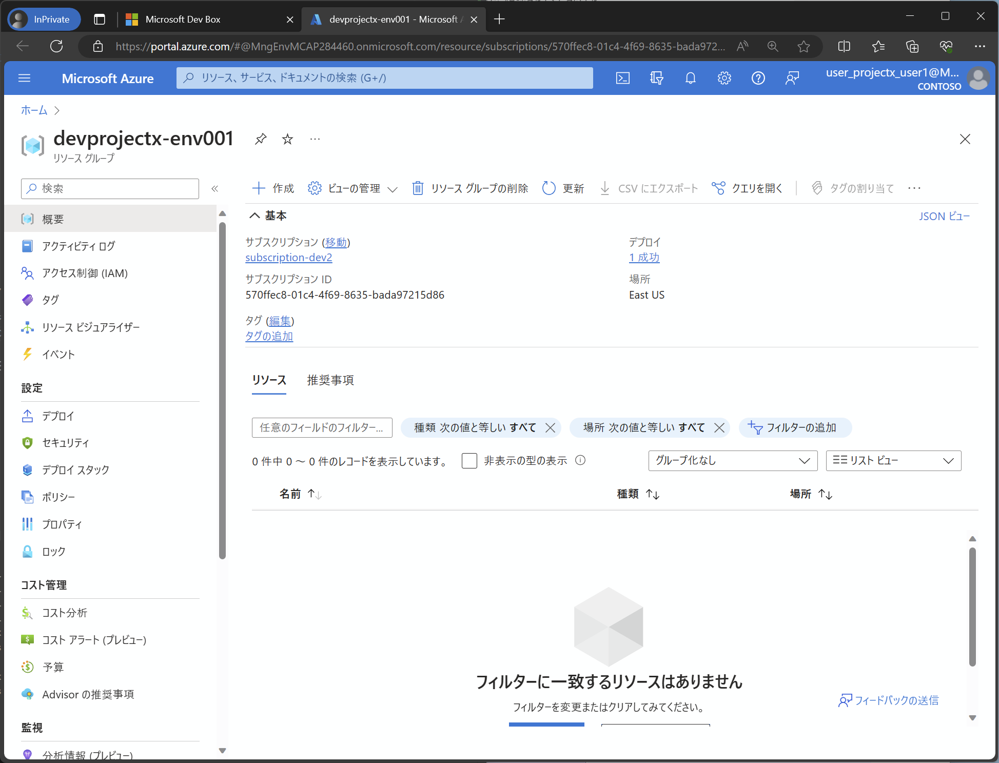

# 環境作成のテスト

ここまでの作業により Deployment Environment が使えるようになったので、実際に環境を作成してみます。

## ユーザアカウントについて

以下のスクリプトで、ログインに利用するユーザアカウントを取得しておいてください。

```bash

cat <<EOF
user_projectx_user1@${PRIMARY_DOMAIN_NAME}
user_projectx_user2@${PRIMARY_DOMAIN_NAME}
user_projectx_user3@${PRIMARY_DOMAIN_NAME}
user_projectx_admin@${PRIMARY_DOMAIN_NAME}
EOF

```

## セルフサービスポータルからの環境要求

- セルフサービスポータル https://devbox.microsoft.com/ に（別アカウント利用のために InPrivate モードなどを使って）アクセスし、user_projectx_user1 でログインします。
- アクセス後、"Sandbox-Empty" サンプルテンプレートを利用して、空の環境を作成してください。（環境名は env001 などとしてください）
- 環境が作成されたのち、「環境リソース」ボタンを押すと、Azure Portal の当該リソースグループの管理画面へ遷移します。
  - リソースグループ名が "DevProjextX-env001" のように、プロジェクト名＋環境名となっていることを確認してください。
  - **このリソースグループ名はサブスクリプション内で一意である必要があります**。リソースグループ名には環境定義名（ARM テンプレートの種類の名前）は含まれないことにも注意してください。

  

  

## コマンドラインからの環境要求

- 前述の作業はコマンドライン（az cli など）から行うこともできます。
- 例えば user_projectx_user2 が env002 という名前で Sandbox-Empty テンプレートを展開する場合は以下のようになります。

※ MFA 環境の場合には、ログイン処理を手作業で行ってください。

```bash

if ${FLAG_USE_SOD} ; then az account clear ; az login -u "user_projectx_user2@${PRIMARY_DOMAIN_NAME}" -p "${ADMIN_PASSWORD}" ; fi

TEMP_LOCATION_NAME=${LOCATION_NAMES[0]}
TEMP_LOCATION_PREFIX=${LOCATION_PREFIXS[0]}
TEMP_RG_NAME="rg-devcenter-${TEMP_LOCATION_PREFIX}"
TEMP_DC_NAME="dc-devcenter-${TEMP_LOCATION_PREFIX}"
TEMP_CAT_NAME="AzureCAF.LandingZones.Demo.DepEnvTemplates"
TEMP_PRJ_NAME="DevProjectX"
TEMP_ENV_TYPE_NAME="Sandbox"
TEMP_ENV_DEF_NAME="Sandbox-Empty"

# パラメータが必要な場合は parameters オプションで指定
# https://learn.microsoft.com/en-us/cli/azure/devcenter/dev/environment?view=azure-cli-latest#az-devcenter-dev-environment-create
az devcenter dev environment create \
  --dev-center $TEMP_DC_NAME \
  --project $TEMP_PRJ_NAME \
  --environment-type $TEMP_ENV_TYPE_NAME \
  --catalog-name $TEMP_CAT_NAME \
  --environment-definition-name $TEMP_ENV_DEF_NAME \
  --environment-name "env002"

```

- 同じことを REST API で行う場合には少し工夫が必要です。（--resource "https://devcenter.azure.com/" の指定が必要）
- 例えば user_projectx_user3 が env003 という名前で Sandbox-Empty テンプレートを展開する場合は以下のようになります。

```bash

if ${FLAG_USE_SOD} ; then az account clear ; az login -u "user_projectx_user3@${PRIMARY_DOMAIN_NAME}" -p "${ADMIN_PASSWORD}" ; fi

# REST API で作成する場合には以下の通り
# https://learn.microsoft.com/en-us/rest/api/devcenter/developer/environments/create-or-replace-environment?tabs=HTTP

# まず DevCenter の URI を入手
# 例）https://5f335032-b138-4484-8436-45b77a200855-dc-devcenter-eus.eastus.devcenter.azure.com/
# DevCenter または Project から URI を入手する（ユーザの場合、DevCenter へのアクセス権がないのでプロジェクトから拾う）
# TEMP_DC_URI=$(az rest --method GET --uri "/subscriptions/${SUBSCRIPTION_ID_DEV1}/resourceGroups/${TEMP_RG_NAME}/providers/Microsoft.DevCenter/devcenters/${TEMP_DC_NAME}?api-version=2023-04-01" --query properties.devCenterUri -o tsv)
TEMP_DC_URI=$(az rest --method GET --uri "/subscriptions/${SUBSCRIPTION_ID_DEV1}/resourceGroups/${TEMP_RG_NAME}/providers/Microsoft.DevCenter/projects/${TEMP_PRJ_NAME}?api-version=2023-04-01" --query properties.devCenterUri -o tsv)

# これを使って環境を作成
# https://learn.microsoft.com/en-us/rest/api/devcenter/developer/environments/create-or-replace-environment?tabs=HTTP
az rest --method PUT --uri "${TEMP_DC_URI}projects/${TEMP_PRJ_NAME}/users/me/environments/env003?api-version=2023-04-01" --resource "https://devcenter.azure.com/" --body @- <<EOF
{
  "environmentType": "${TEMP_ENV_TYPE_NAME}",
  "catalogName": "${TEMP_CAT_NAME}",
  "environmentDefinitionName": "${TEMP_ENV_DEF_NAME}",
  "parameters": {
  }
}
EOF

# 作成の完了待ち
while true
do
  STATUS=$(az rest --method GET --uri "${TEMP_DC_URI}projects/${TEMP_PRJ_NAME}/users/me/environments/env003?api-version=2023-04-01" --resource "https://devcenter.azure.com/" --query provisioningState -o tsv)
  echo "provisioningState is $STATUS ..."
  if [ "$STATUS" == "Succeeded" ]; then
    break
  fi
  sleep 10
done

```

- 作成された環境は、各ユーザから相互に見ることができます（ただしアクセスできるとは限りません）。
- セルフサービスポータル上では、「どのテンプレートから作成したのか」はわかりませんが、az cli コマンドを使うと環境一覧を取得して確認することができます。

```bash

# 作成した環境一覧は、管理者でなくても取得できる
if ${FLAG_USE_SOD} ; then az account clear ; az login -u "user_projectx_user1@${PRIMARY_DOMAIN_NAME}" -p "${ADMIN_PASSWORD}" ; fi

az devcenter dev environment list --dev-center-name "${TEMP_DC_NAME}" --project-name "${TEMP_PRJ_NAME}"

```

出力例は以下のようになります。

```cmd

[
  {
    "catalogName": "AzureCAF.LandingZones.Demo.DepEnvTemplates",
    "environmentDefinitionName": "Sandbox-Empty",
    "environmentType": "Sandbox",
    "error": null,
    "name": "env001",
    "parameters": {},
    "provisioningState": "Succeeded",
    "resourceGroupId": "/subscriptions/570ffec8-01c4-4f69-8635-bada97215d86/resourceGroups/devprojectx-env001",
    "user": "9e78363b-ea6f-4b97-a1cf-8484617b3a8f"
  },
  {
    "catalogName": "AzureCAF.LandingZones.Demo.DepEnvTemplates",
    "environmentDefinitionName": "Sandbox-Empty",
    "environmentType": "Sandbox",
    "error": null,
    "name": "env002",
    "parameters": null,
    "provisioningState": "Succeeded",
    "resourceGroupId": "/subscriptions/570ffec8-01c4-4f69-8635-bada97215d86/resourceGroups/devprojectx-env002",
    "user": "25d9f9ad-25c6-418a-9071-2a0eaf86cc4d"
  },
  {
    "catalogName": "AzureCAF.LandingZones.Demo.DepEnvTemplates",
    "environmentDefinitionName": "Sandbox-Empty",
    "environmentType": "Sandbox",
    "error": null,
    "name": "env003",
    "parameters": {},
    "provisioningState": "Succeeded",
    "resourceGroupId": "/subscriptions/570ffec8-01c4-4f69-8635-bada97215d86/resourceGroups/devprojectx-env003",
    "user": "2093c334-2c7f-4067-85e0-0573711cc1e5"
  }
]

```

  
